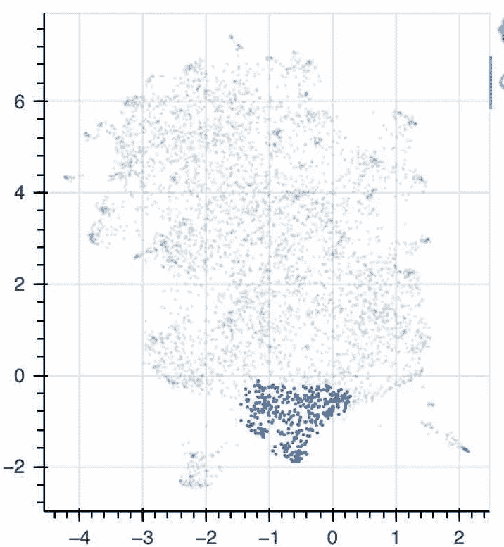
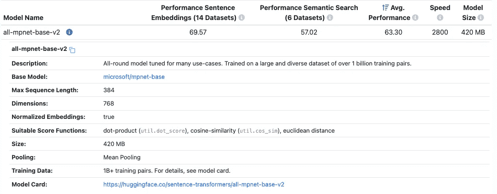

# 批量快速 NLP 标签

> 原文：<https://medium.com/mlearning-ai/quick-nlp-labelling-with-bulk-327ccb62320?source=collection_archive---------1----------------------->

一下午的 NLP 概念验证。

> 所以你有一个内部自由文本数据集，但是你没有标签，你不知道制作它们有多容易，输入 bulk。

[](https://github.com/koaning/bulk) [## GitHub — koaning/bulk:一个简单的批量标签工具

### 批量是一个快速开发工具，可以应用一些批量标签。给定一个带有 2d 嵌入的准备好的数据集，它可以生成…

github.com](https://github.com/koaning/bulk) 

估计机器学习项目有多困难的一个好方法是，看看聚类是否与你想要的分类方式一致。或者对于二元问题，如果您感兴趣的类边界已经至少部分地与单个聚类对齐。



clustering in bulk.

Bulk 因其 EDA(探索性数据分析)的质量而脱颖而出，散点图由散景制成，并允许任意放大和缩小。从一个高度细化的视角，到“从 100 万英里以外”的数据集。你也可以用任何一组关键词来上色。

要按关键字着色，您可以在运行程序时从终端指定关键字:

```
python -m bulk text ready.csv --keywords "F1,hair,sun,fight,rain"
```

Using bulk on twitter datasets. Clusters representing weather and the Earthquake in Italy in 2009.

它与同类工具的不同之处在于能够应用快速标签。带你走出 EDA，开始行动。它是非自以为是的，意味着你可以应用你自己选择的降维方法(umap，t-sne，随你挑)。

[](https://arize.com/blog/t-sne-vs-umap/) [## SNE 对 SNE 霸王龙对 UMAP:进化指南

### 根据多项估计，当今企业生成的 80%的数据是非结构化数据，如文本、图像…

arize.com](https://arize.com/blog/t-sne-vs-umap/) 

这种设计选择也使它比类似 tensorboard 嵌入式投影仪这样的等效工具更具性能。浏览器只需接收二维数据(x 和 y 坐标)，而不是数千个原始向量，这大大减少了从服务器到客户机/浏览器的数据传输。

[](https://projector.tensorflow.org/) [## 嵌入式投影仪-高维数据的可视化

### 可视化高维数据。

projector.tensorflow.org](https://projector.tensorflow.org/) 

在突出显示图表的一个部分后，您可以导出这些记录的命名 csv(使用标签命名)存储，准备用于训练模型。

## 数据集

我选择了一个开源的 twitter 数据集(大约从 2009 年开始)。演示中使用的 30k 样本(降维后，包含原始推文)可从以下网址获得:

[https://github.com/GeorgePearse/bulk-demo/blob/main/ready](https://github.com/GeorgePearse/bulk-demo/blob/main/ready)①。战斗支援车

这个数据集的最大优势是，推文中的自由文本的大小有一个自然的限制。简短的代码片段是 bulk 的简单 UI 真正闪光的地方。

# 代码

下面的代码使用了编写在拥抱脸之上的 SentenceTransformer API。我发现拥抱脸不合理地难以使用，但这个瘦 API 对于 NLP 概念证明非常有用。

 [## 句子变压器文件-句子-变压器文件

### 可以使用 pip 安装:我们推荐 Python 3.6 或更高版本，至少 PyTorch 1.6.0。请参见安装…

www.sbert.net](https://www.sbert.net) 

# 预训练模型

从 sbert 网站上摘下来的，这个网站会把它从拥抱脸网站上删除。



all-mpnet-base-v2 model card.

Vincent Warmerdam 创造了 bulk 和一套其他定义良好的聪明工具，这是巨大的功劳。在 https://github.com/koaning 查看他的 GitHub。

如果这个内容让你感兴趣，请鼓掌关注。在接下来的几个月里，我将努力专注于更长的表单内容和项目。缩小爱好项目和生产应用之间的差距。

[](/mlearning-ai/mlearning-ai-submission-suggestions-b51e2b130bfb) [## Mlearning.ai 提交建议

### 如何成为 Mlearning.ai 上的作家

medium.com](/mlearning-ai/mlearning-ai-submission-suggestions-b51e2b130bfb)