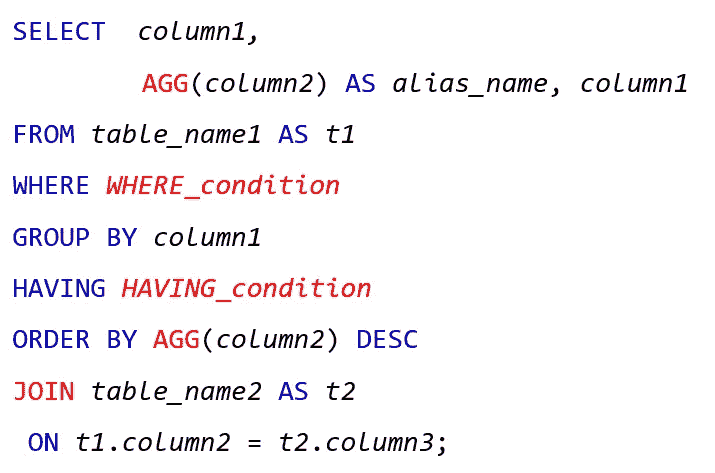
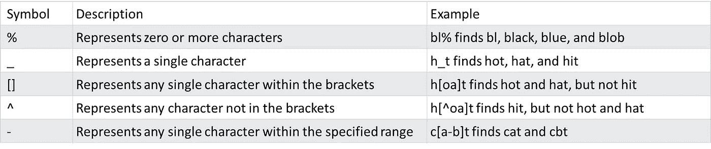
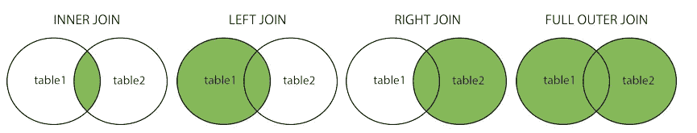

# 快速 SQL 查询提醒

> 原文：<https://medium.com/mlearning-ai/quick-sql-query-reminder-622a98d3ad0c?source=collection_archive---------5----------------------->

这篇文章是为那些熟悉 SQL 并且想要一个快速 SQL 提醒的人准备的。

# SQL 查询示例

这些是您应该知道的 SQL 关键字以及如何使用它们。

**蓝色字** = SQL 关键字

**红色文字** =阅读下文详情

# 集料

聚合函数，如 COUNT()、MAX()、MIN()、SUM()、AVG()

# 情况

WHERE 关键字不能与聚合函数一起使用，因此我们将在聚合函数中使用 HAVING。

**举例**

*   其中*列 1* 列 3>
*   其中*列 1* 像*模式*
*   有计数(*列 1* ) < 5

**LIKE** 用于 WHERE 条件中，搜索指定的模式。

该模式通常使用通配符来替换字符串中的一个或多个字符。

**通配符**

Source: [https://www.w3schools.com/sql/sql_wildcards.asp](https://www.w3schools.com/sql/sql_wildcards.asp)

# 加入

有许多连接类型，包括:

*   **内部连接**:返回在**两个表中有匹配值的记录**
*   **左连接**:返回**左表的所有记录，**右表的匹配记录
*   **右连接**:返回**右表**中的所有记录，以及左表中匹配的记录
*   **全外连接**:当左表或右表中有匹配时，返回**所有记录**

Source: [https://www.w3schools.com/sql/sql_join.asp](https://www.w3schools.com/sql/sql_join.asp)

 [## Mlearning.ai 提交建议

### 如何成为 Mlearning.ai 上的作家

medium.com](/mlearning-ai/mlearning-ai-submission-suggestions-b51e2b130bfb)