# 通过顺序推荐快速开始

> 原文：<https://medium.com/mlearning-ai/quick-start-with-sequential-recommendation-990501358440?source=collection_archive---------1----------------------->

顺序推荐是推荐系统中一项非常重要的任务。其目的是基于用户的历史行为来获取用户的兴趣。

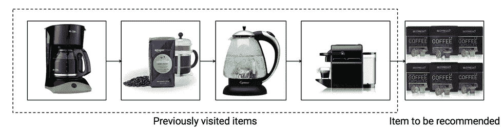

> 用户兴趣有两个重要属性，一个是用户兴趣是动态的，并且随着时间的推移而演变，另一个是用户兴趣具有不同的分辨率，或者准确地说是时间范围，例如长期和短期偏好。

# 马尔可夫链

这是深度学习还没有应用的比较早的阶段，贝叶斯方法也讨论很多。因此，以下两篇论文直接使用马尔可夫链对购买行为之间的关系进行建模。

## **FPMC【1】**

> [分解个性化马尔可夫链进行下一篮推荐](https://dl.acm.org/doi/pdf/10.1145/1772690.1772773)

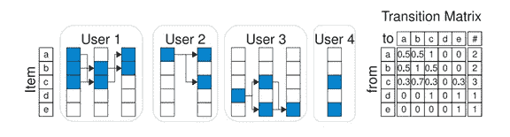

这篇 FPMC 论文的动机是从购物篮推荐和 ***入手，通过历史数据*** 构建产品之间的转移矩阵。之后，只有建立的转移矩阵可以用于预测用户可能购买的下一个商品。

## **化石**【2】

> [融合相似模型和马尔可夫链进行稀疏序列推荐](https://ieeexplore.ieee.org/stamp/stamp.jsp?tp=&arnumber=7837843)

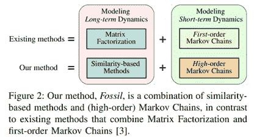

Fossil 模型通过高阶马尔可夫链学习更多信息，然后结合相似度模型解决序列推荐预测中的稀疏性问题。

# RNN

## **gru 4 rec【3】**

> [使用递归神经网络的基于会话的推荐](https://arxiv.org/pdf/1511.06939.pdf)

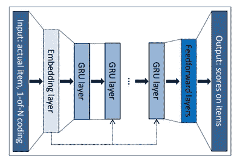

## **RRN**【4】

> [递归推荐网络](https://dl.acm.org/doi/pdf/10.1145/3018661.3018689)

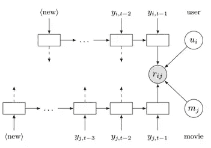

## **HRNN**【5】

> [利用分层递归神经网络个性化基于会话的推荐](https://dl.acm.org/doi/pdf/10.1145/3109859.3109896)

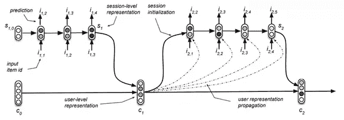

上述三篇论文引用了几个使用 RNN 解决序列推荐问题的模型。有许多论文使用 RNN 来解决序列推荐问题。但从目前来看，最好用的还是 GRU4Rec。当研究人员开始解决这个问题时，他们还发现 RNN 模型不仅可以学习这种类似于马尔可夫链的转移信息，还可以学习长短期序列信息，增加 LSTM 或门控 RNN 等模型的学习能力。

# 美国有线新闻网；卷积神经网络

## **3D-CNN**【6】

> [具有内容特征的基于会话推荐的 3D 卷积网络](https://dl.acm.org/doi/pdf/10.1145/3109859.3109900)

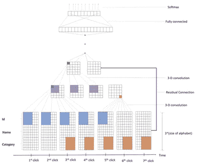

## **办案人**【7】

> [通过卷积序列嵌入的个性化 top-n 顺序推荐](https://dl.acm.org/doi/pdf/10.1145/3159652.3159656)

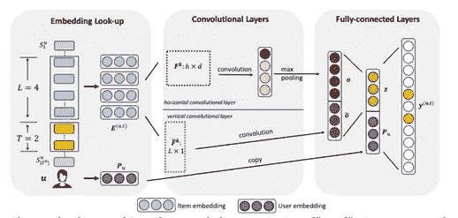

## 第八层

> [用于动态推荐系统的分层时态卷积网络](https://dl.acm.org/doi/pdf/10.1145/3308558.3313747)

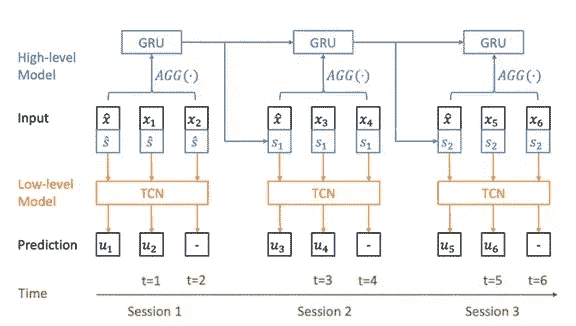

使用 CNN 解决序列推荐的模型相对较少。那主要是因为 CNN 只能从局部到整体对卷积信息进行建模，而在序列推荐中，我们更关心的是序列之间的相关性。但与 RNN 相比，CNN 有一个更直接的优势，那就是它可以用来对整体信息进行建模。例如，Caser 在本文中提到了联合级别的概念:

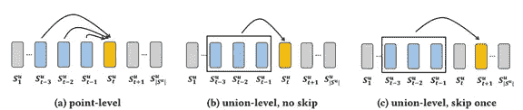

如图中的项目顺序所示。(a)表示点级预测，即通过前一项或前多项预测下一项。(b) (c)表示联合级预测，即根据前面几项的组合信息来预测后面或后面几项。在对这种模式信息建模方面，CNN 显得有天然的优势，因为 RNN 模型一般侧重于项目的序列变化特征，而不是整体影响。

# **注意/变压器**

## 萨斯雷[9]

> [自我关注顺序推荐](https://ieeexplore.ieee.org/stamp/stamp.jsp?tp=&arnumber=8594844)

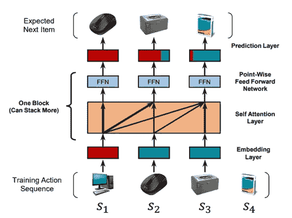

## **伯特 4 雷克**【10】

> [BERT4Rec:来自变压器的双向编码器表示的顺序建议](https://dl.acm.org/doi/pdf/10.1145/3357384.3357895)

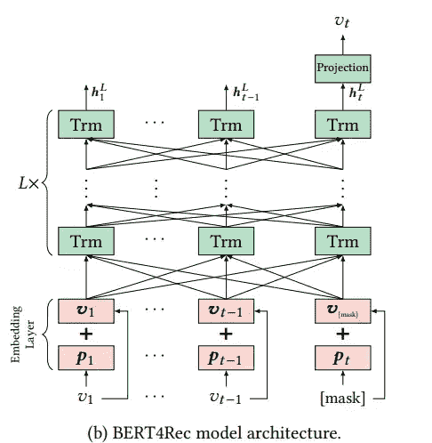

## 上证综合指数

> [SSE-PT:通过个性化转换器的顺序推荐](https://dl.acm.org/doi/pdf/10.1145/3383313.3412258)

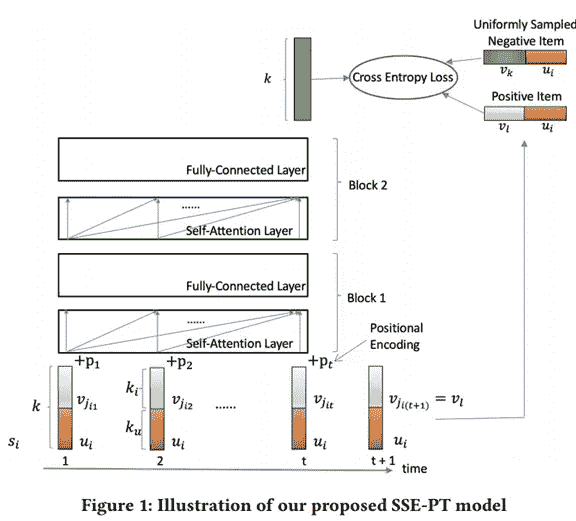

从 NLP 中的自我关注模型开始，很多人开始疯狂地尝试在各个领域使用 Transformer，发现它确实可以达到非常好的效果。尤其是近两年，推荐系统领域也成为了一个热门领域，大家尝试了很多使用 Transformer 解决序列推荐问题的模型。

SASRec 应该算是一个早期的尝试。尽管整个模型与最初的 transformer 非常相似，但它仍然有一些自己的见解，并且代码也是开源的。Bert4Rec 基于 NLP 中最近流行的 Bert 模型，考虑了双向建模序列。SSE-PT 考虑了用户嵌入在序列建模中的重要性，并提出需要使用随机共享嵌入来提高性能。

注意力模型确实非常有用。除了这三篇文章，还有近一年发表的十篇左右的文章使用了自我关注模型来解决序列推荐问题。所以如果你还想做一些序列推荐方面的研究问题，那么自我关注模型应该属于 SOTA 的基线。

# 结论

在本文中，我简单梳理了如何建立模型来完成序列推荐的任务。总而言之，序列推荐中最关键的信息有两点: ***第一是序列中项目之间的相关性，第二是用户的个性化信息*** 。除了这两点，还可以建立一个模型来学习结构信息，比如一些 ***层次信息*** ，或者 ***具体时态信息*** 。如果能很好的利用各种边信息，就能很好的完成序列推荐的任务。

# 参考

[0][序列推荐模型梳理与总结][https://mp.weixin.qq.com/s/8BoEUNNbAC6G_efTKXVLAw](https://mp.weixin.qq.com/s/8BoEUNNbAC6G_efTKXVLAw); [一文梳理序列化推荐算法模型进展][https://mp.weixin.qq.com/s/MHAviL_ArtQ2ZNFfhCinHA](https://mp.weixin.qq.com/s/MHAviL_ArtQ2ZNFfhCinHA)

[1] Rendle、Steffen、Christoph Freudenthaler 和 Lars Schmidt-Thieme。"分解个性化马尔可夫链进行下一篮子推荐."在*第 19 届万维网国际会议记录*中，第 811–820 页。2010.

[2]他，瑞宁和朱利安·麦考利。"融合相似性模型和马尔可夫链的稀疏序列推荐."在 *2016 IEEE 第 16 届数据挖掘国际会议(ICDM)* 中，第 191–200 页。IEEE，2016。

[3] Hidasi、Balázs、Alexandros Karatzoglou、Linas Baltrunas 和 Domonkos Tikk。"基于会话的递归神经网络推荐." *arXiv 预印本 arXiv:1511.06939* (2015)。

[4]吴，赵超元，阿姆鲁·艾哈迈德，阿列克斯·比特尔，亚历山大·j·斯莫拉，和何京."循环推荐网络."第十届 ACM 网络搜索和数据挖掘国际会议论文集*，第 495–503 页。2017.*

[5]夸夸纳、马西莫、亚历山德罗斯·卡拉佐格鲁、巴拉兹·希达西和保罗·克雷莫内西。“使用分层递归神经网络个性化基于会话的推荐。”第十一届 ACM 推荐系统会议记录，第 130-137 页。2017.

[6] Tuan，Trinh Xuan 和 Tu Minh Phuong。“具有内容特征的基于会话的推荐的 3D 卷积网络。”第十一届 ACM 推荐系统会议论文集，第 138-146 页。2017.

[7]唐、贾西和。“通过卷积序列嵌入的个性化 top-n 顺序推荐。”在*第十一届 ACM 网络搜索和数据挖掘国际会议记录*，第 565–573 页。2018.

[8]你、贾旋、王艺晨、Aditya Pal、Pong Eksombatchai、Chuck Rosenburg 和 Jure Leskovec。"动态推荐系统的层次时态卷积网络."在*万维网会议*，第 2236–2246 页。2019.

[9]康、王成和朱利安·麦考利。"自我关注顺序推荐"在 *2018 IEEE 数据挖掘国际会议(ICDM)* ，第 197–206 页。IEEE，2018。

[10]孙，费，，，裴昌华，肖林，，欧，." BERT4Rec:来自 transformer 的双向编码器表示的顺序推荐."在第 28 届 ACM 信息和知识管理国际会议的会议记录中。2019.

[11]吴、李伟、、谢卓瑞和詹姆斯·夏普纳克。" SSE-PT:通过个性化转换器的顺序推荐."第十四届 ACM 推荐系统会议，第 328–337 页。2020.