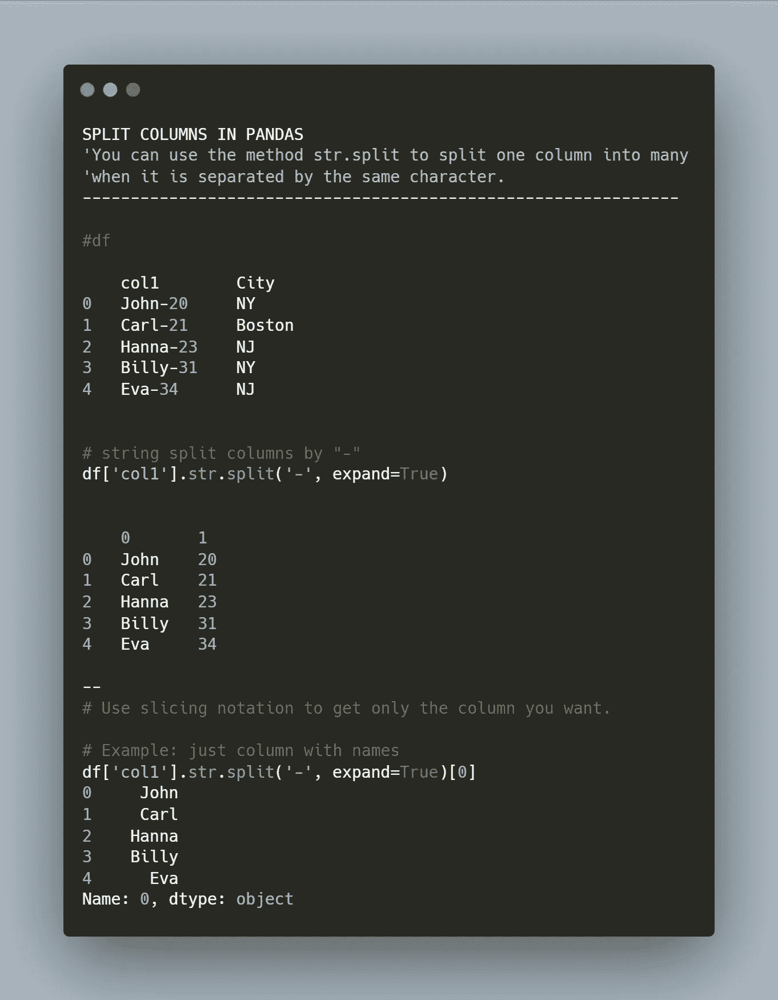

# 快速提示:熊猫串分裂

> 原文：<https://medium.com/mlearning-ai/quick-tip-python-string-split-79a090662e9b?source=collection_archive---------3----------------------->

使用此方法进行列解析。



String Split with Pandas

通过使用 Pandas 的方法`str.split()`可以解析由单个公共字符分隔的列。

语法很简单。

下面我们来看看这个数据:

```
df = pd.DataFrame({'col1': ['John-20-NY', 'Carl-21-MA', 'Hanna-23-NJ', 'Billy-31-NY', 'Eva-34-NJ'], 
'City': ['NY', 'Boston'…
```