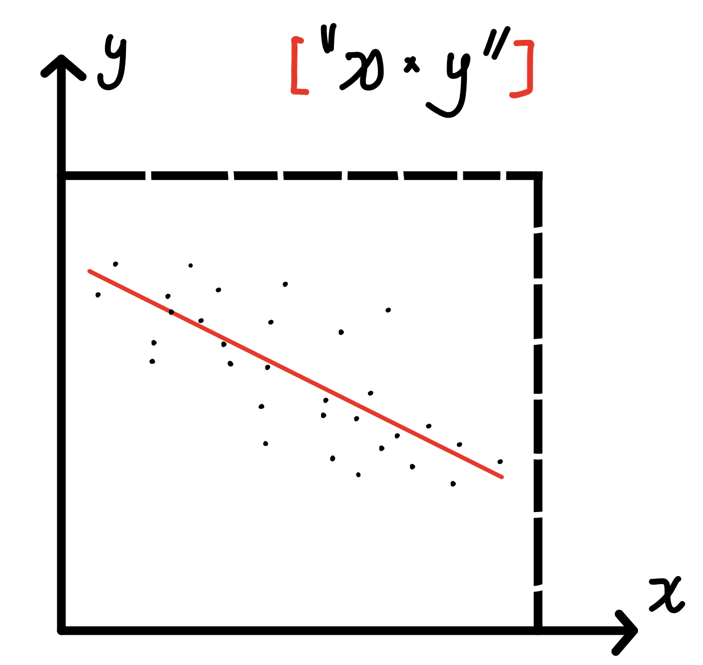
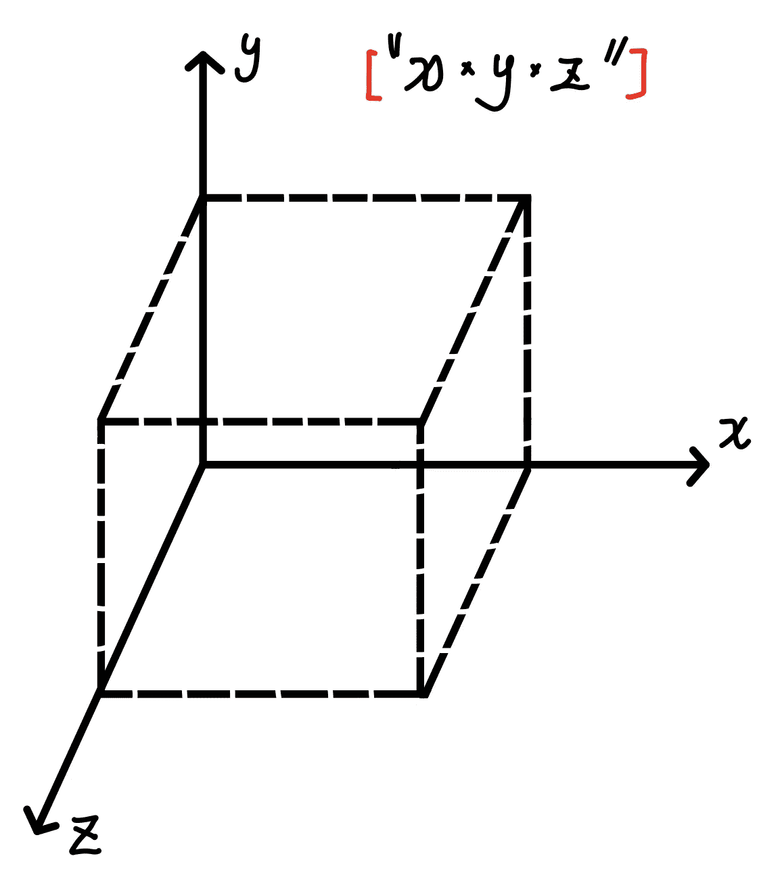
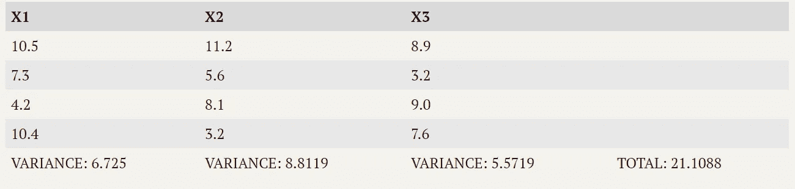
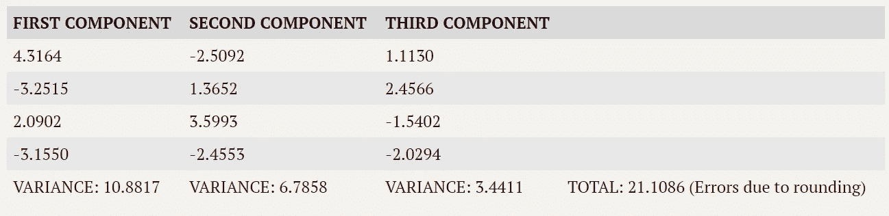

# 快速掌握主成分分析:你必须知道的数据降维技术

> 原文：<https://medium.com/mlearning-ai/quickly-master-the-principal-components-analysis-the-data-dimensionality-reduction-technique-you-28a0483e2b59?source=collection_archive---------8----------------------->

> 为什么降维很重要？

**数据维度越高，模型拟合的难度越大。**我们以线性回归的建模为例。当它包括两个预测值和一个目标时，很容易得出结论，模型拟合过程的“空间”是松散的 ***x* 乘以 *y*** *，* ，它是一个二次变量。



Fig 1\. Two-dimensional space for the model-fitting process

然后再增加一个预测器。现在，模型拟合过程的“空间”变成了松散的 ***x 乘以 y 乘以 z*** *，*这是一个立方变量。



Fig 2\. Three-dimensional space for the model-fitting process

综上所述，虽然这里的数据维度只增加了 **50%** (即从 2 增加到 3)，“空间”的容量经历了**的指数增长**(即从二次增加到三次)，这意味着模型拟合过程的难度大大增加。

> 主成分分析(PCA)是如何进行降维的？

主成分分析将预测因子的总方差重新分配到“分量”中，使方差的分布更加集中。让我们考虑一下线性回归的情况。当它包括两个预测值和一个目标值时，应用主成分分析也将为我们提供相同数量的“分量”。使该分量不同于原始预测值的是，较少数量的分量将包括比原始预测值更多的方差。**换句话说，给定两个模型拟合预测值，仅使用一个组件就可以达到相同的模型性能。**

# 通过一个超级简单的例子深入 PCA

假设有如下所示的三个预测值可用于建模:



Fig 3\. Example: three predictors and their variance

每个预测值的方差已经提供，方差之和为 21.1088。然后，我们通过下面的 python 代码应用了 PCA，我们获得了预期的三个组件。

```
# Applying the PCA to the example 
import numpy as np
from sklearn.decomposition import PCApredictors = np.array([[10.5, 11.2, 8.9],[7.3, 5.6, 3.2], [4.2, 8.1, 9.0],[10.4, 3.2, 7.6]])# create a 'pca' instance with 3 components
pca = PCA(n_components=3)
pca.fit(predictors)# show all 3 components
pca.transform(predictors)
```



Fig 4\. Components from the PCA

正如我们在这里看到的，组件的总方差和预测值都与**相同**！令人惊讶的是，第一和第二分量比 X1 和 X2 的方差多 **14%** 。

因此，我们可以发现，尽管差异的总量是恒定的，但它已被集中到这些顶部组件中。现在，如果我们决定应用主成分分析的前两个成分进行建模，我们应该不会因为丢失三个原始预测值的大量信息而遭受损失。

# 参考

【1】*sk learn。分解. PCA* 。scikit。(未注明)。2022 年 1 月 8 日检索，来自[https://sci kit-learn . org/stable/modules/generated/sk learn . decomposition . PCA . html](https://scikit-learn.org/stable/modules/generated/sklearn.decomposition.PCA.html)

[](/mlearning-ai/mlearning-ai-submission-suggestions-b51e2b130bfb) [## Mlearning.ai 提交建议

### 如何成为 Mlearning.ai 上的作家

medium.com](/mlearning-ai/mlearning-ai-submission-suggestions-b51e2b130bfb)