# 功率 BI 中的 r

> 原文：<https://medium.com/mlearning-ai/r-in-power-bi-bc2652e83f56?source=collection_archive---------0----------------------->


# ❓为什么要掌权毕？

M 微软动力 BI 支持两种不同的语言，M 语言和 DAX(数据分析表达式)。

然而，有时使用 R 进行数据准备更方便，因为 R 有一个 R 包，这是一组有用的函数，不需要从头开始编写代码。此外，熟悉 R 的数据分析师可以轻松地将 R 应用到 Power BI 中，用于 web 抓取或 EDA(探索性数据分析)过程。

而且，有些可视化需要一些 R 包。您可以在没有多少编程知识的情况下创建和调整这些可视化(只需知道如何安装 R 包就足够了，您可以在本文中学习如何安装)

支持 R 包可以在下面的链接中找到。

[](https://docs.microsoft.com/th-th/power-bi/connect-data/service-r-packages-support) [## เรียนรู้แพคเกจ·อันไหนที่ได้รับการสนับสนุน-权力 BI

### คุณสามารถใช้ภาษาโปรแกรมที่มีประสิทธิภาพเพื่อสร้างภาพในบริการ电力比ได้ แพ็คเกจ R…

docs.microsoft.com](https://docs.microsoft.com/th-th/power-bi/connect-data/service-r-packages-support) 

> 如果你是一个 Python 爱好者，这篇文章就是为你准备的。

[](/mlearning-ai/python-in-power-bi-66a80590ecc0) [## Python 在 Power BI 中的应用

### 通过集成 Python 增强 Power BI dashboard 的功能。一步一步地使用 Python 来获取、转换和…

medium.com](/mlearning-ai/python-in-power-bi-66a80590ecc0) 

# 本文内容

*   安装 R
*   功率 BI 中的 r 设置
*   使用 R 获取数据
*   在变换中使用 R
*   用 R 来可视化
*   使用需要 R 包的可视化

# 📥安装 R

在 Power BI 中使用 R 之前，你必须安装 R，一个简单的方法是从[https://cran.r-project.org/bin/windows/base/](https://cran.r-project.org/bin/windows/base/)下载

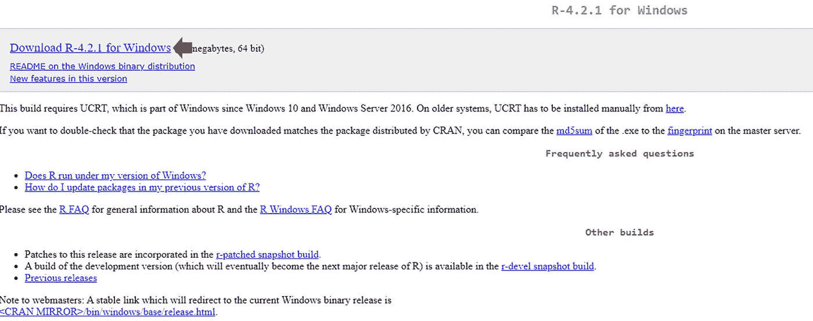

下载完成后，在你的机器上安装 R。

然后，打开 R

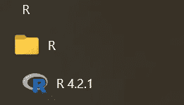

你会看到类似这样的东西

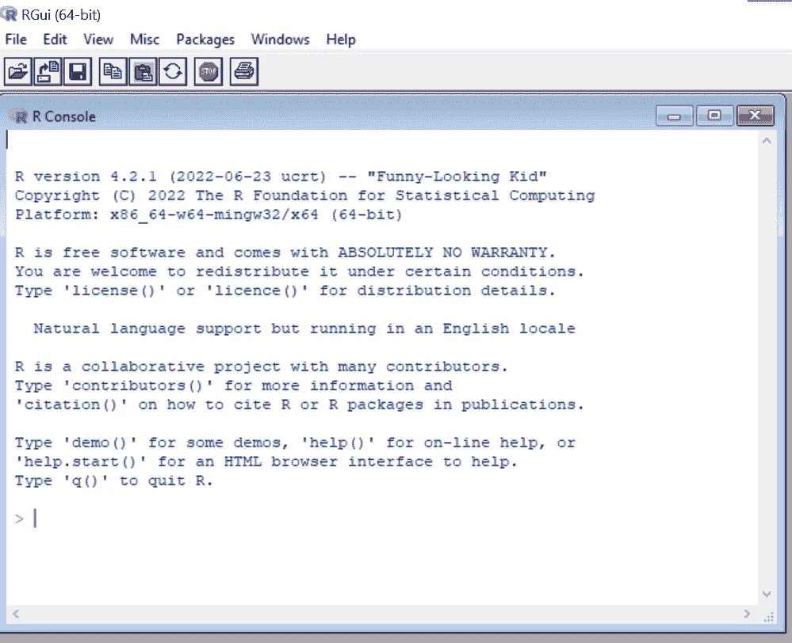

您可以在红色箭头后面键入代码，然后按 Enter 键运行代码。

这只是对 R 的简单介绍，以便您可以安装 Power BI 可视化所需的 R 包。

## 安装 R 包

> Power BI 中的一些可视化需要一些 R 包，所以学习如何安装 R 包是很有用的。

您可以通过键入以下代码来安装将在 Power BI 中使用的 R 包。
(将 **< package_name >** 替换为您要安装的软件包的名称，如 ggplot2、corrplot)

```
install.packages("**<package_name>**")
```

# 功率 BI 中的⚙️ R 设置

R 安装完成，就到了 Power BI 的时候了！！

1.  打开电源 BI。
2.  点击右上角的文件。


3.单击选项和设置。单击选项。


4.单击 R 脚本


5.检查检测到的 R 主目录是否指向您安装的 R。如果不是，将检测到的 R 主目录更改为 Other 并浏览您安装的 R 位置。

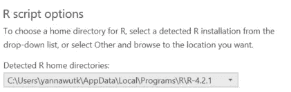

> 现在，您已经准备好在 Power BI 中使用 R 了

> 至少可以在 3 个步骤中应用 R:获取数据、转换和可视化。我还包括如何使用需要 R 包现有可视化。

# 🧺使用 r 来获取数据

r 可以用来获取数据。这有助于网络抓取(从网站获取数据)。

在这个例子中，我将创建一个 R 文件来从两个源获取数据:一个 csv 文件和一个创建的表(一个包含行和列的表)。

1.单击获取数据

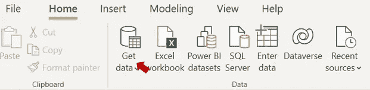

2.搜索一个 R 脚本，点击打开一个新的编码窗口。


3.键入下面的代码，然后单击确定。

```
df1 <- read.csv(file = 'C:/data.csv')
df2 <- data.frame(player = c('AJ', 'Bob', 'Chad', 'Dan'),
                 position = c('A', 'B', 'B', 'B'),
                 points = c(1, 2, 2, 1))
```

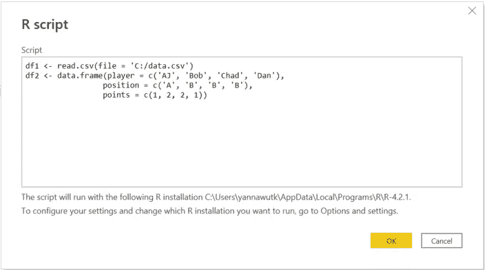

4.您将看到一个显示数据的导航器(类似于其他 get data 方法)。).选择要加载的数据。

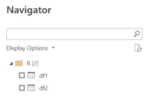

# 🔄在变换中使用 R

r 也可以用在数据转换步骤中。大多数情况下，我将它用于正则表达式，从另一列中提取匹配定义模式的子字符串，比如从 Twitter 文本中获取标签。

在这个例子中，我将使用 r 中的 nchar()函数来查找文本长度。

1.  单击转换数据


2.选择要转换的查询

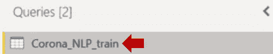

3.在“转换”选项卡中，单击“运行 R 脚本”

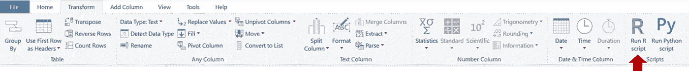

4.您将看到一个新的 Run R script 窗口。在此处编写代码，然后单击“确定”。

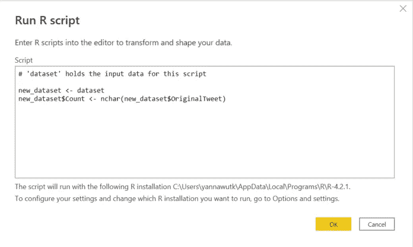

我使用 R 来查找列‘original tweet’中的文本长度，并创建一个名为‘new _ dataset’的新数据

**关键概念**:数据将是一个‘数据集’表，所以你可以用表函数来操纵它。我发现将数据复制到新表中并转换该表更容易。

5.结果将是一个表格。单击以展开表格。确保未选中“使用原始列名作为前缀”。

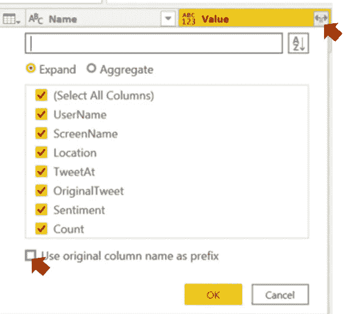

**注意:**new _ dataset 表可能会自动扩展，无需此步骤

6.您将看到数据转换的结果，这些步骤被添加到应用步骤中。

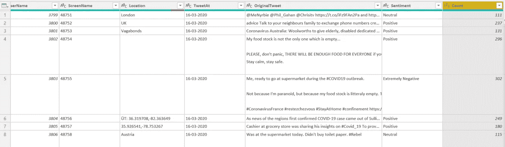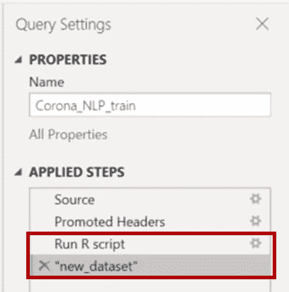

之后，您可以使用这个 new_dataset 来创建一个仪表板。

# 📊用 R 来可视化

仅使用 Power BI 的可视化功能创建图可能会有一些限制，有些图在 Power BI 中可能不可用。

R 将会派上用场，因为有许多 R 包可以按照您的意愿生成任何可视化。

目前常用的数据可视化 r 包包括 ggplot2、Lattice 和 Plotly

虽然用 R 编写代码来创建一个情节可能比 Power BI 的拖放概念更困难，但有更多的情节定制和代码示例(可供复制)。

1.  在可视化平面中，单击 R 图标。

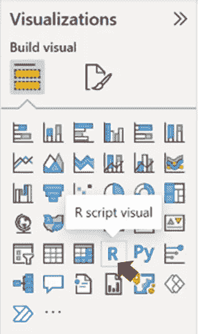

2.您将看到一个空的 R 脚本编辑器区域。选择要可视化的列。

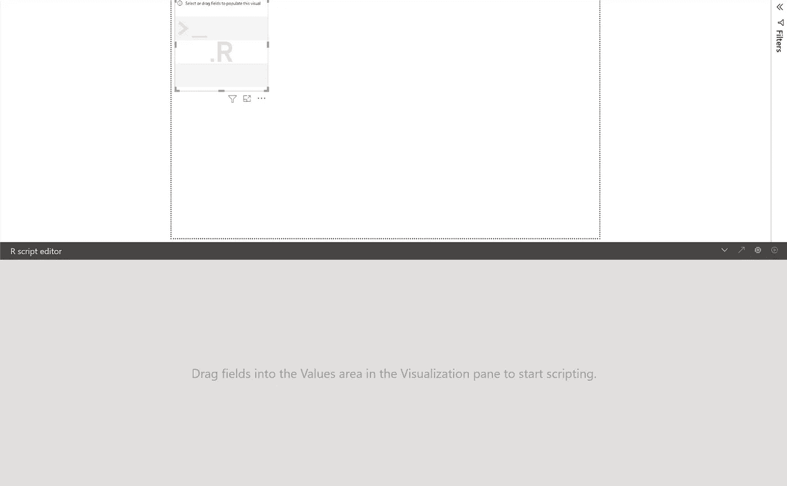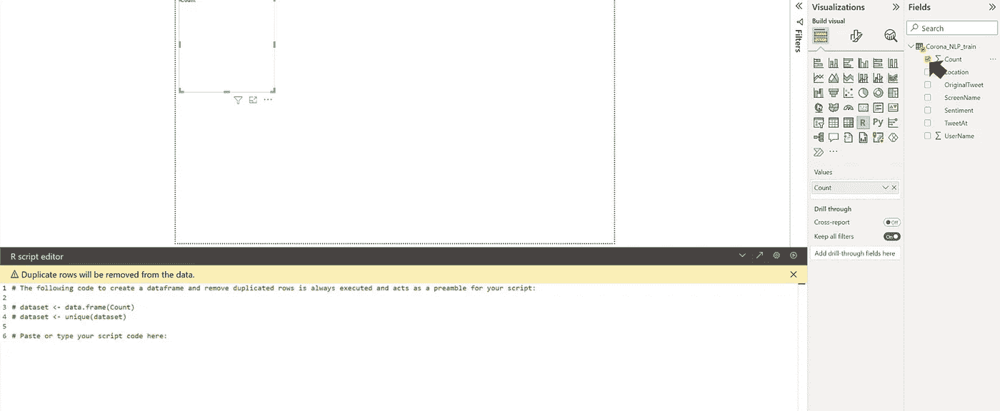

3.你会看到一个空的编码区。编写代码并单击运行图标，然后等待结果。搞定了。！

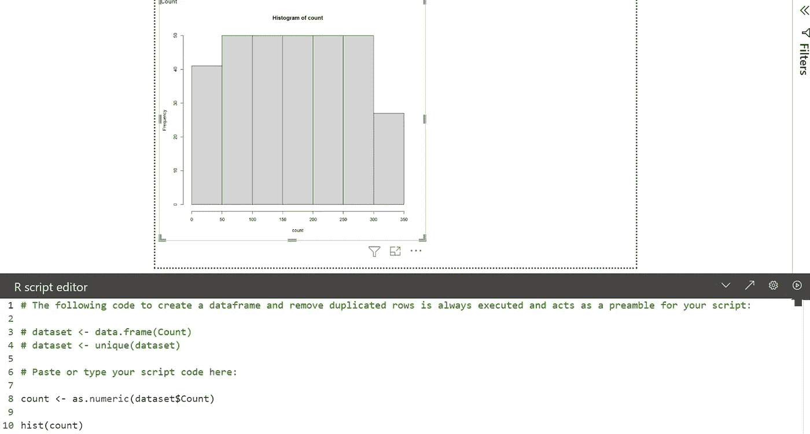

**注意:**如果运行代码后显示错误，深呼吸并阅读错误信息。

# 📂使用需要 R 包的可视化

这种方法介于硬编码和拖放概念之间。

您可以创建一些需要 R 包的复杂图形，而您不需要自己编码，并且您可以以用户友好的方式调整图形。这个视频可以在市场上下载。

在本例中，我将创建一个相关图。

在右侧的可视化平原，点击 3 点，并选择“获得更多的视觉效果”

> V 可视化普通> 3 点>“获得更多视觉效果”


这将打开视觉市场。使用右侧的搜索区域搜索相关图。单击相关图(请确保与下图相同)。然后，单击添加。

> 搜索关联图>单击关联图>添加

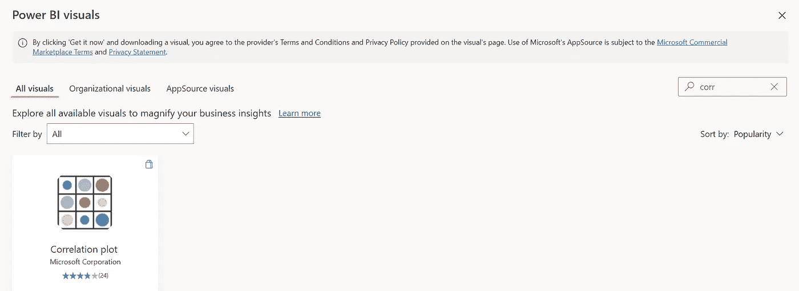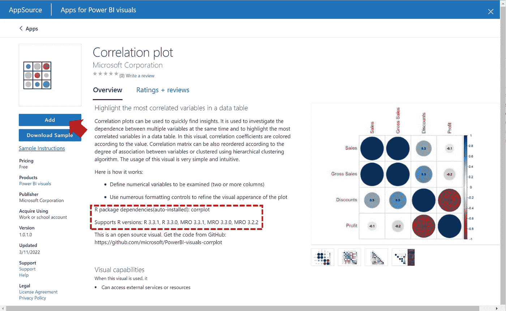

> 请注意 R 包和版本。
> 该地块需要安装“corrplot”包。我将在几分钟后谈论它。

现在，您将在可视化效果平面中看到关联图图标。

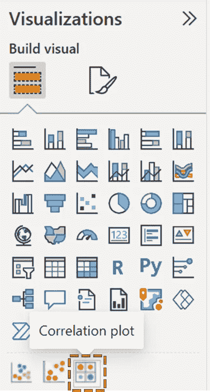

单击可视化效果平面中的关联图图标。

您将看到一个空的可视化。

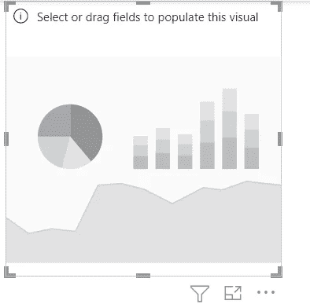

Empty visualization

在右侧的字段平面中，选择要在其中创建相关图的列。我将选择 Count 和 UserName 列作为示例(在这些列之间寻找关联是没有意义的。这只是一个例子)

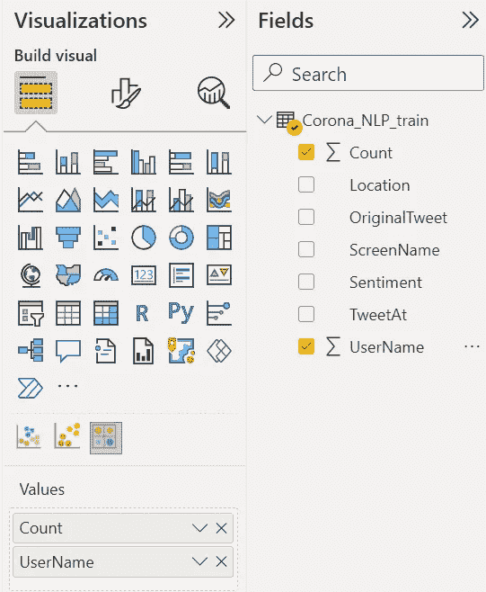

如果没有安装所需的 R 包，您可能会看到类似这样的内容。当你点击“查看详情”时，它会告诉你有一个错误，因为软件包“corrplot”没有安装。

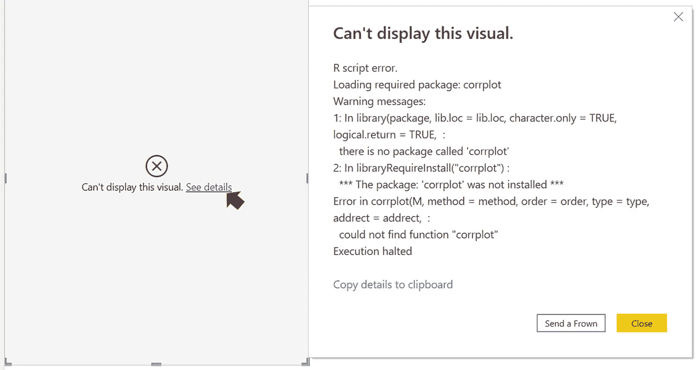

Error if you don’t install the required R package

要解决这个问题，请安装“corrplot”包(阅读本文顶部的如何安装 R 包)。

> 安装“corrplot”包后，将创建相关图。

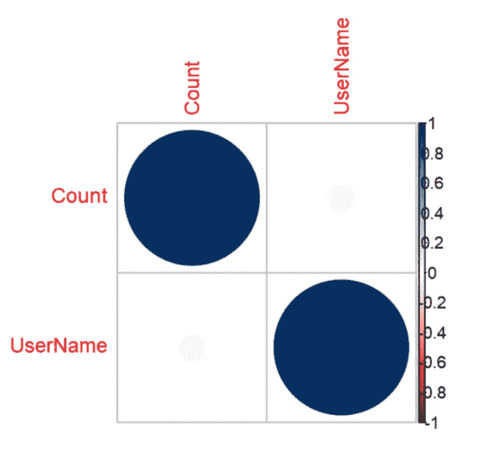

您可以在可视化平面中以可视化图标的格式定制图形，而无需编写任何代码。

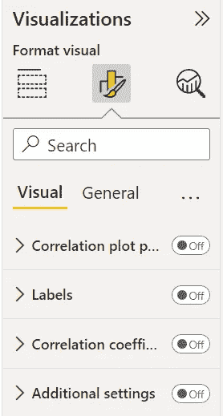

这是如何使用市场上现有的需要 R 包的视觉效果。你唯一需要知道的就是如何安装 R 包。

# 结论

本文将一步步展示如何在 Power BI 中应用 R，这样您就可以同时获得 Power BI 交互式仪表板和 R 灵活性的优势。您可以在许多方面应用 R，包括数据获取、转换和可视化。

希望您对在 Power BI 中使用 R 有所了解。

如果您想阅读更多数据分析内容，请鼓掌并关注我。

[](/mlearning-ai/mlearning-ai-submission-suggestions-b51e2b130bfb) [## Mlearning.ai 提交建议

### 如何成为 Mlearning.ai 上的作家

medium.com](/mlearning-ai/mlearning-ai-submission-suggestions-b51e2b130bfb)