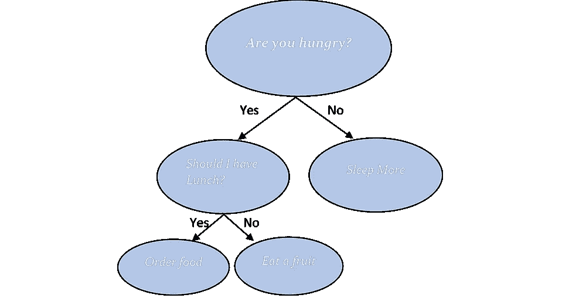

# 随机森林分类器-初学者指南

> 原文：<https://medium.com/mlearning-ai/random-forest-classifier-a-beginners-guide-c0b41713020?source=collection_archive---------2----------------------->

Photo by [Nick Kwan](https://www.pexels.com/@nickkwanhk?utm_content=attributionCopyText&utm_medium=referral&utm_source=pexels) from [Pexels](https://www.pexels.com/photo/lake-near-forest-2745258/?utm_content=attributionCopyText&utm_medium=referral&utm_source=pexels)

# 随机森林

随机森林是从决策树进化而来的分类器。顾名思义，这种算法用许多树来创建森林。随机森林算法是一种监督分类算法，可用于分类和回归类问题。

为了更好地理解随机森林，我们必须首先知道什么是决策树以及它是如何工作的。

# 决策图表

我相信我们所有人都一定在日常生活中有意或无意地使用过决策树技术。我们只是不给那些决策过程起一个花哨的名字。我们来看一个例子。

*问问自己饿不饿？*

Image by author

决策树是一种用于分类和回归的模型。决策树通常从单个节点开始，然后根据可能的结果分成不同的分支。在上面给出的例子中，我们正在决定我们是否饥饿？第一个节点根据是或否被一分为二。当是时，分支被进一步一分为二，当不是时，分支停止分裂。

在上面的例子中，很容易直观地确定结果，但一般来说并不是这样，因为我们的数据不会如此清晰。一棵决策树在每个分支被分裂并最终获得结果之前必须经历各种过程。

现在让我们回到我们的主要话题…

# 随机森林分类器

随机森林在随机选择的数据样本上创建不同数量的决策树，从每棵树中获得预测，并通过投票选择最佳解决方案。

> *简单来说——随机森林构建多个决策树，并将它们合并在一起，得到更准确稳定的预测*。

让我们看看随机森林分类器是如何工作的…

假设你想去度假，但你不知道去哪里。所以，你决定问你的朋友，他们给了他们的建议。有很多地方，所以你让他们投票选出最好的。得票最多的地方将是你旅行的最终选择。

在上面的例子中，要求推荐一个地方的第一步就像使用决策树算法。收集完整个推荐后让他们投票做决定就是随机森林算法。

Image by author

大量不相关且一起运行的树将胜过任何其他单个模型。“森林”是由一组决策树组成的，通常用“装袋”方法训练。装袋方法只不过是不同模型的组合，以增加整体结果。

# ***随机树分类器的重要参数***

1. **n_estimators** —基于该参数，在进行平均预测之前，在算法中建立树的数量。树的数量越多，性能越高，预测越稳定。

2.**判据** —这是衡量分割质量的函数。标准可以是基尼系数或熵，但默认情况下，使用基尼系数进行分割。

3. **Max_feature** —这是一个重要的参数，是随机森林会考虑拆分一个节点的最大特征数。

4. **Min_sample_leaf** —基于该参数，分割每个内部节点所需的最小叶子数。

5. **N_jobs** —这个超参数告诉引擎它可以并行运行多少个作业。如果它的值为“1”，它只能使用一个处理器，如果它的值为“-1”，则表示没有限制。

6. **Random_state** —该参数控制样本的随机性。当该模型具有一个确定的 random_state 值时，并且如果已经给定了相同的超参数和相同的训练数据，则该模型将总是产生相同的结果。

7. **Oob_score** — oob 表示出袋。此参数是随机林交叉验证方法。在采样中，大约有三分之一的数据没有用来训练模型，可以用来评估其性能。这些样本被称为袋外样本。

# 摘要

对于任何需要快速开发模型的人来说，随机森林算法是一个很好的选择。随机森林在性能方面也很难超越。它可以处理许多不同的特征类型，如二进制、分类和数字。

总的来说，random forest 是一个简单灵活的工具，尽管任何模型都有其自身的局限性。

*原载于 2021 年 2 月 21 日 https://www.numpyninja.com***。**