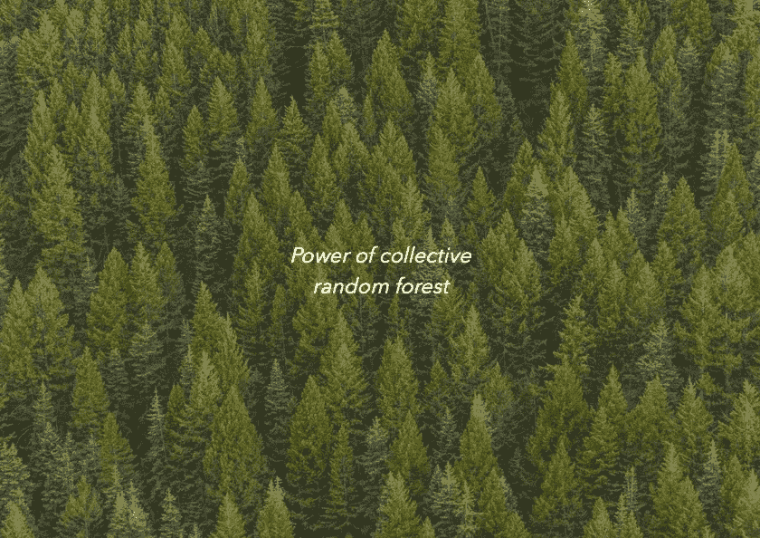

# 随机森林——集体的力量

> 原文：<https://medium.com/mlearning-ai/random-forest-power-of-collectives-5e077be6f215?source=collection_archive---------6----------------------->



[https://pasteapp.com/p/cb0qZtj3xtB?view=f6LOfecMTri](https://pasteapp.com/p/cb0qZtj3xtB?view=f6LOfecMTri)

```
Table of contents-Intro-Problems with decision tree-Bagging-Building random forest-Conclusion
```

**简介**

在本文中，我将介绍构建和评估随机森林。此外，选择随机森林而不是单一决策树的动机…