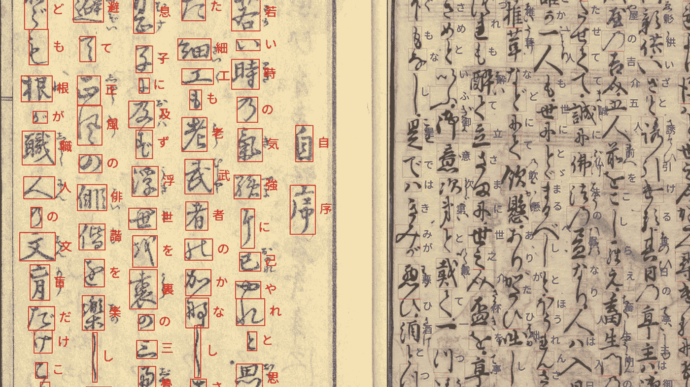
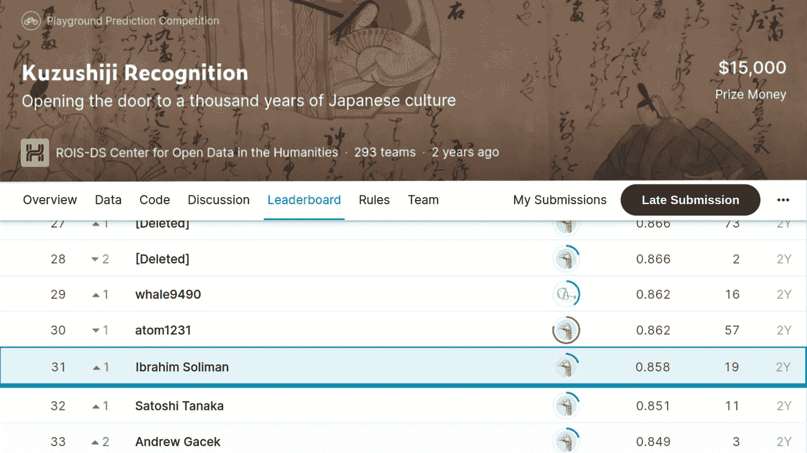
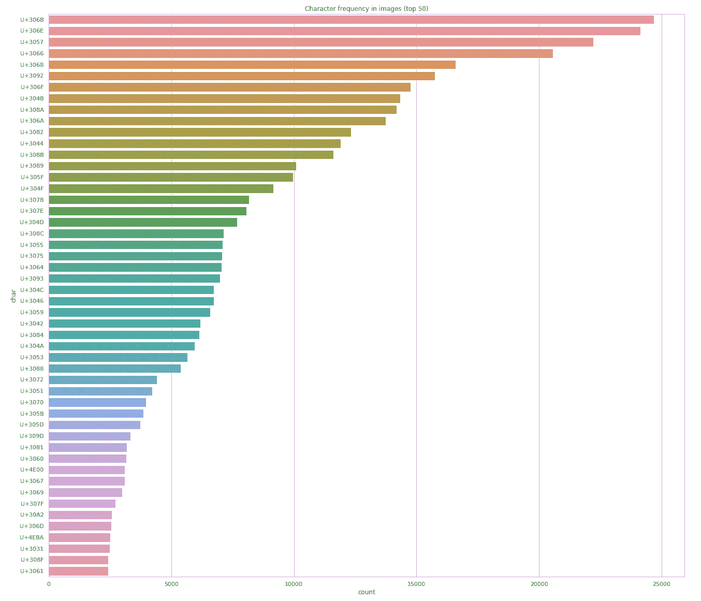
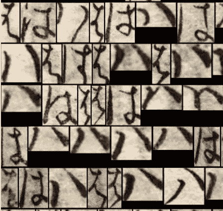
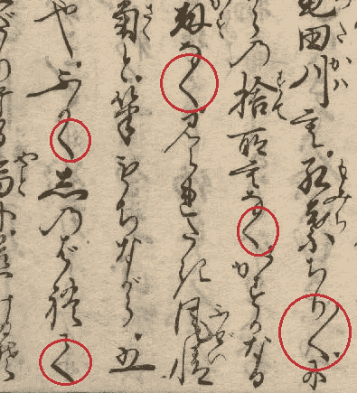
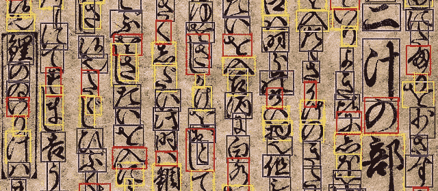
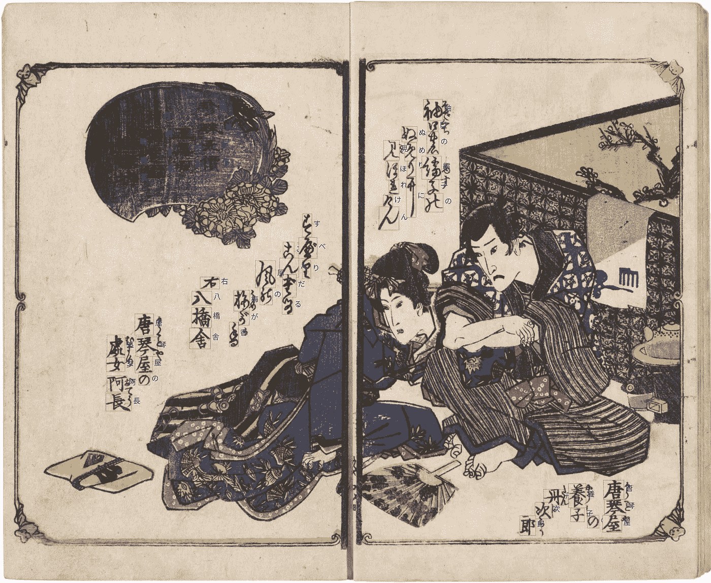
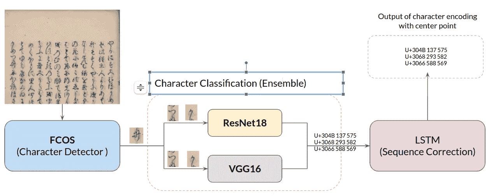
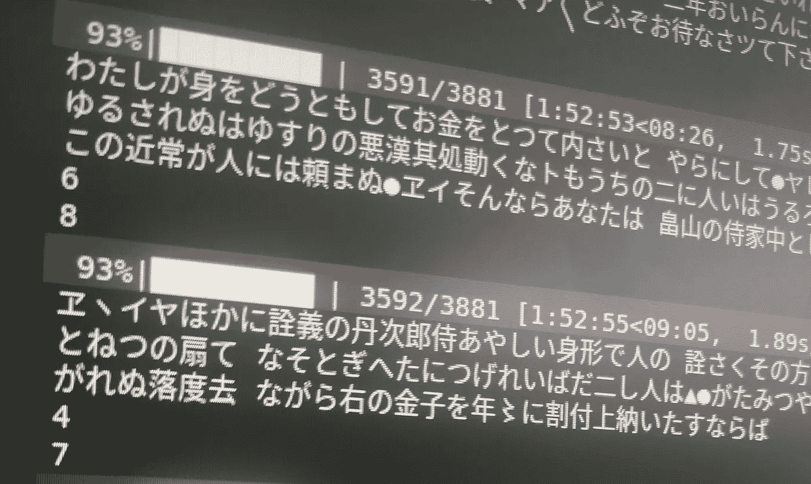

# 在我的第一次 Kaggle 比赛中排名前 11%

> 原文：<https://medium.com/mlearning-ai/ranking-top-11-in-my-first-kaggle-competition-kuzushiji-recognition-5a8a8a4bb461?source=collection_archive---------2----------------------->

使用深度学习将古代日语书籍转录为当代日语

Samples of an ancient Japanese book with its contemporary Japanese transcript.

你有没有想过，我们可以通过把一个概念的书面历史文件转录/翻译成现在使用的现代语言来恢复/保存它的完整历史？

在这篇文章中，我分享了我第一次参加 Kaggle 比赛的经历，那次比赛是把用 Kuzushiji 写的古代日本书籍翻译成当代日本文字。在这次比赛中，我作为个人成员加入，在短短 1.5 个月的时间里，在 293 支车队中排名**第 31 位，我上次提交的 [F1 成绩为 0.858](https://www.kaggle.com/c/kuzushiji-recognition/overview/evaluation)。**

Private Leaderboard scores after final submission.

日本在全国范围内保存了数百万册书籍和超过 10 亿份历史文件，如私人信件或日记。只有 0.01%的现代日本本土人能读懂，因为它们是写在《苦祖史记》里的。

# 什么是 Kuzushiji？

Kuzushiji 是一种草书，从 8 世纪开始在日本使用了一千多年。超过 300 万本书籍，涉及文学、科学、数学和烹饪等各种主题，至今仍保存着。然而，随着现代日本印刷术的流行，1900 年被称为“小学令”的日本教科书标准化从学校课程中删除了 Kuzushiji。结果，今天的大多数日本人无法阅读 120 年前书写或印刷的书籍。

自从汉字在 8 世纪进入日本以来，日语在官方记录中一直使用汉字(日语中的汉字)书写。然而，从 9 世纪晚期开始，日本人开始增加他们自己的字符集:平假名和片假名，它们来自简化日本汉字的不同方法。单个平假名和片假名字符不包含独立的语义，而是携带语音信息(就像英语字母表中的字母)。

在 Kuzushiji 文献中，汉字、平假名和片假名都被使用。然而，每个文档中字符类型的数量因类型而异。例如，故事书大部分是用平假名写的，而正式记录主要是用汉字写的。

# 数据集挑战

大量字符:**超过 4300 个**唯一字符存在于 Kuzushiji 数据集中。然而，我们注意到频率分布是非常长尾的，并且大部分字符可能在整个数据集中只出现一次或两次。因此，我们面临着一个高度不平衡的数据集的问题。

Character frequency in the dataset (top 50 characters)

Hentaigana:传统平假名或 Hentaigana(“字符变体”)的一个特点是，许多在现代日语中只能以一种方式书写的字符可以在 Kuzushiji 中以多种不同方式书写。例如，这张图片显示了平假名 *Ha* (は)可以用几种不同的方式书写。

Example of Hiragana *Ha* (は) that can be written in various ways in Kuzushiji

人物之间的相似性:Kuzushiji 中的几个人物看起来非常相似，如果不将上述人物视为上下文，很难判断这是什么人物。例如，在下图中，红色圆圈显示了 3 种类型的字符: *Ku* (く)，一个迭代标记，以及 *Te* (て).

3 types of Kuzushiji characters: *Ku* (く), an iteration mark, and *Te* (て).

字符之间的连接和重叠:《Kuzushiji》是用草书写的，因此在许多情况下，字符是连接或重叠的，这使得识别任务变得困难。

Bounding boxes show that characters overlap a lot in Kuzushiji.

各种布局:Kuzushiji 字符的布局(虽然通常排列成列)并不遵循单一的简单规则，因此将字符表示为序列并不总是那么简单。这方面的一些例子包括字符被写为环绕甚至集成到插图中。

Layout challenges of Kuzushiji characters.

# 方法和实验

Proposed Methodology and Inference Pipeline

为了解决当前的问题，引入了三级管道:

1.  字符检测器:训练对象检测器模型来检测给定图像中的所有字符，我们选择名为 **FCOS** 的全卷积一级网络来完成这项任务，FCOS 是第一个无锚对象检测网络，它避免了与锚框和锚框的所有超参数相关的复杂计算。因此，它可以实现更快的推理时间，并且可以用较少的超参数调整来容易地训练。我们应用 512x512 滑动裁剪窗口来推断大尺寸图像，然后我们应用 NMS 并裁剪所有字符，以提供给下一阶段的字符识别。
2.  字符分类:为了对所有裁剪的字符进行字符分类，我们使用 2 个网络进行训练(ResNet18 & VGG16)，图像大小为 64px x 64px，最后，我们将两个模型的结果进行组合。我们发现，通过组合几个模型的结果(集合)，我们成功地将分类精度提高了 7%，这对于最终的 F1 分数有 0.09 的影响。
3.  使用 LSTM 进行序列校正:长短期记忆网络已经被训练用于对最终分类结果进行序列校正。

LSTM Training Progress

网络训练是使用 PyTorch 框架完成的，带有 2x 1080 nVidia GPU。FCOS 需要 2 天，ResNet || VGG 一般需要 6~9 小时培训，LSTM 需要 18 小时衔接。

# 承认

本次比赛中使用的所有硬件资源都由 ViTrox 提供，我们将本次比赛视为一项辅助项目活动，在该活动中，我们将验证和基准测试我们的深度学习知识和假设。

# 参考

 [## Kuzushiji 识别

### 打开了日本千年文化的大门

www.kaggle.com](https://www.kaggle.com/c/kuzushiji-recognition/overview/about-kuzushiji)  [## GitHub-Tianzi 0549/FCOS:FCOS:全卷积一级物体探测(ICCV'19)

### 这个项目包含了实现物体检测的 FCOS 算法的代码，如我们的论文《FCOS…

github.com](https://github.com/tianzhi0549/FCOS)  [## Mlearning.ai 提交建议

### 如何成为 Mlearning.ai 上的作家

medium.com](/mlearning-ai/mlearning-ai-submission-suggestions-b51e2b130bfb)