# 噪声图像中拟合圆的 RANSAC 算法

> 原文：<https://medium.com/mlearning-ai/ransac-algorithm-for-circles-1e10a5d8617?source=collection_archive---------1----------------------->

RANSAC(随机样本和一致性)算法是消除噪声的**黄金标准**。不久前，我写了一篇[文章](/@saurabh.dasgupta1/outlier-detection-using-the-ransac-algorithm-de52670adb4a)，讲述了 RANSAC 算法是如何在嘈杂的点场中找到直线模型的。RANSAC 算法的原始形式是围绕在出现噪声视觉数据时寻找直线模型而开发的。在这篇文章中，我将探讨如何实现 RANSAC 算法的一个圆形模型在一组嘈杂的点。我希望在这篇文章结束时，你能体会到 RANSAC 有多美。有时，我会忘乎所以，想象人类的大脑可能正在内心深处进行某种活动。够了！

# 考虑下面的数据点

我们混合了内点(黑色)和外点(红色)。我们想找到符合内嵌的直线模型

# 符合数据的线——由人眼感知

人类的思维可以很容易地消除离群值。

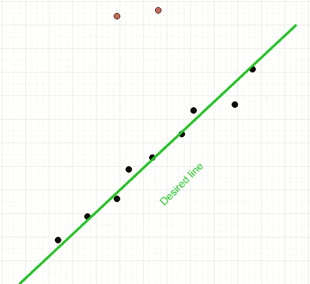

# 拟合数据的线-由最小二乘算法计算

最小二乘法将以同等的重要性考虑所有点。我们可以清楚地看到，结果线明显偏向异常值。

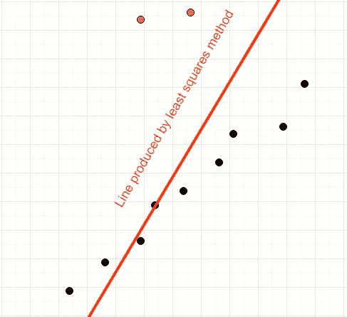

上述示例展示了噪声如何影响最小二乘拟合算法的结果。人类的大脑可以很容易地发现异常值，但最小二乘算法却不能。这就是 RANSAC 介入的地方。RANSAC 是一种简单的基于投票的算法，它迭代地对点群进行采样，并找到那些看起来符合的线的子集。

考虑以下几点。不难发现，只要我们排除视觉最右侧的两个噪声点，就可以从这些点中找到一个漂亮的圆。

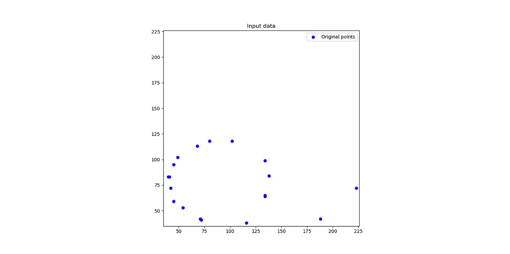

# 拟合圆-使用梯度下降算法

找到最佳拟合圆后的输出如下所示。请注意，圆的位置已经向异常值移动

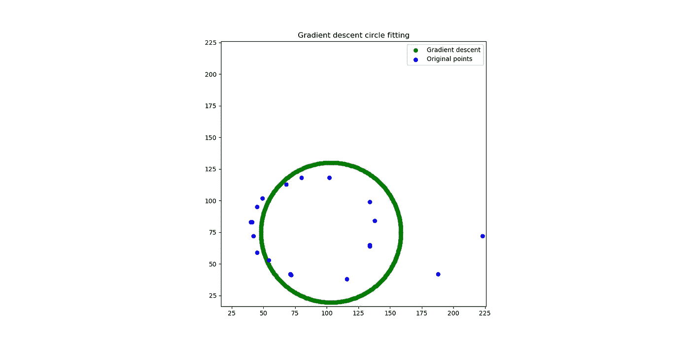

# 拟合圆-使用 RANSAC

使用 RANSAC 考虑异常值后的输出。请注意，该算法已经很好地检测到了最右侧的噪声点。RANSAC 算法完全忽略了异常值。

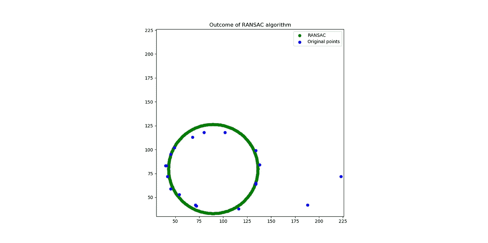

# 关键定义

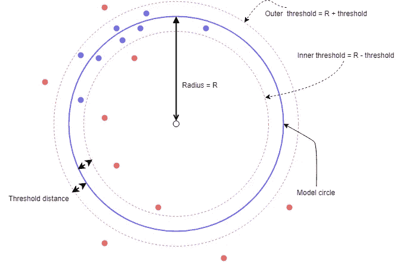

**模型圆:**我们认为符合这些点的候选圆

**阈值距离:**用于创建一个像圆环一样的同心圆，中间是模型圆

**异常点:**甜甜圈区域外的任何点

**内点:**甜甜圈区域内的任意点

**阈值内点计数:**待选候选圆的最小内点点数

**平均绝对误差:**1/N XσABS(内点到候选中心的距离——候选中心的半径)
N =所有内点的计数

# 初始化基本参数

1.  选择一个阈值距离— **阈值距离**
2.  选择内联器的阈值计数— **内联器阈值计数**
3.  选择最大采样数— **最大迭代次数**

# 建立候选人圈子的候选名单

考虑以下点的排列。我们将使用这个例子来理解 RANSAC 算法

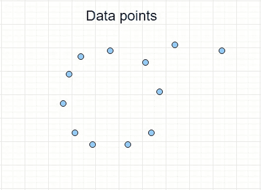

1.  选择任意 3 个点

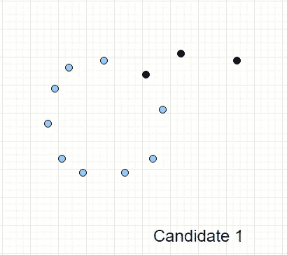

1.  找出通过这三点的圆。这是我们的**候选圈**。

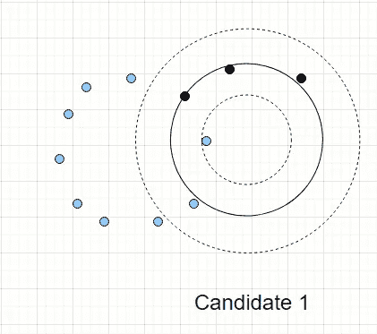

1.  使用**阈值距离**并找到位于环形区域的所有点。这些是**内点**。
2.  如果计数小于**阈值内层计数**，则跳过此**候选圆**并返回第一步。
3.  如果计数超过**阈值内层计数**，则进入下一步
4.  使用所有的**内点**并确定**新的候选圆**
5.  为**新候选圆**找到所有新的**内点**和新的**外点**
6.  如果**内点的计数**小于**阈值内点计数**，则跳过此**新候选圆**并返回第一步。
7.  如果计数超过**阈值，则进入下一步**
8.  使用新的内点计算**新候选圆**的**平均绝对误差**
9.  将此**候选圆**与**内点**和**平均绝对误差**一起添加到候选列表中
10.  回到第一步，重复**最大迭代**次
11.  当最大迭代次数完成后，检查**候选圆**中的**候选列表**，并挑选具有最大内层计数的圆。如果多于一个候选圆具有相同的内线计数，则挑选具有较小平均绝对误差的候选圆

# 示例 1

## 以前

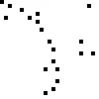

## 在...之后

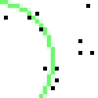

# 示例 2

## 以前

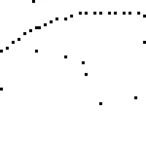

## 在...之后

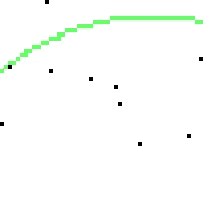

# 示例 3

## 以前

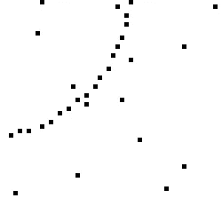

## 在...之后

# 实例 4

## 以前

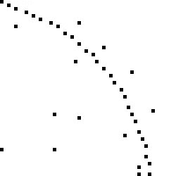

## 在...之后

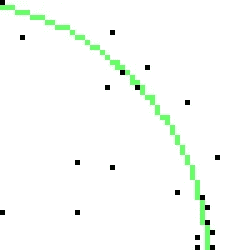

# 实例 5

## 以前

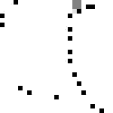

## 在...之后

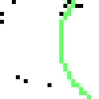

# 实例 6

## 以前

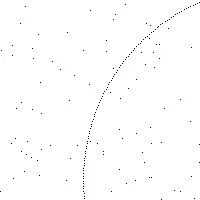

## 在...之后

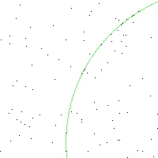

# 例 7

## 以前

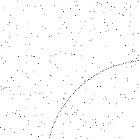

## 在...之后

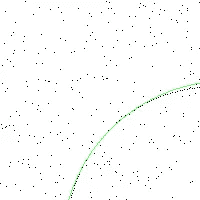

# 链接到源代码

[Github](https://github.com/sdg002/rANSAC)

# 关于源代码

文件夹层次结构如下:

1.  **算法** : Python 类实现了直线和圆的实际 RANSAC 算法
2.  **Common** : Python 类，实现了通用的模型类，如 Circle、Line 和 Util
3.  **RANSAC** :使用“**输入**子文件夹中的图像启动 RANSAC 算法的脚本
4.  **单元测试**:算法类的单元测试

# 快速启动

您可以选择以下任一选项:

1.  **ran sac \ exetransacccircle . py**—编辑。\在此脚本中输入图像文件名并执行。输出将在中创建。\out 文件夹
2.  **unit tests \ ran sac \ test _ ransacirclehelper . py**—您可以调试测试并对代码进行演练

# 为什么我选择梯度下降算法进行圆拟合？

用于直线的 RANSAC 依靠最小二乘算法来找到适合一组点的直线。当我开始为圆实现 RANSAC 时，我不确定将圆拟合到一组点的最佳数学方法是什么。与直线的最小二乘法不同，圆的等效方法是非线性的，没有迭代方法很难求解。我熟悉梯度下降法，这种方法效果很好。然而，GD 是一种迭代方法，计算量相当大。在后期阶段，我学习了 Randy Bullock 的方法，将非线性优化问题简化为线性问题。

# 兰迪·布洛克的圆拟合最小二乘法

这是一个[非常优雅的算法](http://www.dtcenter.org/sites/default/files/community-code/met/docs/write-ups/circle_fit.pdf)，它几乎“神奇地”将圆拟合的非线性问题化为线性问题。它巧妙地选择了残差函数，并对平均值周围的数据点进行了线性变换。我希望通过切换到这个算法来增强 RANSAC 算法的性能。

# 2020 年 8 月更新

*   我已经用兰迪·布洛克的圆算法取代了梯度下降圆拟合。性能提高了近一个数量级
*   一些改进了性能的错误修复