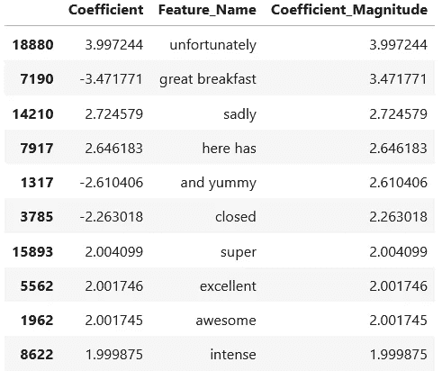
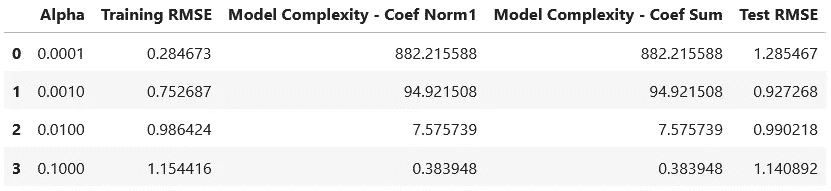
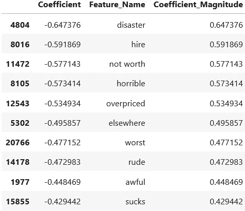
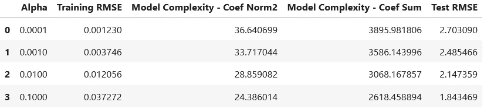
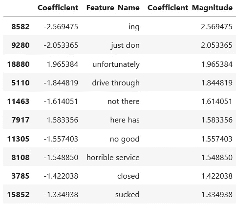
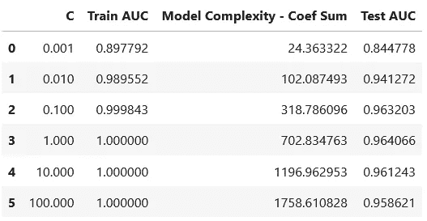
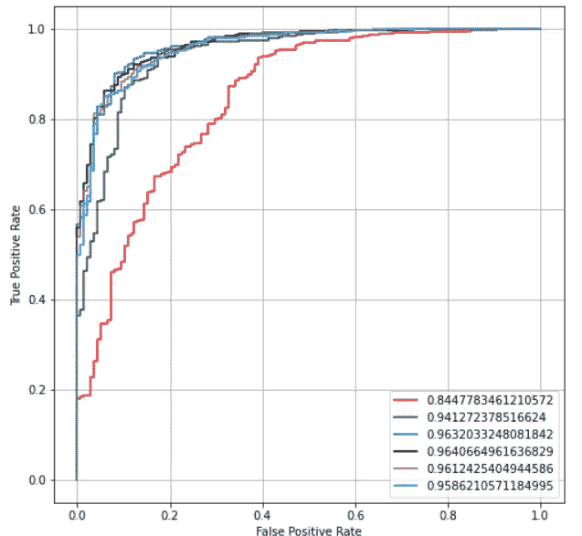
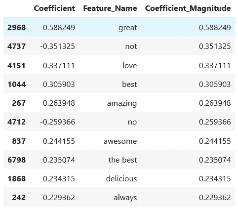
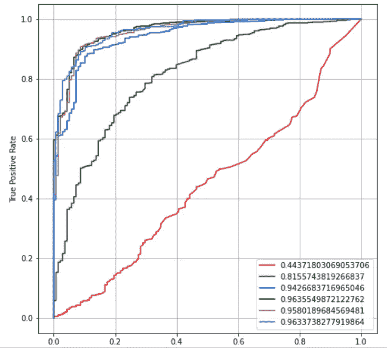
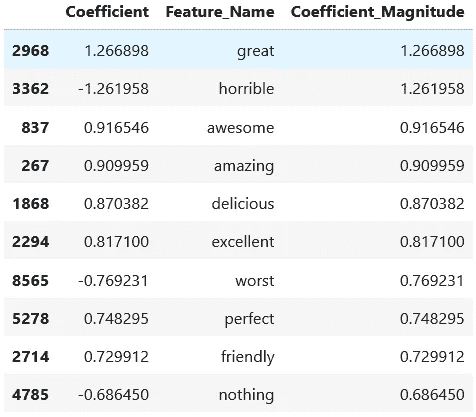

# 基于正则化的评论文本评分预测——线性回归与逻辑回归

> 原文：<https://medium.com/mlearning-ai/rating-prediction-from-review-text-with-regularization-linear-regression-vs-logistic-regression-df0181fe9c07?source=collection_archive---------7----------------------->

在本文中，我试图构建几个传统的机器学习模型(线性回归和逻辑回归)并进行正则化，以纯粹基于顾客评论文本预测餐馆的星级。

[https://stock.adobe.com/](https://stock.adobe.com/sg/images/smile-face-and-cart-icon-on-wood-cube-optimistic-person-or-people-feeling-inside-and-service-rating-when-shopping-satisfaction-concept/412850582?asset_id=412850582)

# 1.简介和数据探索

Yelp 发布关于企业的众包评论。所使用的数据集是 Kaggle 的 [Yelp 商业评分预测](https://www.kaggle.com/c/yelp-recsys-2013)比赛数据的一个小子集，可以在这里下载[。数据集的一些关键信息:](https://smu-my.sharepoint.com/:f:/g/personal/vaple_2021_mitb_smu_edu_sg/EtFn8Z3ynNVKlkiwEJQ5e8UBs4UO2TM-T81LKh7diLcXFA?e=V65JZA)

*   每个观察(行)是特定用户对特定业务的回顾。
*   **星级**栏是评估者给业务分配的星级数(1 到 5)(星级越高越好。)换句话说，就是写评论的人对企业的评级。
*   **文本**列是评论的文本。

首先，让我们导入必要的库和数据集本身:

接下来，为了获得关于评论文本的一些直觉，我们可以在两个极端使用流行的词云可视化——一星和五星评论。我们从 5 星评价开始:

5-star reviews word cloud

接下来是 1 星评价:

1-star reviews word cloud

从生成的两个云来看，很明显输出没有预期的好。我们的期望是，5 星评价应该包含更多的正面词汇，如用于补充的词汇，而 1 星评价应该包含更多的负面词汇。因此，他们的词云应该有这些相反意义的词组占主导地位。

然而，这两种词云都以中性和描述性的词为主，如“食物”、“服务”和“地点”。我们可以看到，虽然 5 星级词云确实包含几个具有积极内涵的词，如“棒”、“好”、“好吃”，但它主要是中性词。此外，1 星评级甚至有一个积极的词“好”作为最频繁的词之一，而“坏”的词相对较少，表明频率较低。
统计最频繁出现的单词不会产生评论是否负面的良好指示。

这表明需要预处理这些评级，以去除上面列出的高度重复但中性的词，从而将更多的注意力放在评论中与情感相关的词上。

# 2.反矢量器和非正则线性回归

根据 Scikit-Learn 文档，CountVectorizer 将输入语料库中出现的单词创建成单词包(词汇表)。这些标记被理解为建模的属性。然后它将文档(句子/复习课文)列表转换成一个矩阵，其中每行是一个文档，每列是词汇表中每个单词在文档中出现的频率。

在这个实现中，我们可以使用参数`ngram_range = (1, 2)`来指定最小 1 个单词和最大 2 个单词的长度将作为特征被包括，并且`min_df = 10`忽略在整个词汇表中出现少于 10 次的特征。具有 CountVectorizer 的线性回归模型(训练 80%和测试 20%)构建如下:

用训练数据拟合回归模型后，我们可以使用测试数据(X_test)生成预测(Y_pred ),然后检查模型如何通过 R 平方或 RMSE 解释残差:

得到的 R 平方是-4.14，而 RMSE 是 2.74。这些数值表明该模型还不能很好地解释这些数据。我们可以深入了解该模型的重要特性，以获得更多见解:

linear model feature importance

我们可以看到，大多数顶级特征都很好地表明了评论的积极或消极。然而，该模型的一些顶级特征具有模糊/中性的含义(“这里有”、“关闭”)或者适用于其他情况的非通用含义(“丰盛的早餐”)。

# 3.正则线性回归

为了提高上述模型的性能，我们可以尝试不同的正则化技术。在接下来的部分中，套索和山脊正则化以不同的程度实现，由`alpha`值控制。alpha 值越高，应用的正则化强度越大，给予复杂模型的惩罚越多，导致复杂度越低。这可以以训练集准确性为代价来改善模型与测试数据的差异(减少过拟合)。关于这两种技术的一篇好文章将在下面的文章中介绍:

 [## 机器学习中的正则化

### 训练机器学习模型的一个主要方面是避免过度拟合。该模型将有一个低…

towardsdatascience.com](https://towardsdatascience.com/regularization-in-machine-learning-76441ddcf99a) 

这些步骤的总体流程是，对于每个 alpha 值，使用训练数据构建一个新模型，然后根据测试数据生成预测。训练集和测试集上的错误都被记录并排列成数据帧，以便于阅读。

**3.1。拉索正规化**

首先，实现套索正则化。请注意，模型的复杂程度可以通过几种方法来计算。这里，L1 范数(或系数幅度之和)被用作指示并同时显示。您可以选择一种首选方法(使用 numpy 线性代数库`.norm()`方法或应用于系数的简单`.abs()`方法。

lasso regularized linear regression models

较高的 alpha 值不利于更复杂的模型，因此通过移除不重要的特征来降低模型复杂性。当 alpha 从 0.0001 增加到 0.001 时，测试 RMSE 减少，因此模型的概括能力提高。这是以更高的训练误差为代价实现的，这可以从增加的训练 RMSE 值中看出。超过 0.001 的 alpha，模型测试误差再次增加。这是较低的复杂性无法推广的地方，因为删除了太多重要的功能。因此，最好的模型似乎是 alpha = 0.001，此时模型的概括能力还没有最大化，复杂度相对较低。

与上一节类似，我们可以从性能最好的模型中输出模型特性重要性。

基于下面幅度最大的前 10 个特征。显而易见，这些特征具有更明确的含义。更强烈的词，清楚地给出了评论的暗示，如“灾难”、“可怕”和“最差”/“不值得”，这些词在以前建立的正常回归中不存在，现在出现了。然而，应该注意的是，顶级功能现在包含所有具有负面意义的内容。

best-performing lasso model feature importance

**3.2。山脊规则化**

通过同样的方式，下面实现了脊正则化，并且在数据帧中总结了不同正则化强度的结果。

ridge regularized linear regression models

从系数大小的总和可以看出，岭回归产生的模型比以前的 lasso 回归复杂得多。这是因为*套索回归允许系数一直减少到零*，因此完全删除了属性，而 ridge 不能。

模型的复杂性也可以通过更常用的 Norm2 来衡量。基于阿尔法和 RMSE 值的趋势，有一个单调的趋势:随着阿尔法的增加，应用更多的正则化，以更高的训练误差为代价降低模型复杂度，并实现更好(更低)的测试误差。这个模型越来越好概括。

我们没有看到套索回归中出现的趋势逆转的问题。这可能是因为岭回归没有完全去除任何属性，不管它们的重要性如何。因此，删除能够概括测试数据的重要特性的风险降低了。我们可以将 alpha 为 0.1 的模型视为性能最佳的模型，因为它是最简单的*，但仍能确保较低的测试误差*。

best-performing ridge model feature importance

从上面的 10 大特征可以看出，这个模型不如 lasso 之前的好。这是因为虽然强否定词仍被列为强属性，但一些中性/歧义词如“ing”、“drive through”和“here has”仍会出现。

总的来说，线性回归模型可以生成良好的预测特征，可以比简单地使用词云更好地预测评论的评级。然而，观察到这些模型收敛相对较慢，并且在最高评级特征中仍然包含中性词。Lasso 的模型复杂度也非常高，这可以从以千计的系数数量级的总和中看出。这使得在实践中使用它成为一个挑战。虽然岭回归可以删除许多特征并生成更简单的模型，但当应用过多的正则化时，它有欠拟合的风险。

# **3。正则化逻辑回归**

在这个简单的逻辑回归实现中，我们将问题视为两个极端类别的二元分类:1 星和 5 星评论，方法是创建主数据集的子集，然后对训练测试集进行同样的 80-20 分割，并将评论文本矢量化为特征。

对于在 SKLearn 中实现的逻辑回归，正则化程度由 C 值控制，C 值与正则化强度的*倒数*成比例-C 值越小，正则化越强，对复杂模型施加的惩罚越多。

此外，L2 范数正则化类似于岭正则化，而 L1 范数正则化等价于线性回归模型中的套索正则化。

在模型分类性能方面，在不同的正则化强度下检查 ROC 曲线下的面积(AUC)。

**3.1。L2 范数正则化逻辑回归**

我们可以实现 L2 正则化的逻辑回归模型，并将它们的 AUC 值记录到一个简单的数据框架中。模型系数幅度的总和用于复杂度测量。

L2-regularized logistic regression model performance

我们可以将不同 C 值的 AUC 曲线可视化如下:

随着 C 的增加，对更复杂的模型施加更少的惩罚。因此，由系数幅度之和测量的模型复杂度增加。模型训练 AUC 值随着其拟合训练数据的能力增加而单调增加。然而，模型试验的 AUC 在 C=1 时达到峰值，此后下降。这显示出过度装配的迹象。

C=0.01 的模型似乎是最理想的。这是因为虽然复杂性是第二低的，最复杂模型的 5.8%(C = 100，最不规则)，但它可以实现最复杂模型的 98%的训练和测试 AUC。

接下来，让我们挑选这个最佳模型，并检查它们的特性重要性。基于其系数大小的顶部特征是合理的，因为它们中的大多数对评论是正面还是负面具有明确的意义。然而，有两个特征(“否”和“不是”)可能是不明确的。

best L2-regularized model feature importance

**3.2。L1 范数正则化逻辑回归**

类似地，让我们建立几个 L1 正则化模型，并通过 AUC 表和曲线检查它们的性能。

L1-regularized logistic regression model performance

如上表和图所示，与之前的 L2 惩罚相似，随着 C 的增加，对更复杂的模型施加的惩罚更少。因此，由系数幅度之和测量的模型复杂度增加。模型训练 AUC 值随着其拟合训练数据的能力增加而单调增加。

然而，模型试验的 AUC 在 C=1 时达到峰值，此后下降。这表明过度拟合的迹象。一个重要的观察是，模型的复杂性现在*低得多*在每一个 C 值比 L2 罚值低的情况下。L1 罚模型导致具有同样好性能的更简单的模型。

C=0.1 的模型似乎是最理想的。这是因为虽然复杂性是第三最低的，是最复杂模型的 2.8%(C = 100，最小正则化)，但它可以实现最复杂模型的训练和测试 AUC 的大约 98%。

使用相同的方法，我们可以提取该最佳模型的最高特征重要性，如下所示:

best L1-regularized model feature importance

与使用 L2 正则化的所选模型相比，L1 最佳执行模型具有低得多的复杂度。即使复杂性更低，其 10 大最重要的特征也比之前的 L2 模型具有更明确的正面或负面意义。使用这些顶级功能更容易辨别和预测 1 星和 5 星评级。在这种情况下没有明显的模糊特征。

# 4.摘要

很明显，逻辑回归在适当调整后可以生成简单的模型，具有高质量的顶级特征，清楚地表明了审查数据的内涵。还观察到它运行非常快。这优于线性回归模型。

 [## Mlearning.ai 提交建议

### 如何成为 Mlearning.ai 上的作家

medium.com](/mlearning-ai/mlearning-ai-submission-suggestions-b51e2b130bfb)