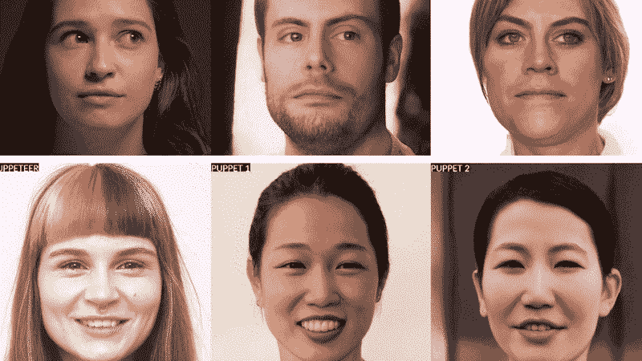

# 重塑你自己的脸

> 原文：<https://medium.com/mlearning-ai/re-creating-your-own-face-4343d9908183?source=collection_archive---------2----------------------->

## [机器学习艺术](https://mlearning.substack.com/)

## 使用 SOTA 视频算法

[https://mlearning.substack.com/](https://mlearning.substack.com/)

我将告诉你一项技术，它可以**生成任何人的接近人类水平的视频**。现在，这项技术可以用在广告或电影中，起初它可能看起来像魔术，但我想你会发现它离真相不远了。