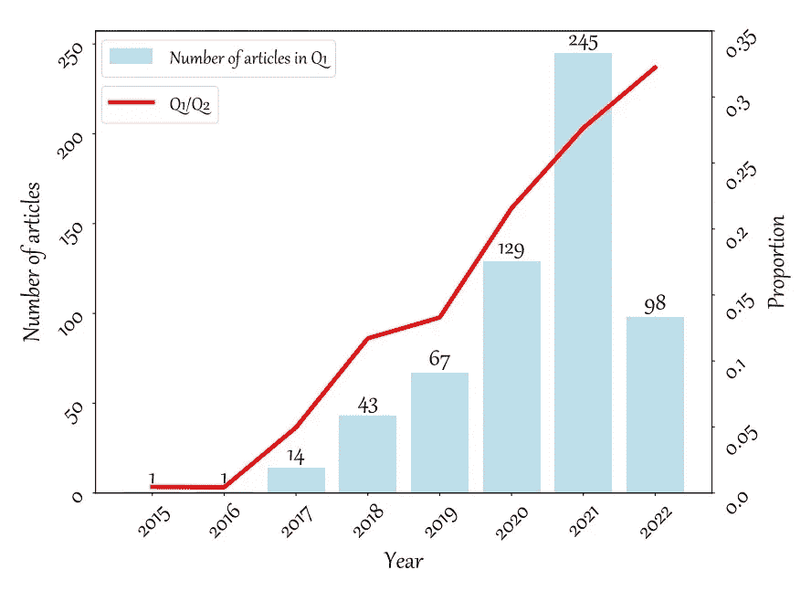
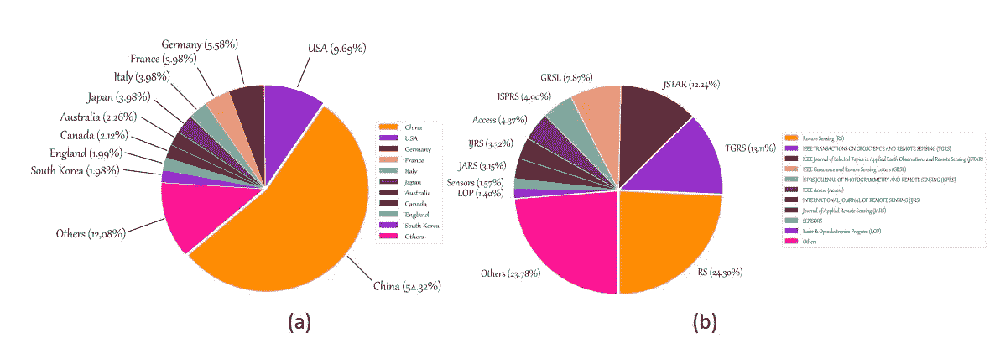
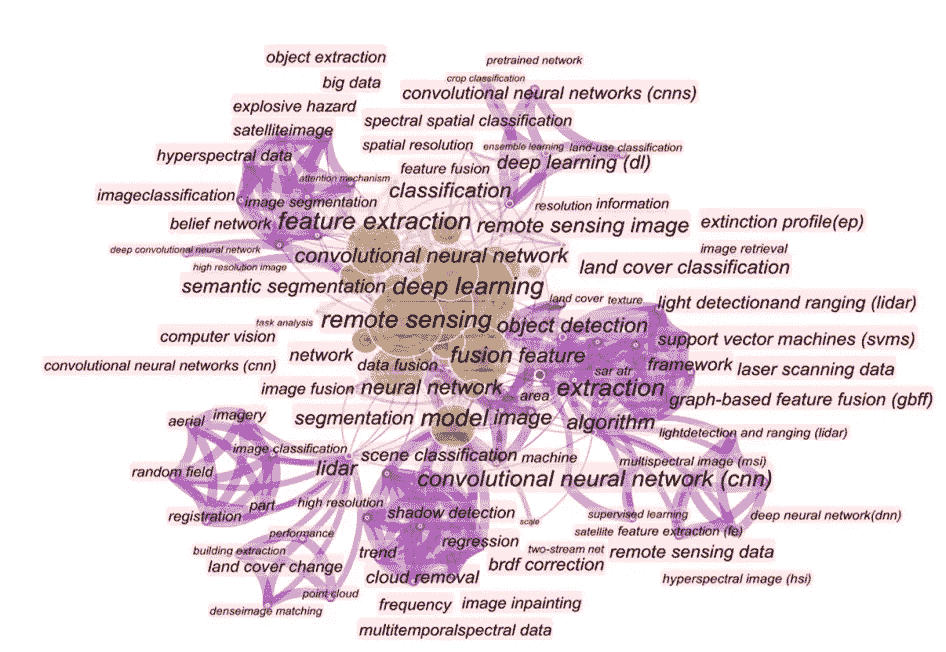
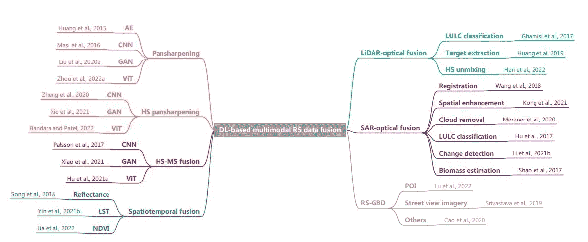
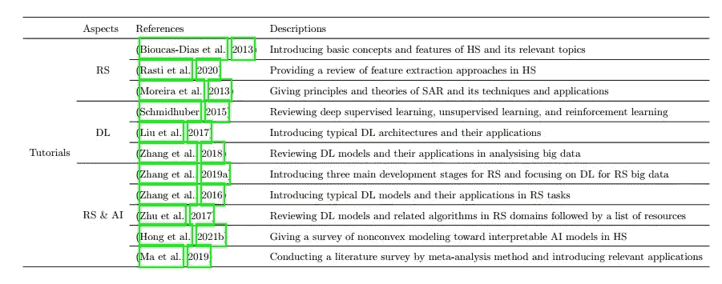
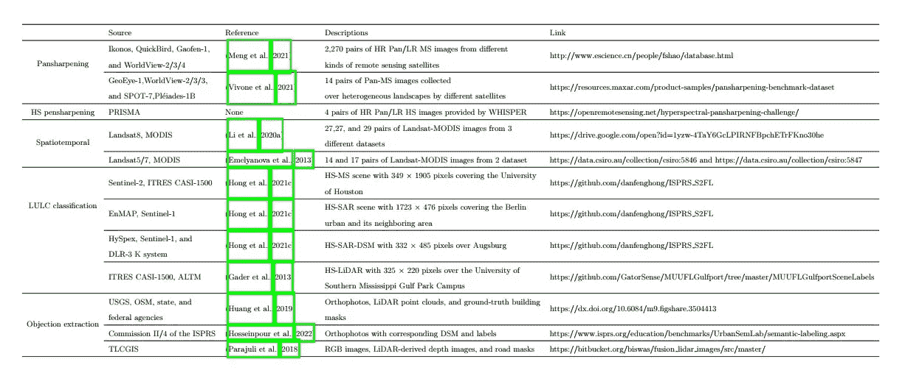

# 转述一篇论文:《多模态遥感数据融合中的深度学习:综述》

> 原文：<https://medium.com/mlearning-ai/re-tell-a-paper-deep-learning-in-multimodal-remote-sensing-data-fusion-a-comprehensive-review-e54d8bd860e3?source=collection_archive---------3----------------------->

## 笔记，深度学习，遥感，高级方法。

## 我读过的论文的注释

Photo by [USGS](https://unsplash.com/@usgs?utm_source=medium&utm_medium=referral) on [Unsplash](https://unsplash.com?utm_source=medium&utm_medium=referral)

大家好，

本周我想分享一些我从李等人 2022 的论文中摘录的 46 页笔记。该论文讨论了用于多模态遥感研究的深度学习方法的概述。

本文的综述可分为四个部分:

1.  通过深度学习进行遥感数据多模态分析的趋势，
2.  遥感数据融合的深度学习方法，
3.  收集的资源列表，
4.  挑战和未来方向。

# 介绍

从遥感数据中提取信息有许多方法。其中之一是我们可以一起使用深度学习和不同类型的输入数据。深度学习在图像处理方面已经取得了令人印象深刻的进展，并在今天被遥感研究人员大量采用。事实上，对于遥感研究人员来说，一种类型的图像可能不足以有效地解释一种现象。我们通常试图将一种类型的图像与其他不同类型的图像融合在一起。这是因为图像融合可以互补其特性，可以产生更稳健的分析，例如，[傲霜等，2021](http://dx.doi.org/10.3390/rs13050851) 融合卫星影像来评估土地利用变化的影响。

此外，“情态”术语缺乏明确的定义。参考文件给出了一些细节。作者将情态定义为**内部属性**和**外部属性**对描述场景的贡献。内部属性是指传感器的技术规格，如成像机制，以及空间、光谱、辐射和时间域的分辨率。而外部属性指的是实际采集条件，例如采集时间、观察角度等。一些典型的遥感模式包括全色、多光谱、超光谱、激光雷达、合成孔径雷达、红外、夜灯、卫星视频数据和地理空间大数据(GBD)。

# 1.基于深度学习的遥感数据多模态分析趋势

趋势分析基于科学网和 cite-space ( [陈，2006](https://doi.org/10.1002/asi.20317) )，关键词为“遥感”、“深度学习”、“融合”。它检索了 2015 年至 2022 年发表的 598 篇论文。

趋势分析是通过检查每年发表的论文数量、它们的国家和期刊分布以及流行关键词来进行的。下面的图 1、图 2 和图 3 显示了上述趋势分析。根据分析，关于这一主题的研究增长是有希望的，因为发表的论文数量正在显著增加。中国被认为做出了重大贡献，其次是美国和德国。大多数论文发表在遥感杂志上，然后是 TGRS 和 JSTAR。CNN 成为最常见的进行多模态分析的深度学习方法之一。此外，利用多模态遥感数据融合的常见应用是分类、去云和目标检测。同时，多光谱、超光谱、激光雷达和合成孔径雷达是最常用的数据。

Figure 1\. The number of published papers annually. Source: [Li et al., 2022](https://arxiv.org/abs/2205.01380) page 6.

Figure 2\. Countries and journals distribution. Source: [Li et al., 2022](https://arxiv.org/abs/2205.01380) page 6.

Figure 3\. Popular keywords. Source: [Li et al., 2022](https://arxiv.org/abs/2205.01380) page 7.

# 2.遥感数据融合的深度学习方法

本节的讨论分为两大类，即同质融合和异质融合。**同质融合**与融合相似的数据类型或传感器有关，例如，空间光谱融合(泛锐化、超光谱泛锐化和超光谱-多光谱)和时空融合。而**异源融合**涉及不同数据类型的融合，如高光谱-光学、合成孔径雷达-光学、遥感-GBD。这两个子领域的文献列表如图 4 所示。所有引文都可以在[引用的论文](https://arxiv.org/abs/2205.01380)中找到。

Figure 4\. Literatur taxonomi. Source: [Li et al., 2022](https://arxiv.org/abs/2205.01380) page 8.

# 3.收集的资源列表

鉴于分析多模态卫星数据的众多基于 DL 的模型，作者提供了相关来源，包括初学者教程(图 5)、开源数据集(图 6)和开源代码( [Li et al .，2022](https://arxiv.org/abs/2205.01380) page 20)。所有引文均可在[参考论文](https://arxiv.org/abs/2205.01380)中找到。

Figure 5\. List of tutorials for beginners. Source: [Li et al., 2022](https://arxiv.org/abs/2205.01380) page 18.

Figure 6\. List of multimodal remote sensing dataset. Source: [Li et al., 2022](https://arxiv.org/abs/2205.01380) page 19.

# 4.挑战和未来方向

对于这一部分，我认为可以在另一篇文章中做更详细的说明。然而，我指出了挑战的要点和参考文件中正在考虑的未来方向。

*   从注册良好到未注册，
*   从面向图像到面向应用的质量评估，
*   从双模态到多模态，
*   从多模态学习到跨模态学习，
*   从黑盒到可解释的深度学习。

本文对多模态遥感数据深度学习的研究进展进行了综述。我们可以得到该领域研究的总体趋势，已应用的不同方法的文献分类，数据和代码来源，以及对未来的一些建议方向。

感谢阅读。

 [## Mlearning.ai 提交建议

### 如何成为 Mlearning.ai 上的作家

medium.com](/mlearning-ai/mlearning-ai-submission-suggestions-b51e2b130bfb)