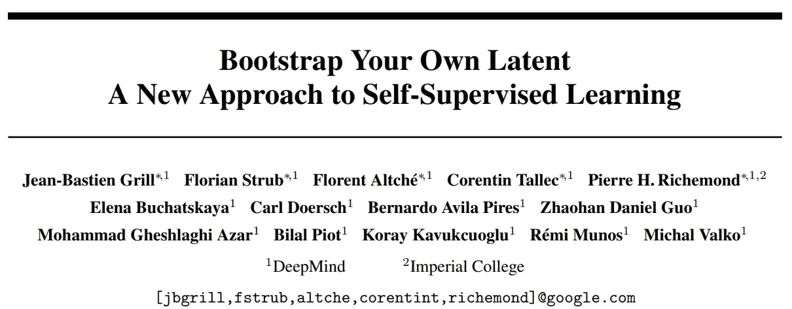
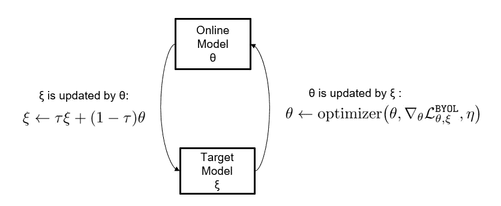
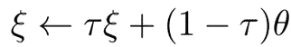
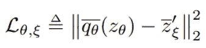
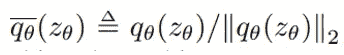
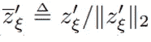
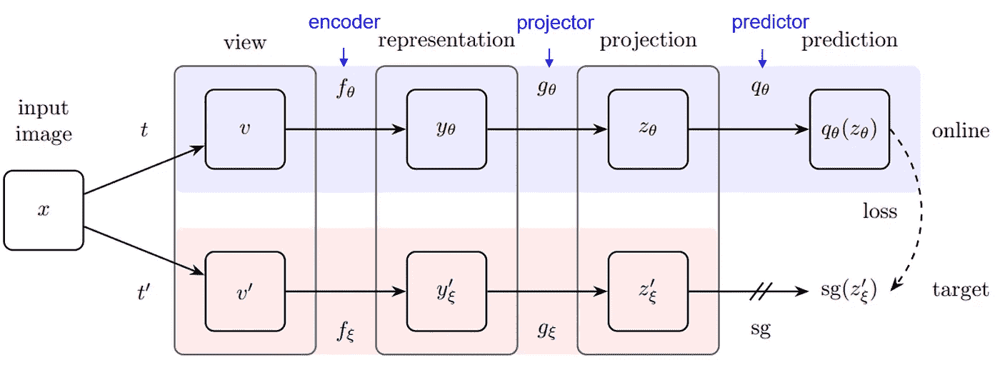
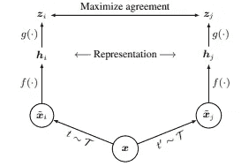
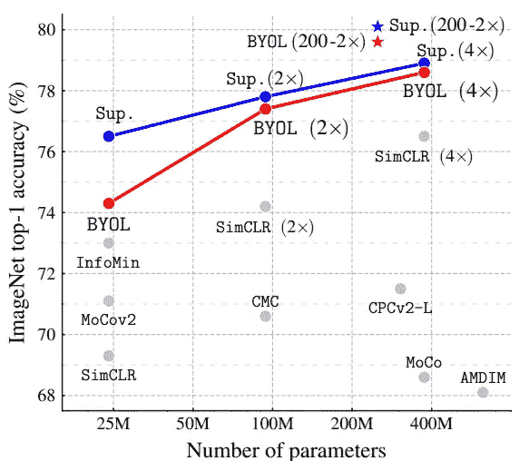

# 和我一起阅读论文:引导你自己的潜能:自我监督学习的新方法

> 原文：<https://medium.com/mlearning-ai/read-paper-with-me-bootstrap-your-own-latent-a-new-approach-to-self-supervised-learning-e6580ce8dae5?source=collection_archive---------3----------------------->

## 自我监督学习方法——BYOL 的解读

*   这篇博客介绍了*[*引导你自己的潜在*【BYOL】](https://arxiv.org/pdf/2006.07733.pdf)方法，这是一种由 DeepMind 和伦敦帝国提出的自我监督学习方法*

***看一眼纸:***

*   *BYOL 包含两个架构相同但参数不同的网络。*
*   *BYOL 不需要负对，而大多数对比学习方法都需要负对，例如 [SimCLR](https://arxiv.org/abs/2002.05709)*

***背景:***

*[对比学习(CL)](https://towardsdatascience.com/understanding-contrastive-learning-d5b19fd96607#:~:text=Contrastive%20learning%20is%20a%20machine,points%20are%20similar%20or%20different%20.&text=In%20essence%2C%20contrastive%20learning%20allows,to%20do%20the%20same%20thing.) 目前在自我监督学习方面取得了最先进的成绩。在对比学习中，来自相同图像的视图被称为正对视图，而来自不同图像的视图被称为负对视图。*

*然而，可以有无限多的负对，CL 需要大量负对以确保其性能。这项工作因此提出了一个新的框架，称为 BYOL，以消除对负对的需要。*

***方法:***

1.  *概观*

*在这个框架中有两个网络。一个名为在线模型，另一个名为目标模型。在线模型用θ参数化，目标模型用ξ参数化。两个模型具有动态行为:*

*   *目标模型通过计算θ的[指数移动平均(EMA)](https://en.wikipedia.org/wiki/Moving_average) 来更新其参数ξ。*
*   *在线模型通过学习目标模型的参数ξ来更新其参数θ。*

**

*The dynamics between the online and target models. Image from the author.*

*2.参数更新*

*我将在下面详细解释每个更新的方式:*

*   *ξ由θ更新:这是通过计算指数移动平均线(EMA)完成的，定义如下:*

**

*The formula of Exponential Moving Average (EMA). τ is a target decay rate and τ ∈ [0,1]. Suppose Compared with getting a plain average of θ over a certain time series, EMA assigned larger weights to more recent θ. This can be seen in the fact that if you expand the ξ on the right side, τ becomes τⁿ (n is the timestep). As τ is less one, τⁿ will become smaller, meaning its importance is decaying. Image from the [original paper](https://arxiv.org/pdf/2006.07733.pdf).*

*   *θ由ξ更新:这是通过优化目标函数来实现的。目标函数是归一化预测 q_θ_bar 和目标 z′_ξ_ bar 之间的均方误差:*

**

*Image from the [original paper](https://arxiv.org/pdf/2006.07733.pdf).*

*   *q_θ_bar 是 q_θ的 [L2 归一化](https://mathworld.wolfram.com/L2-Norm.html);*

**

*Image from the [original paper](https://arxiv.org/pdf/2006.07733.pdf).*

*   *z'_ξ_bar 是 z'_ξ的 L2 归一化:*

**

*Image from the [original paper](https://arxiv.org/pdf/2006.07733.pdf).*

*3.目标 z'_ξ的构造和 q_θ的预测*

*这是这个方法的核心部分。在线模型中，有三个阶段:编码器 f_θ、投影器 g_θ和预测器 q_θ。*

**

*The online model is made from an encoder, a projector, and a predictor. The online model predicts the projection from the target via the objective function mentioned above. sg stands for stop gradient, meaning that the gradient does NOT backpropagate in the target model because the target model is updated using EMA. After training, everything except f_θ is discarded. Image adapted from the [original paper](https://arxiv.org/pdf/2006.07733.pdf).*

*整个结构很可能建立在 [SimCLR](https://arxiv.org/pdf/2002.05709.pdf) 框架之上，所以我将简单介绍一下。在 SimCLR 中，输入图像被 t 和 t’变换以生成两个增强视图，然后通过编码器 f(⋅和投影仪 g(⋅以获得投影表示。然后，将 zᵢ和 zⱼ的投影表示进行对比，以最大化它们的协议，这被发现比直接最大化 hᵢ和 hⱼ之间的协议导致更好的性能。通过使用来自不同输入图像的视图来构建负像对。关于 [SimCLR](https://arxiv.org/pdf/2002.05709.pdf) 论文的更多细节。*

**

*Overview of the [SimCLR](https://arxiv.org/pdf/2002.05709.pdf) framework*

*然而，不同之处在于，在 BYOL，通过不同的编码器 f_θ和 f_ξ生成两个视图。这两种架构相同，但参数不同。此外，在 BYOL，有一个预测和目标网络。正如你所看到的，在 BYOL，不需要消极的一对。*

***成绩:***

*BYOL 模型优于 SimCLR。*

**

*Image from the [original paper](https://arxiv.org/pdf/2006.07733.pdf).*

***结论:***

*BYOL 提供了一种新的不需要负对的自我监督学习方法。*

*BYOL 有两种型号，结构相同，但参数不同。在线模型通过优化目标函数来更新其参数。目标模型通过计算指数移动平均值来更新其参数。*

***个人备注:***

1.  *构建足够多的否定对是保证对比学习效果的重要步骤。否则，可能会出现名为[折叠表示](https://arxiv.org/abs/2110.09348)的问题。这项工作为不使用负对的自我监督学习开辟了一条新的途径。*
2.  *EMA 用来考虑之前的θ，偏向新的θ。这种技术已经在其他方法中使用，例如 [Adam](https://towardsdatascience.com/adam-latest-trends-in-deep-learning-optimization-6be9a291375c) 优化器。原始论文还对 EMA 的τ进行了烧蚀研究。*

* [## Mlearning.ai 提交建议

### 如何成为 Mlearning.ai 上的作家

medium.com](/mlearning-ai/mlearning-ai-submission-suggestions-b51e2b130bfb)*