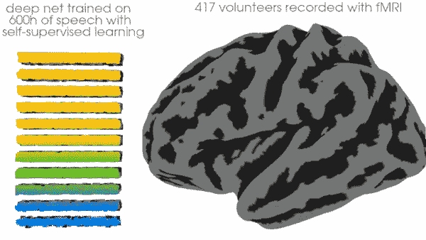

# 读心术

> 原文：<https://medium.com/mlearning-ai/reading-minds-5e69b12e453d?source=collection_archive---------1----------------------->

## [机器学习艺术](https://mlearning.substack.com)

## [大脑中的语音处理模型](/mlearning-ai/cocaine-for-the-eyes-and-brain-2f55312b8e77)

人们经常认为一个简单的理论不能解释大脑是如何工作的，因为它太复杂了。

> “即使有足够的关于每个大脑区域内容的可用数据，也可能没有现成的方程式来描述它们、它们之间的关系以及它们之间的关系……