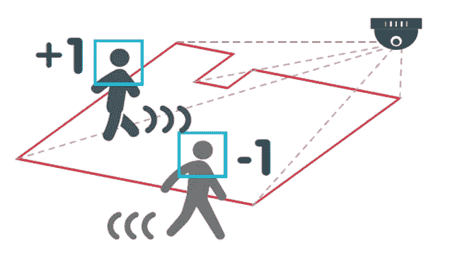
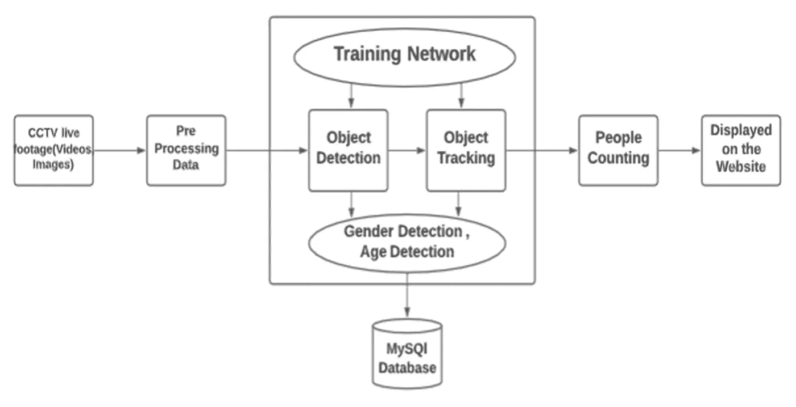
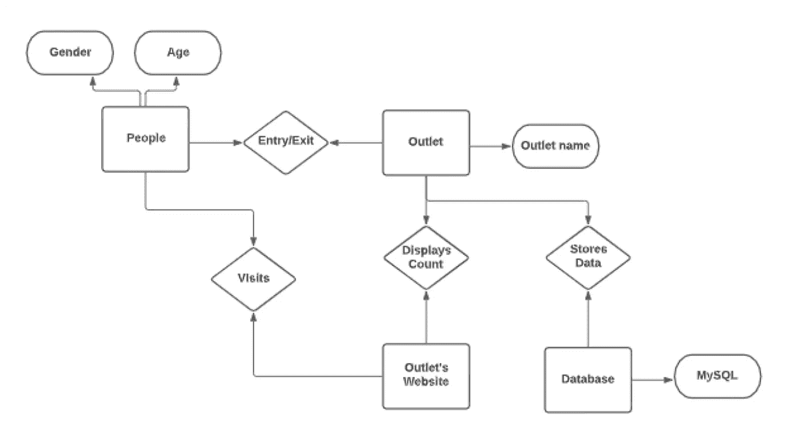
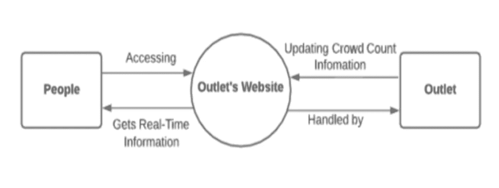
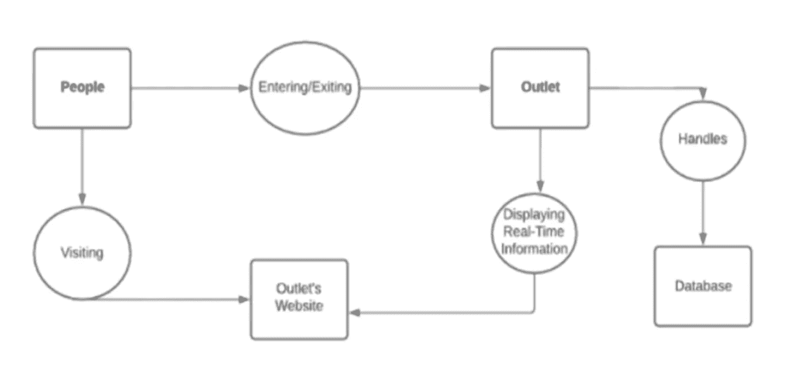
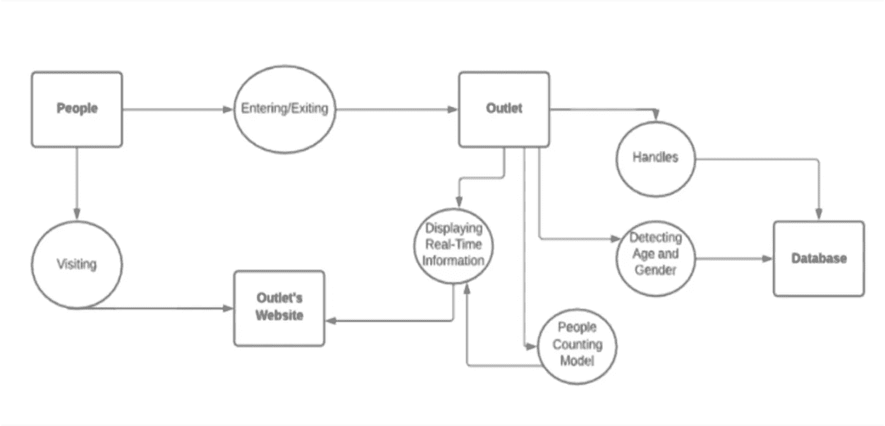
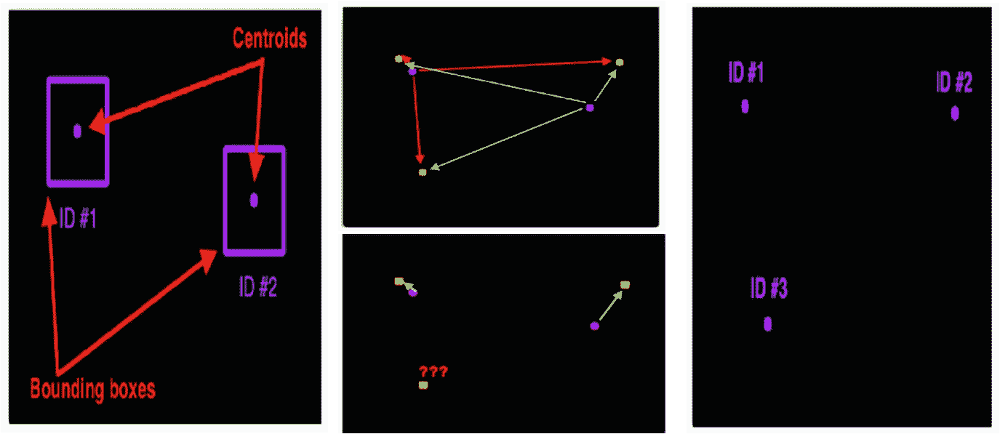
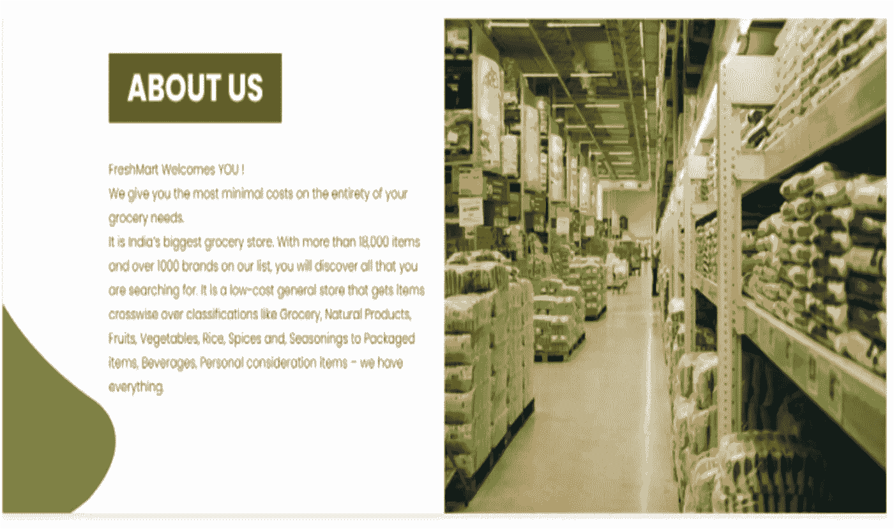

# 交易网点中的实时人群检测分析

> 原文：<https://medium.com/mlearning-ai/real-time-crowd-detection-analytics-in-trading-outlets-88e29a1ab294?source=collection_archive---------4----------------------->

# **简介**

人群是新冠肺炎传播的重要传播源。预防和缓解措施的重点是减少民众的大规模集会。就新冠肺炎疫情而言，尽管处于最初的封锁阶段，但在病毒仍在人群中传播的情况下，社区仍不确定如何恢复“新常态”的存在。普遍接种疫苗的希望对人类来说是一个巨大的挑战，即使在几个月内也不太可能实现。同时，当务之急是发展一种机制，使人们的生活恢复正常，同时限制病毒的传播。交易场所，如商场、餐馆等。，迎合了大众聚集，可能导致病毒的指数级传播。为了避免这种风险，我们可以使用“计数”的概念，让人们知道这些网点的实时人群计数。人群计数将有助于您了解餐厅中有多少人，从而有效监控和管理人群水平。

# **需求和动机**

## **需要**

实施该项目的需要是防止冠状病毒在交易网点传播。商店可以使用这种技术来检测人群数量，并将这些信息提供给公众或顾客。该项目的重点是开发一个 web 应用程序，提供实时的人群计数，帮助客户了解实时的人数，从而让客户做出合理的选择，是现在就去还是以后再去，以避免拥挤。这也将允许以有效的方式管理他们的时间。人群计数还有助于门店管理和调节入住率，并检测过度拥挤情况。这种全球疫情引发的最重要和最特殊的预防措施是，每个人都需要确保他们在自己之间保持建议的社交距离，人群检测可以确保社交距离随之而来。可以通过使用安装在出口的入口和出口处的摄像机来实施人群计数技术，以帮助实施现场人群计数，并且可以使用网络技术来使顾客实时获得人群计数数据。虽然这种方法不能直接解决个人的实际隔离问题，但这是朝着正确方向迈出的一步。

## **动机**

做这个项目的动机来自一个尚未解决的现实问题。我们有各种购物中心，像 D 玛特、大巴扎等。前 covid 的人曾经大量访问他们。最终，这些贸易点成为顾客购买食品杂货或其他必需品的首选。在 covid 时代，这些商店是大众的首选，人们仍然想去参观，但害怕 covid 和大众聚会。然而，即使个人决定参观这样的大型商店，在到达商店时，他们也被迫放弃他们的参观，因为这个地方过于拥挤并且缺乏社交距离。这个问题促使我们做了一个项目，可以实时统计这些出口的人群，并在各个出口的网站上显示信息。

# **问题和目标**

## **范围和受益人**

该项目旨在覆盖普通公众和销售点公司。我们将利用商店中预装的摄像头来检测人员，统计目前在商店中的人数，并通过商店的网站向公众展示这些信息。

通过这个项目，我们能够让上市公司和代销店受益。通过检查直销店网站上的实时人群计数，人们将能够决定何时参观直销店，并在过度拥挤的情况下避免前往，从而在全球疫情期间降低 covid 的风险。直销公司也将受益，因为他们将获得实际人数，并能够根据社交距离规范相应地处理人群。此外，他们还可以使用这些数据进行客户行为分析。

## **目标**

**1。计算当前在出口处的人数**

这个项目的主要目标是为出口处预装的 CCTV 摄像机提供机器学习功能，以使用计算机视觉技术(对象检测)检测人数。

**2。网站上的实时人数统计**

该项目还旨在提供网站上的人群计数，这将有助于最终客户实时了解商店中可能的人数。

**3。性别和年龄估计**

对进入商店的顾客的年龄和性别的估计将有助于商店公司检查进入其商店的人群类型，并相应地提供服务。

**4。帮助网点进行人群管理**

实时人群计数将帮助商店设计未来的策略，并使用这些数据有效地预测和预报人群计数。在过度拥挤的情况下，商店也将能够处理人群。进一步分析，如什么类型的绅士进入出口，什么是高峰时间等。也可以在制定未来战略时加以考虑。

**5。帮助公众做出明智的决定**

该项目有助于了解商店内的实时人数，这将使顾客选择是现在参观还是在过度拥挤的情况下安排时间。考虑到时间是宝贵的，这将节省客户的时间。因此，公众将能够做出明智的决定。

# **工具和技术**

项目中使用的主要技术是

a.计算机视觉(物体检测)

b.网络技术

**计算机视觉(物体检测)**

用于对象检测、对象跟踪(人)、年龄和性别估计的 Python 库和算法是

1.Numpy

2.OpenCV

3.Dlib

4.imutils

5.预训练的 Caffe 深度学习模型

用于对象检测(人)的算法是一种混合方法 MobileNet-SSDs+线性 SVM，因为它是一种高度精确的对象检测方法，而没有那么多的计算负担。对于对象跟踪，我们使用了“质心对象跟踪算法”来跟踪视频流中的对象。

**网络技术**

该项目将使用网站作为交付模式。人群计数，年龄和性别的人将被储存在一个数据库中，稍后，使用该网站，我们将向公众显示实时信息。

1.前端技术(HTML、CSS、Bootstrap)

2.后端技术(Django)

3.数据库(MongoDB)

# **数据集描述**

现场闭路电视实时监控出口的入口和出口

# 项目工作流程

# ER 图

# **数据流程图**

## 0 级

## 一级

## 第二级

# 算法

## 目标跟踪——质心目标跟踪算法

## 人员计数系统——人员计数算法

# 网站实施

# Github 项目

 [## GitHub-pulkitkhandelwal 29/fresh mart-Store-Live-People-Count:实时人群检测分析…

### 交易网点的实时人群检测分析该项目有助于测量穿过一个…

github.com](https://github.com/pulkitkhandelwal29/FreshMart-Store-Live-People-Count) 

# Github 档案

1.  普尔基特·汉德尔瓦尔—[https://github.com/pulkitkhandelwal29](https://github.com/pulkitkhandelwal29)
2.  阿什里塔·卡卡拉—[https://github.com/Ashrithakakarla](https://github.com/Ashrithakakarla)

# Linkedin 个人资料

1.  普尔基特·汉德尔瓦尔—[https://www.linkedin.com/in/pulkit-khandelwal-27a7b0215/](https://www.linkedin.com/in/pulkit-khandelwal-27a7b0215/)
2.  阿什里塔·卡卡拉——https://www.linkedin.com/in/ashritha-kakarla-807728175/

 [## Mlearning.ai 提交建议

### 如何成为 Mlearning.ai 上的作家

medium.com](/mlearning-ai/mlearning-ai-submission-suggestions-b51e2b130bfb)