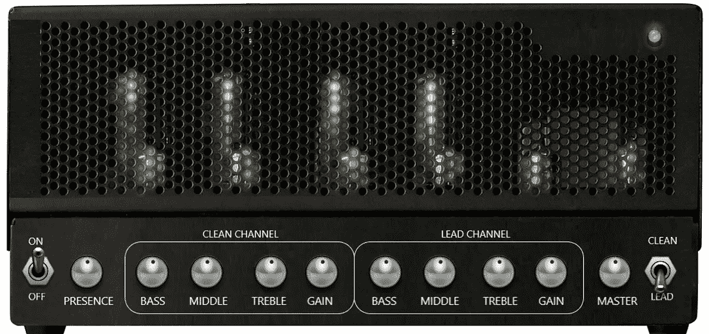
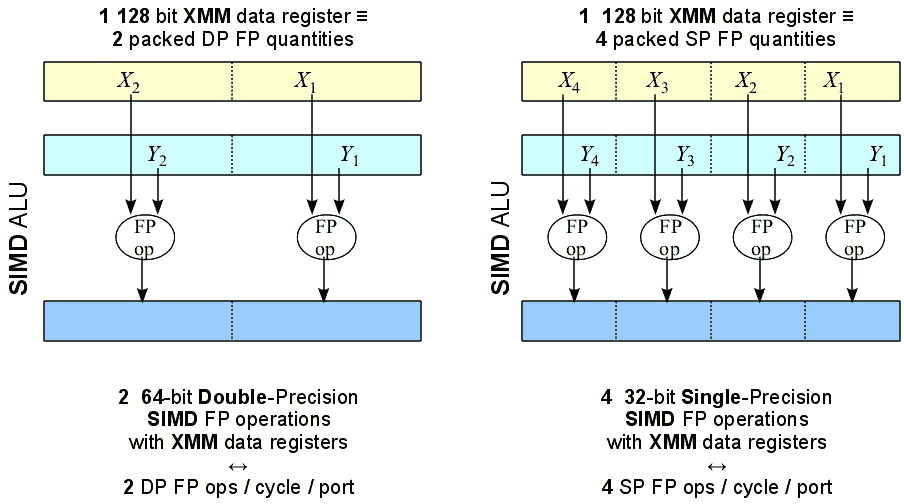
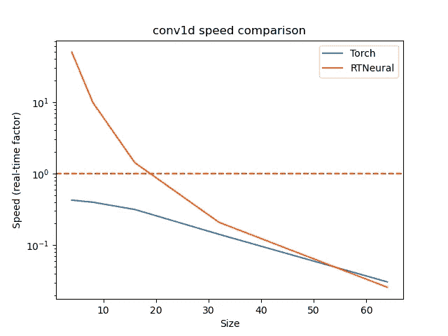
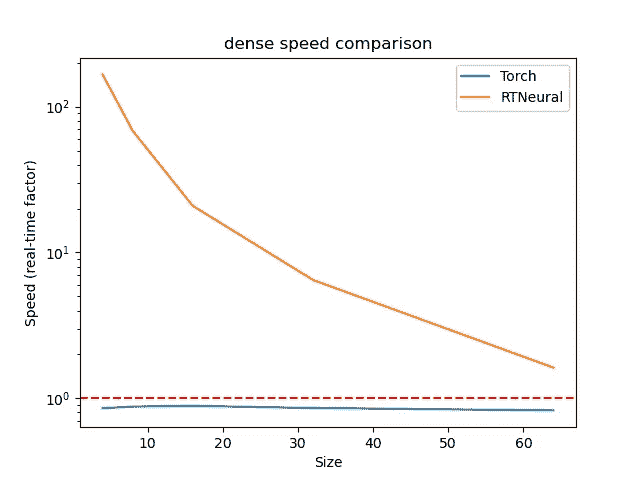
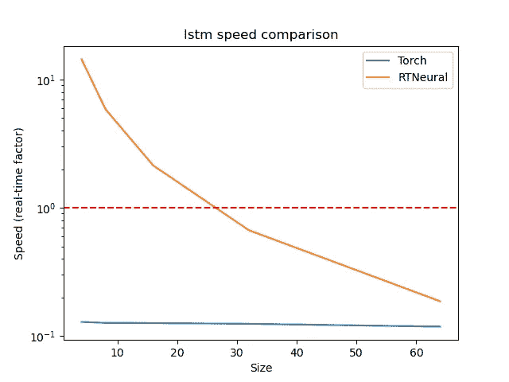
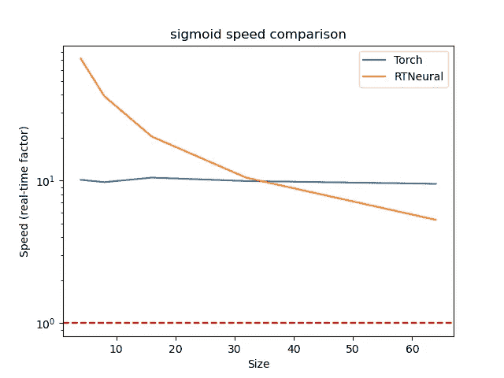
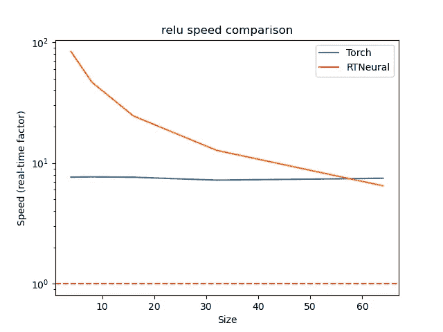

# 用于音频处理的实时神经网络推理

> 原文：<https://medium.com/mlearning-ai/real-time-neural-network-inferencing-for-audio-processing-857313fd84e1?source=collection_archive---------0----------------------->

在过去的几年里，音效领域对使用神经网络实时处理音频越来越感兴趣。这里简单介绍一些学术论文、商业产品和开源项目，它们利用神经网络来创建有趣的音频效果:

*   [*深度学习的实时吉他放大器仿真*](https://www.mdpi.com/2076-3417/10/3/766/htm) ，Alec Wright，Eero-Pekka Damskagg，Lauri Juvela，Vesa Valimaki:用 Wavenet 风格和递归神经网络仿真电子管放大器。
*   [*使用深度神经网络*](http://dafx2019.bcu.ac.uk/papers/DAFx2019_paper_42.pdf) 对非线性状态空间系统建模，Julian D. Parker，Fabian Esqueda，Andre Bergner:使用“状态转移网络”来模拟状态空间系统的行为。
*   [*随机化的 Overdrive 神经网络*](https://github.com/csteinmetz1/ronn)*【RONN】*，克里斯蒂安·斯坦梅茨和约书亚·d·赖斯(Joshua D. Reiss):使用具有随机权重的时域卷积网络来创建有趣的失真效果。
*   我自己的音频插件，模仿著名的 Klon Centaur 吉他踏板，使用了一个递归神经网络。
*   Keith Bloemer 的 [GuitarML](https://guitarml.com/) 项目:使用神经网络的开源吉他放大器和踏板仿真。
*   Native Instruments 的 [Guitar Rig 6 Pro](https://blog.native-instruments.com/the-making-of-icm/) :使用基于神经网络的“智能电路建模”来模拟各种吉他效果。

Steinmetz and Reiss’ Randomized Overdrive Neural Networks (left), and Bloemer’s Smart Guitar Amp (right)

虽然已经有相当多的文献来训练这种类型的神经网络，但我发现在实际实现这些网络作为实时系统的一部分运行时，信息相对缺乏。我在这里希望做的是解释用更“传统”的方法解决这个实现问题的一些困难，并介绍我的 RTNeural 库，它将有希望解决其中的一些问题！

# 深度学习图书馆

如今，大多数神经网络都是使用大型深度学习库进行训练的，如 [PyTorch](https://pytorch.org/) 或 [TensorFlow](https://www.tensorflow.org/) 。这些库有几个好处:大多数都有 GPU 支持，这对快速执行神经网络使用的计算至关重要，此外，它们还支持 Python，这是一种用于训练网络的方便语言。

不幸的是，大多数音频处理被限制在 CPU 上运行，并且需要用性能更好的语言来实现，通常是 C++。考虑到这一点，每个库还支持一个 C++ API，可用于直接在 C++中实现神经网络。然而，这些库对于音频处理任务的性能并不是很好。例如，斯坦梅茨的 RONN 插件使用 libtorch，PyTorch C++ API，但不幸的是，我只能运行几个卷积层，才能最大限度地利用我相当有限的 CPU。

## 性能问题

虽然我不确定是什么导致了这种糟糕的性能，但我有一些猜测:

*   一般来说，与这些库优化运行的大型神经网络相比，用于实时音频处理的神经网络非常小。我注意到 libtorch 处理一个大型卷积层所需的时间与处理一个小型卷积层所需的时间一样长，这是有意义的，因为这些库需要能够以良好的性能运行非常大的网络。
*   类似地，常用的神经网络通常具有慢得多的数据速率。音频系统的标准数据速率是每秒 48000 个样本，对于实时音频处理，网络需要以相同的速率输出数据。相比之下，用于对象检测和自然语言处理的网络可以以低得多的数据速率运行，libtorch 等库可能会相应地进行优化。
*   最后，有些[操作](http://www.rossbencina.com/code/real-time-audio-programming-101-time-waits-for-nothing)是我们在实时音频编程中尽量避免的，比如内存分配，或者大规模加载/存储操作。虽然我不确定，但如果 libtorch 的开发者违反了一些“音频编程规则”，我也不会感到惊讶，因为他们的库是为了更通用的用途。

Real-time object detection with neural networks

# 滚动你自己的

考虑到使用大型 deel 学习库提供的 c++ API 的性能问题，为实时计算开发自己的推理引擎可能是有意义的。然而，这种方法有其自身的一系列困难。

## 重新发明轮子

当我第一次想推出自己的推理引擎时，我认为我可以从其他人的代码中提取。当时，我能找到的唯一一个手动推理引擎是由阿尔托大学的 Eero-Pekka Damskagg 和 Lauri Juvela 编写的。不幸的是，他们只实现了卷积层，而我的网络需要一些递归层。最终，我意识到，由于每个人几乎只实现他们自己项目所需的神经网络层，所以很难在自己的项目中重用他人编写的代码，这导致了大量的重复工作。

## 重新创建非直观的实现

由于您可能也不想实现自己的神经网络训练代码，因此一种常见的方法是使用 TensorFlow 或 PyTorch 训练神经网络，然后“导出”神经网络权重以供推理引擎使用。然而，大型库格式化它们的权重的方式并不总是非常直观。

例如，在尝试实现我自己的门控递归单元时，我发现 Tensorflow 将 GRU 的偏差存储在 2D 向量中，而不是我预期的 1D 向量中。最终，我发现一些偏差是在激活函数应用之前添加的，而另一些是在应用之后添加的；这个发现让我经历了将近一周的狂躁沮丧。在与其他一些实现者交谈后，我发现他们也遇到了这个问题，这意味着重新发明轮子的问题不仅适用于需要实现的特定功能，也适用于理解库实现的古怪之处。

## 使用向量计算库

由于神经网络包含大量可以矢量化的计算，因此使用一些实现矢量化计算的第三方库来加速推理引擎是有意义的。一些常见的选择是像 [Eigen](https://eigen.tuxfamily.org/) 这样的线性代数库，或者像 [xsimd](https://github.com/xtensor-stack/xsimd) 这样的 SIMD 库。然而，当我试图用我的手动推理引擎使用这些库时，我遇到了麻烦。在其中一个项目中，我试图在一个低级嵌入式设备上运行我的神经网络，并且很难在我的设备上编译这些库。最终，我不得不求助于只使用 C++ STL 重写我的手工实现。

Visualizing vector multiplication with SIMD instructions

此外，我发现这些库的性能会因网络规模的不同而有很大差异。这使得试图推出自己的实现的人们的生活变得更加复杂。除非您使用几个不同的库来实现您的网络，并对其进行测试，否则您怎么知道哪个库对您的网络来说最快呢？

# RTNeural 简介

我对上面列出的问题的解决方案是采用我的手工实现，并试图使它尽可能灵活和可重用。我已经用我的 RTNeural 库做到了这一点。基本上，目标是提供常用神经网络层的快速实现，可以在实时代码中使用。虽然我主要使用这个库进行音频编程，但我相信它对其他任务也很有用。

虽然我不会在这里解释如何使用 RTNeural，但在项目 [README](https://github.com/jatinchowdhury18/RTNeural#rtneural) 中有一些文档，以及一个[示例项目](https://github.com/jatinchowdhury18/RTNeural-example)演示了如何在实时音频插件中使用 RTNeural。相反，我想重点介绍 RTNeural 如何解决上面列出的一些问题。

## 选择计算后端

为了解决选择向量计算库的问题，我选择为每一层提供三个实现:一个使用 Eigen，一个使用 xsimd，一个只使用 C++ STL。您可以通过在编译库时设置一个 CMake 变量或者提供一个预处理器定义来选择后端。默认情况下，RTNeural 使用 Eigen 后端，但我发现最好用所有三个后端来测量我的模型的性能，并根据这些结果选择我的后端。

## 性能考虑因素

虽然我认为 RTNeural 的性能仍有改进的空间，但我已尝试使用以下规则来确保最佳性能，即使对于非常小的网络也是如此:

*   除了构建/销毁图层时，没有内存分配。
*   以可立即用于推理的方式存储所有图层权重。
*   使每个推理功能尽可能少。

我还花了一些时间来比较 RTNeural 和 libtorch 的性能，结果显示在下面的图中。我是根据“实时”因素来测量速度的，即该层以 48 kHz 的采样率处理一秒钟的音频需要多长时间。请注意，对于 RTNeural，我使用的是能为该层大小提供最佳性能的后端。GitHub 上的[提供了这种性能比较的代码以及最新的性能结果。](https://github.com/jatinchowdhury18/RTNeural-compare)

## 下一步是什么？

在接下来的几个月里，我希望花更少的时间直接在 RTNeural 上工作，花更多的时间使用这个库来创建一些很酷的音频工具。也就是说，RTNeural 中有许多我希望改进的地方，我希望社区也能提供帮助！以下是一些例子:

*   权重导出器:我目前有一个 Python 脚本，可以用来将神经网络权重从 TensorFlow 导出到可以由 rt neural 加载的 json 表单中。将来，我希望让这个脚本更加健壮，并为导出 PyTorch 网络创建一个类似的脚本。
*   性能改进:我希望 RTNeural 比现在更快，特别是 Conv1D 层和一些激活层。
*   更多层:虽然我已经实现了我常用的大多数层，但我希望支持更大的层集。如果您看到一个您经常使用的层在库中丢失了，请随时告诉我，或者贡献您自己的实现。
*   “智能”后端选择:我认为如果 RTNeural 能够根据层的大小和网络运行的处理器架构，为网络的每一层自动选择最佳后端，那将会非常酷。

无论如何，我希望这篇文章提供了丰富的信息，并且 RTNeural 可以成为将来许多其他人的有用库。前进！

*更新:描述 RTNeural 的设计和实现的学术论文现在已经在 ArXiv* *上发表* [*。*](https://arxiv.org/abs/2106.03037)