# AdaIN 的实时风格转换，已说明

> 原文：<https://medium.com/mlearning-ai/real-time-style-transfer-with-adain-explained-f9fa185959aa?source=collection_archive---------1----------------------->

最近我得到了一台 [OAK-1](https://opencv.org/introducing-oak-spatial-ai-powered-by-opencv/) (一台内置人工智能芯片的相机)，不知道该怎么处理它。我最近还看了[2017 年的论文介绍自适应实例规范化(AdaIN)](https://arxiv.org/pdf/1703.06868.pdf) ，很喜欢。

这就是这个项目的由来。给定一个输入图像(比如一幅画)，我想将橡树的视频转换成该图像的风格。我没有做任何新的事情，但我认为无论如何都会很有趣。

这第一篇文章将涵盖一些基础知识以及我将使用的技术；如果你已经是深度学习的实践者，我会[阅读原文](https://arxiv.org/pdf/1703.06868.pdf)。在第二篇文章中，我将讨论重新实现模型和训练，在最后一篇文章中，我将把事情转移到 OAK-1。

# 关于 OAK-1 的更多信息

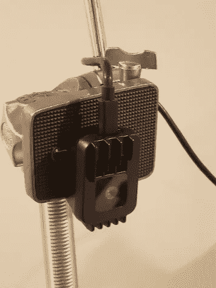

在这里…它的价格大约为 99 美元，具有 4K 视频和一个机载神经网络芯片。

# CNN 基础

我不会在这里详尽地介绍卷积神经网络(CNN ),但是我会对这个项目的其余部分进行足够多的基础介绍。

大多数图像由 3 个通道组成；红色、绿色和蓝色。

卷积层是一个函数，它接受一个 2D 数组堆栈(例如，一个 RGB 图像)，并将其转换为另一个 2D 数组堆栈。因此，一个层可能会接收 64x64 RGB 图像(64x64x3)，并输出四个 32x32 输出(32x32x4)。四个输出中的每一个都称为特征图。

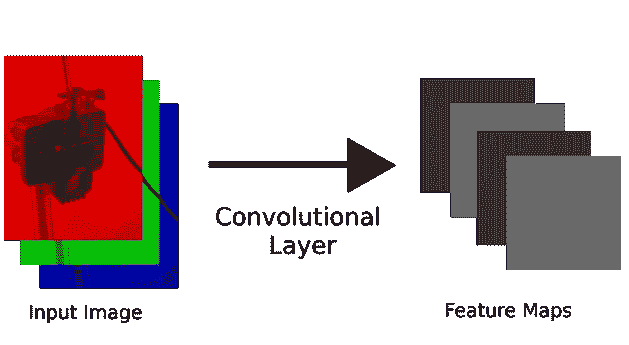

如果我们将一堆卷积层堆叠在一起，我们就会得到一个卷积神经网络(CNN)。第一层做简单的事情，如检测线，而后面的层检测更复杂的模式，如不同种类的斑点。

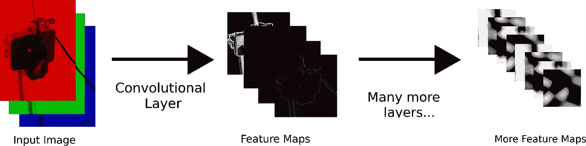

CNN 很酷的一点是，如果我们每层都有足够多的特征地图，足够多的层，以及大量的标记数据，我们就可以模拟几乎任何我们想要的函数。例如，照片是狗还是猫。

# 编码器和解码器

大多数 CNN 会添加越来越多的特征地图，直到他们输出一些我们有的问题的答案。这里有一个例子:

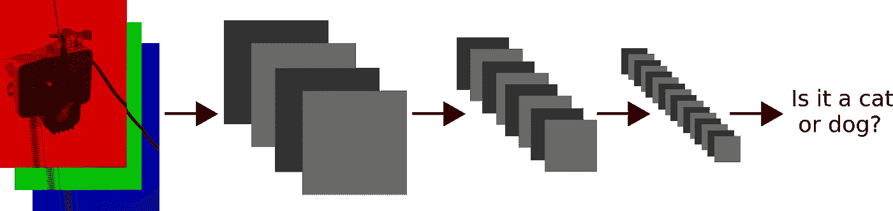

碰巧的是，如果我们去掉 CNN 的最后几层，通常得到的特征地图仍然能告诉我们很多信息。

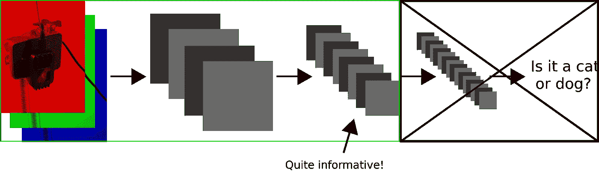

它们告诉我们如此多的信息，如果我们设计一个接受这些特征地图的 CNN，我们可以训练它输出原始图像。然后我们称第一个 CNN 为*编码器*，第二个 CNN 为*解码器*。

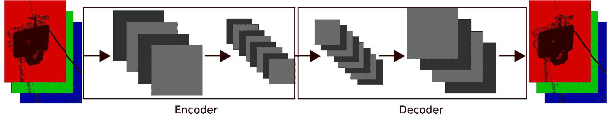

# 特征地图统计

我们就快到了…

卷积层之后的每个特征图将具有平均值和方差。AdaIn 论文的作者提出的强有力的见解是，这些统计数据告诉我们大量关于图像的风格。

一个特征图的统计数据可能会告诉我们图像的平滑度，而另一个特征图的统计数据可能会告诉我们蓝线的宽度(这只是一个例子)。

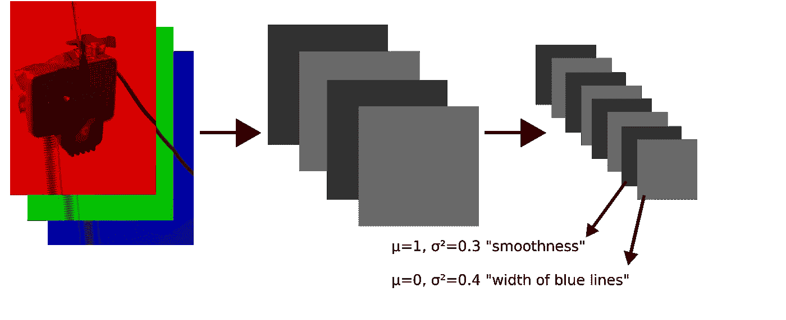

假设我们有一张照片，对它进行编码后，我们计算每个特征图的平均值和方差。现在假设我们对一幅画做同样的事情。

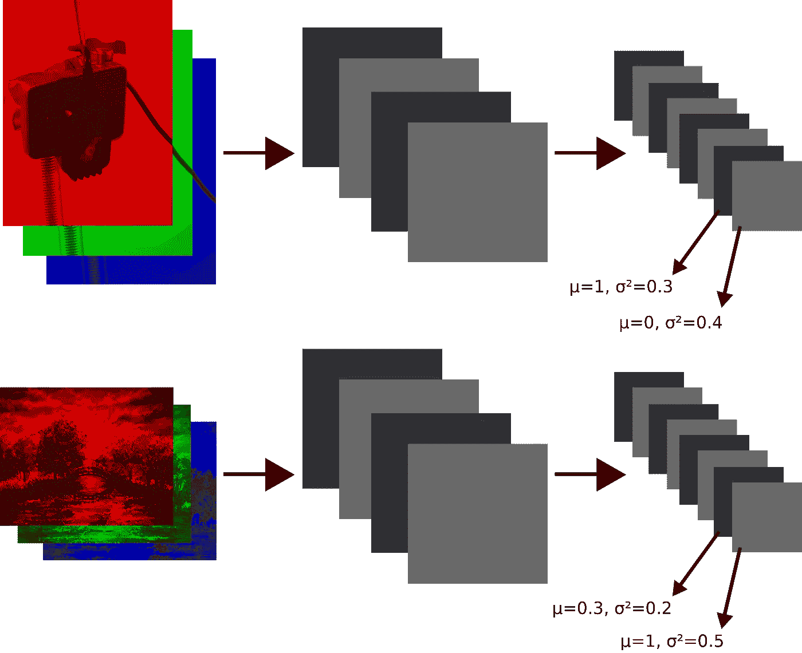

请注意，照片的特征地图的统计数据与绘画的特征地图的统计数据不匹配。这告诉我们，图像有不同的风格。

现在我们可以标准化照片编码的每个特征图，使得每个特征图具有均值 0 和方差 1。

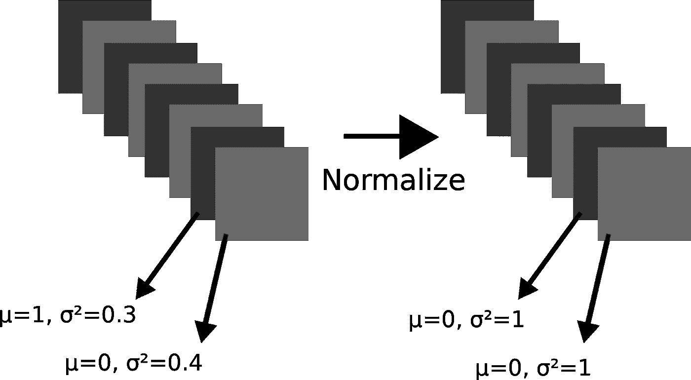

现在，我们可以乘以照片编码中相应特征图的标准偏差，并在照片编码中添加相应特征图的平均值。

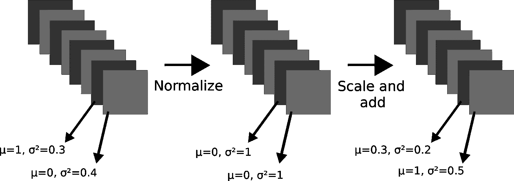

本质上，我们已经修改了照片的编码，这样每个特征图都与绘画编码中的相应特征图具有相同的统计数据。这一步称为自适应实例规范化，或 AdaIn。“自适应”部分来自于我们可以为任何绘画做这件事，“实例规范化”部分来自于我们只需要一个输入图像和样式图像就可以做这件事。

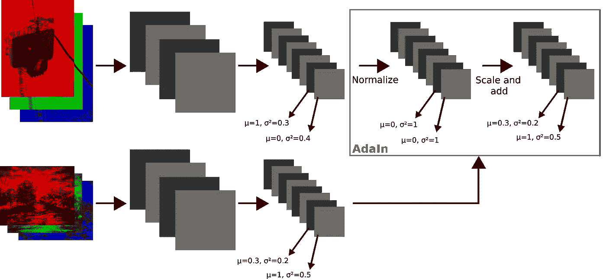

因为特征地图统计决定了图像的风格，所以在我们解码照片的标准化和缩放编码后，我们将得到绘画风格的照片。

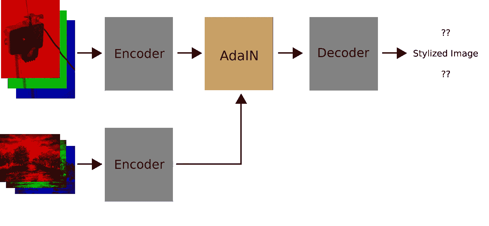

# 网络教学

下一个问题是:我们到底如何做到这一切？对于编码器，我们可以只使用别人为图像分类训练的模型(如 AdaIn 作者所做的)，而不改变它的功能(其权重)。但是解码器需要被训练来以不同的风格重建图像。

我们希望解码器做两件事。首先，解码器应该输出与目标样式匹配的图像。为此，我们比较了特征图统计数据:

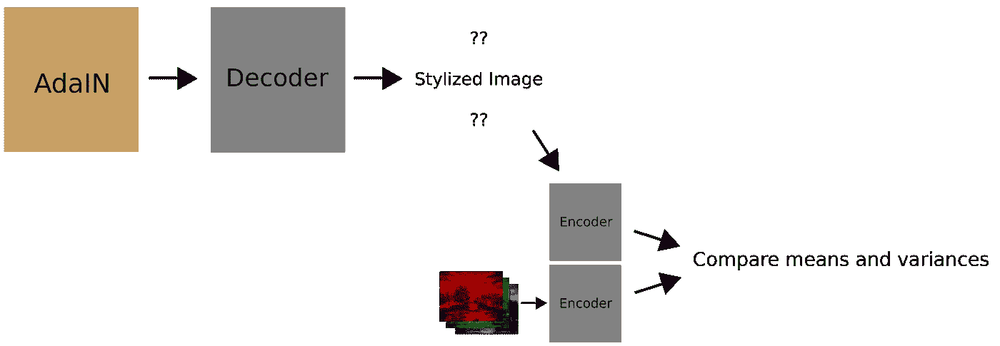

我们可以用下面的函数来衡量解码器在数字上做得有多差:

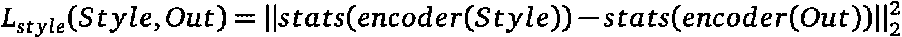

Out is the output image, Style is the style image, and stats computes the mean and variance for each feature map.

直观地说，这计算了输出样式离样式图像的样式有多远；如果目标样式非常平滑，则输出图像也应该非常平滑。

第二，解码器应该输出与给定的输入特征图的内容相匹配的图像。为此，我们比较特征映射值(*而不是*统计值):

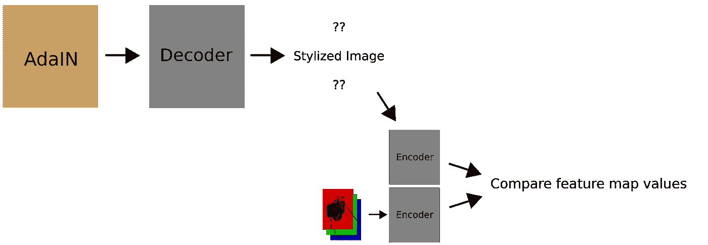

从数字上看，这是:

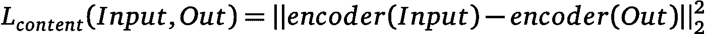

Input is the image we are trying to stylize

直观地说，这将计算输出要素地图与输入要素地图的距离。换句话说，汽车看起来应该还是汽车。

实际上，我们不只是用编码器的输出来计算这些损失函数；我们也使用编码器的中间层。此外，为了平衡内容损失、样式损失以及哪些层更重要，我们引入了一些缩放因子λ。

这就引出了下面的损失函数:

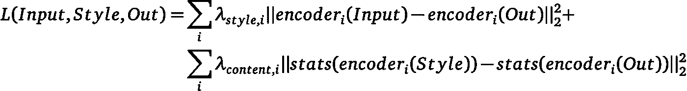

我们可以用梯度下降来最小化这个损失函数。这超出了本文的范围，但我希望我们试图做的事情背后的想法是有意义的。

整个系统在训练期间看起来如下:

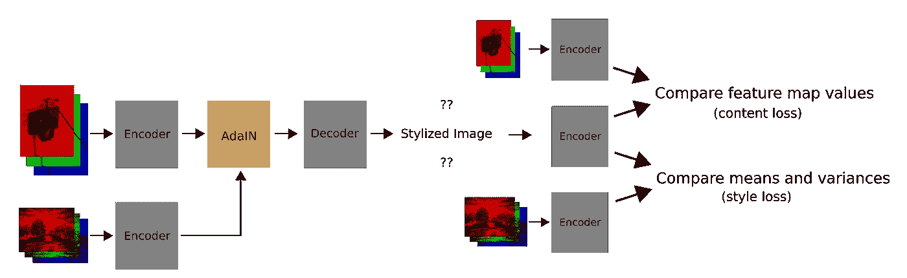

概括一下，这是我们实际使用该系统时的情况:

暂时就这样吧！我已经在编写模型方面取得了相当大的进展，所以请关注下一次更新。

*本帖镜像自* [*我的网站*](https://antiprojects.com/adain/real-time-style-transfer-with-adain-explained) *。*

*范例风格图像从* [*这里的*](https://www.amazon.com/iCoostor-Numbers-Acrylic-Painting-Beginner/dp/B07N2V38XZ) *。*

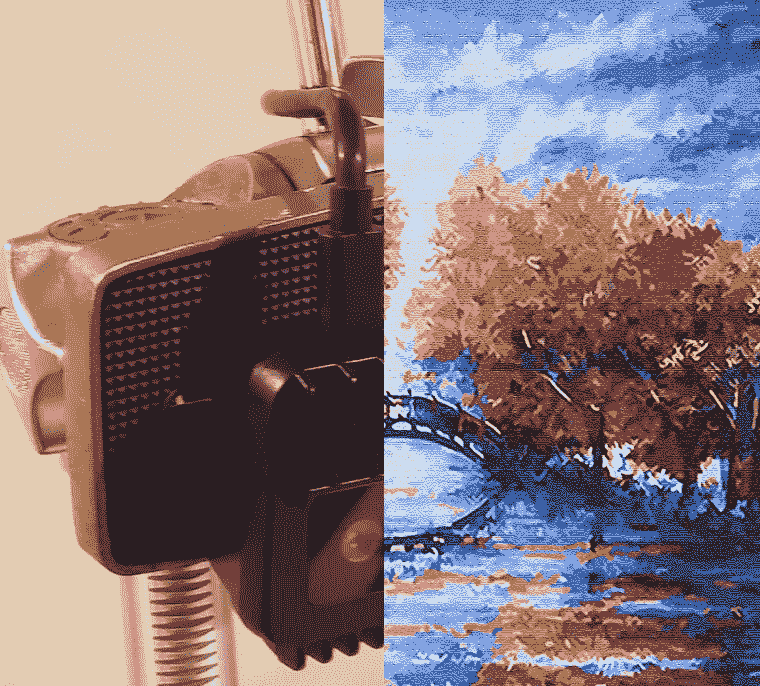