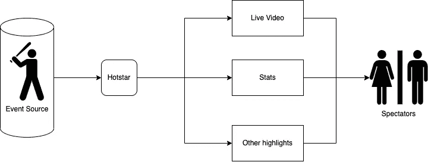
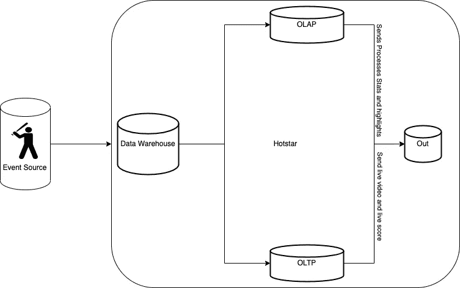
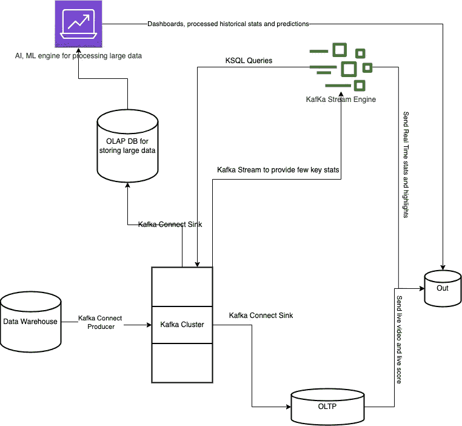

# Kafka 的实时数据可用性

> 原文：<https://medium.com/mlearning-ai/realtime-data-ingestion-with-kafka-b2deb6d0fb57?source=collection_archive---------2----------------------->

## 数据工程

## 用 Kafka 引擎分离 OLTP 和 OLAP 层

[Apache Kafka](https://kafka.apache.org/) 是一个用于构建实时流数据管道和应用程序的开源平台。许多[公司](https://kafka.apache.org/powered-by#:~:text=Today%2C%20Kafka%20is%20used%20by,strategies%20with%20event%20streaming%20architecture.)在其数据流和分析产品中使用它。Kafka 是 LinkedIn 为他们的活动流和新闻源开发的，但他们后来开源供公众使用。这个博客提供了 Kafka 实时数据处理的概要。

首先，Kafka 是一个事件流平台。

> 什么是事件流？

这是一种通过众多物联网设备和应用程序实时捕获/处理数据的能力。

Kafka 结合了事件流的三个关键功能:

1.  为了**发布**(写)和**订阅**(读)事件流，包括从其他系统持续导入/导出您的数据。
2.  **持久可靠地存储**事件流，时间不限。
3.  **在事件发生时或事后处理**系列事件。

为了简化卡夫卡做的事情，我们假设你正在 Hotstar 这样的体育流媒体平台上观看板球比赛。作为一名观众，在比赛过程中，你会看到直播视频、直播统计数据和其他信息图表，如社交媒体聊天、游戏、广告和重要集锦。

Hotstar Streaming

你从 Hotstar 那里得到了所有的信息。它做所有的中间工作。从 A 到 Z，你对信息的接收方式感到满意。这一切都因卡夫卡而成为可能。Hotstar 通过向您提供直播视频、存储数据和同时处理直播数据来提供统计数据和其他精彩内容，即使在比赛结束后也可以访问，从而对上述所有要点进行检查。

> 这一切是怎么发生的？

为了理解这一点，让我们放大到 Hotstar。但在此之前，我们先来看一下这个视频，了解一下 OLTP 和 OLAP 系统及其区别

现在让我们看看下面简化的流程

Inside Hotstar

OLTP 层为您提供实时提要，OLAP 层为您提供统计数据和其他数据。需要注意的一点是，所有这些都是实时发生的。喂视频直播是一回事，喂数据直播是另一回事。处理庞大的数据非常耗时，所有这一切不可能在几秒钟内完成。那么会发生什么呢？我们正在研究一个涉及将算法应用于大量数据的问题。这些数据可以是平面文件、聊天消息或视频文件。

> 那么这是如何实时发生的呢？

Kafka for separating OLTP and OLAP

当数据进入仓库时，Kafka 将像一辆公共汽车一样向不同的系统传递消息。部署了一个名为 Kafka Connect 的进程，将数据复制到 Kafka 集群，并将其发送到其他源。每当新数据到达 Kafka 集群时，Kafka Connect Producer 作业将发送数据(以 KB 大小的小数据包形式)。当数据到达 Kafka 集群时，类似的 Kafka 连接接收器作业会将数据发送到 OLTP 和 OLAP 系统。

接收进程仅将数据分别发送到 OLTP 和 OLAP 层。现在剩下的问题是在这个平台上看到的统计数据？

这通过两种方式实现:实时和历史

> 实时

实时数据处理可以使用一种叫做 Kafka Stream 的服务来完成。并非所有数据都是实时处理所必需的。Kafka stream 可以设置为提取重要数据，并运行推荐的算法和查询。流将直接从集群中提取数据。

> （有关）历史的

所有数据也可以被发送到一个单独的数据库，用于运行一组复杂的人工智能、人工智能作业和分析查询。然后，这可以以仪表板和指标的形式进行处理和可视化。请注意，这里只有数据复制是实时的；处理需要时间来确定结果、因素和预测。实时数据只是处理这些数据的一个子集。

上面的 Kafka 引擎可以通过在任何系统上部署 Kafka 来复制。无论系统是内部部署还是云部署，Kafka 都可以在所有系统上使用。它的开源和它的一种形式存在于像 AWS，Azure 和 Google 云平台这样的主要云上。

页（page 的缩写）s:以上流程是 Kafka 引擎和实时数据流平台的极度简化版本。并不是所有的都是实时的，使用卡夫卡。阅读更多关于 Hotstar 如何做到这一点的信息

[摄取“Bharat”等级的数据。我们写了一个摄取 API，可以摄取… |作者 Bhavesh Raheja |迪士尼+Hotstar(medium.com)](/hotstar/ingesting-data-at-bharat-scale-36615cbb4294)

 [## Mlearning.ai 提交建议

### 如何成为 Mlearning.ai 上的作家

medium.com](/mlearning-ai/mlearning-ai-submission-suggestions-b51e2b130bfb)