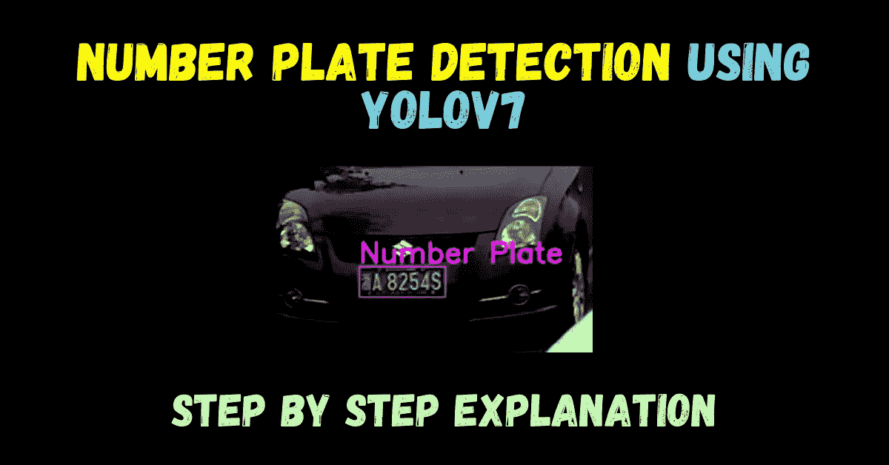
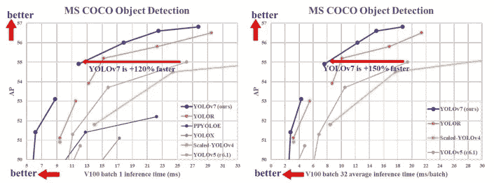
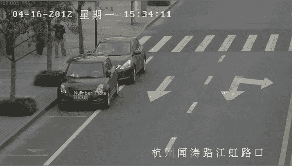
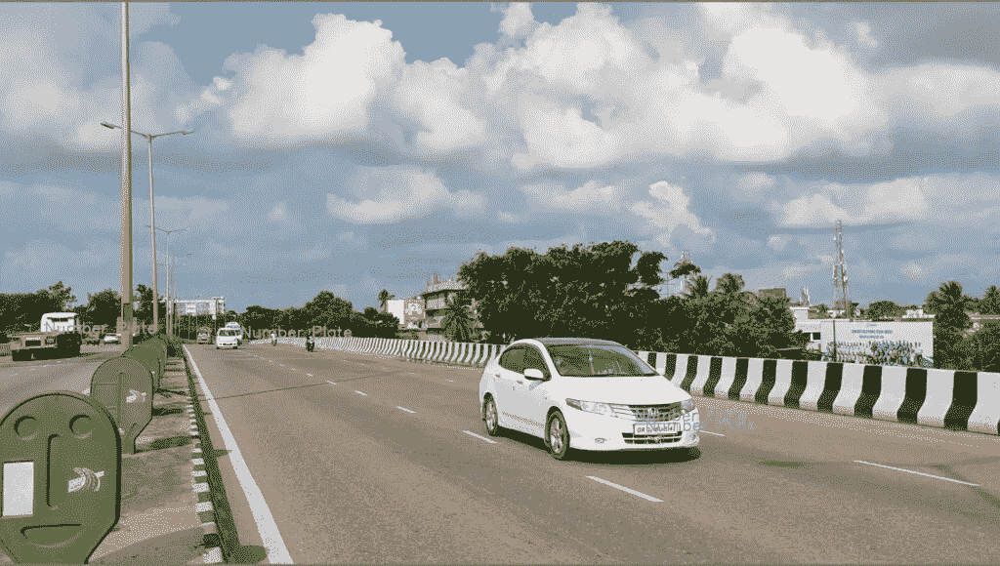

# 使用 Yolov7 进行实时车牌检测——最简单的解释

> 原文：<https://medium.com/mlearning-ai/realtime-number-plate-detection-using-yolov7-easiest-explanation-df4a4ac82fec?source=collection_archive---------2----------------------->



嘿，伙计们，在这个博客中，我们将看到如何使用 YOLOv7 来执行**车牌检测，方法是在我们定制的车牌数据上训练 YOLOv7。**

点击此处阅读完整博客—[https://machine learning projects . net/number-plate-detection-using-yolov 7/](https://machinelearningprojects.net/?p=11957)

点击此处查看视频—【https://youtu.be/beV0nWFlYGc 

**YOLOv7 是最新的实时物体检测模型**。

您可以将它用于不同的工业应用。还有，你可以优化模型，也就是把模型转换成 ONNX，TensorRT 等，这样会增加吞吐量，运行边缘设备。



在这篇博客中，我们将看到在我们的自定义数据集上训练 YOLOv7 的分步指南。

因此，没有任何进一步的原因，让我们做吧…

# 使用 Yolov7 偷窥我们的车牌检测



# 步骤 1-收集车牌数据集

*   为了训练的目的，我基本上使用了 2 个数据集。
*   数据集 1 — [印度车辆牌照 yolo 注释](https://www.kaggle.com/datasets/deepakat002/indian-vehicle-number-plate-yolo-annotation)
*   数据集 2 — [汽车牌照检测](https://www.kaggle.com/datasets/elysian01/car-number-plate-detection)
*   数据集 1 已经具有 YOLO 注释。
*   但是对于数据集 2，您必须对其进行注释。
*   对于一个**更简单的注释过程**，你可以安装**‘labelImg’**python 包。

```
pip install labelImg
```

*   安装软件包后，打开终端并运行“labelImg”命令。
*   这将打开一个图形用户界面。
*   在其中选择图像目录。**图像目录是存储您想要注释**的所有图像的地方。
*   更改其中的保存目录。 **Save Director 是存储注释的地方**。
*   最后，确保将**格式设置为 YOLO，而不是帕斯卡沃克**。

# 步骤 2 —让我们在自定义数据集上训练 YOLOv7

*   到这一步，你应该有 2 个文件夹；图像和标签。
*   **图像文件夹应包含所有图像，标签文件夹应包含 txt 格式的所有注释。**
*   如果你没有看过我之前写的关于 YOLOv7 定制训练的博客，请去看看。

[在自定义数据集上训练 YOLOv7 的最简单方法](https://machinelearningprojects.net/train-yolov7-on-the-custom-dataset/)

*   当您在号码牌数据集上训练 YOLOv7 时，**您将获得一个 PyTorch 重量文件。pt”格式**。
*   那是我们进行推论所需要的最重要的文件。

# 第三步——根据图像和视频进行推断

# 图像文件推理

*   下面是对图像文件进行推理的**代码。**
*   在**第 15 行，我们已经加载了 PyTorch 重量**文件。
*   在**第 20 行，我们给出了视频文件的路径**。

```
# Number Plate Detection using Yolov7import matplotlib.pyplot as plt
import torch
import cv2
import numpy as np
import timefrom torchvision import transforms
from utils.datasets import letterbox
from utils.general import non_max_suppression_kpt
from utils.plots import output_to_keypoint, plot_skeleton_kptsdevice = torch.device("cuda:0" if torch.cuda.is_available() else "cpu")
weigths = torch.load('best.pt')
model = weigths['model']
model = model.half().to(device)
_ = model.eval()img_path = '1.jpg'img = cv2.imread(img_path)# Get the frame width and height.
h,w,c = img.shape
frame_width = w
frame_height = h orig_image = img
image = cv2.cvtColor(orig_image, cv2.COLOR_BGR2RGB)
image = letterbox(image, (frame_width), stride=64, auto=True)[0]
image_ = image.copy()
image = transforms.ToTensor()(image)
image = torch.tensor(np.array([image.numpy()]))
image = image.to(device)
image = image.half()with torch.no_grad():
    output, _ = model(image)output = non_max_suppression_kpt(output, 0.25, 0.65, nc=model.yaml['nc'], kpt_label=True)
output = output_to_keypoint(output)
nimg = image[0].permute(1, 2, 0) * 255
nimg = nimg.cpu().numpy().astype(np.uint8)
nimg = cv2.cvtColor(nimg, cv2.COLOR_RGB2BGR)
for idx in range(output.shape[0]):
    # plot_skeleton_kpts(nimg, output[idx, 7:].T, 3) # Comment/Uncomment the following lines to show bounding boxes around persons.
    xmin, ymin = (output[idx, 2]-output[idx, 4]/2), (output[idx, 3]-output[idx, 5]/2)
    xmax, ymax = (output[idx, 2]+output[idx, 4]/2), (output[idx, 3]+output[idx, 5]/2) plate_roi = nimg[int(ymin):int(ymax),int(xmin):int(xmax)]
    cv2.imshow('Plate',plate_roi) cv2.putText(nimg, "Number Plate", (int(xmin), int(ymin)-5), cv2.FONT_HERSHEY_SIMPLEX,1, (228, 79, 215), 2)
    cv2.rectangle(
        nimg,
        (int(xmin), int(ymin)),
        (int(xmax), int(ymax)),
        color=(228, 79, 215),
        thickness=1,
        lineType=cv2.LINE_AA
    )# Convert from BGR to RGB color format.
cv2.imwrite('result.jpg',nimg)
```

# 结果



*   我们的模型在这张图片上表现良好。
*   轿车和卡车的**车牌均检测成功**。
*   **虽然它也检测到一些噪声，但为了避免这种情况，我们可以对更多数据和更多时期进行训练。**

# 视频文件推理

*   下面是对视频文件进行推理的**代码。**
*   在**第 15 行，我们已经加载了 PyTorch 重量**文件。
*   在**第 20 行，我们给出了视频文件**的路径。

```
# Number Plate Detection using Yolov7import matplotlib.pyplot as plt
import torch
import cv2
import numpy as np
import timefrom torchvision import transforms
from utils.datasets import letterbox
from utils.general import non_max_suppression_kpt
from utils.plots import output_to_keypoint, plot_skeleton_kptsdevice = torch.device("cuda:0" if torch.cuda.is_available() else "cpu")
weigths = torch.load('best.pt')
model = weigths['model']
model = model.half().to(device)
_ = model.eval()video_path = '1.mp4'cap = cv2.VideoCapture(video_path)
if (cap.isOpened() == False):
  print('Error while trying to read video. Please check path again')# Get the frame width and height.
frame_width = int(cap.get(3))
frame_height = int(cap.get(4))# Pass the first frame through `letterbox` function to get the resized image,
# to be used for `VideoWriter` dimensions. Resize by larger side.
vid_write_image = letterbox(cap.read()[1], (frame_width), stride=64, auto=True)[0]
resize_height, resize_width = vid_write_image.shape[:2]# Define codec and create VideoWriter object .
out = cv2.VideoWriter("result.mp4",
                    cv2.VideoWriter_fourcc(*'mp4v'), 30,
                    (resize_width, resize_height)) frame_count = 0 # To count total frames.
total_fps = 0 # To get the final frames per second. while(cap.isOpened):
  # Capture each frame of the video.
  ret, frame = cap.read()
  if ret:
      orig_image = frame
      image = cv2.cvtColor(orig_image, cv2.COLOR_BGR2RGB)
      image = letterbox(image, (frame_width), stride=64, auto=True)[0]
      image_ = image.copy()
      image = transforms.ToTensor()(image)
      image = torch.tensor(np.array([image.numpy()]))
      image = image.to(device)
      image = image.half() # Get the start time.
      start_time = time.time()
      with torch.no_grad():
          output, _ = model(image)
        # Get the end time.
      end_time = time.time()
      # Get the fps.
      fps = 1 / (end_time - start_time)
      # Add fps to total fps.
      total_fps += fps
      # Increment frame count.
      frame_count += 1 output = non_max_suppression_kpt(output, 0.25, 0.65, nc=model.yaml['nc'], kpt_label=True)
      output = output_to_keypoint(output)
      nimg = image[0].permute(1, 2, 0) * 255
      nimg = nimg.cpu().numpy().astype(np.uint8)
      nimg = cv2.cvtColor(nimg, cv2.COLOR_RGB2BGR)
      for idx in range(output.shape[0]):
          # plot_skeleton_kpts(nimg, output[idx, 7:].T, 3) # Comment/Uncomment the following lines to show bounding boxes around persons.
          xmin, ymin = (output[idx, 2]-output[idx, 4]/2), (output[idx, 3]-output[idx, 5]/2)
          xmax, ymax = (output[idx, 2]+output[idx, 4]/2), (output[idx, 3]+output[idx, 5]/2) plate_roi = nimg[int(ymin):int(ymax),int(xmin):int(xmax)]
          cv2.imshow('Plate',plate_roi)

          cv2.putText(nimg, "Number Plate", (int(xmin), int(ymin)-5), cv2.FONT_HERSHEY_SIMPLEX,1, (228, 79, 215), 2)
          cv2.rectangle(
              nimg,
              (int(xmin), int(ymin)),
              (int(xmax), int(ymax)),
              color=(228, 79, 215),
              thickness=1,
              lineType=cv2.LINE_AA
          ) # Write the FPS on the current frame.
      cv2.putText(nimg, f"{fps:.3f} FPS", (15, 30), cv2.FONT_HERSHEY_SIMPLEX,
                  1, (0, 255, 0), 2)
      # Convert from BGR to RGB color format.
      cv2.imshow('image', nimg)
      out.write(nimg)
      print(f"{fps:.3f} FPS")
      # Press `q` to exit.
      if cv2.waitKey(1) & 0xFF == ord('q'):
          break
  else:
      break
# Release VideoCapture().
cap.release()
# Close all frames and video windows.
cv2.destroyAllWindows()
# Calculate and print the average FPS.
avg_fps = total_fps / frame_count
print(f"Average FPS: {avg_fps:.3f}")
```

# 结果


**注意——如果您想运行这些推理文件，请将这些文件保存在克隆的 yolo 文件夹中，因为这些文件使用了 yolo 文件夹中的一些实用程序功能。**

使用以下命令克隆 yolo repo:

```
git clone [https://github.com/WongKinYiu/yolov7.git](https://github.com/WongKinYiu/yolov7.git)
```

这样你就可以用最简单的方式在自定义数据集上训练 YOLOv7。

在这篇博客中，我一步一步地解释了如何使用 YOLOv7 训练车牌检测器，只要遵循这些步骤就可以做到。

如需源代码，请访问我的博客—[https://machine learning projects . net/number-plate-detection-using-yolov 7/](https://machinelearningprojects.net/?p=11957)

**查看我的其他** [**机器学习项目**](https://machinelearningprojects.net/machine-learning-projects/)**[**深度学习项目**](https://machinelearningprojects.net/deep-learning-projects/)**[**计算机视觉项目**](https://machinelearningprojects.net/opencv-projects/)**[**NLP 项目**](https://machinelearningprojects.net/nlp-projects/)**[**烧瓶项目**](https://machinelearningprojects.net/flask-projects/) **at**********

****[](/mlearning-ai/mlearning-ai-submission-suggestions-b51e2b130bfb) [## Mlearning.ai 提交建议

### 如何成为 Mlearning.ai 上的作家

medium.com](/mlearning-ai/mlearning-ai-submission-suggestions-b51e2b130bfb)****