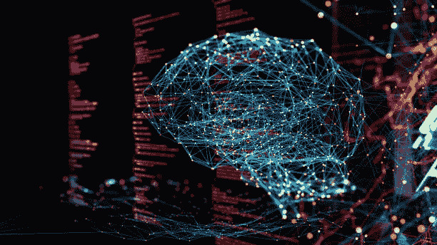

# 人工智能在三个不同领域的最新进展

> 原文：<https://medium.com/mlearning-ai/recent-advances-made-by-ai-in-three-different-fields-f31d994e1753?source=collection_archive---------12----------------------->

人工智能(AI)最近在忙什么？正如你所料，很多。在这篇文章中，我写了人工智能在三个领域的最新进展:人类医学，化学和古代文明的研究，强调了在这些领域的研究的意义。

Recent advances made by AI in different fields are promising for the future of humanity.

# **1。人工智能将研究帕金森病**

[研究人员最近利用人工智能确定了](https://www.nature.com/articles/s41467-022-28423-4)帕金森病的新指标。这一结果可能有助于使用新的药物治疗方法来治愈帕金森氏症，并为寻找治疗其他疾病的药物开辟新途径。

在过去，帕金森病的临床试验有很高的失败率，因为疾病对细胞的影响尚未清楚地了解。为了应对这一长期挑战，研究人员分析了数百万张患者皮肤细胞的图像，并将它们与健康细胞进行了比较。他们使用机器人技术获取细胞，使他们能够从不同的患者群体中收集大量数据。

该方法没有偏见，因为它没有任何关于患病细胞和细胞来源的先验信息。然后，生成的图像被输入到人工智能驱动的图像分析管道中，该算法揭示了不同患者细胞的特定特征，将它们与健康细胞区分开来。

结果是一个令人兴奋的发展，非常重要。这些新的疾病信号将帮助我们评估药物对患者细胞的有效性，使我们能够发现可以逆转疾病的新药。

该方法也是非常可行的，因为它需要来自患者的皮肤细胞，皮肤细胞非常容易获得。我们还可以将这种方法用于其他细胞类型，将这种方法推广到其他疾病，在传统药物发现迄今未成功的地方开辟新的治疗途径。

# **2。人工智能研究分子结构**

DeepMind 开发的人工智能系统[现在可以预测](https://www.science.org/doi/10.1126/science.abj6511)分子内的电子分布。这种方法可以比目前的技术更精确地计算某些分子的性质。

为了研究分子的结构，人们必须求助于量子力学。计算涉及分子周围的电子波函数，这是一项极具挑战性的任务，因为所有的电子都相互作用。为了简化这个问题，研究人员之前使用了一种叫做密度泛函理论的方法。然而这种方法在计算上是昂贵的，需要超级计算机。本质上，它们通过将电子的电荷密度平均到分子核周围的一种云中，避免了计算单个电子的问题。然而，这种方法是有限的，对一些分子给出不正确的结果。

在 DeepMind 的一项新研究中，利用人工智能计算出了电子密度。此前，研究人员使用机器学习来研究材料属性，包括导热能力。DeepMind 现在已经使用从薛定谔方程中导出的数千个精确解来训练神经网络。当针对 DFT 的基准进行测试时，他们获得了惊人的结果。

DeepMind 还发布了其训练过的系统，供任何人使用。如果能在未来几年将这种方法从分子推广到整个材料，那将是令人兴奋的。

# **3。人工智能研究古代文献**

人类直觉和人工智能系统合作[破译古希腊文本并定位其起源](https://www.nature.com/articles/s41586-022-04448-z)。这个结果很有趣，因为它提供了对人类历史的洞察。它还强调了结合人类和机器智能的宝贵好处。

金石学，即对铭文的研究，对理解古代文明很有价值。然而，随着时间的推移，一些古老的铭文已经变质，对它们的起源地点和时间产生了不确定性。一个名为 Ithaca 的新人工智能程序最近被开发出来，用于修复古希腊铭文并确定其年代。它包含一种称为变压器的神经架构，使用一种所谓的注意力机制来衡量输入句子中不同部分的影响。用伊萨卡对大约 20 万个铭文进行训练，在解码符号和揭示它们的起源方面达到了 62%的准确率。接下来，研究人员设计了伊萨卡，以提供视觉输出，将人类援助纳入决策过程，允许历史学家与其预测进行互动。伊萨卡提供了 20 个最有可能的结果，然后由历史学家进行调查。在历史学家的辅助下，解码准确率上升到 72%。

这个结果是一个令人兴奋的发展，因为随着人工智能的进步，它为人类与机器并肩工作提供了希望。此外，这项研究可以解开人类历史上古代时期的秘密，甚至有一天可能解开不屈的印度河流域文献。伊萨卡可能有助于恢复新发现的或不确定的铭文，帮助历史学家了解和学习古代世界的文本分布。研究小组还将伊萨卡作为开源工具，允许历史学家使用伊萨卡进行个人研究。

你对这些进步有什么看法？你认为哪一个最有趣？在下面的聊天中让我知道。

 [## Mlearning.ai 提交建议

### 如何成为 Mlearning.ai 上的作家

medium.com](/mlearning-ai/mlearning-ai-submission-suggestions-b51e2b130bfb)