# 基于转换器的语言模型

> 原文：<https://medium.com/mlearning-ai/recent-language-models-9fcf1b5f17f5?source=collection_archive---------6----------------------->

# 罗伯塔:

*   RoBERTa 是对 BERT 的再培训，它改进了培训方法，增加了 1000%的数据和计算能力。
*   消除了 NSP(下一句预测)损失，引入了动态屏蔽，使得屏蔽的标记在训练时段期间改变。还发现较大的批量训练规模在训练过程中更有用。优于 BERT 和 XLNet

# 蒸馏器:

*   学习经过提炼(近似)的 BERT 版本，保留 97%的性能，但仅使用一半数量的参数。具体来说，它没有令牌类型的嵌入，pooler，并且只保留了 Google 的 BERT 的一半层。

# 艾伯特:

与 BERT 的三个主要区别:

*   它对于记号(E)和层(H)具有不同的嵌入大小。即 H！=E. H set 通常更大，因为它需要对基于上下文的令牌与上下文无关的令牌嵌入进行建模。但是这带来了巨大的 Vocab 和令牌矩阵(VxE)的问题。因此，我们分解这个矩阵(我们假设一个低秩稀疏矩阵就足够了)
*   原始 BERT 中的下一句预测不是很有帮助，因为它将主题预测和连贯预测合并在一个任务中。这里我们使用句子顺序预测(SOP)，这意味着我们以正确的顺序给出两个句子作为正例，并交换作为反例。

# 巴特:

巴特试图融合 GPT 和伯特世界的优点。

*   BERT 是双向的，因此不能用于生成
*   GPT 是单向的，所以它不能学习双向互动。
*   它使用格鲁而不是 RELU
*   它确实引起了对编码器最后一个隐藏层的关注
*   BERT 在字预测之前使用额外的 FF 层，而 BART 没有

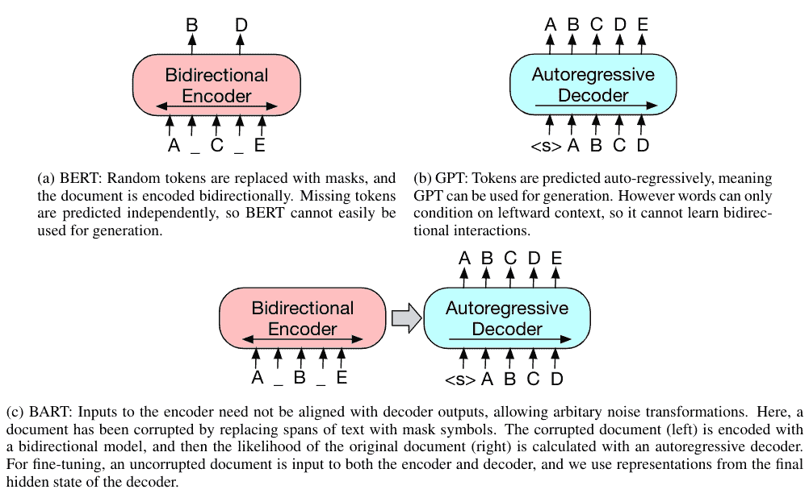

*   有不同的方法来引入噪声并迫使模型从中学习:

令牌屏蔽:(就像 BERT 一样)

令牌删除:删除令牌，但是应该由模型来决定删除哪些令牌。

文本填充:删除具有泊松分布的记号范围

句子排列。

文档旋转

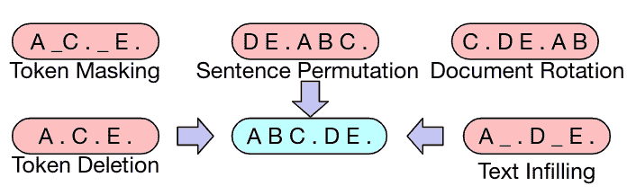

# 伊莱克特拉:

*   在 BERT 中，我们用掩码替换一些令牌，而不是屏蔽输入，我们的方法通过用从小型发电机网络中采样的似是而非的替代物替换一些令牌来破坏输入。然后，不是训练预测被破坏的记号的原始身份的模型，而是训练预测被破坏的输入中的每个记号是否被生成器样本替换的判别模型。是一个**替换的令牌检测任务**。

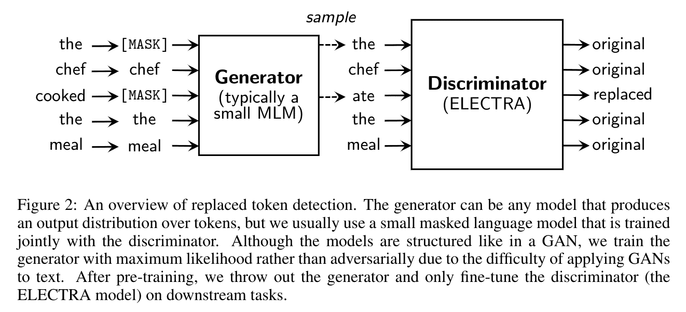

*   生成器(是一个 MLM)然后学习预测被屏蔽的令牌的原始身份。鉴别器被训练来区分数据中的记号和已经被生成器样本替换的记号。

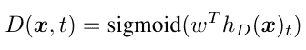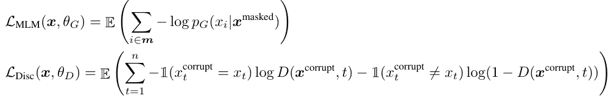

我们将总损失降至最低:

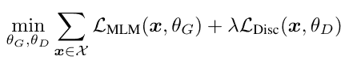

我们推测，拥有太强的生成器可能会给鉴别器带来太大的挑战，阻止它有效地学习。特别是，鉴别器可能必须使用它的许多参数来模拟生成器，而不是实际的数据分布。

# 稀疏变压器:

## 自适应量程变压器

变压器的每个注意力头部共享相同的注意力跨度 s。这假设每个头部需要相同的跨度来形成其表示。如下图所示，这个假设在字符级语言建模的上下文中不成立:一些 Head(如 Head A)关注最近的历史，而其他 Head(如 Head B)从整个可用的上下文中获取信息

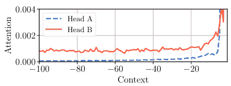

对于每个头部，我们添加一个掩蔽函数来控制注意力的范围。掩蔽函数是非递增函数，它将距离映射到[0，1]中的值。我们采用由[0，S]中的实数值 z 参数化的以下软屏蔽函数 mz:

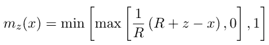

其中 R 是控制其柔软度的超参数。然后在掩蔽的跨度上计算注意力权重，即

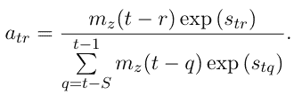

我们在损失函数中增加了一个 L1 罚函数，对模型中每个注意头 I 的参数 zi 进行惩罚

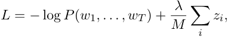

## 变压器-XL

Transformer-XL 没有试图降低密集注意力操作的成本，而是选择从 RNNs 获得灵感，并在 transformers 的自我注意力机制之外引入了一种递归机制。他们的工作引入了两个新概念——一个将先前“片段”的隐藏状态作为输入输入到当前片段层的组件，以及一个促进这一策略的相对位置编码方案。

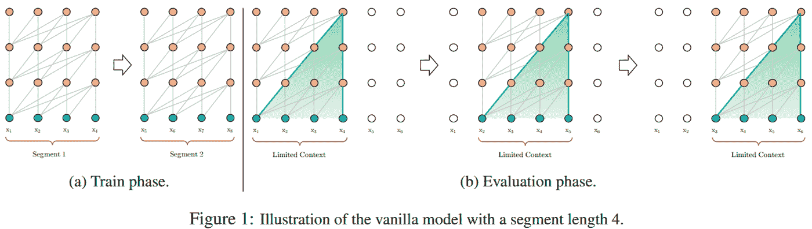

Transformer-XL 通过强制串行处理数据段克服了这一限制。在第一段之后，后续令牌中的令牌将总是具有 512 个令牌的立即上下文大小，因为先前的段激活作为上下文被传递给后续段的注意操作。这意味着来自 N 个上下文大小* L 层之外的信息可以被传播到给定的令牌。假设上下文大小为 640，模型有 16 层，Transformer-XL 理论上可以合并来自多达 10，240 个令牌的信号。

## 重整器:

*   对于长序列来说，大转换器的成本高得惊人，我们用一种使用位置敏感散列法的转换器来代替点积注意力，将其复杂度从 O(L2)变为 O(L log L)，其中 L 是序列的长度。
*   我们使用可逆残差层代替标准残差，这允许在训练过程中仅存储一次激活而不是 N 次，其中 N 是层数。

## 长成形器

*   基于变换器的模型不能处理长序列，因为它们的自注意操作与序列长度成平方比例。

它提出了一种新的注意机制:

*   **滑动窗口**:考虑到局部注意力的重要性，新的注意力在每个标记周围采用固定大小的窗口注意力。使用这种窗口式注意力的多个堆叠层会产生一个大的感受野，其中顶层可以访问所有的输入位置。
*   **扩大滑动窗口**:为了在不增加计算量的情况下进一步增加感受野，可以“扩大”滑动窗口。
*   **全球关注**:相应地，我们在几个预选的输入位置上增加了“全球关注”。重要的是，我们使这种注意操作对称:也就是说，一个具有全局注意的记号关注序列中的所有记号，序列中的所有记号也关注它。例如，对于分类，全局注意力用于[CLS]标记，而在问答中，全局注意力提供给所有问题标记。

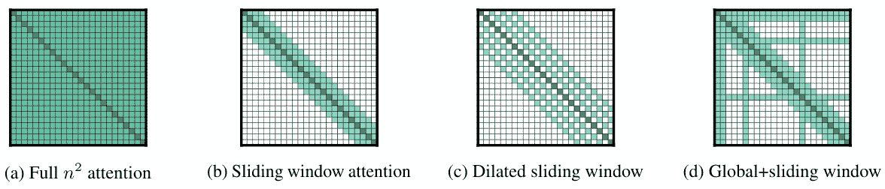

*   我们对较低的层使用小的窗口尺寸，并且随着我们移动到较高的层而增加窗口尺寸。这允许顶层学习整个序列的更高层表示，同时让较低层捕捉本地信息。

# T5:

*   它通过引入一个统一的框架，将每一个语言问题转换成文本到文本的格式，探索了自然语言处理的迁移学习技术的前景。
*   我们考虑的每一项任务——包括翻译、问答和分类——都是将模型文本作为输入，并训练它生成一些目标文本。这允许我们使用相同的模型、损失函数、超参数等。在我们不同的任务中。它还为我们的实证调查中包含的方法提供了一个标准的测试平台。“T5”指的是我们的模型，我们称之为“文本到文本转换转换器”

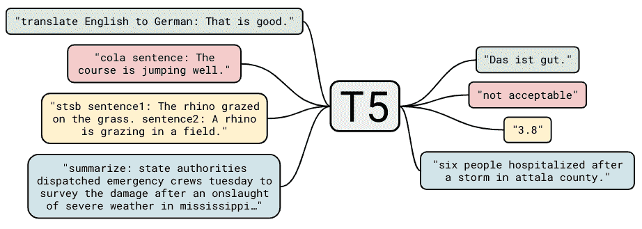

## 林 former

实验表明，注意力矩阵(P)是一个低秩矩阵，因此它基本上可以用低得多的维数来很好地近似。换句话说，仅用 128 个奇异值，我们就可以重建 95%的原始注意力矩阵。

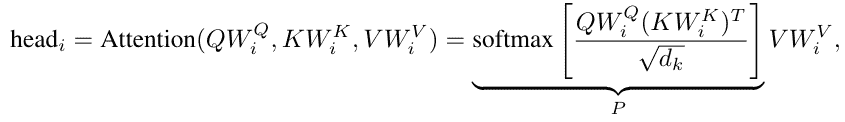

如果我们可以使用奇异值分解，那么我们可以使用 P_low

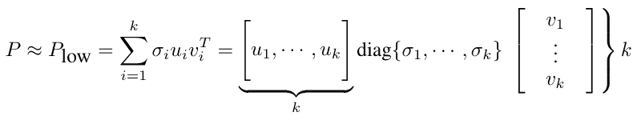

但这在实践中是不可能的，因为它需要更多的计算。

诀窍是分别使用线性变换 E_I 和 F_i 将 K 和 V 从 nxd 向下投影到 kxd 大小。

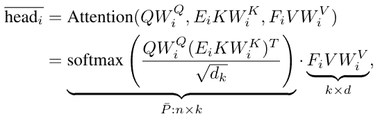

现在，计算成本是线性的，因为我们用固定的线性变换去掉了一个 n。可以证明(在论文中)这是一个很好的近似，可以精确到我们想要的程度。

国王的顺序是

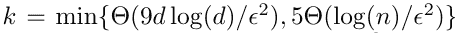

随着 n 的增加，第一项将是最小值，因此 k 是 d*log(d)。因为 d 是常数 O(nk)=O(n * d*log(d))=O(n)

# 有效注意:具有线性复杂性的注意

如果没有 softmax 函数，那么只需改变乘法的顺序:

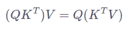

我们可以从 O(n*n*d)到 O(d*d*n ),因为 q，k 和 v 是 nxd，所以 QK^T 是 n*d*n

但是 X = K^T V 是 d*n*d 乘法运算，QX 是 n*d*d

我们不能删除 softmax，但我们可以忘记它，从其他东西开始:

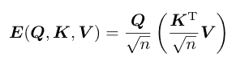

在这个新公式中，我们只缩放 Q 和 K！。在下图中，我们可以看到不同之处。事实证明，这种方法是可行的，即使它没有正当理由。

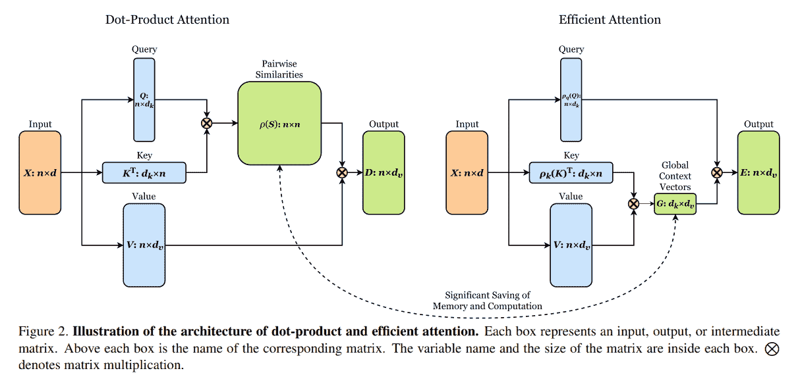