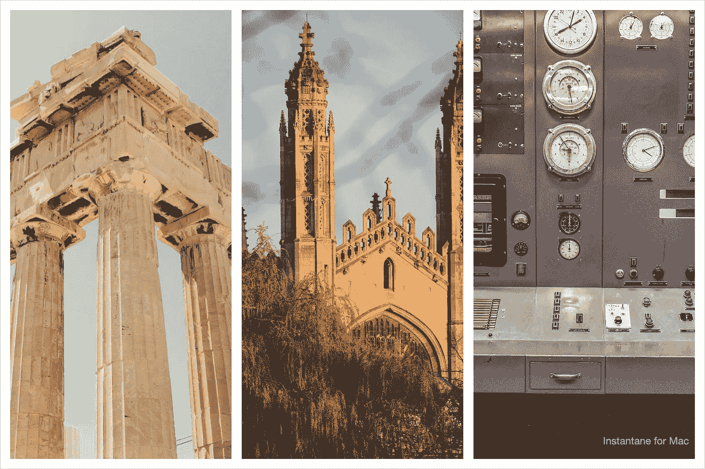

# 来自 DeepMind 的最新论文

> 原文：<https://medium.com/mlearning-ai/recent-results-in-practical-machine-learning-from-deepmind-d59c4939a5e7?source=collection_archive---------4----------------------->

Recent applications of deep learning include decrypting old texts, controlling a nuclear fusion reactor, and guiding pure mathematicians’ intuition. Sources: Photo by [Hans Reniers](https://unsplash.com/@hansreniers?utm_source=unsplash&utm_medium=referral&utm_content=creditCopyText) on [Unsplash](https://unsplash.com/s/photos/greece?utm_source=unsplash&utm_medium=referral&utm_content=creditCopyText), [Ben Wicks](https://unsplash.com/@profwicks?utm_source=unsplash&utm_medium=referral&utm_content=creditCopyText) on [Unsplash](https://unsplash.com/s/photos/trinity-college-cambridge?utm_source=unsplash&utm_medium=referral&utm_content=creditCopyText), [Dan Meyers](https://unsplash.com/@dmey503?utm_source=unsplash&utm_medium=referral&utm_content=creditCopyText) on [Unsplash](https://unsplash.com/s/photos/nuclear-physics?utm_source=unsplash&utm_medium=referral&utm_content=creditCopyText).

总是有很多有趣的机器学习的新应用被发布。在本文中，我们将从铺天盖地的新闻中退一步，只考虑 DeepMind 的三个令人兴奋的结果，即:

*   AlphaGo 很酷，核聚变更酷:deep mind 和 EPFL 托卡马克的团队如何使用强化学习来控制反应堆中的等离子体。