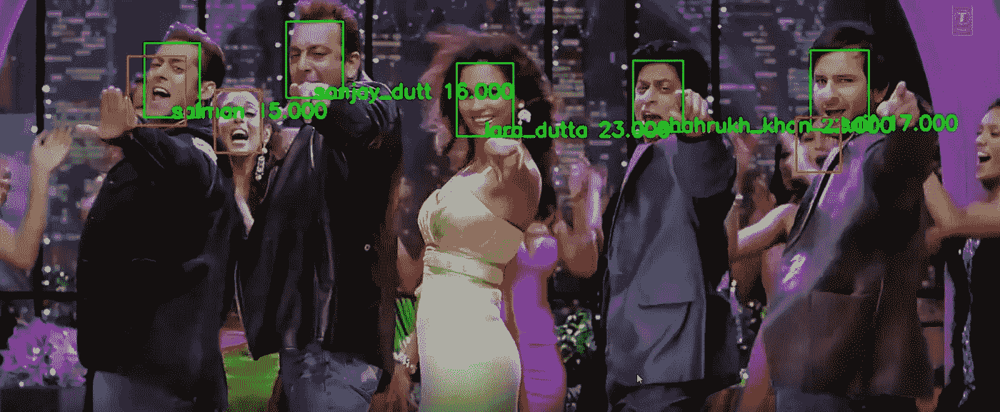
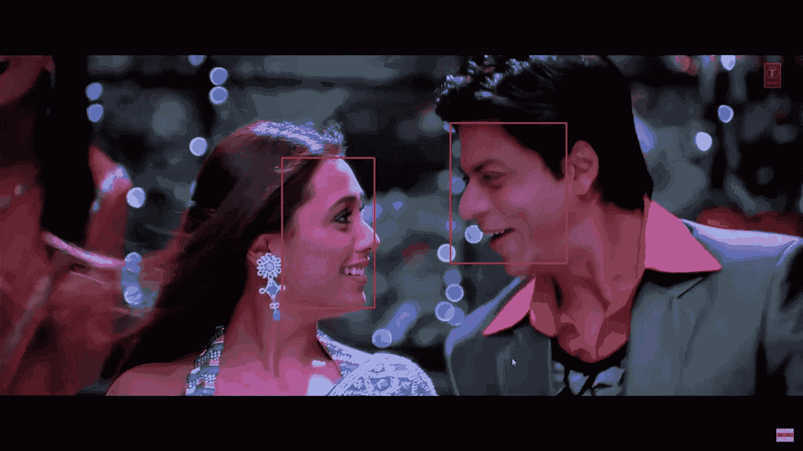
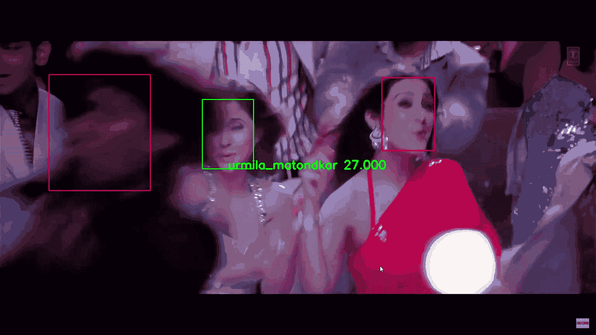

# 使用深度学习在 5 分钟内识别音乐视频中的名人

> 原文：<https://medium.com/mlearning-ai/recognizing-celebs-in-a-music-video-using-deep-learning-under-5-minutes-be5c214be5?source=collection_archive---------4----------------------->

## 使用 MTCNN、FaceNet 和支持向量机识别音乐视频中的宝莱坞名人🎼📹

Example output of Face recognition pipeline on a single video frame.

我已经踏上了学习深度学习的征程。“对于我们在做之前必须学习的东西，我们通过做来学习。”—亚里士多德。

在我的 [**上一篇文章**](/@nan-u/face-recognition-using-deep-learning-under-5-minutes-ad8a52fc1be9) 中，我们学习了使用 MTCNN、FaceNet 和支持向量机从输入图像中识别宝莱坞名人。现在，我们将尝试在电影“Om Shanti Om”中一个著名的宝莱坞音乐视频上测试我们的人脸识别管道这个特定的音乐视频涉及大约 30+宝莱坞名人的交叉。

我们将使用 cv2 OpenCV 库将 mp4 视频转换成帧。接下来，我们将通过人脸识别管道处理每一帧。

人脸检测模型 MTCNN 检测出大量误报。第 21 行是通过忽略小于 1600 (40 x 40)区域的边界框来减少误报的一个小技巧。我们的 SVM 分类器的训练数据集很小，每个名人只有大约 10 张照片。音乐视频包含大量的背景舞者。因此，第 38 行忽略了低于 15%概率的人脸分类。我坚信，通过在更广泛的数据集上进行训练，可以大大提高分类精度。

在通过面部识别管道处理帧之后，我们通过绘制边界框和它们各自的预测名人姓名来更新每个帧。最后，我们从更新的帧中编译回音乐视频。

Face recognition pipeline example output for frames 440 to 480.

Face recognition pipeline example output for frames 13983 to 14040.

忠太🎉我们已经在一个音乐视频上应用了我们的人脸识别管道，取得了令人满意的结果。

页（page 的缩写）我也把整个视频输出上传到了 youtube 上。📷

Face Recognition using MTCNN, FaceNet and SVM.