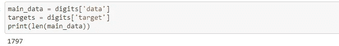
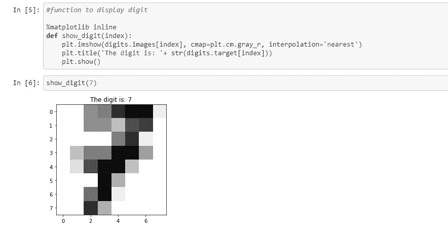
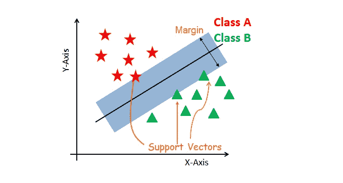
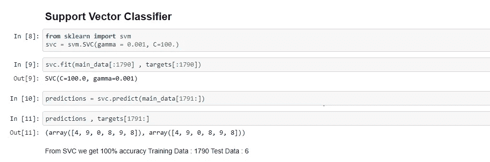
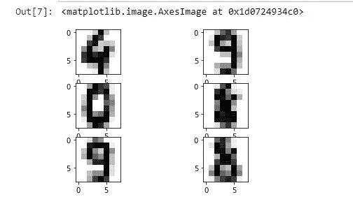
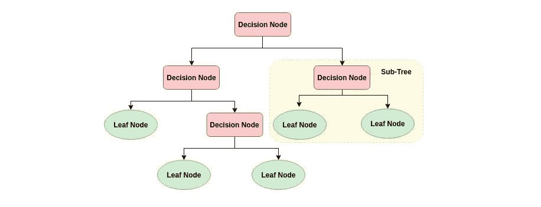
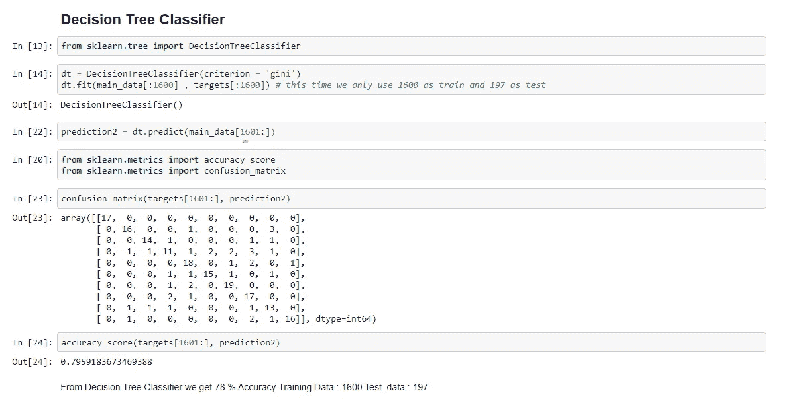
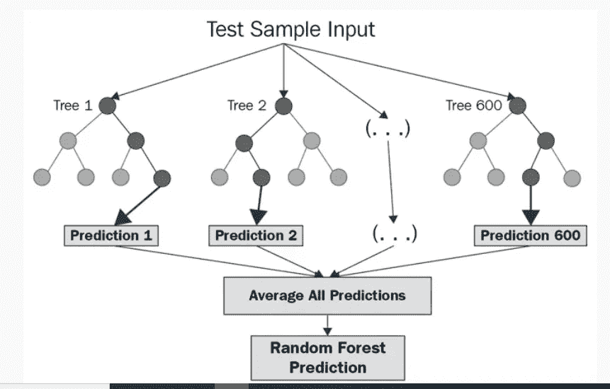
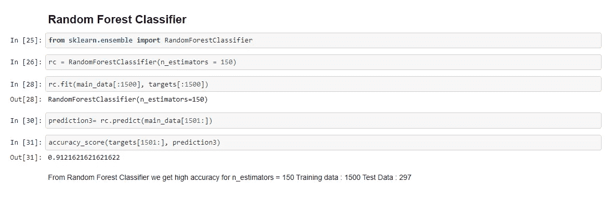

# 用 Scikit-learn 识别手写数字

> 原文：<https://medium.com/mlearning-ai/recognizing-handwritten-digits-with-scikit-learn-1391173c63d?source=collection_archive---------1----------------------->

识别手写文本是一个问题，它可以追溯到需要识别手写文档中的单个字符的第一台自动机器。对手写文本或数字进行分类对于许多现实世界的场景来说是很重要的。例如，邮政服务可以扫描信封上的邮政编码，以自动对必须发往同一个地方的信封进行分组。这篇文章使用来自 ***Scikit-Learn*** 的著名的 ***数字*** 数据集，使用逻辑回归分类器来识别手写数字(0 到 9)。

> **假设**

Scikit-learn 库的 Digits 数据集提供了许多数据集，可用于测试许多数据分析问题和预测结果。一些科学家声称它 95%的时候都能准确预测数字。进行数据分析来接受或拒绝这个假设。

> ***先决条件***

要创建这样的项目，您需要具备以下先决条件:

1.  Matplotlib
2.  Sklearn
3.  机器学习算法，例如决策树分类器(DTC)、随机森林分类器(RFC)、支持向量机(SVM)。

> 资料组

我们使用 sklearn 库中已经存在的内置数据集；我们需要导入它才能使用它。

Digits 数据集是一个字典，包含数据、目标、图像、特征名称、数据集描述、目标名称等。

我们主要关注数据和目标。我们在不同的变量上提取两者。

现在我们可以看到我们的数据看起来像:

> ***模型规划:***

为了了解不同的模型如何处理不同的数据大小，我们使用了 3 个模型:支持向量分类器、决策树分类器和随机森林分类器。

1.  **支持向量分类器:**

支持向量机算法的目标是在 N 维空间(N-特征的数量)中找到一个超平面，该超平面清楚地分类数据点。点击这里了解更多关于 SVM 的信息。

> 密码

svc output

我们可以看到，在 SVC 上，我们得到了数据集的 100%输出，其中 1791 个数据用于训练，6 个输入用于测试，输入与标签匹配。

**2。决策树分类器:**

决策树分类器是一种简单而广泛使用的分类技术。它应用一种简单的思想来解决分类问题。决策树分类器提出了一系列关于测试记录属性的精心制作的问题。每次它收到一个回答，都会询问后续问题，直到得出关于记录的类标签的结论。[更多...](http://mines.humanoriented.com/classes/2010/fall/csci568/portfolio_exports/lguo/decisionTree.html)

source: [https://www.datacamp.com/community/tutorials/decision-tree-classification-python](https://www.datacamp.com/community/tutorials/decision-tree-classification-python)

> 代码:

现在，这一次，我们使用不同大小的训练数据和验证数据。正如我们所看到的，决策树分类器在数据上表现不佳。我们可以通过微调 DTC 的超参数来提高精度。

**3。随机森林分类器:**

随机森林是监督学习算法。它既可以用于分类，也可以用于回归。也是最灵活易用的算法。森林是由树木组成的。据说树越多，森林就越健壮。随机森林在随机选择的数据样本上创建决策树，获得每棵树的预测，并使用投票选择最佳解决方案。它也为特性的重要性提供了一个很好的指示器。

[更多关于随机森林……](https://www.datacamp.com/community/tutorials/random-forests-classifier-python)

[https://corporatefinanceinstitute.com/resources/knowledge/other/random-forest/](https://corporatefinanceinstitute.com/resources/knowledge/other/random-forest/)

> 代码:

正如我们所看到的，与决策树和支持向量相比，随机森林在使用较少数据的情况下表现出色。我们用随机森林分类器得到了 92 %的准确率。

> **结论**

根据我们的假设，通过使用不同的机器学习模型或使用更多的数据来调整超参数，我们可以在手写数据集上达到近 95%的准确率。但是要确保我们也有大量的测试数据；否则，模型会过拟合。

> 完整代码

 [## 识别-手写数字-scikit-learn/数字识别。ipynb at main …

### 在……上创建一个帐户，为 ashmalvayani/用 scikit 识别手写数字学习的发展做出贡献

github.com](https://github.com/ashmalvayani/Recognizing-Handwritten-Digits-with-scikit-learn/blob/main/Digits%20Recognition.ipynb)