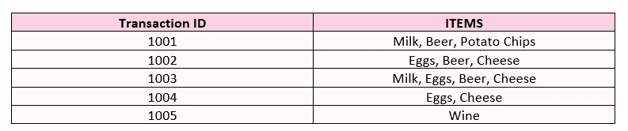
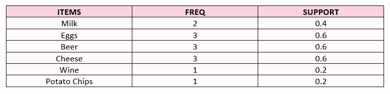
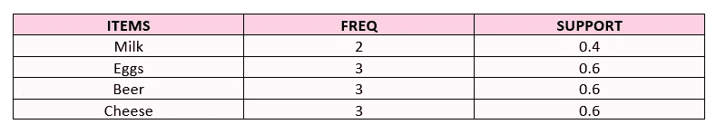
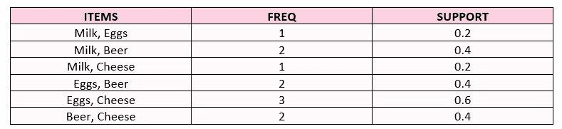
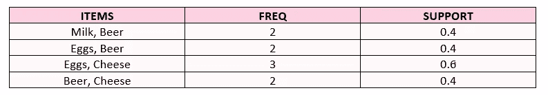
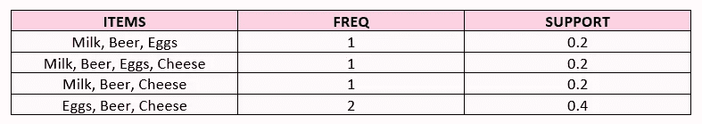
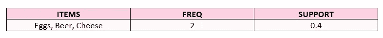
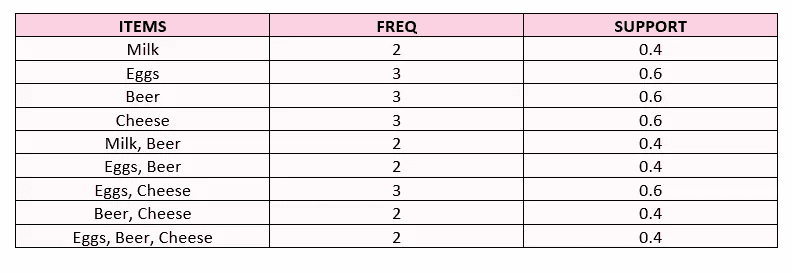

# 推荐系统:ARL(关联规则学习)

> 原文：<https://medium.com/mlearning-ai/recommendation-systems-arl-association-rule-learning-bed1a07b5d9a?source=collection_archive---------0----------------------->


Jerry-Lee Bosmans

推荐系统旨在使用一些方法和算法向用户推荐内容、产品和服务。虽然它从 90 年代就开始使用了，但自 2009 年以来，它已被广泛用于数据分析。

虽然内容丰富，但用户的兴趣更倾向于定制整个内容集，并且因人而异。为了不迷失在这个丰富的集群中，并根据感兴趣的领域达到期望的个性化服务，需要进行各种过滤。这些过滤器和算法表现为“推荐系统”。它被用于许多领域，如约会应用、电子商务网站、社交媒体渠道等。

可以在 4 个主要标题下检查推荐系统:

*   **简单推荐系统:**利用商业知识或简单的排序技术进行一般性推荐。
*   **关联规则学习:**根据通过关联分析学习到的规则提出建议。
*   **基于内容的过滤:**根据产品的相似性进行推荐。
*   **协同过滤:**根据共同意见，基于用户或产品进行推荐。它分为基于用户、基于产品和基于模型。

本文是推荐系统的第一部分，重点是简单的推荐系统和关联规则学习，关注基于内容的过滤和协同过滤方法。

# 简单的推荐系统

简单的推荐系统不关心用户行为或产品特征。这些系统通常集中于具有最高分数的优选的、流行的、传奇的产品等。并将这些产品直接推荐给用户。

# 关联规则学习

它是一种基于规则的机器学习技术，用于发现数据中的模式。关联规则学习时使用 Apriori 算法。Apriori 是一种篮子分析方法，用于揭示产品关联。先验中有 3 个重要指标:

*   **支持**:测量产品 X 和 Y 一起购买的频率

```
**Support(X, Y)** **= Freq(X, Y) / Total Transaction**
```

*   **置信度**:购买产品 X 时，购买产品 Y 的概率

```
**Confidence(X, Y)** **= Freq(X, Y) / Freq(X)**
```

*   **Lift:** 购买产品 X 时，购买产品 Y 的概率增加的系数。

```
**Lift = Support(X, Y) / (Support(X) * Support(Y))**
```

## 先验是如何工作的？

Apriori 算法根据流程开始时确定的支持度阈值计算可能的产品对，并根据每次迭代中确定的支持度值进行淘汰，从而创建最终表。



*   **第一步**:计算每个产品的支持值。



*   **步骤 2:** 剔除支持值等于或低于流程开始时确定的支持阈值的产品。



*   **第三步:**确定可能的产品对并计算支持值。



*   **第四步:**根据确定的支持度阈值进行剔除。



*   **第五步:**确定新的可能产品对，计算支持值。



*   **第六步:**根据确定的支持度阈值进行淘汰。



*   **第 7 步:**最终表格



鸡蛋和啤酒一起出现在 40%的购买中。67%买鸡蛋的顾客也买啤酒。鸡蛋购买量增加了 1.11 倍。根据最后的表格，可以做出这几种评论。

既然我们已经研究了 Apriori 算法的工作逻辑，那么是时候创建一个 Python 项目了，在这个项目中，我们将使用 Apriori 算法实现关联规则学习。

在这个项目中，我将使用之前在 RFM 和 CLTV[(客户终身价值)](/the-modern-scientist/crm-analytics-cltv-customer-lifetime-value-6a02825d7cbe)项目的[客户细分中使用的 online_retail_II 数据集。要记住变量:](/@zbeyza/crm-analytics-customer-segmentation-with-rfm-208ddc10c623)

## 可变包:

*   **发票**:发票号。名义上。分配给每笔交易的 6 位整数。如果此代码以字母“C”开头，则表示取消。
*   **库存代码**:产品(项目)代码。名义上。一个 5 位数的整数，唯一分配给每个不同的产品。
*   **描述**:产品(物品)名称。名义上。
*   **数量**:每笔交易每种产品(物品)的数量。数字。
*   **发票日期**:发票日期和时间。数字。生成交易的日期和时间。
*   **单价**:单价。数字。以英镑为单位的产品价格()。
*   **CustomerID** :客户编号。名义上。唯一分配给每个客户的 5 位整数。
*   **国家**:国家名称。名义上。客户居住的国家的名称。

与数据集相关的操作和各种操作已经在前面的代码部分完成，你可以在这里找到项目[的完整代码。](https://github.com/zbeyza/association_rule_learning)

要应用 ARL，首先，您应该准备 ARL 数据结构。我们需要一个由 0 和 1 组成的发票项目矩阵，但在创建这个矩阵之前，我将把数据集缩减到一个国家。我选了法国，你可以选别的国家，自己试试。

由于我们将数据集减少到法国，现在我们可以创建发票项目矩阵。我们可以将 StockCode 和 Description 都作为 Item，但是将 Description 作为 Item 会导致它占用大量内存并且代码运行缓慢，所以将 StockCode 作为 Item 会更健康，而不是产品名称。

频繁项目集是一组经常一起出现并达到预定义的支持度和置信度的项目。使用关联规则可以发现频繁项集。

```
**antecedents** : first product
**consequents** : second product
**antecedent support** : proportion of transactions that contains antecedent A
**consequent** **support** : proportion of transactions that contains consequent C
**support** : items’ frequency of occurrence
**confidence** : conditional probability of purchasing consequents Y 
when antecedents X is purchased
**lift** : How many times the probability of purchasing consequents Y 
increases when antecedents X is purchased
**leverage** : similar to lift but it gives priority to higher support.
**conviction** : expected frequency of antecedents X without consequent Y
```

在创建规则表之后，可以根据需要(支持、信任、提升、杠杆)进行排序，然后可以执行推荐过程。

作为项目的最后一步，我们将进行产品推荐。为此，我们将使用一个函数，该函数将规则数据框、产品 id 和建议数量作为参数。

假设我们为产品 id 为 22492 的产品推荐 2 个产品。

通过使用下面的函数，我们可以从我们将要推荐的产品的 id 中检查产品名称。

我们已经到达终点了！有问题，遇到困难或者只是想打个招呼？请使用评论框。🦖

[](https://github.com/zbeyza/association_rule_learning) [## GitHub-zbeyza/association _ rule _ learning

### 一种基于规则的机器学习技术，用于发现数据中的模式。使用 Apriori 算法的同时…

github.com](https://github.com/zbeyza/association_rule_learning) 

请继续关注基于内容的过滤和协作过滤，这将是关于推荐系统的下一篇文章。🔔

[](/mlearning-ai/mlearning-ai-submission-suggestions-b51e2b130bfb) [## Mlearning.ai 提交建议

### 如何成为 Mlearning.ai 上的作家

medium.com](/mlearning-ai/mlearning-ai-submission-suggestions-b51e2b130bfb)