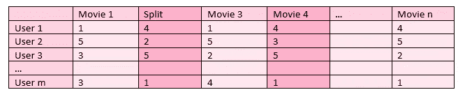
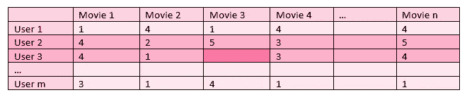
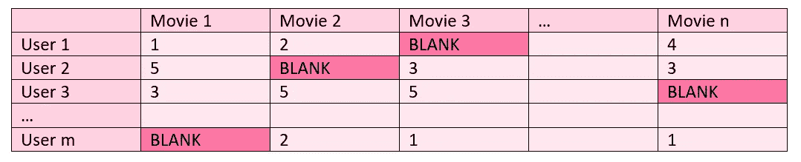
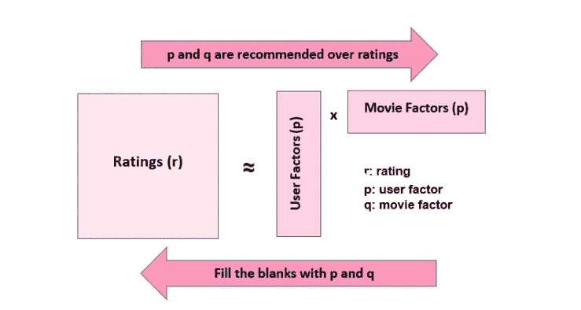
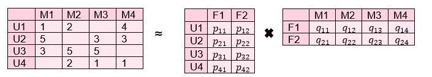
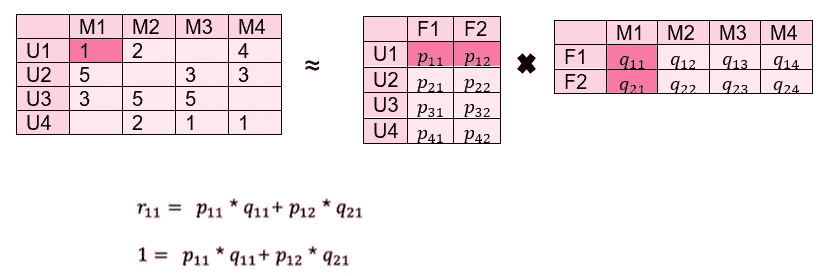
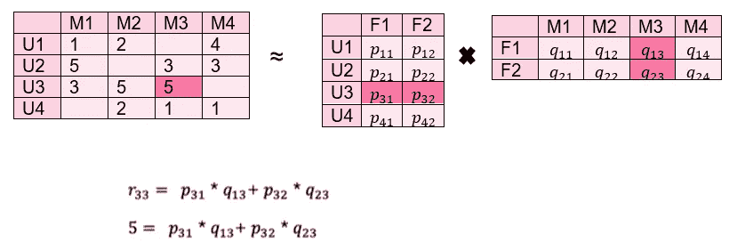
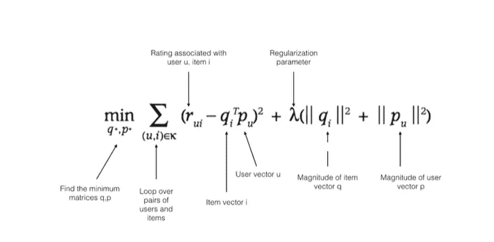
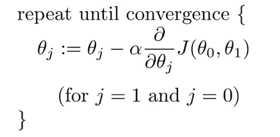
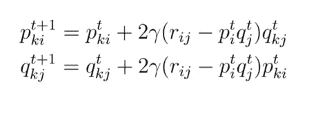

# 推荐系统:协同过滤

> 原文：<https://medium.com/mlearning-ai/recommendation-systems-collaborative-filtering-75121f19dd03?source=collection_archive---------1----------------------->

在本文中，我将讨论协同过滤，这是推荐系统的第三个也是最后一个标题。您可以通过以下链接找到我写的关于推荐系统的前两篇文章，它们是关联规则学习和基于内容的过滤:

 [## 推荐系统:ARL(关联规则学习)

### 推荐系统旨在使用一些方法和算法向用户推荐内容、产品和服务

medium.com](/mlearning-ai/recommendation-systems-arl-association-rule-learning-bed1a07b5d9a)  [## 推荐系统:基于内容的过滤

### 基于内容的过滤是用作推荐系统的方法之一。相似性是通过…

medium.com](/mlearning-ai/recommendation-systems-content-based-filtering-e19e3b0a309e) 

协同过滤是一种利用用户和产品之间的相似性来提供建议的方法。协同过滤分析相似的用户或相似评级的产品，并基于该分析推荐用户。

协同过滤分为 3 个子标题:

1.  基于项目的协同过滤
2.  基于用户的协同过滤
3.  基于模型的协同过滤

# 基于项目的协同过滤

它是一种分析产品相似性或用户对产品的评价，并根据分析结果提出建议的方法。

下表是 m 个用户给 n 部电影的评分。我们想向观看过《分裂》并喜欢它的用户推荐一部与《分裂》评分相似的电影。

在这种情况下，可以为该用户推荐电影 4，该电影是与 Split 具有相似取向(同时喜欢和不喜欢)的电影。

## 项目:

某在线电影平台想开发一个协同过滤的推荐系统。希望以适应机构群体意见的方式提出建议。当用户喜欢一部电影时，与该电影具有相似喜欢模式的其他电影被请求推荐。

**关于数据集:**

电影:

*   电影 Id:电影的 id
*   标题:电影的标题

评级:

*   userId:用户的 Id
*   电影 Id:电影的 id
*   分级:用户对电影的分级
*   时间戳:评级的时间戳

你可以在这里找到数据集。对于这个项目，我们将合并“电影”和“电影评级”数据集。

在项目开始时，数据集被读取和合并。你可以查看[项目的完整代码。](https://github.com/zbeyza/collaborative_filtering/blob/main/item_based_collaborative_filtering.py)

**创建用户电影数据帧:**

在这一步，我们将创建用户电影数据帧，但我们不希望它稀疏。例如，假设一个用户只评价了一部电影。即使对一部电影进行了分级，该用户也将在用户电影数据帧中的所有其他电影中各占据一个单元。这会延迟要进行的计算，并导致性能问题。为了避免这些计算问题，并防止极少数用户观看的电影被包括在推荐中，应该进行一些缩减过程。

完成归约过程后，将创建一个数据透视表，其中行中包含“userId”，列中包含“title”，交叉点中包含“rating”。

在“用户-电影”数据框中，如果用户尚未对电影进行评级，则其交叉点处的单元格由 NaN 表示。

**基于项目的电影预测:**

因为已经创建了用户电影矩阵，所以可以通过查看电影和其他电影之间的相关性来发现它们之间的相似性。

随机选择电影后，计算这部电影与其他电影的相关性。可以推荐具有高相关性的电影，这意味着表现出与该电影相似行为的电影已经被推荐。

电影也可以手动选择和检查。您可以使用下面的代码片段通过关键字进行搜索，以获得数据集中电影的全名。

# 基于用户的协同过滤

这是一种分析用户行为(喜好)并根据表现出类似行为的用户喜好提供建议的方法。

表格显示了 m 个用户给 n 部电影的评分。用户没有观看的电影的分级是空白的。希望建议一部与用户 3 相似的他可能喜欢的电影。为此，首先，应该找到表现出类似行为的用户。可以看出，在用户 3 评价的电影中表现出类似行为的用户是用户 2，并且选择推荐用户 2 喜欢但用户 3 没有观看的电影 3。作为该建议的结果，预期用户 3 会喜欢这部电影。

## 项目:

在这个项目中，将使用基于项目的协同过滤中使用的相同数据集。将在基于项目的项目中创建的用户电影数据帧上执行操作。这是项目的[完整代码，用于检查数据集的处理过程并创建数据框。](https://github.com/zbeyza/collaborative_filtering/blob/main/user_based_collaborative_filtering.py)

**确定用户观看的待推荐电影:**

用户是随机选择的。在该选择之后，应该为该用户减少使用电影数据帧。这样就可以确定这个用户看的电影。

到了`len(movies_watched)`，发现 random_user 看了 33 部电影。

**访问观看相同电影的其他用户:**

在这一步，我们首先需要找出有多少电影是其他用户与随机用户共同观看的。

在这一点上，我们需要一个限制，因为一个只看过 1 或 2 部与 random_user 共同电影的用户不会成为推荐过程的一个标准。

**识别与待推荐用户行为最相似的用户**

这将分 3 步完成:

步骤 1:汇总 random_user 和其他用户的数据

步骤 2:创建相关性数据框

步骤 3:寻找最相似的用户(顶级用户)

在前一阶段中找到的值是所有用户的相关值。目的是接触到与 random_user 高度相关的用户。为此，选择相关性高于 0.65 的用户。

**计算加权平均推荐分数:**

如果根据评级进行排序，相关性的影响将被忽略，如果根据相关性进行排序，评级的影响将被忽略。为了防止这种情况并同时看到两者的效果，将通过将这两个值相乘获得一个名为“weighted_rating”的新变量，并根据该变量进行排序。

这样，考虑到相关性和评级，可以向用户做出类似上面的推荐。

# 基于模型的协同过滤(矩阵分解)

在基于模型的协同过滤中，这个问题被更全面地处理。假设存在需要优化的问题。

目标是预测并填充 m 个用户和 n 部电影的矩阵中标记为空白的单元格。

为了填补空白，假设存在于用户和电影的“潜在特征”的权重是在现有数据上找到的，并且用这些权重对不存在的观察进行预测。

用户电影矩阵被分解成 2 个更低维度的矩阵。假设从 2 矩阵到用户电影矩阵的转变伴随着潜在的因素发生。潜在因素的权重在填充的观察值上找到，空的观察值用找到的权重填充。

为了更清楚地理解这一过程，通过一个例子将是有用的。

我们有一个类似上面的用户电影矩阵，我们想在这里估计空值。首先，我们把它分成 2 个低维矩阵作为用户因子和电影因子。

在这一点上，潜在因素在已填充的观测值上的权重应该被发现如下:

所有 p 和 q 值都是在现有值上迭代找到的，然后使用。最初，它试图预测随机的 p 和 q 值以及评级矩阵中的值。在每次迭代中，安排错误的估计，并试图接近评级矩阵中的值。因此，作为特定迭代的结果，p 和 q 矩阵被填充。

要了解预测是好是坏，需要一个通用的衡量标准。为此，将所有估计值和实际值之间的差的平方相加，然后是平方根，然后是平均值(RMSE 和 MSE 值)。这给了我们关于所有数据的信息。通过这种方式，我们获得了关于预测平均误差的信息，这是我们在研究开始时分配给用户和电影矩阵的值的结果。p 和 q 值被更新以最小化该误差。

**矩阵分解的梯度下降:**

找到 p 和 q 权重的一种方法是使用梯度下降法。梯度下降是一种用于函数最小化的优化方法。

在“最陡下降”的方向上迭代地更新参数值，该方向被定义为梯度的负值，并且找到将给出相关函数的最小值的参数。

这里，p 和 q 矩阵中的权重基于导数交换。函数在某一点的导数给出了该函数增长的最大方向。当迭代地沿着定义为梯度的负值的方向进行时，即，与增加方向相反的方向，参数值被更新以最小化相关函数。

## 项目:

在协作过滤的最后一个项目中，将使用基于项目和基于用户的协作过滤中使用的相同数据集。这里是[项目的完整代码](https://github.com/zbeyza/collaborative_filtering/blob/main/matrix_factorization.py)来检查数据集的过程。

**数据准备:**

在可追溯性方面，我将根据 4 部电影及其 id 来缩减数据集，并从缩减的数据集创建用户电影数据帧。

既然惊喜库要用在这个项目中，而且它有它特殊的数据结构，movie_user_df 就要转换成这个特殊的结构。

**造型:**

对于建模步骤，首先数据应按照 75%和 25%的比例分为训练集和测试集。然后，应创建 SVD 的模型对象，并对车列执行 fit 操作。接下来，应该在测试集上测试模型。

可以优选 RMSE 度量来评估预测的平均误差。

userId 为 1.0、movieId 为 541 的手表单元的实际额定值如下。

当我们使用我们为相同观察单元建立的模型进行预测时，我们获得了 4.33 的评级:

**模型调整:**

在这一步中，将对模型进行优化，即我们将努力增加模型的预测性能。这将通过超参数优化来实现。

考虑到理论部分讨论的公式，超参数是时期、潜在因素、学习速率和λ。对于超参数优化，我们将如下定义历元和学习率的参数集。然后，通过用 GridSearchCV 尝试这些可能的参数集，为历元和学习率的组合计算平均误差，这将给出最低的可能平均误差。

**最终模型&预测:**

模型的缺省值和我们用 GridSearchCV 找到的最优参数互不相同。因此，必须用这些最佳参数重新创建 SVD 模型对象。

到目前为止，我们已经将数据分为训练集和测试集，检查错误并优化超参数。如果模型建立在更大的数据上，就可以进行更好的学习。因此，模型将建立在所有数据的基础上。

建模步骤中 userId-movieId 对的预测过程:

在建模步骤中，对于 1.0 的用户 Id 和 541 的电影 Id 的预测是 4.33。在超参数优化之后，可以看到新的预测是 4.23。在超参数优化之后，预测过程已经被执行以更接近实际值(4.00)，也就是说，误差已经减小。

得到的优化模型提供了对期望的用户电影对进行预测的可能性。做出相关预测后，就可以过滤电影了。向那些用户推荐对某些用户具有高预测评级的电影。

您可以从下面的 GitHub 链接中找到这三个项目的详细代码:

 [## GitHub-zbeyza/协作过滤

### 此时您不能执行该操作。您已使用另一个标签页或窗口登录。您已在另一个选项卡中注销，或者…

github.com](https://github.com/zbeyza/collaborative_filtering) 

我们已经到达终点了！有问题，遇到困难或者只是想打个招呼？请使用评论框。🦖

 [## Mlearning.ai 提交建议

### 如何成为 Mlearning.ai 上的作家

medium.com](/mlearning-ai/mlearning-ai-submission-suggestions-b51e2b130bfb)