# 推荐系统:基于内容的过滤

> 原文：<https://medium.com/mlearning-ai/recommendation-systems-content-based-filtering-e19e3b0a309e?source=collection_archive---------6----------------------->

Jerry-Lee Bosmans

在本文中，我将讨论基于内容的过滤，这是推荐系统的第二个主题。你可以从下面的链接找到我写的关于推荐系统的第一篇文章，它是关联规则学习:

 [## 推荐系统:ARL(关联规则学习)

### 推荐系统旨在使用一些方法和算法向用户推荐内容、产品和服务

medium.com](/@zbeyza/recommendation-systems-arl-association-rule-learning-bed1a07b5d9a) 

基于内容的过滤是用作推荐系统的方法之一。相似性是通过产品元数据计算的，它提供了开发建议的机会。推荐与相关产品最相似的产品。

元数据代表产品/服务的特征。比如一部电影的导演、演员、编剧；作者、封底文章、书籍的译者或产品的类别信息。

该图像包含用户喜欢的电影的描述。要根据用户喜欢的电影向用户推荐一部电影，就要利用这些描述得到一个数学形式，也就是要让文字变得可测量，然后通过与其他电影的比较找到相似的描述。

我们有各种各样的电影和关于这些电影的解释。为了能够比较这些电影注释，注释需要被矢量化。在对这些描述进行矢量化时，必须创建一个所有电影描述(比如说 n 个)和所有电影(比如说 m 个)中唯一词的矩阵。列中有所有独特的单词，行中有所有的电影，每个单词有多少在交叉点的电影中使用。这样，文本就可以矢量化了。

基于内容的过滤步骤:

1.  以数学方式表示文本(文本矢量化):

*   计数向量
*   TF-IDF

2.计算相似度

# 1.文本矢量化

文本矢量化是基于文本处理、文本挖掘和自然语言处理的重要课题之一。诸如将文本转换成向量并在向量上计算相似距离的方法构成了分析世界的基础。如果文本可以用向量来表示，那么就可以进行数学运算。

将文本表示为向量的两种常见方法是 Count Vector 和 TF-IDF。

## -计数向量:

*   **第一步:**所有唯一术语放在列中，所有文档放在行中。

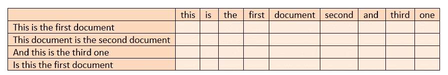

*   **第二步**:将文档中的词频放入交集的单元格中

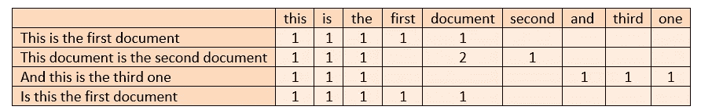

## - TF-IDF:

TF-IDF 对这些词在其文本和整个语料库(即我们关注的数据)中的频率进行归一化处理。换句话说，它对我们将要创建的词向量进行了总体标准化，考虑了文档术语矩阵、整个语料库、所有文档以及术语的频率。这样，它消除了由于计数向量而可能出现的一些偏差。

*   **步骤 1** :计算计数向量(每个文档中每个词的出现频率)

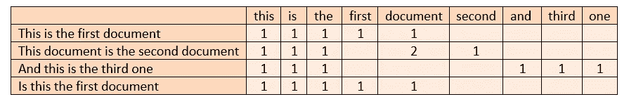

*   **第二步**:计算 TF(词频)

(相关文档中术语 t 的频率)/(文档中术语的总数)

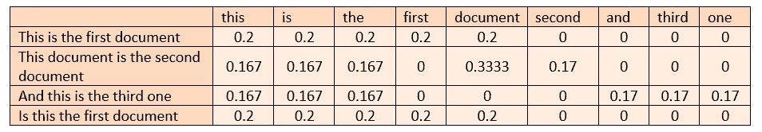

*   **第三步**:计算 IDF(逆文档频率)

1 + loge((文档数+ 1) /(其中包含术语 t 的文档数+ 1))

检查的样本文件总数:4

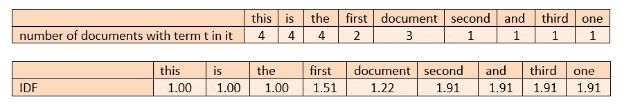

如果一个术语 t 在整个语料库中出现的频率很高，说明这个相关术语影响了整个语料库。在这种情况下，对词内和整个语料库中的通过频率进行归一化。

*   **第四步**:计算 TF * IDF

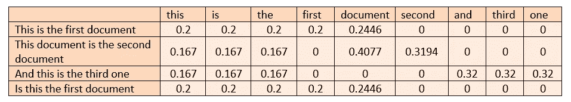

*   **第五步** : L2 归一化

找出行的平方和的平方根，并用找到的值除相应的单元格。

L2 规范化再次纠正由于某些行中存在缺失值而无法显示其效果的单词。

# 2.计算相似度

假设我们有 m 部电影，在对这些电影的描述中有 n 个独特的词。在我们以编程的方式找到这些电影的基于内容的相似性之前，让我们看看如何在实践中做到这一点:

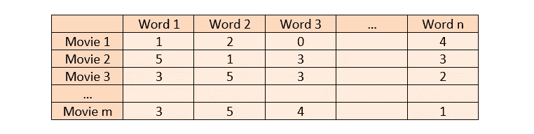

我们可以使用欧几里德距离或余弦相似性来寻找矢量化电影的相似性。

## **-欧几里德距离**:

通过计算欧几里德距离，可以找到两个电影之间的距离值，该距离值表示电影之间的相似性。据观察，随着距离的减小，相似性增加。这样，推荐过程就可以进行了。

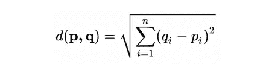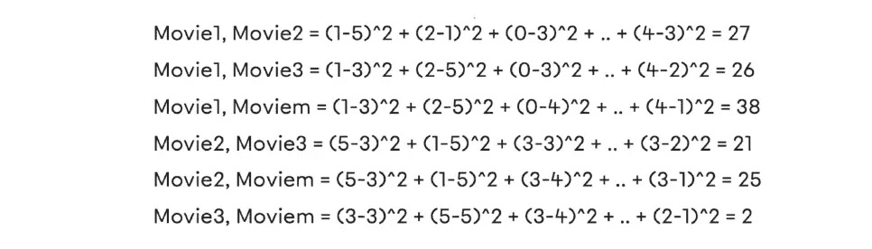

## -余弦相似度:

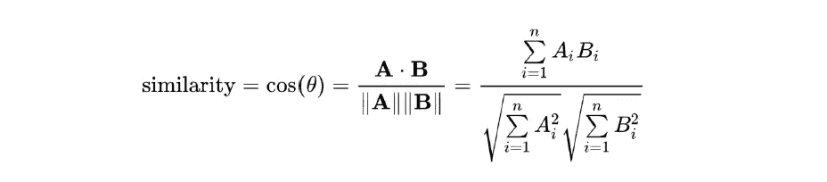

欧几里得中有距离的概念，余弦相似中出现了相似的概念。距离-接近和相似-不相似在这里对应相同的概念。

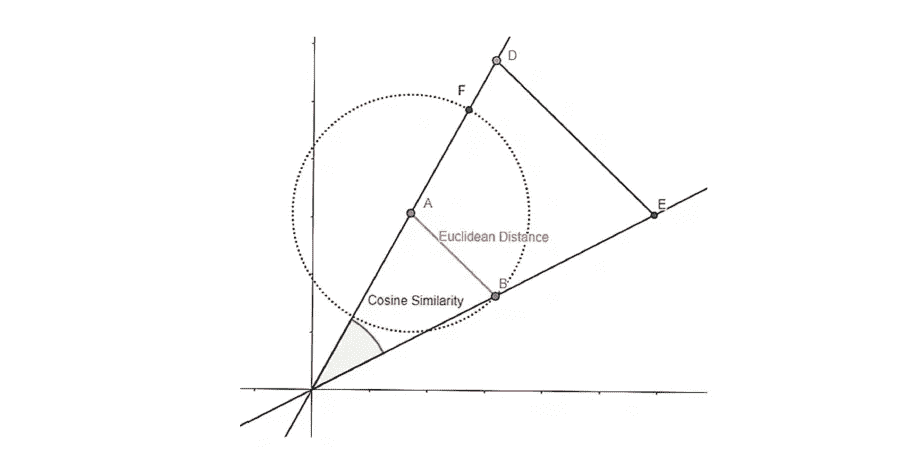

# 项目

既然我们已经讨论了基于内容的过滤的逻辑，我们就可以深入项目了。

**问题:**

一家新成立的在线电影平台希望向其用户推荐电影。由于用户的登录率很低，用户的习惯是未知的。然而，关于用户观看哪些电影的信息可以从浏览器中的轨迹中获得。根据该信息，期望向用户推荐电影。

**关于数据集:**

主影片元数据文件。包含完整 MovieLens 数据集中 45，000 部电影的信息。功能包括海报，背景，预算，收入，发布日期，语言，生产国家和公司。

您可以在这里找到数据集[。](https://www.kaggle.com/rounakbanik/the-movies-dataset)

## **创建 TF-ID 矩阵:**

在项目开始时导入必要的库，并读取数据集。

这里要应用的第一个过程是使用 TF-IDF 方法。为此，调用项目开始时导入的 TfidfVectorizer 方法。输入 stop_words='english '参数来删除单词(and、The、at、on 等。)是语言中常用的，不带有度量值。这样做的原因是为了避免稀疏值将导致在 TF-IDF 矩阵中创建的问题。

tfidf_matrix 的形状为(45466，75827)，其中 45466 表示概视图的数量，75827 表示唯一单词的数量。为了能够更好地处理这种大小的数据，我将把 tfidf_matrix 交集处的值的类型转换为 float32，并进行相应的处理。

现在我们已经有了 tfidf_matrix 交点处的分数，我们现在可以构建余弦相似性矩阵并观察影片之间的相似性。

## 创建余弦相似矩阵:

使用项目开始时导入的 cosine_similarity 方法，可以找到每部电影与其他电影的相似性值。

例如，我们可以找到第一个索引中的电影与所有其他电影的相似性得分，如下所示:

## 基于相似性提出建议:

相似度是用余弦相似度计算的，但是需要电影的名字来评估这些分数。为此，包含哪个电影在哪个索引中的熊猫系列被创建为`indices = pd.Series(df.index, index=df[‘title’])`。

如下图所示，在一些电影中可以观察到多路复用。

我们需要保留这些倍数中的一个，去掉其余的，这个应该在最近的日期取这些倍数中最近的一个。这可以通过以下方式实现:

作为操作的结果，可以观察到每个标题变成单数，并且变得可以用单个索引信息来访问。

假设我们要达到 10 部类似《神探夏洛克·福尔摩斯》的电影。首先，通过在余弦 _sim 中输入福尔摩斯的索引信息来选择福尔摩斯电影，并访问表示这部电影与其他电影的相似关系的分数。

创建一个名为 similarity_scores 的数据框，使其具有更好的可读性。所选的与 cosine_sim[movie_index]的相似性被保存为该数据框中的“分数”变量。

上面选择了与夏洛克电影最相似的 10 部电影的索引。对应于这些索引的电影名称可以如下访问:

这 10 部电影从描述上来说是最像夏洛克·福尔摩斯的。这些电影可以推荐给看过《夏洛克》的用户。也可以尝试不同的电影，观察效果。

我们已经到达终点了！有问题，遇到困难或者只是想打个招呼？请使用评论框。🦖

 [## GitHub-zbeyza/基于内容的过滤

### 基于内容的过滤是用作推荐系统的方法之一。相似性是根据产品计算的…

github.com](https://github.com/zbeyza/content_based_filtering)  [## Mlearning.ai 提交建议

### 如何成为 Mlearning.ai 上的作家

medium.com](/mlearning-ai/mlearning-ai-submission-suggestions-b51e2b130bfb)