# 推荐系统:基于内容的推荐和协同过滤[全文]

> 原文：<https://medium.com/mlearning-ai/recommender-systems-content-based-recommendations-collaborative-filtering-full-6483b6caa5eb?source=collection_archive---------1----------------------->

在浏览互联网时，你可能会经常发现我们看到的很多东西都是我们自己偏好的，个性化的方式使我们能够接收到与我们需求相关的信息。

今天，我们将讨论这是如何工作的。

满足推荐系统。

Admire the complexity.

到目前为止，在这个博客中，我们已经讨论了两种类型的 ML:监督学习和非监督学习。我们今天讨论的系统是这两种类型的结合。我们将涵盖:

1.  [创意【简介】](#4bb7)
2.  [问题公式化](#dd2a)
3.  [基于内容的推荐](#01c2)
4.  [协同过滤](#ee6c)
5.  [低秩矩阵分解](#dc40)
6.  [均值归一化](#527d)

让我们开始吧。

# 1.想法:介绍

顾名思义，推荐系统试图寻找特定的模式来过滤信息，从而为我们提供有用的推荐。

换句话说，这些系统旨在预测用户的好恶。这些信息将被用于过滤和推荐与特定用户相关的项目。

有两种方法可以做到这一点:使用基于内容的推荐和协同过滤。

在我们开始之前，让我们从一些基本的符号开始。

# 2.问题定式化

在这一特定部分，我们将制定一些值来更好地简化所讨论的概念。回过头来参考这个符号。

比方说，我们想创建一个推荐系统，通过查看用户过去对其他电影的评级，并了解其他用户与他们类似的行为，来预测用户对电影的评级。

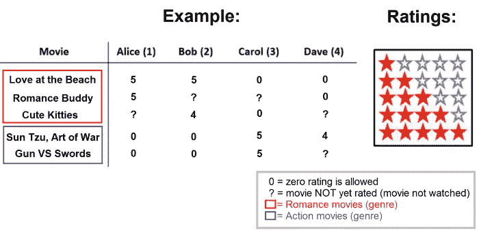

符号:

*   *n_u =* 用户数量(4)
*   电影数量(5)
*   *r* ( *i，j* ) = 1 如果电影 *i* 已经被用户 *j* 评级
*   *y* ( *i，j* ) =用户 *j
    给出的电影 *i* 的评分——注意:只有当 r(i，j)=1* 时才有可能

例如， *y* (4，3) = 5，因为 Carol 给电影*孙子兵法*打了 5 颗星， *r* (3，1) = 0，因为 Alice 没有给电影*可爱的小猫*打分数，但给其他浪漫相关的电影打了 5 颗星，如*海滩之恋*。了解了这一点，推荐算法就知道卡罗尔更喜欢动作片，而爱丽丝更喜欢爱情片。

简而言之，我们的目标是让我们的算法预测用户会给那些未观看的电影(？).

# 3.基于内容的推荐

一种方法是使用基于内容的推荐方法。这个想法是基于一组特征中的项目(电影)的内容来进行推荐。

假设我们创造了一个新的功能 *n* 来衡量一部电影有多少*浪漫*或*动作*。请参见以下内容:

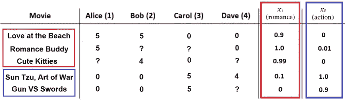

对于每个用户 *j* ，我们希望算法使用函数(*θ*(*j*)*ᵀ*)(*x*(*I*))来预测电影 *i* 的评分。其中:

*   *θ* ( *j* )是用户 *j* 的ℝ *ⁿ* ⁺参数向量。
*   *x* ( *i* )是电影 *i.
    的ℝ *ⁿ* ⁺特征向量——回想一下，偏置项 x0 总是 1。*

*—例:给定 Alice θ(1)的参数向量为[0；5;0]以及未分级电影 x(3)的特征向量为[1；0.99;0]，则使用(θ(1)ᵀ)(x(3)计算的评级为 4.95 (5 x 0.99)。*

然后，这可以应用于单独的线性回归问题，用于在让每个用户 *j* 评价一个 *m* ( *j* )数量的电影之后学习 *θ* ( *j* ):

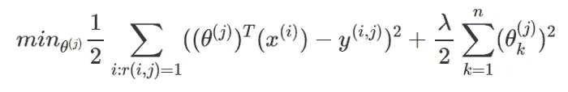

Copy-paste: minθ(j) 1/2 ∑i:r(i,j)=1 ((θ(j))ᵀ(x(i)) − y(i,j))² + λ/2 n∑k=1 (θ(j)k)²

*—注:为简化起见，省略了‘m(j)’。*

学习所有参数向量*θ*(1)*θ*(2)…，*θ*(*n*_*u*):

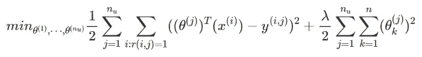

Copy-paste: minθ(1),…,θ(n_u) 1/2 n_u∑j=1 ∑i:r(i,j)=1 ((θ(j))ᵀ(x(i)) − y(i,j))² + λ/2 n_u∑j=1 n∑k=1 (θ(j)k)²

*—增加了两个求和符号 n_u∑j=1。*

将其应用于成本函数，

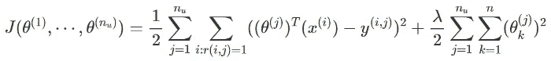

Copy-paste: J(θ(1),…,θ(nu)) = 1/2 n_u∑j=1 ∑i:r(i,j)=1 ((θ(j))ᵀ(x(i)) − y(i,j))² + λ/2 n_u∑j=1 n∑k=1 (θ(j)k)²

以及梯度下降，

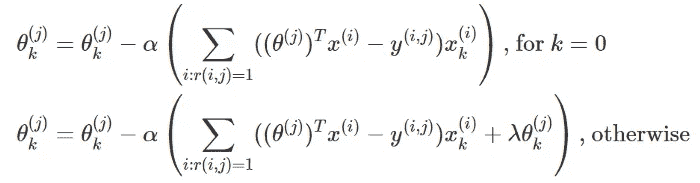

Copy-paste: θ(j)k = θ(j)k − α (∑i:r(i,j)=1 ((θ(j))ᵀx(i) − y(i,j)) x(i)k), for k=0 — separate this for the bias term x0 θ(j)k = θ(j)k − α (∑i:r(i,j)=1 ((θ(j))ᵀx(i) − y(i,j)) x(i)k + λθ(j)k), otherwise

— *注意:不需要正则化偏差项，因此需要分离。*

利用这些，推荐系统可以依靠电影内容中的特征来帮助他们预测某人对某部电影的喜好。

然而，想出如此可靠的功能并不容易。因此，我们有了推荐系统的另一种选择:

# 4.协同过滤

与求 *θ* ( *j* )的值相反，如果我们试着学习*x*(*I*)*的特征值呢？以前，已经提供了这些值。但是，让某人观看并评价每部电影的浪漫程度或动作场面并不容易:这既费时又费钱。*

*我们可以初步对 *θ* ( *j* )的值进行猜测，然后用它来学习 *x* ( *i* )的值。使用这些学习值，我们可以再次学习**θ*(*j*)的值，以便更好地改进用于学习 *x* ( *i* 的最初估计的 *θ* ( *j* )值。这些值随后被用于再次学习*更好的 *x* ( *i* )值，并且循环重复。***

> **猜θ(j) →学 x(i) →学θ(j) →学 x(i) →学θ(j) → …**

**通过这种方式，我们能够获得更好的电影评级和更好的用户推荐。这样做的好处是，每个用户都*在某种程度上与*合作，帮助算法更好地*过滤*电影推荐。**

**因此，我们更依赖用户协作，而不是内容。**

## **4.1 理念**

**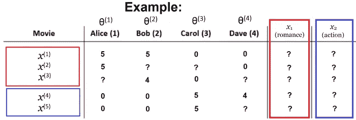**

***Note: it’s supposed to use Θ, not θ.**

**在对一部电影一无所知的情况下，只看用户的评分就可以推断出第一部电影 *x* ( *i* )更像是一部爱情片。**

**爱丽丝和鲍勃有相似的喜好，给 1⁽ ⁾.打了五颗星另一方面，卡罗尔和戴夫对那部电影的评分是 0 颗星，这表明他们都喜欢另一种类型的电影，从他们在 2⁽ ⁾.的评分来看**

**协同过滤推荐系统的目标是找到一个值 *x* ( *i* )，使得函数(*θ*(*j*)*ᵀ*)(*x*(*I*))可以得到用户给出的实际评分值 *θ* ( *j* )。**

**比如什么特征向量 *x* (1)值会给出(*θ*(*j*)*ᵀ*)(*x*(*I*))≈5？知道了 *θ* (1) = 5 的值，我们可以估计出 *x* (1)的合理值应该是 1.0。意思是，特征向量 *x* (1)是 100% (1.0)一部言情电影 *x* 1(1)和 0% (0.0)一部动作一 *x* 2(1)。**

**所有这些都是用户协作的结果。**

## **4.2 配方**

**给定[ *θ* (1)，…， *θ* ( *n_u* )]值，算法通过最小化预测评级(*θ*(*j*)*ᵀ*)(*x*()之间的平方差来学习*x*(**

**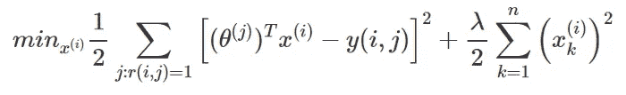**

**Copy-paste: minx(i) 1/2 ∑j:r(i,j)=1 ((θ(j))ᵀ(x(i)) − y(i,j))² + λ/2 n∑k=1 (x(j)k)²**

**为了学习所有电影 *m，*的所有特征向量[ *x* (1)，…， *x* ( *n_m* )]，给定大量用户的评分[ *θ* (1)，…， *θ* ( *n_u* )]，**

**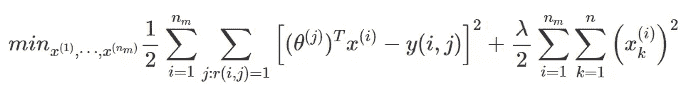**

**Copy-paste: minx(1),…,x(n_u) 1/2 n_u∑i=1 ∑j:r(i,j)=1 ((θ(j))ᵀ(x(i)) − y(i,j))² + λ/2 n_u∑i=1 n∑k=1 (x(j)k)²**

**因此，梯度下降更新如下:**

**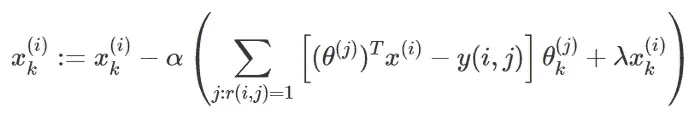**

**Copy-paste: xk(i) ​:= xk(i) ​− α (∑j:r(i,j)=1​ [(θ(j))ᵀ(x(i)) − y(i,j)] θk(j) ​+ λxk(i)​) — if i ≠ 0.**

**如果您注意到，这些公式看起来非常类似于用于基于内容的推荐的公式，这些公式试图找到用户参数向量值 *θ* ( *j* )。在这种情况下，我们所做的只是简单地将那些 *θ* ( *j* )变量改变为 *x* ( *i* )这是它试图学习的，同时改变求和符号的功能。**

## **4.3 算法**

**协同过滤的工作原理是分别使用给定的特征或用户评级来学习 *θ* ( *j* )和 *x* ( *i* )的值，以此类推——*参见本节开始时讨论的循环*。**

**总而言之，我们当前的优化目标如下。**

**1/2.给定 *x* (1)， *x* (2)，…，*x*(*n*_*u*)，学习 *θ* (1)， *θ* (2)，…，*θ*(*n*_*u*):**

**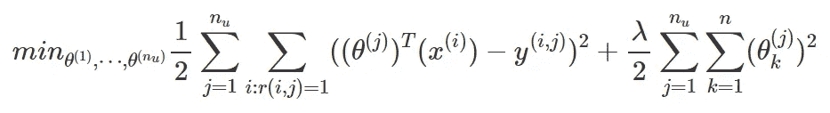**

**2/1.给定 *θ* (1)， *θ* (2)，…，*θ*(*n*_*u*，学习 *x* (1)， *x* (2)，…，*x*(*n*_*u***

****

**3.重复一遍。**

**不用来回寻找 *θ* 和 *x* 值，我们有一种方法可以同时求解这两个值。将上面的两个公式组合成一个最小化目标，我们可以得到以下包含两个参数的成本函数:**

**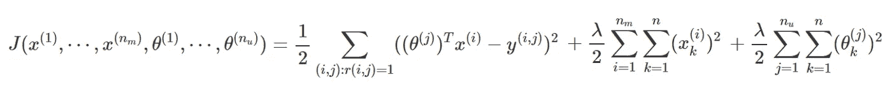**

**Copy-paste: J(x(1),…,x(nm),θ(1),…,θ(nu)) = 1/2 ∑(i,j):r(i,j)=1 ((θ(j))ᵀx(i)−y(i,j))² + λ/2 nm∑i=1 n∑k=1 (x(i)k)² + λ/2 nu∑j=1 n∑k=1 (θ(j)k)²**

**— *注:没有 x0 = 1 或θ0，所以有 x* ∈ ℝ *ⁿ和θ* ∈ ℝ *ⁿ.***

**因此，优化目标是:**

**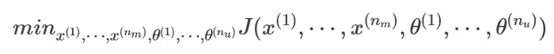**

**Copy-paste: min(x(1),…,x(nm),θ(1),…,θ(nu)) J(x(1),…,x(nm),θ(1),…,θ(nu))**

**这样，该算法能够同时最小化两个参数 *θ* 和 *x* ，而不必在这两个参数之间不断切换。如果 *x* 或 *θ* 分别保持不变，该优化目标实际上与之前的两个梯度下降更新(2)相同。**

**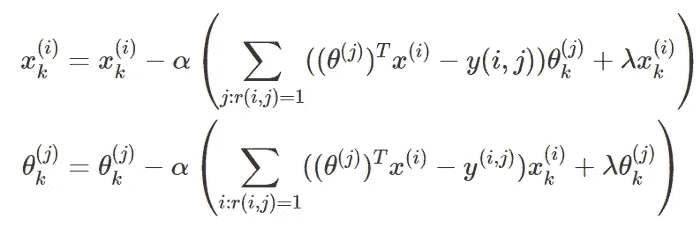**

## **4.4 结论**

**因此，下面是我们的协同过滤算法:**

1.  **将小随机值初始化为参数 *x* (2)、…、*x*(*n*u*)和 *θ* (1)、 *θ* (2)、…、*θ*(*n*_*u*)。***
2.  *使用梯度下降或任何其他高级优化算法最小化 *J* ( *x* (1)，…， *x* ( *n_m* )， *θ* (1)，…， *θ* ( *n_u* )。*
3.  *给定具有参数 *θ* 的用户评级和具有学习特征 *x* 的电影，使用 *θᵀx.* 预测未评级电影的星级*

*利用这一点，该算法能够同时学习电影的良好特征，并对用户评级做出良好的预测，从而根据用户电影偏好收集的协作数据来过滤电影。*

# *5.低秩矩阵分解*

## *5.1 定义*

*回到我们的原始数据，我们可以基于用户 *j、*对电影 *i* 的 *y* ( *i，j* )的评级，将所有用户评级分组到一个矩阵 *Y* 中*

*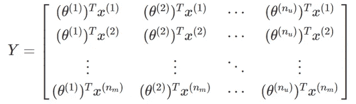*

*这种情况的矢量化实现是:*

*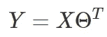*

*Copy-paste: Y = XΘᵀ*

*在哪里，*

*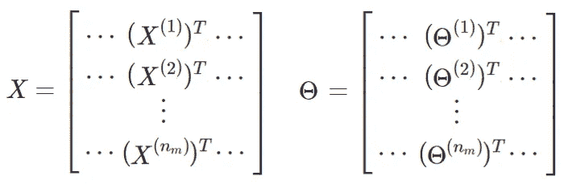*

*这种算法就是低秩矩阵分解，因其低秩矩阵属性而闻名于线性代数。*

## *5.2 应用*

*这对于找到与特定用户观看过的内容相关的其他电影非常有帮助，然后推荐给该用户。*

*从技术上来说，对于每部电影 *i* ，我们想要学习一个特征向量*x*(*I*)*∈ℝ*ⁿ*，它抓住了电影内容的本质——*哪一部分让用户喜欢或不喜欢这部电影？***

**一旦了解，我们就需要找到其他未看过的电影 *j* 推荐给特定用户，基于它与用户已经看过的电影 *i* 有多相似。我们可以通过找到电影 *i* 和 *j* 的特征值之间的欧几里德“距离”来做到这一点，并且说它们的差异越小它们就越相似:**

> **小∨x(I)÷x(j)÷→电影都差不多。**

**因此，推荐距离最小的电影。**

# **6.均值归一化**

## **6.1 理念**

**假设我们有一个没有对任何电影评级的新用户，**

**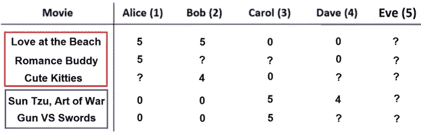**

**如果我们应用现有的算法，使用 *Y* 矩阵，**

**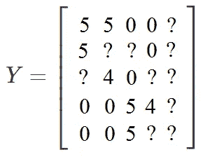**

**和给定的成本函数，**

**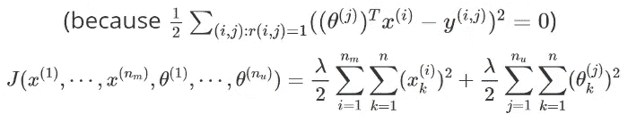**

**— *Eve 没有给任何电影评级，所以不存在 r(i，j)=1 的情况。因此，它只是试图找到最小化最后一个正则化项的θ(5)值，这将导致零向量(对于θ1(5)&θ2(5))。***

**则θ(5)的所有预测评级为零(0)。**

**这很糟糕。**

**如果所有的评分都一样，没有一部电影的评分比另一部高，我们会向 Eve 推荐哪部电影？我们也不能假设伊芙看过这些电影后会给它们打 0 分。**

**这就是均值归一化的用武之地。**

## **6.2 均值归一化**

**这里的想法是找到一些其他评级，至少在某种程度上是理想的安全。足够安全让算法做出合理的预测。比如取其他用户的*平均*评分。**

**为此，我们将使用平均值标准化评级 *Y* 矩阵的每一行，然后从评级中减去平均值:**

**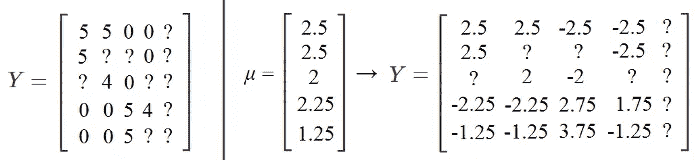**

**将更新后的 *Y* 矩阵视为用于学习θ(*j*)和 *X* ( *i* )的原始 *Y* 矩阵，我们将在预测完成后对它们进行反规格化。我们通过将平均值加回预测的等级来做到这一点，**

**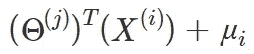**

**Copy-paste: (Θ(j))ᵀ(X(i)) + μ_i**

**这意味着为 Eve 预测的评级仅仅是所有其他用户评级的平均评级，**

**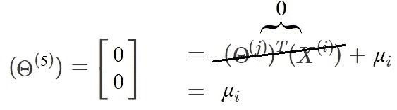**

**因此，预测评级:**

**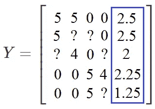**

**这意味着我们只是根据其他用户给出的电影平均星级来推荐 Eve 电影，而不是首先知道她的电影偏好。**

**此外，这也适用于没有分级的电影。在这种情况下，您可能希望标准化分级矩阵的列 *Y* 而不是行，这正是我们为没有对任何电影进行分级的用户所做的— *不过这并不重要，因为没有分级的电影不应该被推荐给任何人*。**

**这都是关于推荐系统的，在课程中已经解释过了。下一次，我们将讨论其他与 ML 相关的话题。**

**到时候见。**

***——这篇文章最初发布在 https://azumiekyu.blogspot.com/* *的* [*上，为了更好地编排格式，请访问该网站。感谢阅读！*](https://azumiekyu.blogspot.com/2021/07/recommender-systems-content-based.html)**