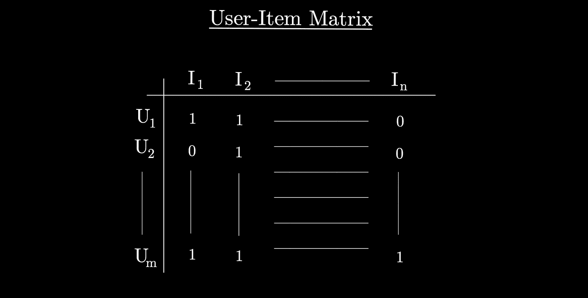
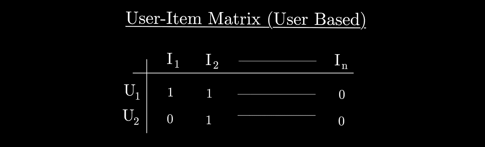
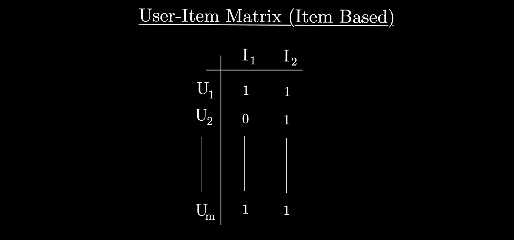
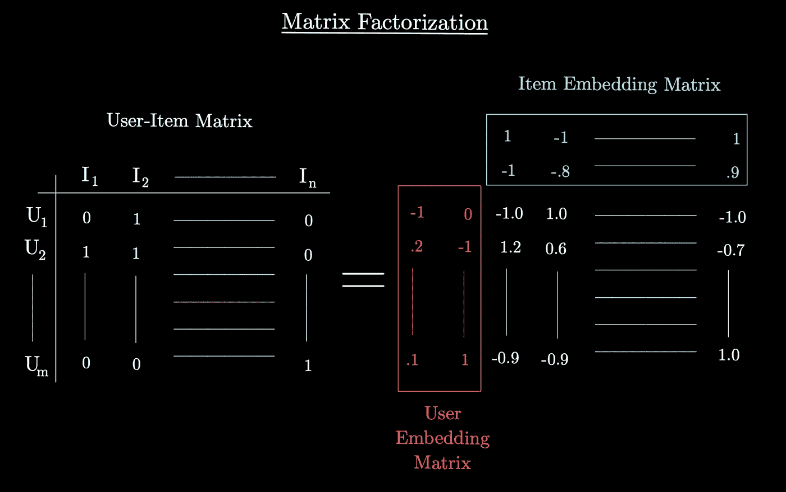
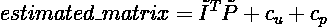
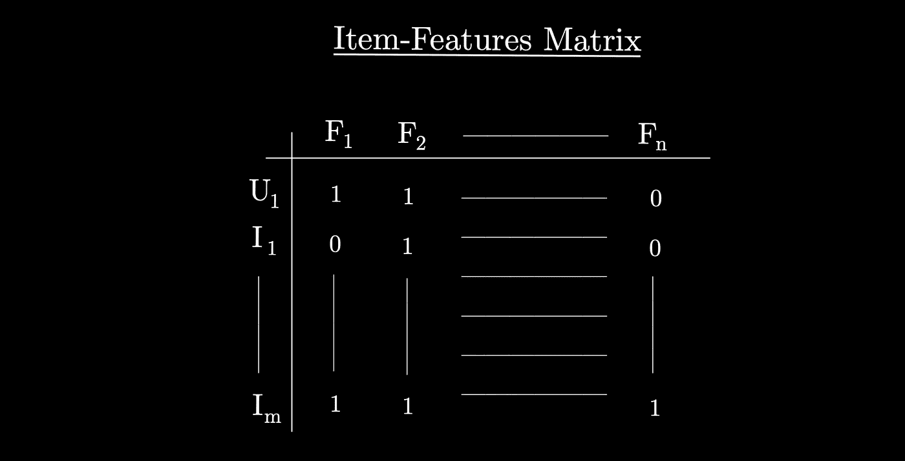
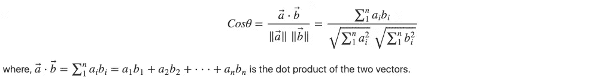

# 推荐系统——无处不在的模型

> 原文：<https://medium.com/mlearning-ai/recommender-systems-the-models-used-everywhere-1f1ed0690658?source=collection_archive---------2----------------------->

这篇文章关注广泛使用的推荐系统，它们背后的不同类型和方法以及它们的发展。

Photo by [Sajad Nori](https://unsplash.com/@sajadnori?utm_source=medium&utm_medium=referral) on [Unsplash](https://unsplash.com?utm_source=medium&utm_medium=referral)

浏览互联网，不遇到推荐系统几乎是不可能的。无论是在 YouTube 这样的视频服务平台上，还是在亚马逊这样的市场上，这些模式到处都在实施，以促进消费，并总是向客户提供新产品或内容。

显然，这是有争议的，因为为了被推荐，你必须被系统知道。因此，实现推荐的服务使用大量数据来构建准确且与用户相关的模型。

让我们来看看建立推荐系统的不同方法…

# 推荐系统如何工作

推荐系统背后的想法是提供一种服务，根据提供给底层模型的一些数据向用户发送任何类型的响应。

正如我之前所说，响应可以是网站上的横幅、电子邮件、推送通知等等。目标是通过对这些推荐感兴趣，给用户一个使用应用程序或网站的理由。

最简单的例子就是你在 Youtube 上观看的视频。然而，这些视频不一定与你正在观看的视频属于同一类型，因为推荐系统可以使用任何数据来提出建议。

事实上，推荐系统背后有两种方法:

*   协同过滤
*   基于内容的过滤

## 什么是协同过滤？

这种方法利用**用户**和物品数据进行学习和预测。它使用所谓的**用户-项目矩阵**，来计算用户/项目之间的相似度。这是用户-项目矩阵的样子:

这个想法是使用这个矩阵来了解用户会如何对一个新元素做出反应，例如一部电影，一个产品或其他东西。

构建协同过滤推荐系统有两种方式，要么基于**基于用户的过滤**，要么基于**基于项目的过滤**。

*   **基于用户的过滤**:寻找相似的用户，利用他们的数据推荐产品。

*   **基于项目的过滤**:寻找相似的项目，利用其他用户的行为进行推荐。

可以实现各种技术来从协同过滤构建系统。比如用 K 近邻和相似度/距离测度(余弦、Jaccard、欧几里德、曼哈顿……)来寻找相似的用户或物品，然后对用户没见过的某个物品进行预测。

然而，它需要大量的计算资源，我们称这些类型的过滤:**基于内存的过滤**。

因此，从协同过滤方法获得预测的另一种方法是:**矩阵分解**。

**矩阵分解**是将用户项矩阵转换成**嵌入**的降维，使得*将* *相乘*得到的嵌入层给出原始用户项矩阵的**估计**。

如您所见，它将矩阵分解到嵌入中(一个用于行，一个用于列)，从而允许将潜在特性计算为估计输出(右侧是新估计矩阵的所有元素)。嵌入的内容被随机初始化，并通过训练如线性回归来发现。

这是带有因子和常数项的估计矩阵的样子:

为了找到每个嵌入 I 和 P 中的值，该过程是通过修改这些值直到它收敛来最小化损失函数。一个经典的损失函数是**替代** **最小** **平方**，它基本上固定两个嵌入中的一个，并优化另一个。

在上面的例子中，用户-商品矩阵中的 0 意味着用户没有购买该产品。因此，使用矩阵分解计算的估计矩阵将根据其他用户的数据判断用户是否会购买该产品。例如，当它被训练为回归时，估计矩阵中的预测是连续的，它们越高，用户就越有可能购买该商品。
为了拥有这种模型，训练必须去除缺失的值，例如 0。在另一种情况下，关于电影的评级评论，缺失值将为空，并且估计矩阵将预测每个用户对每个电影的评级。

使用矩阵分解进行预测只是输入用户和我们选择的项目。

协同过滤遇到的问题:

*   **冷启动**:由于这些类型的系统需要用整个数据集进行训练，新数据(用户或项目)不能用作输入，因为模型不知道它，也不能将其与其他用户/项目数据进行比较。
*   **回音室**:如果系统配置不当，就会出现这种情况，并且会产生一个非常相似的推荐循环。问题是用户没有被引导到能让他高兴的新项目。
*   **先令攻击**:类似于数据中毒，系统被来自用户的数据破坏，这些用户想要提升一个项目或者降低它的受欢迎程度。比如在谷歌上给一家餐厅很多差评，这样就不推荐给任何人了。

## 什么是基于内容的过滤？

与前面的方法不同，这种方法不需要用于推荐系统的许多用户和项目的数据库。事实上，基于内容的过滤关注于 **项目**之间的**相似性** **基于表征它们的****特征**。它不需要关于其他用户的信息，而只需要关于向其推荐的用户的数据。****

**其思想是，系统将用户以前看过的电影或购买的产品的特征与所有其他项目(例如电影或产品)的特征进行交叉，以便找到最相似的项目。**

**一旦特征被表示并被良好排序，通过使用相似性度量来计算显示一个元素如何反映在另一个元素中的值，就可以找到最佳项目。**

****

> ***U1 正在描述用户本身的特征(F1… Fn)(例如，对于一部电影，特征可以是流派，因此它正在告诉系统用户喜欢他已经看过的以前的电影中的什么)。
> I1 正在引用第一个项目的特征(在这种情况下，它不属于流派 F1，但属于 F2)。
> 有了这个矩阵，就可以衡量哪个商品与用户正在寻找的商品相似。***

**我之前列出了一些主要的衡量标准，但最常用的是**余弦相似度**:**

****

**From the great post of machinelearningplus [here](https://www.machinelearningplus.com/nlp/cosine-similarity/).**

**基于内容的过滤也有其局限性:**

*   **基于这种方法，推荐可能过于简单而难以预料。这意味着，在某些特征的基础上推荐一部与另一部相似的电影可以在没有推荐系统的情况下完成，而在另一个与你相似的用户喜欢的东西的基础上完成，可以更具原创性，并推荐惊喜。**
*   **任何新元素及其特征都必须不断地添加到数据库中。因此，过一段时间后，计算复杂度会变得非常高。**

# **深度学习扩展:推荐系统的现在和未来**

**从以前的方法面临的挑战中，机器学习的子领域找到了答案。**

**事实上，与我们以前看到的每次新数据出现在训练数据集中时都必须进行训练不同，所谓的**深度学习扩展**来抵消这一点。我不会全部描述，但其思想是，用户项目矩阵的所有元素都成为神经网络的输入，该神经网络由用户和项目的嵌入层组成，然后是完全连接的层，该层将所有元素汇集到具有线性激活函数的最终输出层中。**

**这种想法是能够像任何其他类似的神经网络一样以流的方式训练模型，从而避免为每个新条目进行矩阵分解所花费的时间。**

**除此之外，**深度学习混合** **模型**随着协同过滤网络和基于内容的过滤网络的收缩而出现，以便获得每种方法的最佳效果。**

**如果您对您周围的大型推荐系统背后的模型感兴趣，您可以查看该领域正在使用的两个最著名的架构:**

*   ****广&深**:2016 年凸显的 Google 革命性架构，[此处](https://arxiv.org/abs/1606.07792)。**
*   ****DLRM**:2019 年脸书创新推荐人制度，[此处](https://ai.facebook.com/blog/dlrm-an-advanced-open-source-deep-learning-recommendation-model/)。**

# **结论**

**推荐系统无处不在，对于任何寻求始终满足消费者口味的服务都很有用。存在两种主要的机器学习方法:协同过滤和基于内容的过滤。第一个使用来自用户的信息来知道如何向另一个推荐任何项目，第二个关注项目本身及其属性。**

**由于每种方法背后的问题，深度学习扩展开始以更复杂但更适合生产启动的方式应用那些方法。在一个独特的系统中混合这两种方法已经成为今天的基础。**

**感谢您阅读这篇文章，我希望您了解了推荐系统的基础知识和当今的技术水平。**

## ****资源****

** [## 算法专家|赢得编码面试

### 准备编码面试的领先平台。掌握基本的算法和数据结构，并土地你的…

www.algoexpert.io](https://www.algoexpert.io)  [## 矩阵分解|机器学习|谷歌开发者

### 矩阵分解是一个简单的嵌入模型。给定反馈矩阵 a \(\在 r^{m \乘以 n}\)，其中\(m\)是…

developers.google.com](https://developers.google.com/machine-learning/recommendation/collaborative/matrix)  [## 基于深度学习的推荐系统

### 推荐系统是无限沸腾的电子商务海洋中的救生员，改善客户体验…

medium.com](/sciforce/deep-learning-based-recommender-systems-b61a5ddd5456)  [## 基于深度学习的推荐系统:综述与展望

### 随着网上信息量的不断增长，推荐系统已经成为克服这一问题的有效策略

arxiv.org](https://arxiv.org/abs/1707.07435)  [## Mlearning.ai 提交建议

### 如何成为 Mlearning.ai 上的作家

medium.com](/mlearning-ai/mlearning-ai-submission-suggestions-b51e2b130bfb)**