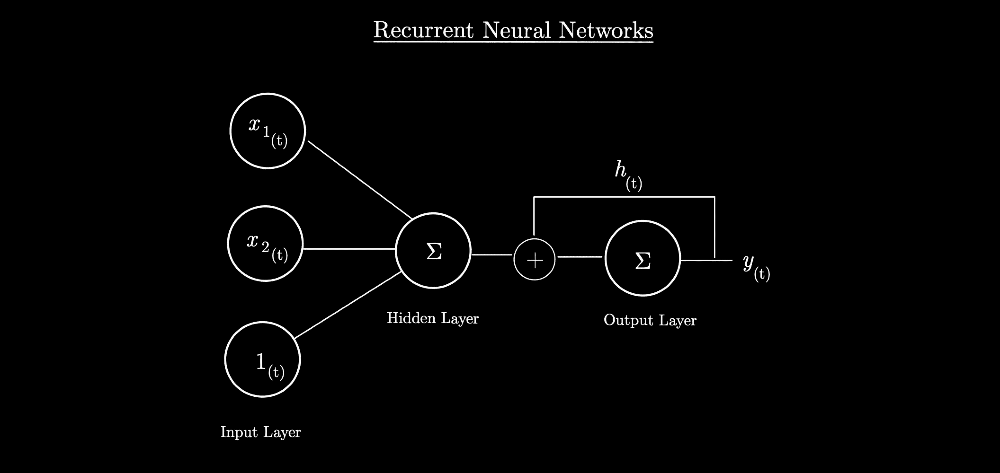

# 递归神经网络——学习而不遗忘

> 原文：<https://medium.com/mlearning-ai/recurrent-neural-networks-learn-without-forgetting-598ba9daafe3?source=collection_archive---------6----------------------->

这篇文章是对什么是**递归神经网络**以及它们如何工作的一般介绍。这是神经网络最重要的架构之一，因为它们背后的直觉。

Photo by Xingye Jiang on Unsplash

**自然语言处理**任务和**时间序列**预测由序列数据组成。这意味着将数据集作为一个整体并不能清楚地表示数据中的信息。这是因为数据点可能依赖于其他数据点。

就拿两句话来说: ***它不好*** 和 ***它真的很棒*** 。一台未经训练的机器不会区分**不是**和**好**，并且会因为两个句子之间的相似性而认为两者都是肯定或否定的。为了避免这一点，通过句子中的连续步骤进行学习将允许模型识别与积极和消极意义相关联的内容。例如，两个单词的步骤将使模型基于包含这些对的其他句子理解**不好**是否定的而**非常好**是肯定的。

这就解释了 RNNs 对于**自动翻译**、**自动** **语音** **识别** **系统**、**时间** **系列**等等的使用。这并不意味着它们是用于这些任务的唯一架构，传统的密集网络和卷积神经网络也可以很好地执行。

# 什么是递归神经网络

一个 **RNN** 可以被视为一个非循环神经网络(输入层→输出层)，但是在网络中有一个或多个反向连接。这是一个单神经元 RNN 的例子，它在每个时间步接受输入: *x* 和它自己的输出 *y* :

一层递归神经元使用与每个神经元相同的原理，经典输入 *x* 和前一时间的输出 *y_{t-1}* (作为向量)。权重与输入 *x* *(w_x)* 和之前的输出 *w_y* 相关联。

这是 RNN 方程的样子:

*ϕ* 是激活函数 *ReLu* 和 *b* ，常数项。

**什么是记忆细胞？**

**存储单元**与 RNN 中保存一个或多个过去时间步的部分相关联。就简单的 RNN 来说，记忆是相当短暂的。因此，我们可以说**隐藏状态**是先前时间状态和输入的函数。在处理更复杂的 RNN 体系结构时，这种隐藏状态可能不同于单元本身的输出。

**RNN 是怎样训练出来的？**

像经典的神经网络一样，训练方法包括优化网络中包含的权重，使得预测误差最小化。这可以通过*反向传播*实现，但在 RNNs 的情况下，这种反向传播略有不同，因为它是通过时间实现的:**通过时间的反向传播**。

这种反向传播的修改版本对应于从网络的若干次获得的梯度来优化模型的参数(权重)。*例如，如果成本函数使用模型的最后 3 个输出(最后 3 次)，该方法将考虑最后 3 次的梯度以改变模型参数。*

以下是根据 Keras/Tensorflow 库创建的 RNN 的外观:

一个深邃的 RNN 看起来是这样的建筑:

当想法是获得一系列的几个预测值时，例如根据以前的销售额(时间序列)预测某个产品几天的销售额，RNN 就改变了它的逻辑。
事实上，我们可以用不同的方式来回答这个问题:

*   使用训练好的模型来预测单个值，然后循环将预测值添加到输入值中，以便预测下一次。
*   训练一个新模型，它不会预测单个值，而是在输出层预测一系列的几个值。
*   训练一个新模型，该模型将预测每个递归层的一系列值，从而优化每个步骤的参数，因为预测将在每个时间步骤进行。
    *例如，如果我们想要预测 10 个值，则只需获取 20 个已知输入值，并要求模型每次预测 10 个输入值，输入值为 1 至 10，而输出值预测值为 2 至 11，依此类推。知道输入 2 至 11 的实际值是已知的，就可以进行优化。以这种方式，在每个时间步长改进权重，以最终允许预测最初未知的值 21 至 30。*

# 更复杂的 RNN 建筑

rnn 变得更加复杂有两个原因:

*   **梯度消失**:训练中重量不再变化的点，导致训练停止。
*   **RNN 长期记忆的丧失**:在一定时间后，在参数的优化中，关于 RNN 的第一个条目的信息几乎不再存在。

这种复杂化可以用超参数(辍学、学习率、激活函数……)来处理，但也可以通过添加长记忆细胞来处理: **LSTM** 等 **GRU** 。

## 长短期记忆(LSTM)

LSTM 像元是为替换简单像元而创建的像元，以保持输入数据的长期相关性。

这些细胞以不同的方式分解:我们区分两种状态，短期和长期，其中有不同的层，各有用处。这个想法是，对于每个时间步:

*   **长期状态**可用于添加先前列出的信息，或者相反，用于删除它。
*   **短状态**执行与经典 RNN 相同的工作，但是根据不同层的结果具有或多或少的信息。

这些层在网络中处于不同的级别，但是它们都具有隐藏状态和作为输入的 *x* 输入:

*   **主层**对应于具有正常存储单元的单个 RNN 层。后者的输出将被与其相邻的不同层增强。
*   **遗忘层**考虑输入，以决定(根据逻辑成本函数)在时间 *t* 时输出不需要什么(通过删除长期状态中的信息)。
*   **输入层**定义了在长期状态下主层应保留的内容(根据逻辑函数)。
*   **couche de sortie** 从输出的长期状态和新的短期状态中选择应该使用的内容(根据逻辑函数)。除了主层之外，所有层都是完全连接的层，并且与门相关联，以将它们的结果与通过的信息相乘，从而应用它们的选择。

## 门控循环单元(GRU)

GRU 细胞是 LSTM 细胞的简化细胞，因为它们没有一个长期状态，并在一个层/门里聚集了遗忘和输入的想法，包括在 LSTM 一边。

以下是从 Keras/Tensorflow 库中创建的具有 LSTM 或 GRU 像元的 RNN 的外观:

# 结论

rnn 是具有记忆的神经网络，与完全连接的网络相比，它允许权重优化对数据有更好的理解。
LSTM 和 GRU 是改进的 rnn，说明了长期记忆，更能抵抗梯度消失。

感谢你阅读这篇文章，我希望你喜欢它，现在能够实施 RNN！如果你对数据科学和机器学习感兴趣，可以在这里查看我的其他文章。

## 资源

 [## 使用 Scikit-Learn、Keras 和 TensorFlow 进行机器实践学习，第二版

### 通过最近的一系列突破，深度学习推动了整个机器学习领域。现在，甚至…

www.oreilly.com](https://www.oreilly.com/library/view/hands-on-machine-learning/9781492032632/)  [## 张量流

### 一个面向所有人的端到端开源机器学习平台。探索 TensorFlow 灵活的工具生态系统…

www.tensorflow.org](https://www.tensorflow.org/)  [## Mlearning.ai 提交建议

### 如何成为 Mlearning.ai 上的作家

medium.com](/mlearning-ai/mlearning-ai-submission-suggestions-b51e2b130bfb)