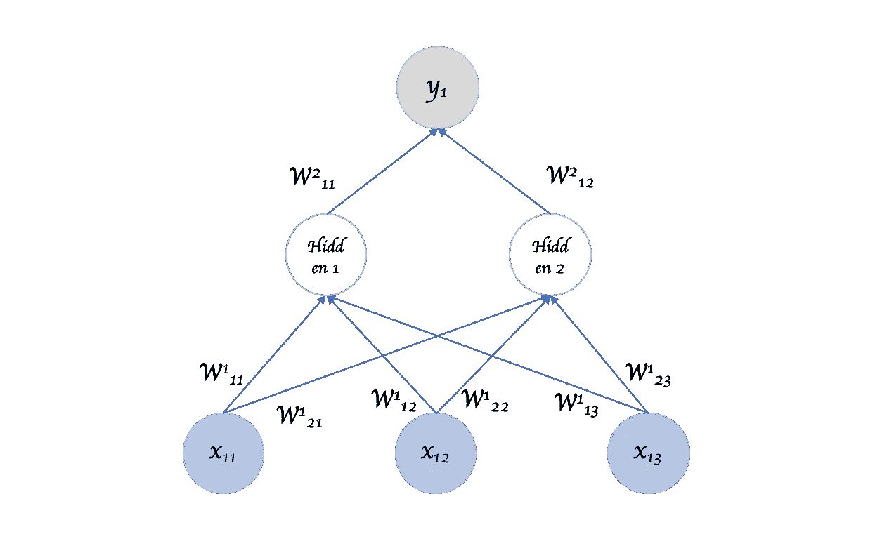

# 文本生成中的递归神经网络

> 原文：<https://medium.com/mlearning-ai/recurrent-neural-networks-rnns-in-text-generation-b3497c1442a0?source=collection_archive---------6----------------------->

Photo by [Guillaume de Germain](https://unsplash.com/@guillaumedegermain?utm_source=medium&utm_medium=referral) on [Unsplash](https://unsplash.com?utm_source=medium&utm_medium=referral)

# 介绍

递归神经网络是一类人工神经网络(ann ),其中节点之间的连接沿着时间序列形成有向或无向图。典型地，网络被应用于输入信号，该输入信号的输入在被添加到网络之前被编码，然后被应用于输出信号。这具有以下主要优点:网络被配置为以高速(开销或低速)运行，网络不太慢，网络在其设计和构造上是灵活且灵活的，网络可以是高效的(次数不限并且具有足够的存储器)，并且网络是可扩展的并且可以切换到网络的下一阶段。存在各种类型的混合神经网络——本发明不限于此，而是更加具体，并且能够以比其用途更高的速度运行。

Recurrent neural network architecture. Source: ibm.com

混合神经网络是完全连接的自包含神经网络，其由在一组公共控制信号下互连的神经元组成。这类混合神经网络分为两种主要类型:全连接、自含式神经网络全连接、自含式神经网络由在一组公共控制信号下互连的神经元组成。全连接、自包含的网络由以主动或被动方式连接的神经元组成，并且在一组公共输入和输出下互连。众所周知，全连接神经网络和主动神经网络之间存在一些差异。通过设计，全连接神经网络的每个细胞都具有许多突触连接，这些突触连接取决于各种独立的参数，例如网络架构、输入神经元的数量和输入强度。在全连接神经网络中，突触连接由网络拓扑本身来指导，并由神经元之间的连接形成的一组突触来表示。

与 RNNs 相比，普通神经网络有一个缺点，它们不能解决需要记住关于过去输入的信息的机器学习问题。当处理顺序数据时，关键是我们要记住数据中的关系，而普通的 CNN 不擅长长度可变的输入和输出。因此，我们使用 RNNs 来完成文本生成的任务。

文本生成通常是数据扩充任务的目标。涉及文本生成的任务通常要求用户使用文本表示中的文本图像来表示文本。然而，用户经常发现他们想要表示的文本少于他们想要表示的文本。因此，他们可能希望以文本表示显示文本，而不显示任何可见文本。

这些任务试图使用文本图像和文本表示来表示文本表示中的文本。当用户使用图像或文本表示创建文本时，他们必须在文本表示中指定他们的图像和文本。这种任务被称为基于图像的文本生成( *IEG* )。在处理之后，它们在文本表示任务中被迭代地重新评估。

# 基于图像的文本生成任务

基于图像的文本生成任务通常涉及用户通过文本生成器创建文本，其中他们将表示文本的数字分配给图像和表示文本图像的文本。当文本生成器生成文本图像时，所生成的图像随后被转换成文本表示。在基于图像的文本生成任务中，文本表示由文本生成器创建，基于图像的文本生成( *IBG* )，它计算文本的输出图像以生成一组文本。大多数基于文本的文本生成任务能够通过 *IEG* 生成输出图像。对于文本生成，在 *IEG* 任务中的用户需要一些方法来计算文本表示，然而这通常是不可能的。一个原因是文本表示需要一些计算资源，包括时间和存储器，因此不能简单地使用通过图像生成的图像来计算表示。

 [## Mlearning.ai 提交建议

### 如何成为 Mlearning.ai 上的作家

medium.com](/mlearning-ai/mlearning-ai-submission-suggestions-b51e2b130bfb)