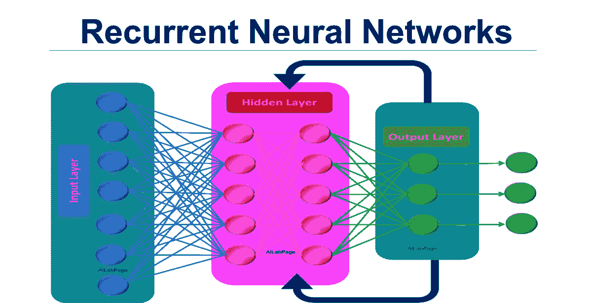
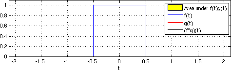
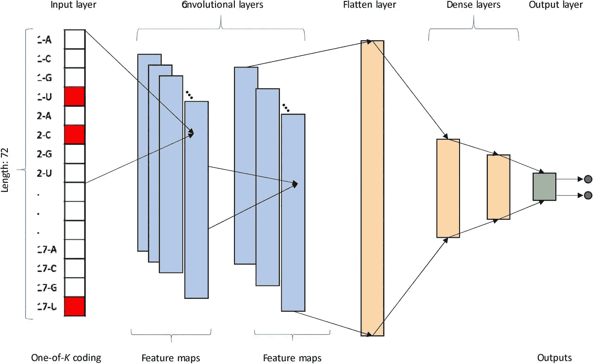

# 递归神经网络与 1D 卷积网络

> 原文：<https://medium.com/mlearning-ai/recurrent-neural-networks-vs-1d-convolutional-networks-5ac7b4f68ca9?source=collection_archive---------4----------------------->

找出哪种架构更适合您的项目。

# 1.了解架构

在信号处理的应用领域，有两种主要架构可以解决这一问题。

**1.1。递归神经网络**

这类问题最常见的架构之一是递归神经网络。

Fig1.1\. A simple RNN architecure

这些类型的网络依赖于一个简单的原理，将一层的输出反馈给它自己，从而在网络的不同层之间创建一个反馈回路。处理顺序数据时，信息出现的顺序很重要，通过将以前的输入反馈到当前层，网络可以记录输入信号，并可以找到输入的不同部分之间的模式。更高级的模型遵循这种类型的架构，如 LSTMs 和 GRUs。

**1.2。1D 卷积网络**

该领域中使用的另一种主要架构是一维卷积神经网络。在谈论它的工作原理之前，我们应该先描述一下它的核心——卷积运算。

与互相关相反，两个信号的卷积是一种数学运算。它在工程领域有着广泛的用途，从设计滤波器、控制动力系统和处理图像，到深度学习等新领域。

Fig1.2-Convolution of two signals

你可能对普通的卷积神经网络很熟悉，这些网络用于包含图像的数据集中。原理是一样的，图像只是二维信号。使用这种架构，网络学习卷积层(充当滤波器)的最佳权重，以便从信号中提取重要成分。例如，如果您试图检测一个有故障的电机，通过测量它的旋转作为输入电压的函数，您可以提取主频率，如果电机不在正常状态，主频率会有所不同。1D 卷积网络自动选择最佳特征从信号中进行提取。就像它的 2D 对等物一样，你可以使用复杂的模型，比如 InceptionTime 的对等物 InceptionNet。

Fig 1.2.2 A 1D Conv Net

# 2.使用哪种架构？

问题仍然是，哪种架构最适合您的项目。

如果谈论性能和易于训练，那么答案很简单，1D 卷积网络是更好的选择。不幸的是，问题要复杂得多。对任何数据集使用 1D 卷积网络都不是最佳选择。非常了解您的数据集是选择最佳架构的关键。

RNN 是基于序列到序列的数据处理，信号的长度是没有意义的，它只是一次处理一个点，反馈以前的预测。对于信号长度可变的数据集来说，RNN 架构是一个不错的选择。这种数据集可以在像人类语音识别和文本分析这样的应用中找到。

像它的成像同行一样，1D CNN 严重依赖数据集的维度，为了从这些网络中实现最佳性能，您必须使用信号长度固定的数据集。这种数据集可以在诸如预测维护和动态系统分类的应用中找到。

感谢您的时间，如果您对机器学习领域感兴趣并正在寻找项目想法，请随时关注我，因为我将很快发布新内容。

 [## Mlearning.ai 提交建议

### 如何成为 Mlearning.ai 上的作家

medium.com](/mlearning-ai/mlearning-ai-submission-suggestions-b51e2b130bfb)