# 寻找图像中所有直线的顺序 RANSAC 方法

> 原文：<https://medium.com/mlearning-ai/recursive-ransac-approach-to-find-all-straight-lines-in-an-image-b5c510a0224a?source=collection_archive---------0----------------------->

# 概观

在本文中，我介绍了一种利用 RANSAC 算法检测图像中多条线的方法。RANAC 是一种鲁棒的线检测算法，它使用点的子集迭代地创建线模型。评估所有模型的内点总数。内侧定义为距离直线在指定阈值距离内的点。评估模型的拟合程度。RANSAC 算法的教科书实现产生单行(如果存在的话)。这是异常值最大的线。在本文中，我们探索了如何通过在同一幅图像上重复运行传统的 RANSAC 算法来找到多条直线。

# 示例—无噪声

左边是无噪声图像，右边是使用递归 RANSAC 方法检测到的线条

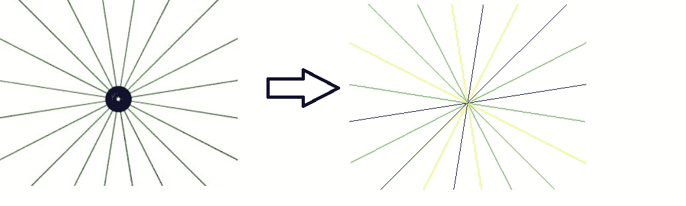

# 示例—带有椒盐噪声

左侧是带有一些椒盐噪声的相同图像，右侧是使用递归 RANSAC 方法检测到的线条

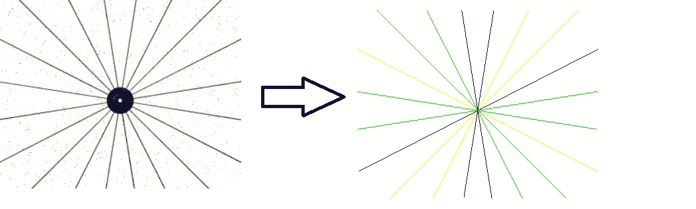

# 示例—有 2 行噪声的图像

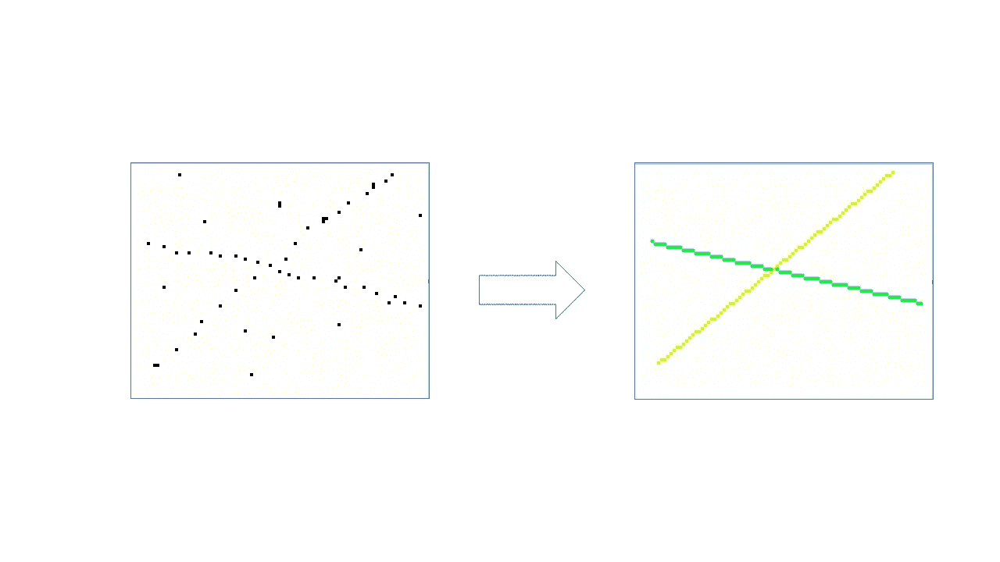

# 示例—有 3 条线的噪声图像

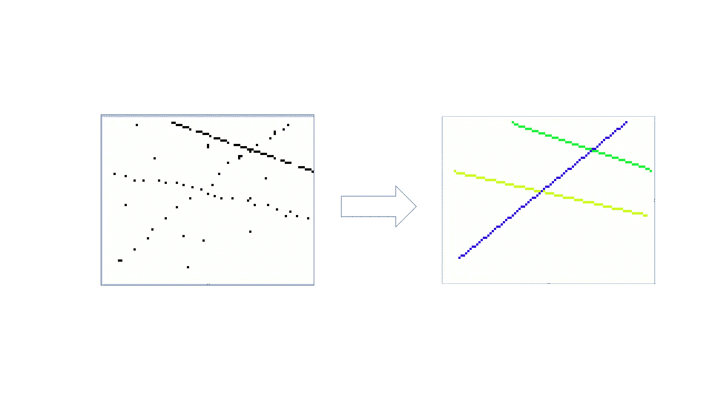

# RANSAC 概述

这不是对 RANSAC 算法的详细解释。

# 考虑下面的数据点

我们混合了内点(黑色)和外点(红色)。我们想找到符合内嵌的直线模型

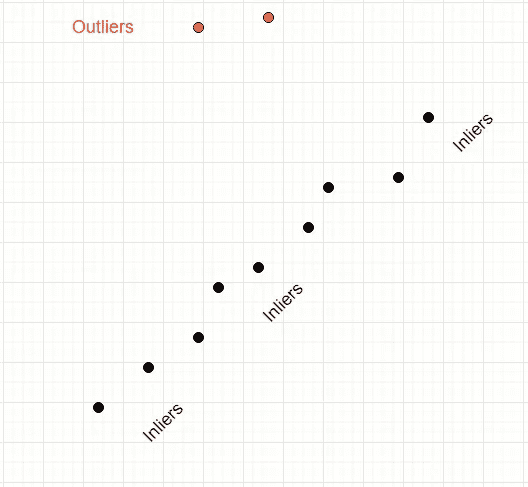

# RANSAC 算法有什么帮助？

RANSAC 是一种简单的基于投票的算法，它迭代地对点群进行采样，并找到那些看起来符合模型的线的子集。在这种情况下，模型是一条直线。

# 递归运行 RANSAC 它是如何工作的？

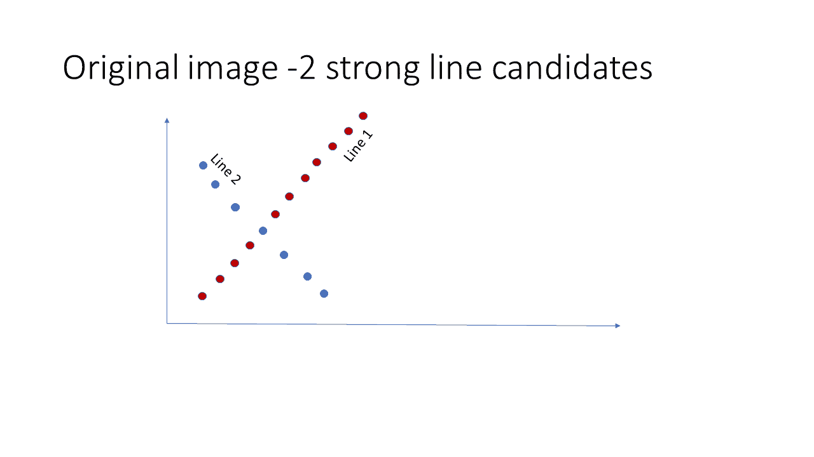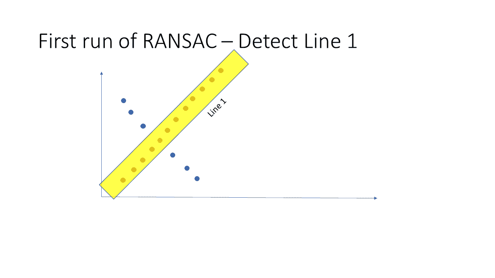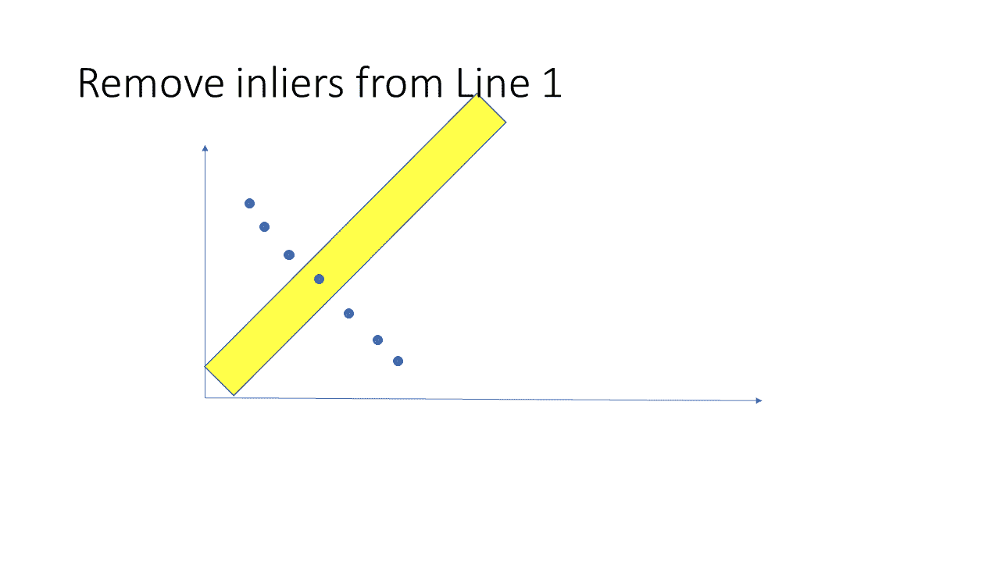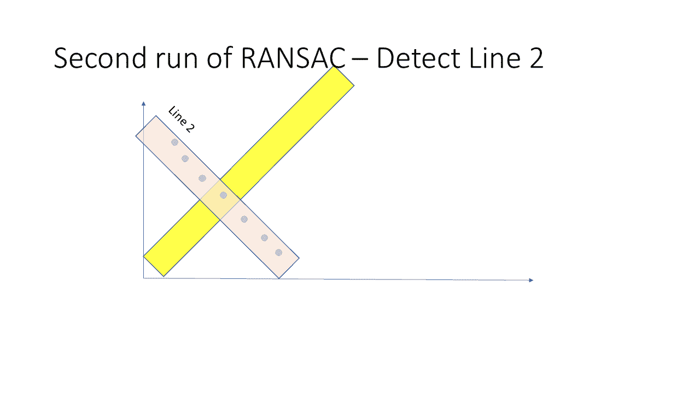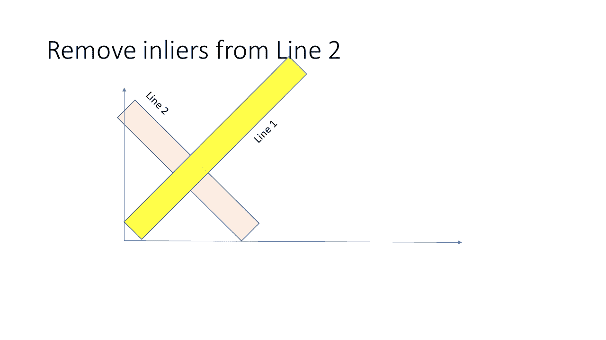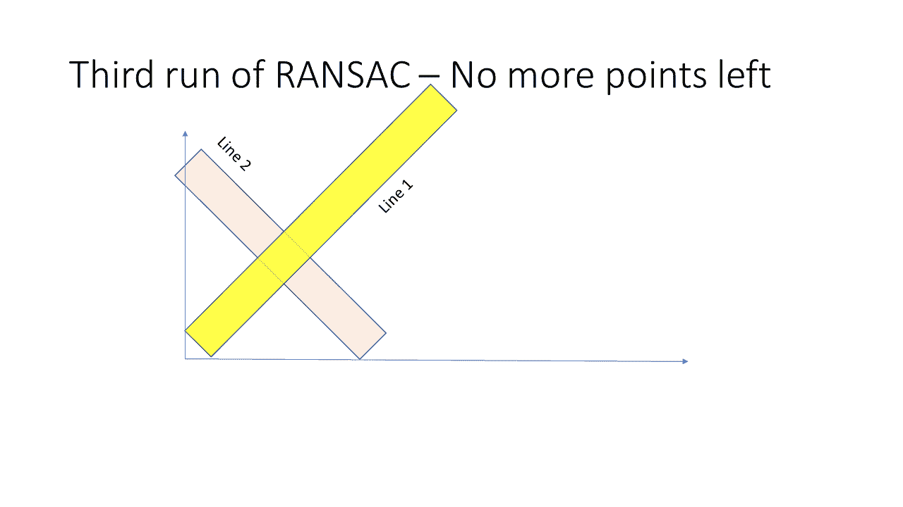

# 伴随代码

我已经包装了 Scikit Learn 的 RANSAC 实现。作为一个停止标准，当不再有内联者或者当 RANSAC 生成一个内联者计数低于某个阈值的行时，我将停止对其他行的迭代。该阈值是一个可配置的参数。将此阈值视为消除不需要的线条的一种方法。

*   链接到 python 代码的是[这里的](https://sdg002.github.io/recursive-ransac/src.zip)
*   用于开发代码的示例图像与 Python 代码捆绑在一起

# 结论和警告

在我的方法中，我在每次迭代后都消除了内嵌点。这可能会影响下一条线的发现。考虑这样一种情况，当两条直线的相交区域非常拥挤，并且您发现了直线 1，导致可能成为第二条直线的潜在内点的点被移除

递归 RANSAC 方法的总体成功取决于停止准则。我已经用内球数作为停止的信号。但这可能不是最佳选择。另一个选择可以是内层计数与线段长度的比值。非常低的值表示发现的线太稀疏，没有任何实用价值。

你认为这种方法怎么样？你知道有其他选择吗？我不确定以前是否尝试过。无论哪种方式，我都希望收到您的来信，并尽可能做出改进。