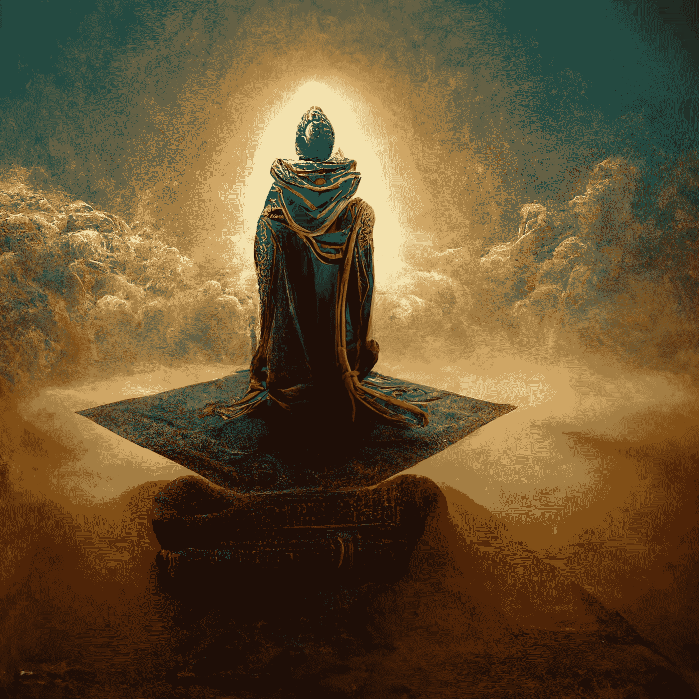

# 关于人工智能渲染艺术的深层含义

> 原文：<https://medium.com/mlearning-ai/regarding-the-deeper-implications-of-ai-rendered-art-4a857d2d4b49?source=collection_archive---------3----------------------->

## 从作家的角度思考

AI generated image created using [Midjourney](https://www.midjourney.com/app/). © 2022 Obsidian Eagle

众所周知，人工智能正在彻底改变各个领域和行业，从商业自动化到 T2 医学，是的，甚至是艺术。后者导致了最近相当多的关于图形艺术家和画家被淘汰或失业的讨论…