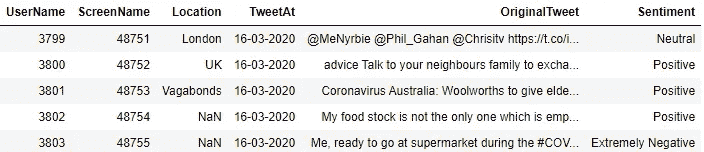
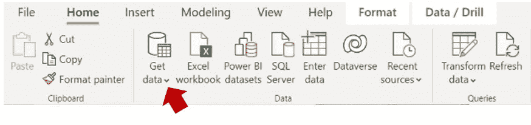
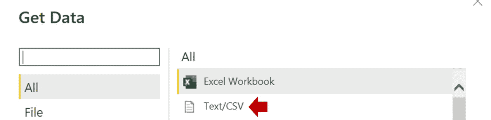
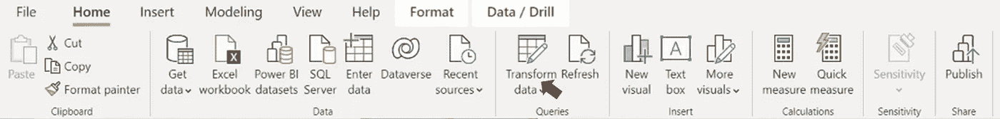
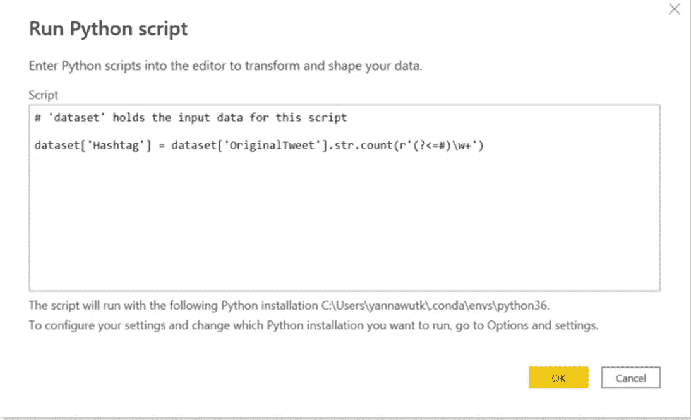
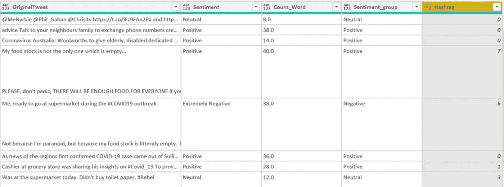

# PowerBI 中的 RegEx

> 原文：<https://medium.com/mlearning-ai/regex-in-powerbi-e5b77ed8b976?source=collection_archive---------0----------------------->


R egEx 或正则表达式是文本分析的重要工具之一。然而，在 Power BI 中，使用现有的 Power BI 工具实现 RegEx 并不容易。

在本文中，我将描述一种借助 Python 在 Power BI 中实现 RegEx 的方法！

# 什么是 RegEx？

正则表达式是用于匹配文本中指定模式以提取子字符串的特殊字符。

在数据分析中，RegEx 通常用于从长文本中找到一些关键词，或者检查文本是否与所需的模式匹配。

# 要求

在我们开始之前，确保您已经在 Power BI 中安装了 Python 和设置。

您可以在以下链接中了解如何操作。

[](/mlearning-ai/python-in-power-bi-66a80590ecc0) [## 权力商业智能中的蟒蛇

### 通过集成 Python，增强 Power BI 仪表板的功能。逐步使用 Python 来获取、转换和…

medium.com](/mlearning-ai/python-in-power-bi-66a80590ecc0) 

# 步骤总结

1.  检索数据
2.  转换数据
3.  使用正则表达式运行 Python 脚本

> 在这个例子中，我想计算推特文本中的标签数量(#)。

# 第 1 步:获取数据

本文中使用的数据来自

 [## 卡格尔:您的数据科学之家

### Kaggle 是世界上最大的数据科学社区，拥有强大的工具和资源来帮助您实现数据…

www.kaggle.com](https://www.kaggle.com/datasets/datatattle/covid-19-nlp-text-classification/download) 

这些数据是在疫情期间从推特上收集的，将情绪分为非常积极、积极、中立、消极和非常消极。

此数据集包含 41157 行和 5 列。



Data sample

*   下载数据集并解压缩文件，你会发现 2。csv 文件。
*   打开 Power BI，然后单击获取数据



*   从文本/CSV 文件中获取数据



*   选择下载的文件并加载

# 第 2 步:转换数据

我将添加一个新的 Hashtag 列，即在 Twitter 文本中找到的 Hashtag 数。

1.单击转换数据



2.选择查询“Corona_NLP_train”


现在，您已经准备好添加新列了。

# 第 3 步:用正则表达式运行 Python 脚本 3

在这一步，我将运行一个执行正则表达式的 Python 脚本。

1.  在“转换”选项卡下，单击“运行 Python 脚本”。


2.您将看到一个新的运行 Python 脚本窗口。在此处编写代码，然后单击“确定”。

```
dataset['Hashtag'] = dataset['OriginalTweet'].str.count(r'(?<=#)\w+')
```



**代码说明**

*   数据将是一个“数据集”数据框架，所以你可以用熊猫函数来操作它。
*   创建一个新的数据框架列，Hashtag。该列的值来自 RegEx 结果。
*   计算推特文本中符合**的字符串出现次数(？≤#)\w+** 模式。

3.运行 Python 脚本后，结果将是一个表。单击以展开表格。确保未选中“使用原始列名作为前缀”。


4.您将看到数据转换的结果，这些步骤以 APPLIED STEPS 的形式添加。



就这样了。！

# 结论

您可以使用运行 Python 脚本在 Power BI 中创建一个包含正则表达式的新列。起初听起来可能很难，但当一切都准备好了，你可以在短时间内完成。使用这个 RegEx 可以可视化和分析更多维度的文本数据。

希望你喜欢阅读这篇文章。如果你想看更多这样的文章，请关注我。

[](/mlearning-ai/mlearning-ai-submission-suggestions-b51e2b130bfb) [## Mlearning.ai 提交建议

### 如何成为 Mlearning.ai 上的作家

medium.com](/mlearning-ai/mlearning-ai-submission-suggestions-b51e2b130bfb)