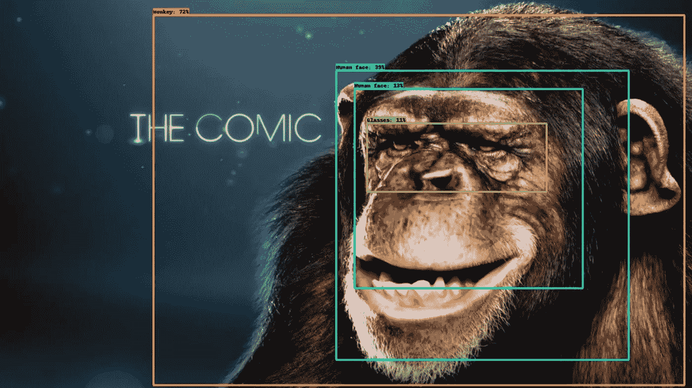

# 区域提议网络(RPN)和 RoI 合并:从图像分类到目标检测

> 原文：<https://medium.com/mlearning-ai/region-proposal-network-rpn-roi-pooling-from-image-classification-to-object-detection-35f98bee0ddd?source=collection_archive---------1----------------------->

## 我曾经想知道从图像分类到物体检测有什么不同。

source:Author

在我之前作为人工智能研究实习生的实习中，我的主要职责主要涉及计算机视觉任务，特别是图像分类任务。图像…