# 使用 Python 从头开始构建回归树

> 原文：<https://medium.com/mlearning-ai/regression-tree-from-scratch-using-python-a74dba2bba5f?source=collection_archive---------2----------------------->

在这个故事中，我深入到回归树的主题及其基本的数学背景。我将尽可能简单地解释它，并从头开始使用 python 创建一个工作模型。

我将使用递归来创建树节点，所以如果你不熟悉的话，我建议你在网上看一些例子和解释(尽管我还是会简单解释一下它的逻辑)。

*进口*

```
import pandas as pd
import numpy as np
import matplotlib.pyplot as plt
```

## 创建数据

从创建一个数字数据开始，该数据将有一个自变量(x)和一个因变量(y)。使用 numpy，我将向依赖值添加一个高斯噪声，数学上可以表示为

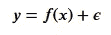

其中 *𝜖* 是噪音。

使用 numpy 创建一个数据，我们可以计算因变量和添加噪声一步如下。

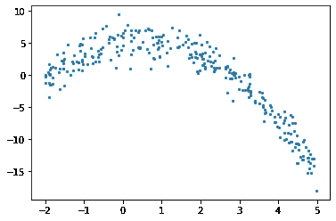

# 回归树

## 树形结构

在回归树中，我们通过创建多个节点的树来预测数值数据，其中每个训练点都在一个节点中结束。下图显示了回归树的树结构示例，其中每个节点都有用于划分数据的阈值。

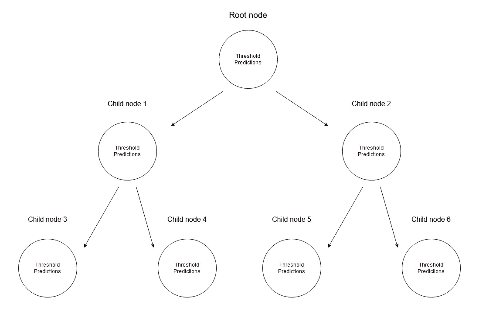

Every node stores its threshold and predictions

给定一组数据，输入值将到达叶子。到达节点 m 的 X 的所有输入值可以用 X 的子集来表示。数学上，让我们用一个函数来表示这种情况，如果给定的输入值到达节点 m，该函数给出 1，否则给出 0。

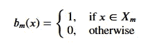

## 寻找分割数据的阈值

我们首先通过在每一步选取 2 个连续点来迭代经过排序的训练数据，并计算它们的平均值。我们计算的平均值是将数据一分为二的阈值。

让我们随机取一个阈值来考虑任何给定的情况。

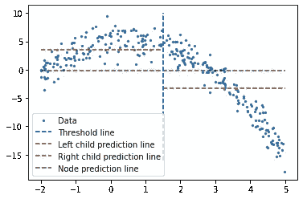

A random threshold value, with its and children node’s predictions

蓝色垂直线代表单个阈值，我们假设它是任何给定两点的平均值。稍后将使用它来划分数据。

我们对该问题的第一个预测是所有训练数据(绿色水平线)的平均值(y 轴)。2 条红线是对将要创建的子节点的预测。

虽然很明显，这些平均值都不能很好地代表我们的数据，但它显示了差异；主节点预测(绿线)获得所有训练数据的平均值，但我们将其分为 2 个子节点，这 2 个子节点有自己的预测(红线)，与绿线相比，这 2 个子节点更好地表示了其相应的训练数据。我们将不断地将数据分成 2 份，从每个节点创建 2 个子节点，直到达到给定的停止值，这是一个节点可以拥有的最小数据量。这被称为*预修剪*树，它提前停止树的构建过程。

**记住**:如果我们继续分割直到我们达到一个单一值，它将创建一个过度拟合的场景，对于每个训练数据，它的预测将是它自己。

**剧透预警:**模型完成后，不会使用根或任何中间节点预测任何值；它将使用回归树的叶子(将是树的最后节点)进行预测。

为了获得最能代表给定阈值数据的阈值，我们使用*残差平方和*。它在数学上可以定义为


Sum of squared residuals

让我们看看这一步是如何操作的。

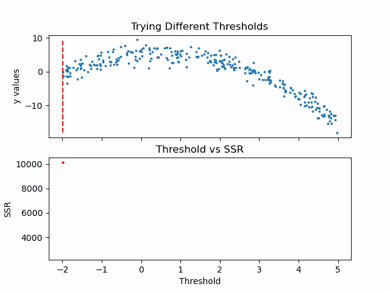

Animation code available below in appendix

既然我们已经计算了阈值的 SSR 值，我们可以采用具有最小 SSR 值的阈值。该阈值将用于将训练数据分成两部分——低部分和高部分，其中低部分将用于创建*左*子节点，高部分将有助于创建*右*子节点。

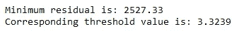

在进入下一步之前，我将使用 pandas 创建一个数据框架，并创建一个寻找最佳阈值的方法。所有这些步骤都可以在没有熊猫的情况下完成，使用它只是个人的选择。

## 创建子节点

既然我们已经将数据一分为二，我们可以为低值和高值找到单独的阈值。尽管我们需要一个停止条件。因为对于每个节点，属于一个节点的数据集中的点变得更小，所以我们为每个节点定义最小数量的数据点。如果我们不这样做，每个节点将只使用 1 个训练值进行预测，导致过度拟合。

我们可以递归地创建节点。为此，我们定义了一个名为 TreeNode 的类，它将存储节点应该存储的每个值。之后，我们首先创建根，同时计算它的阈值和预测值。然后我们递归地创建它的子节点，其中每个子节点类都存储为其父类的属性，或者命名为 *left* 或者 *right* 。

在 create_nodes 方法中，我们首先将给定的数据帧分成两部分；低和高，使用该节点的阈值。然后，我们检查是否有足够的数据点来使用相应的数据帧在单独的 if 条件下创建左右节点。如果有足够的数据点，我们计算它的数据帧的阈值，用它创建一个子节点，并使用这个新节点作为我们的树再次调用 create_nodes 方法。

注意，这个方法在提供给它的第一棵树上进行修改，所以它不需要返回任何东西。

还要注意，虽然递归函数通常不是这样编写的(no *return* )，但我们并不要求 *return* ，因为当 no *if* 语句被激活时，方法将返回自身。

我们现在可以检查这个树结构，看看它是否创建了一些节点来更好地适应数据。我将手动选择前 2 个节点及其对根阈值的预测。

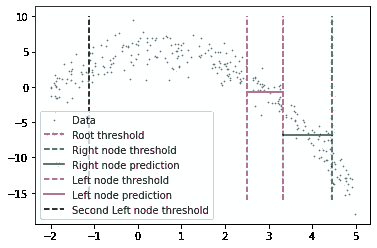

我们在这里看到两个预测:

*   第一个左侧节点对高值(高于其阈值)的预测
*   第一个右侧节点对低值(低于其阈值)的预测

我已经手动削减了预测线的宽度，这是因为如果给定的 x 值到达这些节点中的任何一个，它将由属于该节点的所有 x 值的平均值来表示，这也意味着没有其他 x 值参与该节点的预测(希望这有意义)。

当然，这种树形结构比两个节点要深得多。事实上，我们可以通过如下调用它的子节点来检查一个特定的叶子。

```
tree.left.right.left.left
```

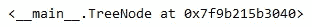

这当然意味着这里有一个向下 4 个孩子长的分支，但它可以在树的不同分支上更深。

## 预测

我们可以创建一个预测方法来预测任何给定值。

我们在这里做的是通过比较每一片叶子的阈值和我们的输入来沿着树往下走。如果输入大于阈值，我们就转到右边的叶子，如果输入小于阈值，我们就转到左边，依此类推，直到我们到达任何一个*底部*叶子。最后，我们使用该节点自己的预测值进行预测，并最终与其阈值进行比较。

用 x = 3 进行测试(实际值可以使用我们上面写的函数来计算，同时创建我们的数据。-3**2+3+5 = -1，这是期望值)，我们得到:

```
predict(3)
```

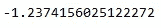

## 计算误差

我们可以用相对平方误差

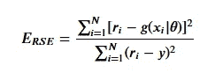

Relative squared error

并使用相同的函数创建如上的验证数据。

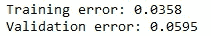

这可以说是一个小错误。

## 概括步骤

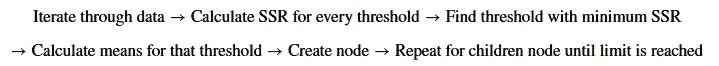

# 附录

1.  更适合回归树模型的数据

我选择的数据是一个多项式，它可以更好地拟合使用多项式回归模型。虽然我们可以很容易地看到一个数据集，其中回归树模型比标准回归效果好得多。让我把我们的新功能看作

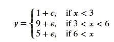

实施和可视化:

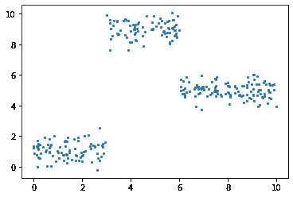

我对这个数据集运行了上面所有相同的过程，得到的错误值为

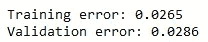

比我们从多项式数据中得到的误差要低。

2.动画情节的代码

[](/mlearning-ai/mlearning-ai-submission-suggestions-b51e2b130bfb) [## Mlearning.ai 提交建议

### 如何成为 Mlearning.ai 上的作家

medium.com](/mlearning-ai/mlearning-ai-submission-suggestions-b51e2b130bfb)