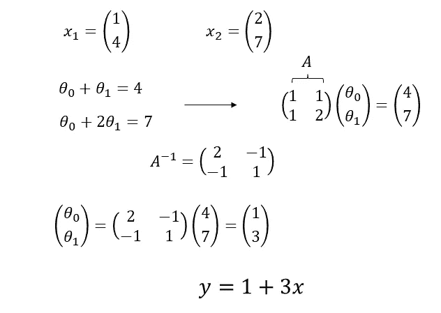
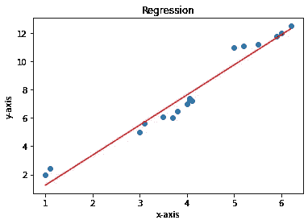
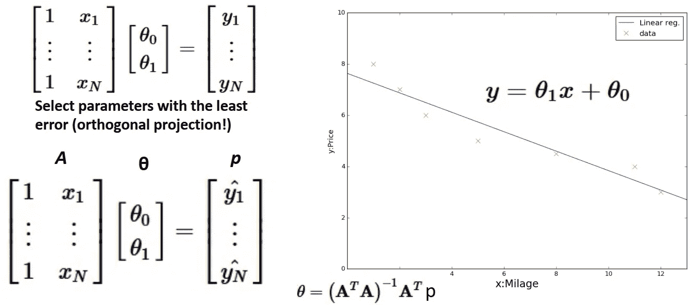
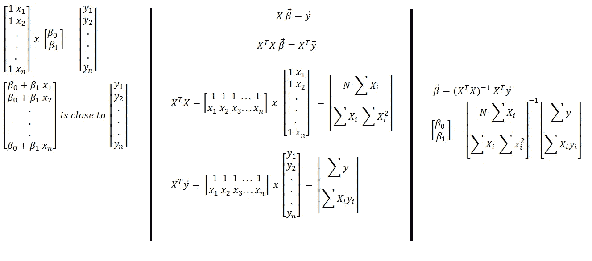
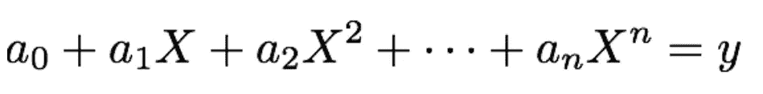
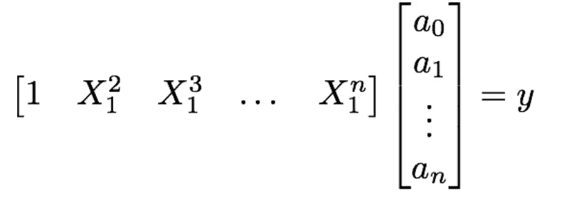

# 最小二乘直觉回归

> 原文：<https://medium.com/mlearning-ai/regression-with-least-squares-intuition-d37c5a99ba7d?source=collection_archive---------5----------------------->

在这篇文章中，我们来看看回归的直觉。

# 线性回归

让我们考虑一下我们在高中时看到的最简单的场景。假设我们想找到通过两点的直线方程。下面的例子展示了我们在线性代数中是如何做的。

但是，当数据点的数量增加时，所有的数据点将不会位于一条直线或曲线上。曲线意味着使用多项式来描述数据。但是，为了简单起见，让我们考虑我们想要为一组数据(多于两个)找到一条线的参数。在下面的例子中，蓝点是我们的数据点，红线是我们拟合的线。然后，在回归中，我们要找到那条线的参数(斜率和偏移量)。

我们想找到一个线性模型的参数来拟合我们的数据。这种情况下的最佳答案将是看到与所有数据点的平均距离最小的线。最小二乘法是一种众所周知的解决方案，用于查找我们希望用于以下预测的线性模型的参数。下一个视频从数值计算的角度展示了它的工作原理，令人大开眼界。

从线性代数的角度来看，我们有以下计算。

下图更详细地展示了它。

[[ref](https://towardsdatascience.com/building-linear-regression-least-squares-with-linear-algebra-2adf071dd5dd)]

之所以有这样的计算，是因为在线性代数中，回归依赖于投影概念。

# 多项式回归

在这种回归中，使用多项式函数，因为数据点的分布是一条线无法覆盖的。因此，我们不再有两个参数，而是寻找更多的参数。模型是这样的:

求解和寻找参数的方程:

为了找到参数，进行相同的计算。python 的 Numpy 包中有一个函数用于查找参数。

> x，res，rank，s = NP . linalg . lstsq(design _ matrix，y，rcond=None)

 [## Mlearning.ai 提交建议

### 如何成为 Mlearning.ai 上的作家

medium.com](/mlearning-ai/mlearning-ai-submission-suggestions-b51e2b130bfb)