# 从零开始使用 Python 回归—多项式回归

> 原文：<https://medium.com/mlearning-ai/regression-with-python-from-scratch-polynomial-regression-3e186198ae0c?source=collection_archive---------0----------------------->

在这个故事中，我将我对线性回归的解释归纳为多项式回归。再次从创建带有噪声的随机数据开始，这一次我更多地使用了一种方法，这样我们就可以创建一个回归问题的类。

多项式回归是线性回归的一种，被称为多元线性回归的特例。它再次仅使用一个独立变量进行预测，但是假设所述独立变量和因变量之间存在 n 次多项式关系。

我们的假设也是有效的(就像线性回归一样),即要预测的数据是输入的确定性函数和随机噪声的总和。

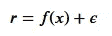

其中 r 是因变量，x 是自变量， *𝜖* 是随机噪声。

概括线性回归中使用的估计量，我们有

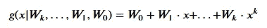

也可以写成

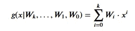

让我们从进口说起。

```
import numpy as np
import matplotlib.pyplot as pltnp.random.seed(3)
```

## 创建带有噪声的随机多项式数据

一般来说，我们的多项式数据函数可以写成类似于我们的估计函数。

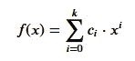

其中 *𝑐* 是函数中每一项的常数，k 是多项式函数的次数。

**记住**我们在这里写这些只是因为我们正在生成将在本教程中使用的数据。在现实世界中，我们不知道哪种类型的函数最适合我们的数据，而这正是我们的估计函数的目标。

我们在创建常数时使用 *degree + 1* 的原因是，我们还向我们的数据(c_0)添加了一个偏差。

让我们绘制数据。

```
plt.scatter(X, y, s = 5)
```

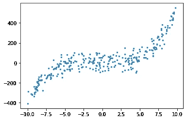

我们可以有条理地创建数据部分，以便以后使用。

## 生成训练集和验证集

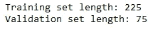

# 模特培训

## 权重的随机初始化

我们再次从随机初始化权重开始。

让我们将我们的*尚未训练的*估计值与我们的数据进行对比，看看它是如何不符合实际的。

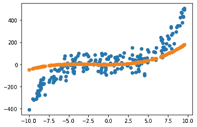

## 更新权重

为了更新我们的权重，我们将使用以下等式

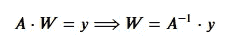

这与用于线性回归的相同。不过现在，我们可以将这些矩阵归纳如下。

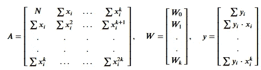

注意，N 也是总和，但是是 x 的 0 次方。

我们可以如下实现这个矩阵点积。

我们再一次创造我们的情节，看看这一次，我们的预测是否符合。让我们绘制两个图，一个用于查看预测的每个训练数据，另一个用于验证数据。

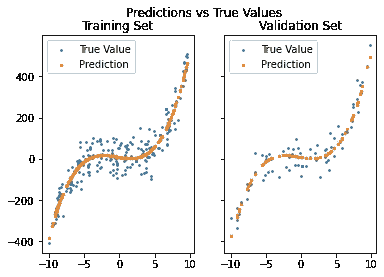

# 误差和决定系数

我们将使用与线性回归中相同的误差，即相对平方误差。

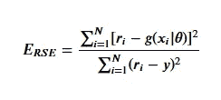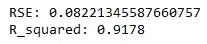

## 使用更高或更低次数的多项式预测器进行预测

现在让我们更进一步，看看假设我们的数据点和它们相应的值之间存在二阶关系会怎么样。我们可以用 W 平方项的权重来计算我们的新回归量(记住 python range 函数在上端是开放的，这意味着它不包括上端)。

这给了我们情节

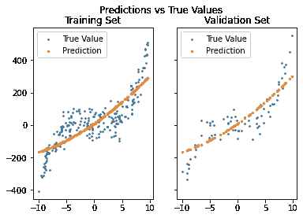

很明显，我们会有更大的误差，因为这种拟合在预测我们生成的值方面表现平平。

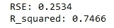

**或** …

我们可以反其道而行之，使用更高程度的估计量进行预测。

不过这一次，我们希望能很好地拟合我们的数据，因为我们希望更高程度的权重接近于零。

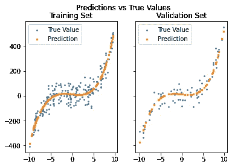

让我们看看高次权重是否真的接近于零。打印 W 变量，我们有

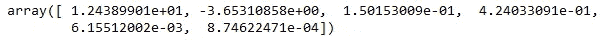

不出所料。

## **模型使用 Numpy**

Numpy 太方便了，不能不使用，它有一个计算拟合线的方法。仅使用一行代码(当然是在生成我们的数据之后)，我们就可以为数据创建一条拟合线。

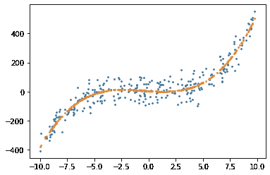

Fit line using numpy

可以看出，我们还可以通过将输入数据传递给模型来进行预测。

# 参考

*   埃塞姆·阿尔帕丁山。2010.机器学习导论(第二版。由…编辑).麻省理工学院出版社。

# 附录

让我们把这些方法放入一个类中。我写这个类只是为了这个目的，并不是为了做一个库，所以请注意，这当然不是写这个类的最好方法；因为没有错误处理或优化等。

现在我们可以一个接一个地调用我们的方法，看看我们的回归过程在起作用。

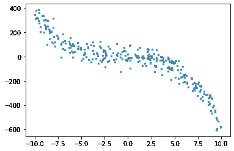

Generated data


Validation predictions fits validation data perfectly

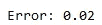

RSE Error

当然，我们也可以重复上一部分，其中我们对数据使用了不同程度的预测。有了我们的新班级，这很容易做到；我们仅在创建随机数据时改变*度*参数。

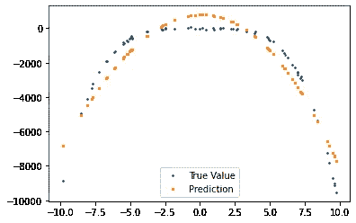

As expected, predictions fit validation data worse

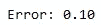

Error also has increased

[](/mlearning-ai/mlearning-ai-submission-suggestions-b51e2b130bfb) [## Mlearning.ai 提交建议

### 如何成为 Mlearning.ai 上的作家

medium.com](/mlearning-ai/mlearning-ai-submission-suggestions-b51e2b130bfb)