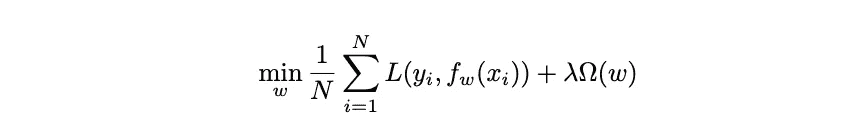
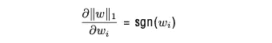
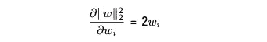
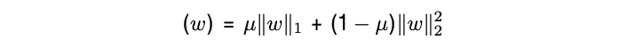
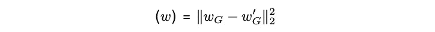

# 正规化

> 原文：<https://medium.com/mlearning-ai/regularization-85df7cd2f31e?source=collection_archive---------5----------------------->

当开发一个机器学习模型时，你的目标是使它能够很好地泛化，并对未知数据具有高性能。建立一个模型，然后训练它，实际上是在特定的函数集中寻找一个合适的函数。这里的选择很重要，原因如下。

如果您选择的函数集很差，并且如果该集合中没有一个模型具有相对较小的平均误差，则不能期望该模型具有良好的泛化能力。它可能没有能力表示数据的底层结构。

然而，如果函数集很大，可能很难找到一个好的模型，并且经常会发生过度拟合。也就是说，该模型过于努力地表示训练数据，对通常不重要的属性赋予了很大的权重，导致测试集的性能很低。

帮助我们从大量函数中选择能够很好概括的模型的技术是正则化。它降低了模型在训练过程中的灵活性。**正则化是对优化问题的每一次修改，它降低了优化问题的适应性，使其不容易过度拟合**。

但是如果我们完全忽略了重新调整，学习就变得不可能了。目标是在平均误差和惩罚项之间进行折衷。因为这些原因有一个系数，正则化超参数— ***λ*** 。优化问题现在变成了:

Ω(w) — the penalty term, λ — regularization hyperparameter

需要注意的是，我们希望最小化整个表达式。

惩罚项的两种正则化类型是:

*   ***l1*** 或 ***laso*** 正则化:惩罚权重的范数
*   ***l2*** 规则化:惩罚权重的绝对值

这两种正则化的主要区别在于， ***l2*** 正则化导致一些权重变得**非常小**，而 ***l1*** 正则化使那些不太重要的权重变得**实际上为零**。

其原因在于 ***l1*** 和 ***l2*** 正则化情况下罚项的导数的表达式。

在 ***l1*** 规则化的情况下:

无论权重值是多少，它同样有助于绝对值的减少。

在 ***l2*** 正规化的情况下:

惩罚与权重值成线性比例。因此，如果权重的值很小 ***l2*** 正则化将具有很小的效果。

由于这个原因 ***l1*** 正则化不太稳定。在用于 ***l1*** 正则化的模型的输入中存在相关属性的情况下，哪个属性将被遗漏并不重要。模型中的微小差异会产生不同的结果，这使得模型的解释相当困难。

其中一个解决方案是 ***弹性网*** ，正则化如下:

where μ∈[0,1]

但是，由于 ***l1*** 正则化会导致**模型** **稀疏性**(意味着某些权重为零)，这可能是有帮助的。如果某个属性/特征的权重等于零，则意味着该特征不重要，不需要测量。一些测量进行起来很昂贵，知道它不能提供有用的信息，可以节省预算和时间。

专家可能提前知道一些属性如何有助于期望的输出。我们想要建模的问题的领域知识可以用来帮助引导具有正则表达式的模型:

where G represents the group of attributes

出现的问题是关于假定值的质量。但是，这可以在搜索正则化超参数时解决。如果假设是坏的，则值接近零的超参数将产生更好的结果，并且将使用这样的配置。

## **结论**

正规化并不总是有用的。当数据集很小时，模型很容易过拟合训练数据。更大的数据集被认为是最好的正则化。然而，获取大型数据集在金钱和时间上都是昂贵的。在这种时候，我们讨论了如何修改优化问题，以实现更好的推广。

 [## Mlearning.ai 提交建议

### 如何成为 Mlearning.ai 上的作家

medium.com](/mlearning-ai/mlearning-ai-submission-suggestions-b51e2b130bfb)