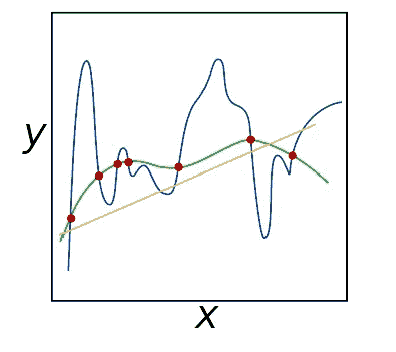
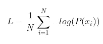
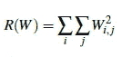
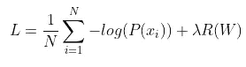
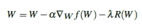

# 正规化

> 原文：<https://medium.com/mlearning-ai/regularization-e7b7d5104eb1?source=collection_archive---------5----------------------->

> “机器学习中使用的许多策略都是为了减少测试错误而明确设计的，可能是以增加训练错误为代价。这些策略统称为正规化。”— Goodfellow 等人。

在神经网络中，通过选择正确的参数集(权重和偏差)来获得通用模型是减少过拟合影响的关键因素。我们如何获得这样的参数？。答案是**正规化**。正规化可以分为两个阶段。

*   *隐式正则化方法*:数据扩充和提前停止
*   *显式正规化方法*:辍学

有各种类型的正则化技术，如 L1 正则化、L2 正则化(通常称为“权重衰减”)和弹性网，它们通过更新损失函数本身、添加附加参数来约束模型的容量来使用。

# 为什么我们需要正规化？

正则化有助于我们控制我们的模型容量，确保我们的模型能够更好地对未经训练的数据点进行(正确的)分类，我们称之为泛化能力。如果我们不应用正则化，我们的分类器很容易变得过于复杂并过度适应我们的训练数据，在这种情况下，我们将失去对我们的测试数据(以及测试集以外的数据点，如野外的新图像)进行归纳的能力。

然而，过多的正规化可能是一件坏事。我们可能会面临拟合不足的风险，在这种情况下，我们的模型在训练数据上表现不佳，并且无法对输入数据和输出类标签之间的关系进行建模。

**blue line:** overfit, **orange line:** Underfit

正则化的目标是获得这些类型的“格林函数”,它们很好地适应我们的训练数据，但避免过度适应我们的训练数据(蓝色)或未能对底层关系建模(橙色)。

# 损失和重量更新，包括正规化

整个训练集的损失可以写成:

现在，假设我们已经获得了一个权重矩阵 W，使得我们训练集中的每个数据点都被正确分类，这意味着我们的损失 L = 0。太棒了，我们获得了 100%的准确性，但让我问你一个关于这个权重矩阵的问题，它是唯一的吗？或者，换句话说，是否有更好的 W 选择来提高我们模型的泛化能力并减少过度拟合？

如果有这样的 W，我们怎么知道？我们怎样才能把这种惩罚纳入我们的损失函数呢？答案是定义一个正则化惩罚，一个作用于权重矩阵的函数。正则化罚函数通常写成函数 R(W)。

L2 Regularization

为了减轻各种维度对输出分类的影响，我们应用正则化，从而寻求考虑所有维度而不是少数具有大值的维度的 W 值。在实践中，你可能会发现正则化会稍微损害你的训练精度，但实际上增加了你的测试精度。

第二项是新的，这是我们的正则化惩罚。\lambda 变量是一个超参数，它控制我们正在应用的正则化的数量或强度。在实践中，学习率\alpha 和正则项\lambda 都是您将花费最多时间调整的超参数。

weight updating during backpropagation

这里，我们将负线性项添加到我们的梯度(即梯度下降)，惩罚大权重，最终目标是使我们的模型更容易推广。

**参考:**

Adrian Rosebrock 用 Python 实现计算机视觉的深度学习(入门包)