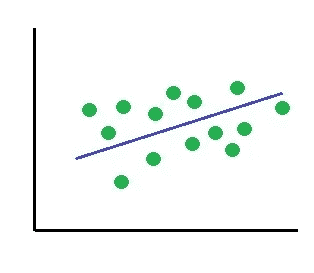
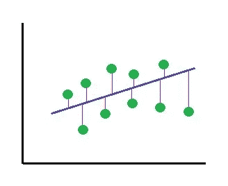
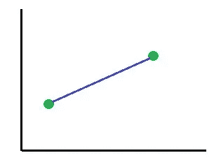
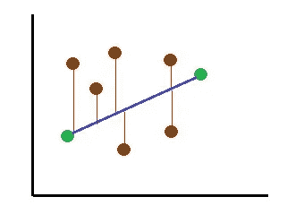
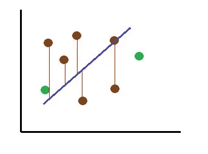
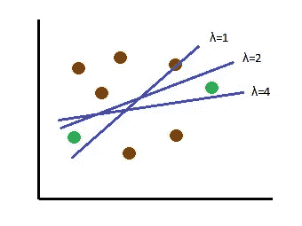
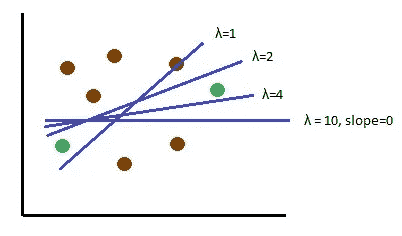

# 线性模型中的正则化

> 原文：<https://medium.com/mlearning-ai/regularization-in-linear-models-b39349dbc055?source=collection_archive---------11----------------------->

在机器学习中，正则化是对模型进行的修改，以便我们获得更通用的模型，更好地适应新数据。

线性回归是一种使用直线找出变量之间关系的方法。它试图找到一条最符合数据的线。

线性回归是发现变量之间关系的简单而快速的方法，但是它试图将噪声/异常值也包含在数据中。这可能导致在预测新数据时，模型不太通用，误差较大。因此，为了推广这个模型，我们将其正则化。

当我们谈到误差时，我们通常会听到偏差和方差这两个术语。所以，让我们先看看什么是偏差和方差，然后再来看看正则化技术。

# 偏差和方差

当我们通过模型预测数据时，我们得到的预测值可能与实际值有一定的距离(距离是预测值与实际值的偏差)。这个距离就是误差。

如果我们得到的误差是通过将**训练**数据传递给模型得到的，则称之为**偏差**。

如果我们得到的误差是通过将**测试**数据传递给模型得到的，则称为**方差**。

具有**较小偏差和较小方差**的模型被认为是好模型，因为它能够以较小的误差预测训练和测试数据。

# 线性回归中残差平方和

残差是预测值和实际值之间的差值。

在线性回归中，我们预测一条线来显示变量之间的关系，使得数据点的残差平方和较小。

在上图中，绿点是数据点，红线代表残差。给定数据的残差平方和较小的线被视为最佳拟合线。

当我们只有 2 个训练数据点时，最佳拟合线将是通过这两个点的线，在这种情况下残差平方和为 0。

但是当我们用新数据测试这条线时，我们可能会得到新数据的残差平方和很大。

这意味着该预测线具有高方差。换句话说，这条线过度拟合了模型。

# 里脊回归

岭回归也称为 L2 正则化，是一种正则化技术。该模型找到一条不太符合训练数据的线，但减少了与测试数据的误差。这意味着我们给拟合数据的线引入了一个小偏差。但是作为回报，我们得到方差的下降。

这条新直线称为岭回归线，它比以前的直线(线性模型线)提供了更好的预测，尽管这条线并不最适合训练数据。

正则化模型找到一条线，该线减少了残差平方和加上惩罚。当罚值为**平方斜率之和**时，称为**岭回归**。

所以，岭回归减少了

## 残差平方和+λ* ^2(斜率)和

这里斜率的平方和是惩罚，λ表示惩罚有多严重。λ的值可以是 0 到∞(无穷大)之间的任何值。

当λ为 0 时，则

残差平方和+ **0*** (斜率)和^2 =残差平方和

因此，当λ为 0 时，模型仅尝试减少误差平方和，从而得到线性回归线。

随着λ值的增加，预测线的斜率减小。

随着λ的增加，直线的斜率逐渐接近 0。因此，当λ较大时，输出变量对输入特征的依赖性降低。为了找到方差最小的λ，我们使用交叉验证技术。

# 套索回归

拉索回归也称为 L1 正则化，类似于岭回归。它还拟合了一条偏差很小但方差比线性回归小的直线。这是通过增加惩罚来缩小线的斜率，直到我们得到最佳拟合。

因此，当正则化模型的惩罚是绝对斜率的和时，它被称为套索回归。

所以，套索回归减少了

## **残差平方和+ λ*(斜率之和|)**

这里，绝对斜率之和是惩罚，λ表示惩罚有多严重。λ的值可以是 0 到∞(无穷大)之间的任何值。

当λ为 0 时，则

残差平方和+ **0** *(斜率之和|) =残差平方和

因此，当λ为 0 时，该模型试图仅减少给出线性回归线的最小二乘误差。

随着λ值的增加，预测线的斜率减小。

因此，随着λ的增加，直线的斜率变为 0。这就是套索和岭回归的主要**区别**。当脊回归将斜率减小到非常接近 0 时，套索回归**将其完全减小到 0** 。

由于 Lasso 回归可以将斜率缩小到 0，因此它消除了输出变量对某些要素的依赖性。因此，当我们的数据包含许多不重要的特征时，Lasso 可以进行特征选择，并使对这些特征的依赖性为 0。

相比之下，当输出变量依赖于所有特征时(也就是说，当所有特征都重要时)，岭回归效果更好。

# 弹性净回归

当有大量的特征，而我们不知道哪些特征是有用的，哪些是无用的，那么我们就不能在 Lasso 和 Ridge 回归之间进行选择。在这种情况下，我们可以使用弹性网回归，它结合了套索和脊。

弹性网回归模型试图找到一条线，减少

## **残差平方和+ λ1*(斜率之和|)+λ2 * ^2(斜率)之和**

λ1 和λ2 的值不同。λ1 代表套索，λ2 代表山脊。为了获得λ1 和λ2 的最佳值，我们对不同的值组合使用交叉验证技术。

当λ1、λ2 都为 0 时，我们得到线性回归线(仅拟合最小残差平方和的线)。

当只有λ1 为 0 时，我们得到岭回归。当只有λ2 为 0 时，我们得到套索回归。

# 结论

模型的正则化处理过拟合问题。正则化有很多技巧。选择最佳的正则化方法取决于特征的有用性。如果所有的特征都很重要，那么就选择岭回归。如果只有一些要素对输出重要，则使用套索回归。当我们有大量的特征，并且不知道它们的有用性时，我们选择弹性网络回归。

*原载于 https://www.numpyninja.com*[T5](https://www.numpyninja.com/post/regularization-in-linear-models)*2021 年 3 月 2 日*