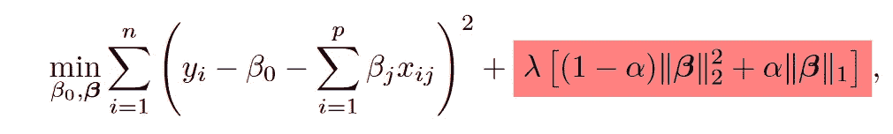
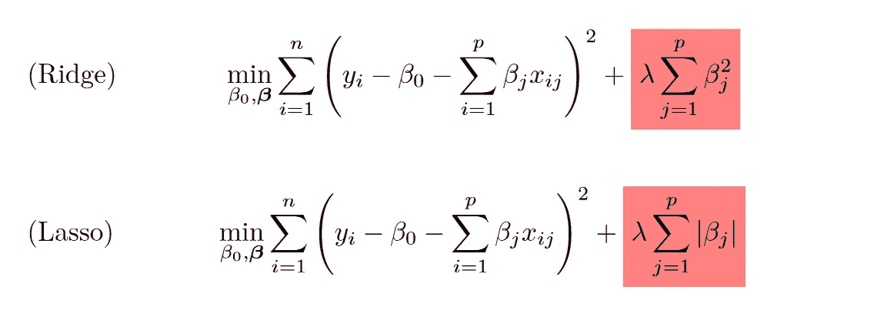
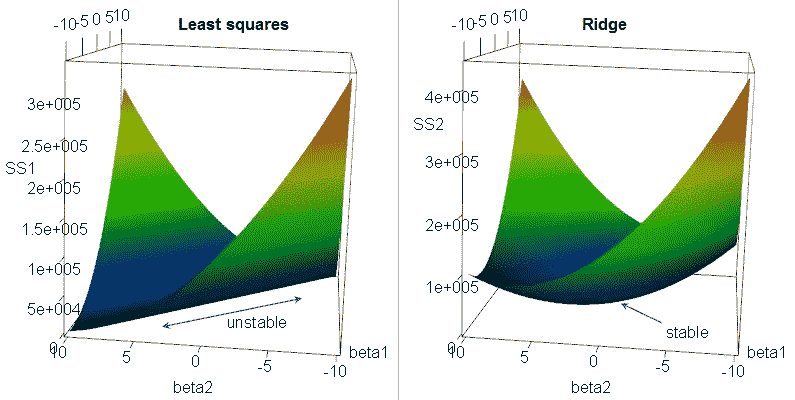

# 回归的正则化技术:第 1 部分

> 原文：<https://medium.com/mlearning-ai/regularization-techniques-for-regression-part-1-f583c0929c92?source=collection_archive---------7----------------------->

## 了解什么是山脊和套索，为什么他们是如此强大的工具

正则化包括通过添加一个过程来调整回归模型，该过程通过将这些估计“缩小”到原点(到零)的惩罚来限制或正则化系数估计。

虽然正则化改进模型调整的原因并不明显，但一般来说，这组“收缩”技术有助于减少方差(这可以导致增加模型的预测能力)并允许变量选择。

特别是对于线性模型(包括[广义线性模型](https://en.wikipedia.org/wiki/Generalized_linear_model)，还有另一个优势:那些技术可以修复[多重共线性](https://en.wikipedia.org/wiki/Multicollinearity)，这通常会产生不一致的系数估计。

最常用的正则化技术是 Ridge 和 Lasso，它们之间的唯一区别是应用于系数的惩罚的格式。

接下来，将根据找到使残差平方和(RSS)最小化的β_ 0，β_ 1，…，β_ p 的过程来介绍这些技术，尽管也可以使用其他函数。

以α为 0，我们有山脊，α为 1，我们有套索。

**岭回归**

岭回归通过系数平方和的形式的惩罚来缩小系数。

λ被称为单独确定的调谐参数。注意，当λ为零时，罚值没有影响，岭回归将产生与普通最小二乘法相同的系数估计值。

当λ趋于无穷大时，惩罚的影响增加，系数估计将接近零(不完全是零)。

对于每个λ，产生一组不同的系数。选择一个好的λ值是至关重要的，选择它的方法将在后面解释。

在岭回归中，当一个预测因子乘以一个常数时，系数估计值可以被显著修改。所以建议把之前的预测因子标准化。

值得一提的是，对于线性模型(包括广义线性模型)，系数估计中的惩罚有助于解决多重共线性带来的问题。

当存在多重共线性时，估计会产生不一致的系数估计值(用于模型训练的预测值的微小变化会导致估计值的重大变化)。该现象可在**左图**中观察到(出于解释目的，仅考虑两个预测值):该表面具有非常不稳定的脊/峰，用于寻找最小化先前呈现的函数的系数。

但是添加的惩罚在表面上创建了一个定义明确的凹陷(**右图**)，稳定了估计过程，返回了更一致的系数估计。

**拉索回归**

套索回归与岭回归非常相似，但不同之处在于罚函数的格式，它是绝对值的和，而不是平方。

Lasso 回归也缩小了系数估计值，并具有相同的调整参数。

此外，之前为岭回归提供的所有信息也适用于套索:

*   λ等于零相当于没有应用惩罚，并且λ增加到无穷大返回零估计；
*   有助于解决多重共线性，减少方差；
*   建议将预测因子标准化。

岭回归不能准确地返回零系数估计值(可以返回接近零的值)，但 Lasso 回归可以。因此，这种正则化技术可以用作预测值选择(许多人可能称之为特征选择)和重要性排序(估计值等于零的预测值将被丢弃)的方法。

**调谐参数选择**

正如我之前所说，选择一个好的λ值是一个关键的决定。那么，我们如何做出这个决定呢？我们通过以下步骤使用交叉验证(adicionar link ):

*   [1]定义调谐参数可能值的网格；
*   [2]训练模型，并为网格的每个可能值计算适当的误差度量。例如，用于回归的 MSE(均方误差)或 MAE(平均绝对误差)或用于分类的准确度；
*   [3]选择调谐参数作为产生最小误差的值；
*   [4]用所有观察值和选择的调整参数训练最终模型。

在第 2 部分中，我将通过一些代码示例来应用这些正则化技术。

我会把我的信息留在这里！

> **Linkedin:**[https://www.linkedin.com/in/marcos-augusto-47o47/](https://www.linkedin.com/in/marcos-augusto-47o47/)
> **Github:**[https://github.com/MarcosAugusto47](https://github.com/MarcosAugusto47)

**资源**

1.  Hastie，Tibshirani，r .，，j . h . Friedman(2009 年)。统计学习的要素:数据挖掘、推理和预测。第二版。纽约，斯普林格。
2.  加雷斯·詹姆斯，丹妮拉·威滕，特雷弗·哈斯蒂，罗伯特·蒂布拉尼。(2013).统计学习导论:应用。

 [## Mlearning.ai 提交建议

### 如何成为 Mlearning.ai 上的作家

medium.com](/mlearning-ai/mlearning-ai-submission-suggestions-b51e2b130bfb)