# 正规化:什么？为什么？又是怎么做到的？(第一部分)

> 原文：<https://medium.com/mlearning-ai/regularization-what-why-and-how-part-1-ef6bdb6bafea?source=collection_archive---------3----------------------->

## 如果你是真正提出正规化的人，你会采取什么样的方法？在学习正则化的时候，你是否无法将我们通常看到的不同概念联系起来？也许是因为我们孤立地了解这个问题，或者是因为缺乏破解这个问题的通用工具。如果你是一个天生的发现者，喜欢阅读，浏览这篇文章/故事，看看你的点点滴滴。

> 这篇文章分为两部分，在第一部分，我们将重点放在作为一个工具建立正则化的先决条件和直觉，在第二部分，我们将学习正则化作为一个机器学习的主题。

每个故事都有独白，那为什么不在这里呢？所以，让我们开始吧，

自从机器学习，特别是深度学习作为一个问题解决领域出现以来，很多时间都花在寻找解决问题的最佳方法上。但是大多数尝试使用深度神经网络作为单一功能来解决问题的研究工作都失败了；主要是因为他们试图做一些被称为无约束优化的事情(别担心，我们稍后会谈到这个术语)。

*只是在纳入正规化和一些其他技术后，快速进步才开始发生。但是为什么我们总的来说失败了？正规化是如何解决一些问题的？*

让我们通过*首先理解过度拟合来理解这一点。*

我们假设其重要性足以训练我们的模型的数据集是真实连续人口分布的*离散子集。*

These black points are things which comprise our dataset, and our true distribution is our red curve (sine function)

因此*我们不能确定；即使我们在这上面拟合一个完美的模型，我们也将完美地拟合真实的分布*，我们的主要任务是近似真实的分布！*这导致了所谓的过拟合*的情况。作为偏差(你的训练模型与最佳可能模型有多接近；平均)非常低，定义如下

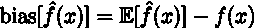

其中*f’(x)是您的训练模型，f(x)是完美/最佳可能模型*(可以在给定数据集上训练的最佳模型，我们认为该数据集是真实分布的一部分；但是足够显著以代表真实分布)，而不是整个群体。

方差(与预测平均值相比，每样本预测值的变化量)很高，

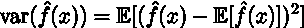

那么，这种*高方差和低偏差*的含义是什么？

你的*模型是复杂的*，但是这意味着什么呢？在一般的 ML 意义上，复杂性可以指两种情况，第一，如果有*太多的可学习参数*，第二，如果参数有*高自由度增长*。那就是它们的*系数是无界的。*

说得更清楚些；让我们用一些类比和例子来再次理解它，

如果有大量的参数，每个参数可以对应于每个输入进行映射，那么我们将最终学习一个高度复杂的函数。它类似于用一个非常大的勺子喝汤，它会完成任务吗？是的，值得吗？不会。另一方面，如果有大量的重量积累，这将使模型对输入的微小变化非常敏感，因此模型将非常不稳定，这也不是所希望的情况。

因此，如果我们以某种方式降低模型的复杂性，那么我们将克服过度拟合？是的，奥卡姆剃刀也象征着同样的事情，一个更简单的模型总是更好，这就是正则化介入的地方。

*正则化有助于惩罚任何类型的复杂性，可能是由于大量参数或大量权重累积导致的复杂性。*

我们可以通过以下任一方法来执行正则化:或者下述两种情况，

***1。约束参数数量***

稀疏性在这方面起着非常重要的作用。理解这一点的一般想法是*如果网络稀疏，可学习参数的数量将会减少，因此复杂性将会降低*，防止模型过度拟合。

***2。参数值*的约束大小**

将*惩罚置于参数值*之上，这通常是通过在成本函数中添加一个惩罚项来实现的，这具有正则化效果。即*如果参数值/权重变得太大，我们的成本函数会造成很大的损失*。我们将在后面的章节中更清楚地看到这一点。

上述两点也可以相互结合使用。就像在 L1 正则化的情况下，考虑较大权重和稀疏性的惩罚项。我们有整整一节是关于 L1 和 l2 的，所以，请耐心听我说。

在最后几段中，我们看到了一些新术语，如成本函数、惩罚项和约束/无约束优化。让我们看看他们如何融入大局。

在前两段，我开始说这个问题是因为我们试图解决一个无约束的问题，然后我突然跳到过度拟合，似乎可疑，对不对？是的，有一点，现在让我们把它们连接起来，

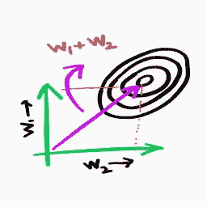

Unconstrained optimization

在上面的图表中，右上角的螺旋形的东西是我们想要近似的分布。轴上有我们的参数，所以有一点是肯定的，*如果模型必须符合分布，它需要沿着 w1 和 w2 轴移动*。(拟合分布意味着近似统计分布，如平均值和标准偏差)

这是关键时刻， *w1 和 w2 可以变得任意大以适应分布，这将使我们的模型变得复杂，并将导致过度拟合*，这意味着我们*试图解决一个无约束问题*，或者简单地说这是一个无约束优化。

有人可能会说，如果我们将分布标准化或规范化，会不会防止参数变得疯狂，答案是否定的，假设你想写一个函数 y = f(x)，其中 x 是[1，1]，预期 y 是 4。f 的参数是 w1 和 w2。有多少种方法可以将它们结合起来，得到期望的 y，使用一个线性方程组。

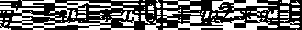

w1 和 w2 可以是字面上的任何值，在(-无穷大，无穷大)的范围内，这将满足等式。

> *4 = 4*1 + 0*1*
> 
> *4 = 100*1 + (-96*1)*
> 
> *4 = (-500*1) + 504*1*

我们还想给予*更多的关注，关注对我们的数据*更重要的参数/特性。因此，我们最好的办法是不允许权重超过某个点，或者简单地限制权重值，因为这将有助于我们限制权重以及一些特殊的事情，如在 L1 正则化的情况下促进稀疏性(我们将在后面的部分中讨论)。

众所周知，较大的权重意味着较高的复杂度，因此在大多数情况下会导致过度拟合。我们在上面看到的*解决方案是对参数值*进行一些限制/约束。因此，我认为无约束优化和过度拟合之间的联系应该是明确的。但是，我们实际上如何玩这个优化的东西，它到底是什么？让我们在下一节讨论这个问题。

**什么是优化？**

在一般的机器学习意义上，它是*求解一个目标函数来执行最大或最小评估*。实际上，优化在使用上要深刻得多。

然后，我们有两个术语，我们经常听到“优化”作为后缀。凸/非凸优化和线性/非线性优化。

对于线性和非线性优化，我们手头的任务的名称是相当明显的。这实际上是求解一个线性或非线性的方程组。

但是就凸和非凸而言，它们有点不同，这两个家伙可能有完整的博客，因此我们将轻轻地选择我们需要的东西，然后继续前进。

我们需要知道的几点:

1.如果成本函数梯度的 Hessian/双导数/Jacobian 都是正的，则函数是凸的，如果都是负的，则函数是凹的，如果两者都是，则函数是非凸的。

convex vs non-convex function

2.出于直观的目的， *hessian 定义了函数*的曲率，想象有一条 U 型曲线，像 y = x，如果你在曲线上画任何一条连接任意两点的线，那么曲线之间的所有点都会位于曲线之下。因此曲率低于直线。现在想象画许多线，如果对所有线都适用，那么它应该是凸的。但是如果它在某个位置失败，那么它是非凸的。对你来说，这就是为什么在训练我们的模型时，与局部最小值相比，遇到鞍点的风险更大。

3.我们知道凸函数和非凸函数是什么，那么加两个凸函数呢？我们得到了什么？答案是*两个凸函数总会出一个凸函数*，但是一个凸和一个非凸合在一起会出一个非凸。但是两个非凸曲面最终可能会形成一个凸曲面。这就是为什么我们通常看到类似于多个 L1 或 L2 项组合的东西，因为两者都是凸的，因此可以优化。

4.但是为什么只有凸优化呢？很长一段时间都有人猜测，*把问题想得那么难*是关于线性和非线性，但后来得出结论，主要是*关于凸性和非凸性*。实际上，*凸问题是我们有某种确定性方法来解决*的唯一问题，也就是说，通过使用 *KKT 条件*，因此我们希望将自己限制在仅凸的区域内。也许，将来我们也能想出一种方法来确定性地解决非凸问题，但现在让我们享受我们所拥有的，并对我们没有的感到好奇。

太好了！我们现在知道什么是凸优化，为什么它很重要。我们已经准备好了自己发现正则化的工具。首先恭喜你。为此拍拍自己的肩膀。让我们开始发现规律的过程。

我们提到我们想要对我们的参数值施加一些限制/约束。但是我们怎么做呢？问问你自己，我们想要一个函数，每当 w1 或 w2 大于我们的阈值时，它会给出一个很高的惩罚。

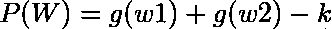

这不是我们想要的吗？函数 g(w)可以是任何东西，比如平方函数或绝对函数。

现在让我们把这一项加到我们实际的目标函数上，它通常是一个 MSE 或 MAE。

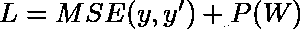

但是 P(W)很像阶跃函数，因为一旦我们踏出阈值范围，就会有突然的惩罚/损失。这将导致不健康的梯度流动。

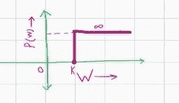

step function like P(W) wrt W

想象一下，如果阈值为 1，我们的 P(W)为 1.001，我们仍然会看到巨大的损失，这并不好，为了让事情变得更平稳一些，我们在 P(W)和一个新项 lambda 之间建立了线性依赖关系。

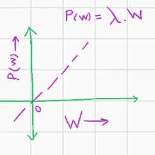

Smoother P(W) with lambda term wrt W

我们的新方程变成了，

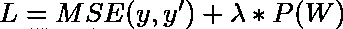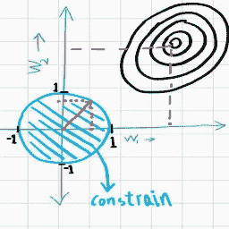

general regularization

它让你想起什么了吗？是的，这是您在学习正则化时通常会看到的熟悉等式。我们谈到的这个λ是你所谓的“正则化参数”，据说它平衡了目标项和惩罚项，但它的作用远不止我们上面看到的那样。

您已经看到我们可以在目标中添加一个惩罚项，但是如果我们添加多个惩罚项呢？一个通用的等式应该是这样的，

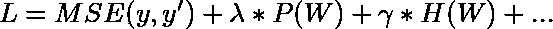

这整个方程一起被称为*拉格朗日*。所以，你可以将*拉格朗日函数定义为你的主目标函数与所有惩罚项/正则项的组合。*

现在这些*罚项可以是任何东西，可以是 l2 范数(结果转化为 L2 正则化)或 L1 范数(结果转化为 L1 正则化)或两者的组合(是的，你是对的，弹性网)*。不是很直观吗？

现在，让我们来一点技术，我们想要最小化我们的主要目标函数，MSE，对吗？当我们使用惩罚项越过阈值时，我们希望给予较大的惩罚。因此，我们可以把这个等式看作，

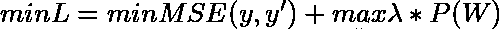

从博弈论的角度来看，你可以认为这是一个最小-最大游戏，优化 MSE 导致更大的 W，另一方面优化 P 导致更小的 W。*优化(最小化)这两个函数的唯一最佳点是在 P 的边界/阈值处。*

从机器学习的角度来看，你可以这样理解，*权重值会随着它们变得更大而占更大的惩罚*，一旦它们增长到足以触及我们的分布，它们就会停止增长，因为任何高于这个值的值，虽然会降低 MSE，但也会占非常重的惩罚。因此，这个边界充当优化最佳点。

现在，我们几乎完成了，我们知道只要将这个正则项添加到我们的主目标函数中，就会产生一个新的目标函数，它的优化可以防止我们过度拟合(因为我们刚才讨论的最小-最大博弈)。

我们有多种选择来定义 P(W ),它可能是 L1/L2/ L1 + L2 或其他什么，但它应该是凸的。

我们现在有了完整的正则化方程，只剩下关于 P 的选择的一些见解。*由于我们要考虑权重的大小，因此最明显的选择是使用我们称之为规范的东西。*

*至此，我们结束了我们的第 1 部分，并了解了优化及其与复杂性的关联，我们看到了一个通用的数学但易于理解的制定组合目标函数的观点，在下一篇文章中，我们将从这里开始，并从机器学习的角度理解我们的 P(W)。*

第二部分链接:[https://medium . com/@ rsiddhant 73/regulation-what-why-why-how-part-2-4a 075 ad 68 ad 2](/@rsiddhant73/regularization-what-why-and-how-part-2-4a075ad68ad2)

 [## Mlearning.ai 提交建议

### 如何成为 Mlearning.ai 上的作家

medium.com](/mlearning-ai/mlearning-ai-submission-suggestions-b51e2b130bfb)