# 正规化:什么？为什么？又是怎么做到的？(第二部分)

> 原文：<https://medium.com/mlearning-ai/regularization-what-why-and-how-part-2-4a075ad68ad2?source=collection_archive---------4----------------------->

> 这是我们两部分正规化讨论的第二部分，我鼓励你先看完第一部分；确保我们在同一页上。这是它的链接

[https://medium . com/@ rsiddhant 73/regulation-what-why-why-how-part-1-ef 6 BDB 6 bafea](/@rsiddhant73/regularization-what-why-and-how-part-1-ef6bdb6bafea)

*在前面的部分中，我们试图用一种非常通用的数学方法来理解这个主题，即使我们的由惩罚项和目标函数组成的组合目标函数也是非常通用的，那么，我们是否应该从机器学习的角度来研究正则化，以获得更专业的观点？让我们从我们离开的地方开始，即规范。*

**什么是规范？**

*它们一般代表矢量的大小/幅度。*L-p 范数的一般形式是

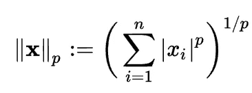

L-p Norm equation

一些常用的规范有:

```
**L0 -> number of zeros, though pointed as wrong definition in Ian Goodfellows’ Deep learning book.****L1 -> sum of absolute values of vector****L2 -> sum of squared values of vector****L-infinity -> in general you can think it as max value in a vector or absolute value of element with largest magnitude in a vector.**
```

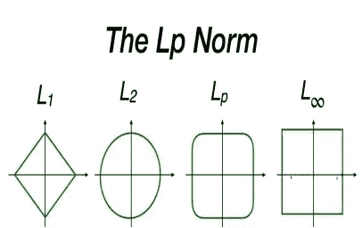

Different type of Norms

让我们讨论一些基于这些规范的**流行的正则化技术。**

## L1 正则化或套索


penalty increasing linearly with increase in w1

这里，***P(W)=****β*****∑| W |***

也就是说。*绝对权重之和*，表示*罚值随着参数值*线性增加。但是 L1 最重要的方面是它执行*特征选择*的能力，我们将在后面的章节中讨论这一点。

## L2 正则化或岭

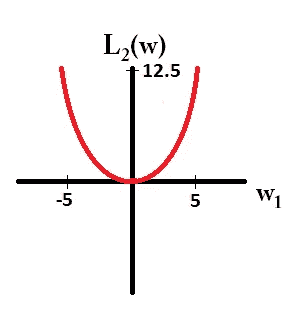

penalty increasing quadratically with increase in w1

这里，***P(W)=****λ*****∑W***

也就是说。*权值的平方和*，这意味着*罚值随参数值*的平方增加。但是 L2 最重要的方面是它的平均效果和重量分配。随着惩罚越来越重，限制也越来越严格，因此*通常在实际场景中更受青睐*。

*L1 也被称为曼哈顿距离，l2 被称为平方距离或欧几里得距离。*

## 弹力网/ L1 + L2

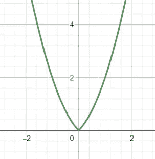

graph of elastic net, penalty is somewhere between L1 and L2, it is neither a straight line nor quadratic by nature, thus no problem with quadratic changes, also it is lot more more robust

***这里 P(W)=***【λ****∑W+***【β****∑| W |***

它基本上*结合了 L1 和 L2* ，非常类似于我们在推导组合目标函数时所做的。你应该已经从你的作品中得出了这个，伟大的作品。它提供了 L1 和 L2 的好处，但也有一些折衷。有许多关于这方面的好文章，我鼓励你去探索一下。*一般来说λ < β，就像我们要更强调 L1 一样，为什么？我们将在本文的后面讨论这个问题。*

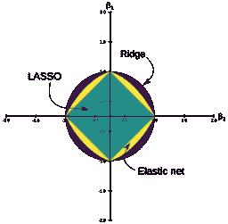

All the generally used regularizations

从上图可以看出，Lasso 的 ***特征选择概率最高，其次是 elastic，最后是 Ridge 的*** 。*在完成下一节关于稀疏性和特征选择的内容后，你会对图形 w.r.t .特征选择有更好的理解。*

有人可能会问，为什么我们不用 l2 以外的规范，可能有几个可能的原因，

1.非常*大罚*超出二次项。

2.它开始形成某种方方正正的形状，这扼杀了我们将一切都限制在一定范围内的动机，因为这些目标函数的最大化可能会超过我们的阈值，这是我们不希望的，因此像这样的形状也会*抑制我们对稀疏性的渴望*。

3.对于 L-3 范数，我们的惩罚项的导数将是二次的，这将导致梯度非常*快速衰减*，甚至比遵循线性衰减的 L2 快得多，这将随着范数的增加而变得越来越陡，这将导致梯度非常*突然变化，使整个设置非常敏感，从而不稳定*，我确信这不是我们想要的。在后面的部分有一个跟进图。

让我们简单讨论一下**其他著名的正则化技术**:

***Dropout :*** 它通过提升稀疏度来执行*正则化，我们可以将其形象化为，假设存在一个大型图(我们的神经网络)，在每次迭代中随机使用 Dropout 后，一些激活将被设置为 0，这将*在该大型图中创建一个子图。许多这些子图会导致某种集合*，我们知道集合如何帮助*减少方差*等等。几乎没有数学证据表明辍学是如何类似于 L2 标准的。*

**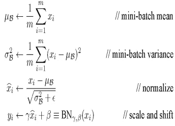**

**batch-normalization equations**

**第三个等式中分母的这个 ***ϵ*** 是额外的值，用于防止一些讨厌的数学复杂情况，如零除法，但暗地里它也充当噪声。主要噪声实际上是由计算出的平均值和方差造成的，而不是真实的统计数据，即整个数据，因此存在一些标准误差，进而导致噪声。如果数据中有噪声，在任何情况下你都无法拟合采样分布，因此过度拟合的机会减少，正则化应用。**

*****早停:*** 其实最容易理解，简单来说，你训练的时间越长，越有可能超负荷。那么，我们该怎么办呢？如果指标没有明显变化，尽早停止？对吗？对，就是这样。**

***还有更多，但我们留下一些东西供你探索。***

# **稀疏性和特征选择:神话与真理**

**让我们进入主题，我一直在等待解释，稀疏使用正则化。**

**什么是特征选择的稀疏性？你可以这样想，如果特征选择正在发生，那么*少数特征被挑选，而其他特征被拒绝，即对应于那些特征的权重/参数被推到 0* ，从而产生稀疏的权重矩阵/向量。稀疏矩阵是主要由零值组成的矩阵。因此，如果存在特征选择器，其输出将是稀疏向量/矩阵。**

**主要问题是，为什么 L1 做特征选择，而 l2 不做？**

**一个明显的答案是，L1 本身并不促进特征选择，其他规范在这项任务中非常弱，以至于 L1 看起来像一个专门的特征选择器*(除了* L0 *规范，它是促进稀疏性的理想选择)*。**

**我这话是什么意思？**

**我来解释一下，给你两种思考方式，**

*****1。数学*****

**我们将讨论 P 对 w 的导数。**

**对 L2 来说，**

**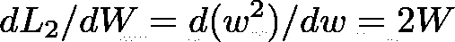**

**这意味着在 L 的导数和 W 的导数之间存在线性关系，**

**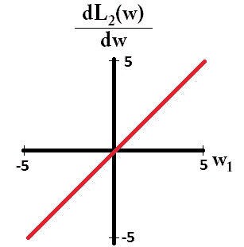**

**因此当 W 变小时。惩罚也变小了，这*导致了一个递减/衰减的惩罚*。这就是为什么 *l2 正则化也被称为权重衰减*。现在，由于存在衰变，我们无论如何也不能达到 0。**

**你可以这样想**

```
w = 16while w != 0: w = w/2
```

**这是一个无限循环，因为 w 将继续衰减/减少，并且永远不会等于零。片段和实际的解释之间没有直接的关联，这只是将你的理解推向那个方向。好的，我们知道 l2 永远不会将 w 推到精确的零，因为这不可能进行特征选择，*对于更高的规范可以推导出类似的想法*。**

**但是 L1 呢，让我们看看，**

**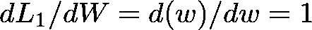**

**这意味着无论 W 的大小如何*恒定递减。***

**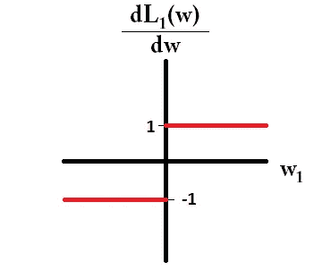**

**constant updates by L1-norm**

**因此，与 l2 相比，W 有更多的机会被推到 0。**

**满意吗？没有吗？太好了！！！**

*****2。目测*****

**欢迎来到视觉化部分，这会让事情变得更清楚。**

**假设我们的 L2 范数的圆周(一个圆)是由下面标记为红点的 100 个点构成的。在多少点上我们能够最大化这个函数？在每个地方，对吗？为*，所有点与中心*等距。你能在多少点上做*特征选择？*，即在四个位置将其中一个参数设为 0，*。这些位置在下面用蓝色突出显示。那么，你在所有的点中选择四个点之一的概率是多少？4/100，实际上一个圆是由无限多的点组成的，那么我们的概率大约是 4/N，其中 N 非常非常大，将特征选择的整个概率推向 0。***

**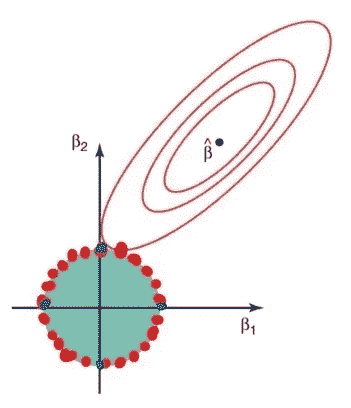**

**Red points are all the locations at which P(W) would maximize, and blue points are location where feature selection could take place as one axis is 0 completely. There is very slight overlap. In reality these red points are very large in number, i.e. tending to infinity.**

**这意味着*当 P(W)增长时，发生特征选择的那 4 个点不太可能是与分布*(还记得我们讨论过的甜蜜点)接触的第一个点，因为有 N 个点具有最大化概率 *P(W) = w + w .***

**那么 L1 呢，它很特别吗？，让我们弄清楚。*能使 L1 最大化的点数只有 4 个*并且令人惊奇的是*它们都位于会导致特征选择的位置，因为轴上的一个参数值被推到 0*。因此，*如果目标最大化*，进行特征选择的概率非常高，即 1。因此，如果 L1 能够最大化自己，那么它肯定只会选择少数几个特征，而抑制其他特征。见下图。**

**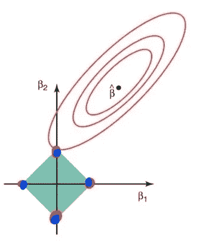**

**Red points are all the locations at which P(W) would maximize, and blue points are location where feature selection could take place as one axis is 0 completely, each red and blue point is overlapping.**

**这意味着*当 P(W)将增长时，很可能发生特征选择的那 4 个点中的任何一个都将是与分布*(还记得我们谈论过的甜蜜点)接触的第一个点，因为只有 4 个点具有最大化 P(W)的最高概率，由| *w1|+|w2|* 给出。**

**我认为这将使我关于 L1 的特征选择的论点具体化。因此，L1 比 L2 更擅长特色选择。**

**如果我们谈论弹性网络，使用我们在上面看到的相同的论点，*弹性网络是比 L2 更好的特征选择器，但是，在现实中，它不能生成稀疏特征集*，简单的原因实际上存在于公式中，因为两个项(L1 和 L2)被添加，因此 w 的零值是不可能的，正如我们在上面看到的；L2 不会轻易给出 0 值。那我为什么说它在功能选择上比 L2 好呢？简单地说，因为它提出了比 L2 更严格的限制，*记得我们看到λ(L2 的正则化常数)<β(L1 的正则化常数)，因此 L2 被给予较低的权重，并且不能对组合的解决方案产生太大影响*，正因为如此，不相关特征的值变得几乎可以忽略不计(因为 L1 已经将其推至 0，尽管 L2 在那里，但是小得多)，这通常不会在 L2 发生。**

**让我们通过一个小例子来理解 L1 正则化和 L2 正则化之间的区别，**

***假设给你一个任务，告诉你一个球员是否会被选入篮球队。我们收到的数据有 3 个特征(球员的身高，球员的头发颜色，球员的婚姻状况)，为了简单起见；让我们假设，只有身高是一个重要的因素，其余两个特征是无用的。***

**在约束优化下训练之后，输出 y 可以被看作是，**

**对 L2 来说，**

**W = [1.88，0.18，0.04]**

***y=σ(W.X+B)***

**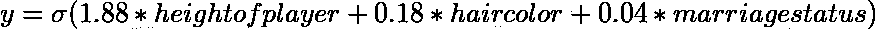****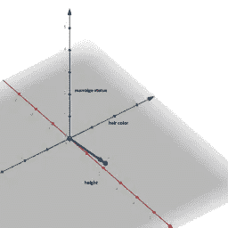**

**red axis->height, green axis-> hair color, blue axis->marriage status**

**您可以清楚地看到，重要的特征被赋予较大的权重，而不重要的特征被赋予较低的值，但仍然有一些权重被赋予它们，这在少数情况下是可以接受的，但如果我们想要选择特征，这并不理想。**

**对 L1 来说，**

**W = [1.55，0.0，0.0]**

***y=σ(W.X+B)***

**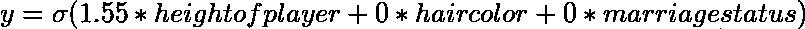****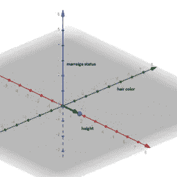**

**red axis->height, green axis-> hair color, blue axis->marriage status**

**在这里，L1 能够选择重要的特征而完全忽略其他特征。这使得模型对噪声更加鲁棒；因为它对额外的特征不敏感。**

**我们谈到了 2D 空间中的正则化，如果你需要一点方向来思考高维空间中的所有这些，下面是如果我们有两个以上的特征，我们的约束/L-p 范数看起来会是什么样子的表示。这是一个有三个特点的视觉。到目前为止，我们讨论的每件事都保持不变。现在，我们的 W 将在所有三维空间中增长，数据分布也将在三维空间中。**

**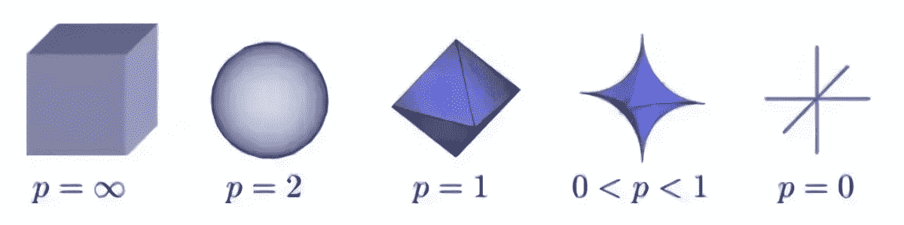**

**L-p norms in 3d**

**结论
*这真是一次漫长的旅行，但我们学到了很多，不是吗？让我们快速浏览一下我们在这篇文章中看到的内容。我们从过拟合和无约束优化开始，然后我们在它们之间建立了联系，同时还讨论了一些重要的事情，如复杂性以及如何防止它。从那里，我们给出了优化及其各种组件的鹰眼视图。基于我们对最优化中凸性的了解，我们导出了我们自己的拉格朗日函数，它后来成为我们的一般正则化方程。在那之后，我们快速地浏览了一般的定义，然后理解了稀疏性和范数。然后我们用一些证据来证明特征选择是如何在 L1 而不是在 L2 发生的，接着是一些规范的 3d 表示来满足我们可视化的渴望。***

**到此为止，我们结束了这次讨论，这是一次信息的过山车，我希望你能学到一些新的东西，最重要的是以不同的方式。*正规化本身还有很多需要理解和探索的地方，假设你从这里学到的东西是基础*，我会鼓励你去寻找。感谢你有足够的耐心通读这篇文章，是的，再次拍拍你的肩膀，你今天学到了一些新东西。**

**将来的某个时候，我会赶上一篇新文章。在那之前，继续探索。再见。**

**[](/mlearning-ai/mlearning-ai-submission-suggestions-b51e2b130bfb) [## Mlearning.ai 提交建议

### 如何成为 Mlearning.ai 上的作家

medium.com](/mlearning-ai/mlearning-ai-submission-suggestions-b51e2b130bfb)**