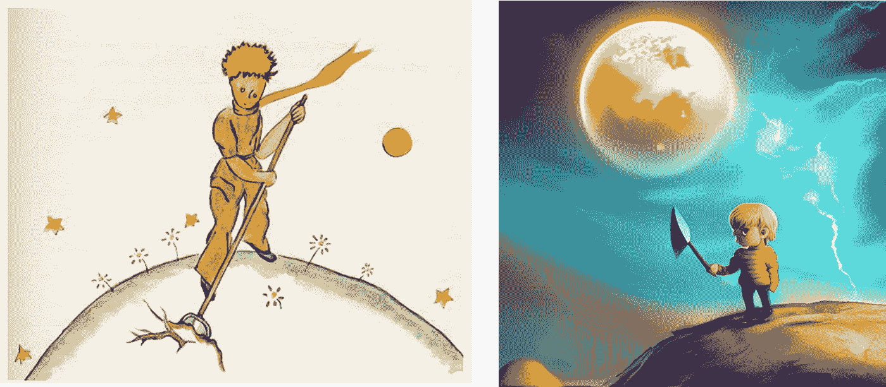
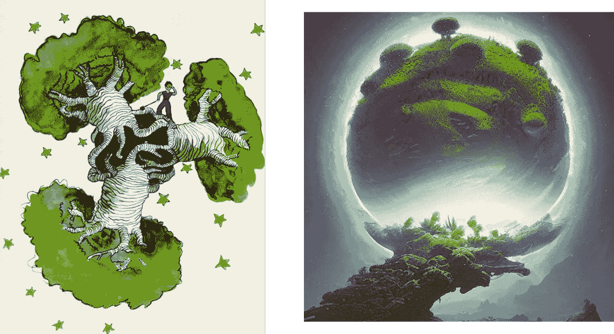
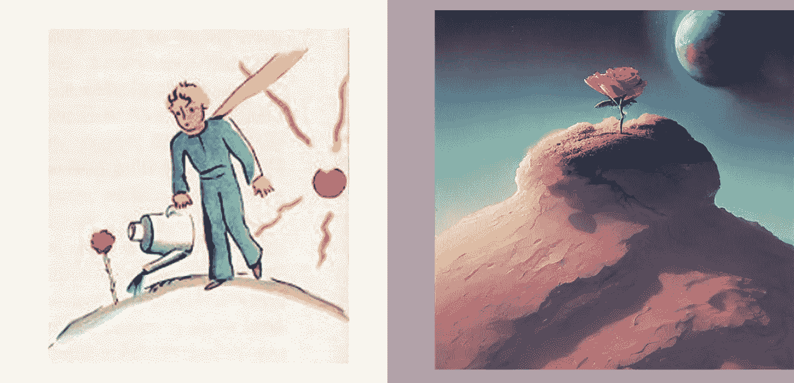

# 用艾重新想象小王子

> 原文：<https://medium.com/mlearning-ai/reimagining-the-little-prince-with-ai-7e9f68ed8b3c?source=collection_archive---------2----------------------->

人工智能如何从《小王子》中的人物描述中重构他们的形象


image created by the author using stable diffusion

《小王子》是由[安托万·德·圣·埃克苏佩里](https://en.wikipedia.org/wiki/Antoine_de_Saint-Exup%C3%A9ry)创作的短篇小说，如今已经成为 20 世纪最有影响力的作品之一(被翻译成 505 种不同的语言和方言)。因为它的简单性和同时强大的图像，这本书已经伴随了几代儿童和成人。正是因为其超乎文字的想象之美，我想知道人工智能是如何将它呈现在图像中的。

**这一切始于一架飞机坠毁**

每个人(或者至少我认为)都知道小王子的故事，讲述者在撒哈拉沙漠坠毁，当他正在考虑如何修理他的飞机时，一个孩子问他，“你能给我画一只羊吗？”这本书的出版历史也始于一次事故。1944 年，在第二次世界大战最激烈的时候，安托万·德·圣·埃克苏佩里正在科西嘉岛和撒丁岛之间进行侦察飞行。7 月 31 日是他的第五次任务，但是[他没有回来](https://www.nytimes.com/2004/04/11/opinion/saint-exupery-lands-at-last.html)。

直到 64 年后，一名前德国飞行员承认击落了侦察机，失踪之谜才得以解开。他的小说将于 1945 年由出版商 Gallimard 以法语出版，并立即成名(成为仅次于《圣经》的第二大翻译书籍)。它将被改编成多种形式:有声读物、广播剧、电影、电视、芭蕾等等。

这个故事虽然是儿童读物，却是爱情和友谊的隐喻。这本书细腻地讲述了小王子是如何对大人们的陌生感感到惊讶的。因此，这本书充满了在作者自己的水彩画中栩栩如生的人物。

**人工智能如何给文字赋予图像**

最近几个月，互联网上充斥着人工智能制作的图像。几个月前，OpenAI [DALL-E](https://cdn.openai.com/papers/dall-e-2.pdf) 问世，但这只是令人兴奋的模型中的第一个。事实上，不久之后，其他几款( [Imagen](https://arxiv.org/abs/2205.11487) 、 [parti](https://arxiv.org/abs/2206.10789) 、 [stable diffusion](https://ommer-lab.com/research/latent-diffusion-models/) )也相继问世，其中一些已经提供给公众。其原理是，使用数百万张图像和相关标题训练的模型能够生成图像。

为了生成图像，我们需要提供文本描述，使模型能够理解我们想要创建的内容。

```
“little blonde prince with a long coat and walking stick, space is colorful, artstation trending, 8k render, dramatic lightning, beautiful sky colors, vivid, luminescent, biometal”
```


image created by the author using stable diffusion

王子说必须阻止猴面包树的种子在这个星球上发芽和生长，否则它们会占据所有的空间。

> “这是一个纪律问题，”小王子后来对我说。“当你早上用完你自己的厕所时，就是时候去打理你星球的厕所了，就是这样，要非常小心。你必须确保你定期拔掉所有的猴面包树，在第一时间，当他们可以从玫瑰花丛中区分出来，他们非常像他们最早的青春。“这是非常乏味的工作，”小王子补充道，“但是很容易。”

```
“little blonde prince with a shovel on a mini planet, space is colorful, artstation trending, 8k render, dramatic lightning, beautiful sky colors, vivid, luminescent, biometal”
```



image created by the author using stable diffusion

事实上，小王子讲述了一个星球，那里住着一个懒惰的人，他让猴面包树长满了整个星球。

```
“ large growing baobabs growin on a floating mini planet highly detailed, digital painting, trending artstation, concept art, illustration, cinematic lighting, vibrant colors, epic nature, octane render”
```



image created by the author using stable diffusion

小家伙遇到了生长在他的小星球上的玫瑰，需要不断的关注。

> “我真不该听她的，”有一天他对我吐露道，“一个人真不该听花的话。人们应该只是看着它们，呼吸它们的芳香。”

```
“ a rose bush growing on a mini planet, the planet float in space, by peter mohrbacher, by alex andreev, by jacek yerka, by alan lee, by vincent di fate, super detailed, digital art, trending on artstation”
```



image created by the author using stable diffusion

王子离开了他的小星球，并遇到了几次，其中一个国王声称统治所有的星球。国王喜欢对他的臣民发号施令，尽管他是唯一的居民。最后，他也给小王子下了一道命令:

> “那你就自己判断吧，”国王回答。“这是最困难的事情。判断自己比判断别人难多了。如果你成功地正确判断自己，那么你确实是一个真正有智慧的人。

```
“ A king sitting a mini planet, the mini planet float in space, sitted on an intricate metal throne, smooth pale skin, ethereal skin, ominous, eldritch. oil painting by nuri iyem, james gurney, james jean, greg rutkowski, highly detailed, soft lighting, chiaroscuro”
```


image created by the author using stable diffusion

小王子还会有其他遭遇，但我把读者留给书和他自己的想象。

在本文中，我测试了文本提示的不同组合，并从中获得了乐趣。有时，结果并不完全是你所希望的，你必须尝试不同的组合，改变风格，或选择其他变化。然而，一般来说，稳定扩散(这里使用的模板)是一个非常强大的算法，它允许您测试各种具有高质量输出的选项。

# 如果你觉得有趣:

你可以寻找我的其他文章，你也可以 [**订阅**](https://salvatore-raieli.medium.com/subscribe) 在我发表文章时得到通知，你也可以在**[**LinkedIn**](https://www.linkedin.com/in/salvatore-raieli/)**上连接或联系我。**感谢您的支持！**

**这是我的 GitHub 知识库的链接，我计划在这里收集代码和许多与机器学习、人工智能等相关的资源。**

**[](https://github.com/SalvatoreRa/tutorial) [## GitHub - SalvatoreRa/tutorial:关于机器学习、人工智能、数据科学的教程…

### 关于机器学习、人工智能、数据科学的教程，包括数学解释和可重复使用的代码(python…

github.com](https://github.com/SalvatoreRa/tutorial) 

或者随意查看我在 Medium 上的其他文章:

[](https://towardsdatascience.com/how-artificial-intelligence-could-save-the-amazon-rainforest-688fa505c455) [## 人工智能如何拯救亚马逊雨林

### 亚马逊正处于危险之中，人工智能可以帮助保护它

towardsdatascience.com](https://towardsdatascience.com/how-artificial-intelligence-could-save-the-amazon-rainforest-688fa505c455) [](https://towardsdatascience.com/speaking-the-language-of-life-how-alphafold2-and-co-are-changing-biology-97cff7496221) [## 说生命的语言:AlphaFold2 和公司如何改变生物学

### 人工智能正在重塑生物学研究，并开辟治疗的新领域

towardsdatascience.com](https://towardsdatascience.com/speaking-the-language-of-life-how-alphafold2-and-co-are-changing-biology-97cff7496221) [](https://towardsdatascience.com/a-critical-analysis-of-your-dataset-2b388e7ca01e) [## 对数据集的批判性分析

### 停止微调你的模型:你的模型已经很好了，但不是你的数据

towardsdatascience.com](https://towardsdatascience.com/a-critical-analysis-of-your-dataset-2b388e7ca01e) [](https://towardsdatascience.com/blending-the-power-of-ai-with-the-delicacy-of-poetry-3671f82d2e1) [## 融合人工智能的力量和诗歌的细腻

### 人工智能现在能够从文本中生成图像，如果我们给它们提供伟大诗人的话语会怎么样？梦幻之旅…

towardsdatascience.com](https://towardsdatascience.com/blending-the-power-of-ai-with-the-delicacy-of-poetry-3671f82d2e1) 

**其他资源**

*   关于小王子:[书中引用](https://en.wikiquote.org/wiki/The_Little_Prince)，[书中 pdf](https://blogs.ubc.ca/edcp508/files/2016/02/TheLittlePrince.pdf) ，[书中的财富](https://www.newyorker.com/books/page-turner/the-strange-triumph-of-the-little-prince)
*   关于 AI 艺术:[关于](https://www.v7labs.com/blog/ai-generated-art)的介绍，[时代关于我的文章](https://time.com/5357221/obvious-artificial-intelligence-art/) t，[关于它的伦理问题](https://www.technologyreview.com/2022/09/20/1059792/the-algorithm-ai-generated-art-raises-tricky-questions-about-ethics-copyright-and-security/)，

[](/mlearning-ai/mlearning-ai-submission-suggestions-b51e2b130bfb) [## Mlearning.ai 提交建议

### 如何成为 Mlearning.ai 上的作家

medium.com](/mlearning-ai/mlearning-ai-submission-suggestions-b51e2b130bfb)**