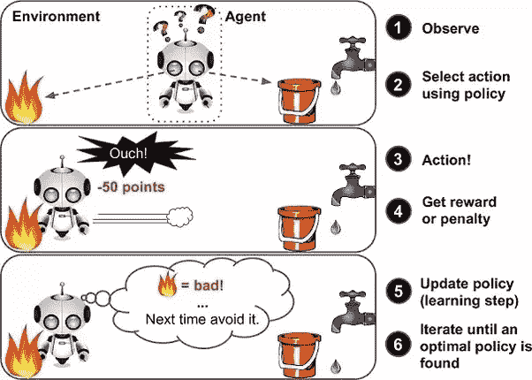
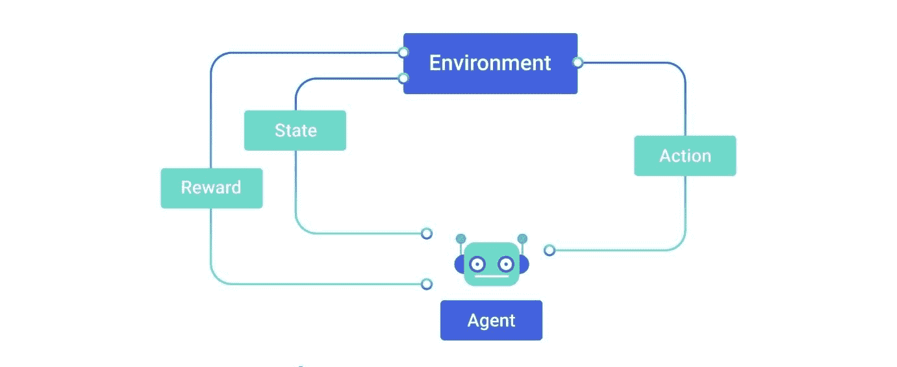
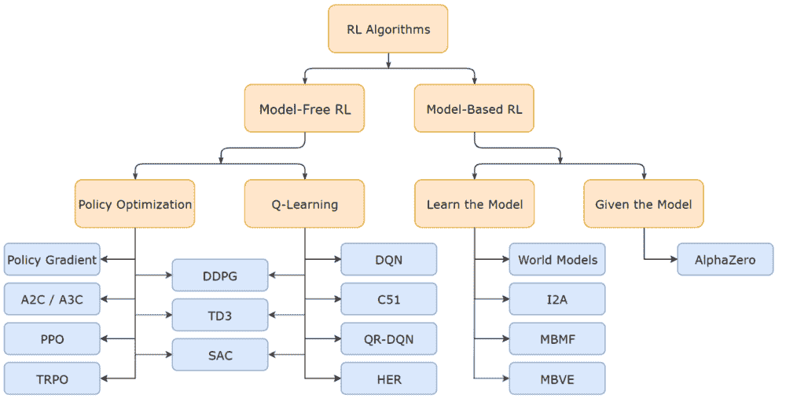
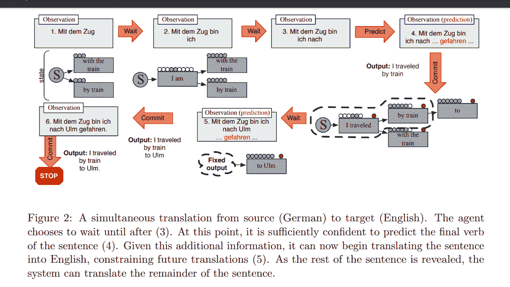
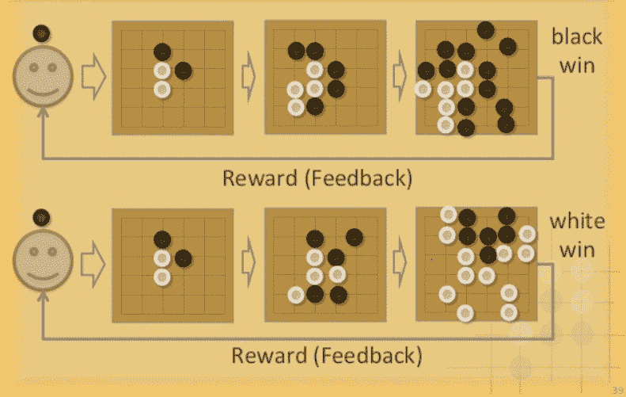

# 强化学习

> 原文：<https://medium.com/mlearning-ai/reinforcement-learning-learning-a6e45d4502a5?source=collection_archive---------5----------------------->

> 增强学习是人工智能蛋糕上的樱桃，机器学习是蛋糕本身，深度学习是糖衣。如果没有前面的迭代，cherry 将一无所获。
> 
> *——扬·勒村*

Reinforcement Learning is has immense potential in the gaming industry

R 强化学习(RL)是一种机器学习，涉及智能代理如何在动态环境中做出决策，在这种环境中，它应该执行某个目标，以使累积报酬最大化。环境是智能体生活和互动的世界。特工们接受奖惩机制的训练。代理人因正确的移动而得到奖励，因错误的移动而受到惩罚。重复时，代理试图最小化错误的，最大化正确的。它是机器学习的三个基本类别之一，与监督学习和非监督学习并列。

强化学习与监督学习的不同之处在于，在监督学习中，训练数据带有答案，因此模型是用正确的答案来训练的，而在强化学习中，没有答案，而是由强化代理来决定如何执行给定的任务。在没有训练数据集的情况下，它必然会从自己的经验中学习。强化学习的诞生可以追溯到 1957 年，当时理查德·贝尔曼推导出了贝尔曼方程。它与**动态规划**相关联，用于通过包含先前状态的值来计算某一点的决策问题的值。还有，无模型算法，Q-learning 就是基于这个方程。

Reinforcement Learning explained in a picture!

有两种类型的强化:

**正向强化**是指某一特定行为与奖励的增加相关联，从而导致该行为的强度和频率增加。

**负面强化**是一种行为的强化，因为一种负面状况被阻止或避免。

除了代理和环境之外，强化学习系统还有四个主要的子元素:

1.  一项政策
2.  奖励信号
3.  价值函数
4.  环境的模型。

**策略**是从感知的环境状态到处于这些状态时要采取的行动的映射。一个**奖励信号**定义了强化学习问题中的目标。在每一个时间步，环境发送一个数字，奖励给强化学习代理。代理人的唯一目标是最大化其长期获得的总回报。因此，奖励信号定义了对代理人来说什么是好的和坏的事件。一个**价值函数**指定了什么是长期的好。模型是用于计划的，我们的意思是在实际经历之前，通过考虑可能的未来情况来决定行动过程的任何方式。 **Q-learning** 和 **SARSA** (状态-动作-奖励-状态-动作)是两种常用的 RL 算法。

Some Algorithms used in Reinforcement Learning

强化学习在许多领域都有应用，包括信息论、基于模拟的优化、多智能体系统、群体智能、统计学、博弈论、控制理论和运筹学。

强化学习的一个例子是机器人学习如何走路。机器人首先向前迈出一大步，然后摔倒。随着那一大步跌倒的结果是强化学习系统响应的数据点。由于反馈是负面的，即跌倒，系统调整动作以迈出更小的一步。因此，机器人能够向前移动。

强化学习的应用:

1.  **在自然语言处理中:**用于同时机器学习，具有学习何时信任预测单词的能力，并使用 RL 来确定何时等待更多输入。

2.**在博弈方面:**利用强化学习，AlphaGo Zero 能够从零开始学习围棋的博弈。深度强化学习算法正在国际象棋、围棋和雅达利等游戏上进行测试。像 DeepMind 和 OpenAI 这样的公司已经在这一领域进行了广泛的研究，并建立了可能训练强化学习模型的健身房。

强化学习无疑是本世纪发现的最具创新性的技术之一。敬请期待阅读更多此类文章！

**参考文献:**

1.  [强化学习— GeeksforGeeks](https://www.geeksforgeeks.org/what-is-reinforcement-learning/)
2.  [强化学习的 10 个现实应用— neptune.ai](https://neptune.ai/blog/reinforcement-learning-applications)
3.  [2014 _ em NLP _ sim trans . pdf(umd.edu)](http://users.umiacs.umd.edu/~jbg/docs/2014_emnlp_simtrans.pdf)
4.  [黑白游戏控制器(unsplash.com)](https://unsplash.com/photos/YuipfPtOH1k)

 [## Mlearning.ai 提交建议

### 如何成为 Mlearning.ai 上的作家

medium.com](/mlearning-ai/mlearning-ai-submission-suggestions-b51e2b130bfb)