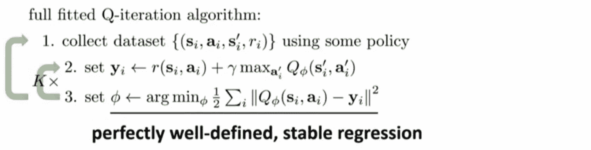
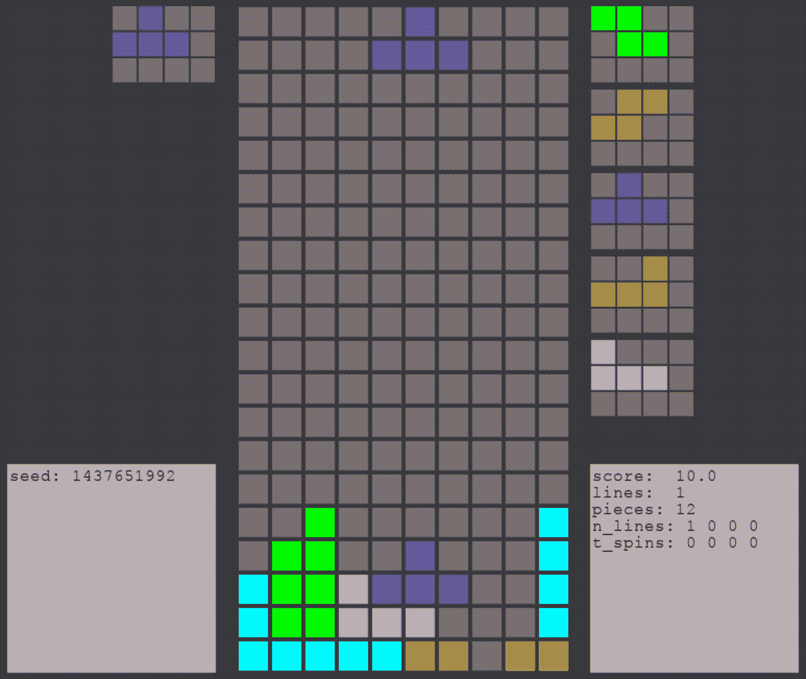
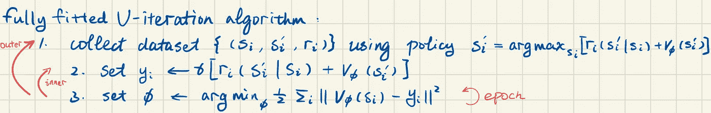
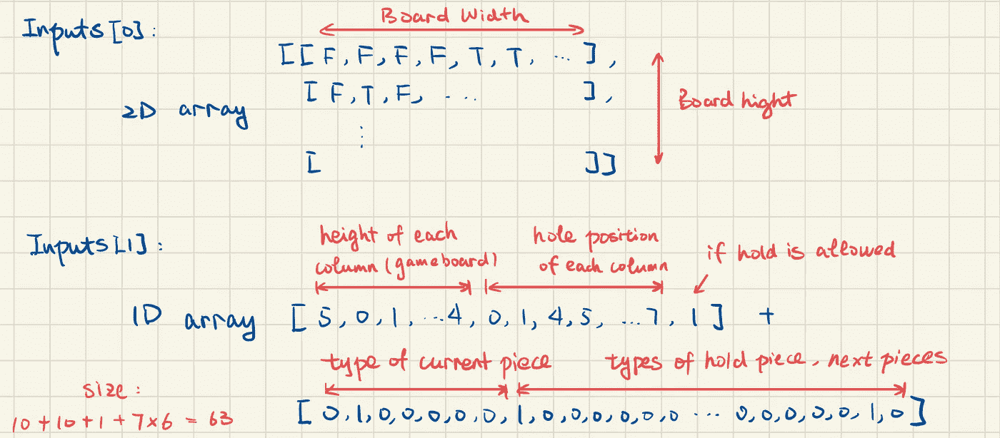
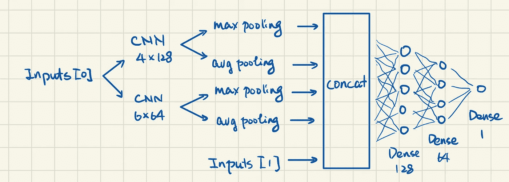

# 俄罗斯方块的强化学习

> 原文：<https://medium.com/mlearning-ai/reinforcement-learning-on-tetris-707f75716c37?source=collection_archive---------0----------------------->

我决定重写这篇日志，并发表一篇关于这个兼职项目的简洁文章。代码可以在这里找到 [tetris_ai](https://github.com/zeroize318/tetris_ai) 。以下是这本日记的大纲:
1。当前结果视频
2。强化学习的算法
3。应用详情
4。神经网络
5。结果和讨论
6。我尝试过的想法和变体

文章第二部分:[https://rex-l . medium . com/reinforcement-learning-on-Tetris-2-f12f 74 f 70788](https://rex-l.medium.com/reinforcement-learning-on-tetris-2-f12f74f70788)

# **当前结果视频**

AI playes Tetris that focuses on T-Spin

AI plays customized Tetris

# 强化学习算法

*本节大部分内容并非来自真实资源(提供出处的除外)。因此，如果你注意到一些错误或者你不同意，你非常欢迎指出并讨论它。*

Source: [https://youtu.be/w_IIP-swuVo](https://youtu.be/w_IIP-swuVo)

Q-learning 在俄罗斯方块上应用的主要问题是许多步骤将是琐碎的。游戏的动作{a}包括{ *向左、向右、向下、向左转、向右转、保持、软降和硬降* }，但教 AI 学习如何移动棋子不是我们的优先任务。人类在玩俄罗斯方块的时候，考虑**如何**将棋子移动到某个位置是小事一桩；相反，我们考虑**到**到**我们应该把**移到哪里。因此，最好提供当前棋子可以掉落的所有可能位置，并让 AI 选择最佳位置。

All possible states and rewards: [(r, s’)], where r’ is simply {score’-score}. If you are not familiar with T-spin, please check this short video [https://youtu.be/FI39WJqTLvA](https://youtu.be/FI39WJqTLvA)

通过这种调整，不再涉及动作{a}，奖励{r}与未来状态{s'}绑定。Q 值由 V 值代替，V 值基本上是给定可能状态池{[s']}的最大 Q 值。

Φ is the the trainable variables of the Neural Network for V(s)

这是人工智能的巨大优势:首先，人工智能不需要学习如何移动棋子。否则，预计会看到人工智能卡在来回移动一块，左转，然后右转；第二，数据集大小减少到大约 1/7，其中 7 是移动棋子的估计平均步数；最后，人工智能不需要学习如何得分，例如，做一个 T 型旋转——人工智能只需要学习如何为 T 型旋转设置一块板。V 值可以解释为得分的可能性，由于γ的原因，预计得分会低于实际得分。所以，当 AI 被提供了[(r，s')]，它就把它处理成一列数[r+V(s ')]；高分移动几乎肯定具有最大值，因此策略会选择它。

# 申请详情

*   外循环—样本收集{( *s，s’，r* )}:
    对于每一步，环境(游戏)都有当前状态 *s* ，并提供所有可能状态的列表及其对应的奖励[(*s’，r* )]。神经网络对 V 值进行评估，使其成为一个数字列表[r+V(s')]，找到最高的 *r+V(s')* 值，并将其命名为最佳未来状态。AI 将当前状态、最佳未来状态及其回报( *s，s’，r* )附加到样本中。然后，它生成一个介于 0 和 1 之间的随机数，如果它大于ε(比如说 0.05)，那么人工智能将选择最佳未来状态进行开发；否则，它将探索，选择一个随机的未来状态。最后，环境的当前状态 *s* 被所选择的*s’替换。* 下一步…重复直到游戏结束。
*   内循环—更新目标 y:
    这个简单来说就是: *y_i=γ[r_i+V(s'_i)]。* 我把 *r_i* 放在括号里面是因为我觉得它和未来状态绑定了。因此，这是未来的奖励。
    有一点要注意，当 *s'_i* 游戏结束时， *y_i=γ[r_i]* ，一定不能包含 *V(s'_i)* 因为这个值 *V(s'_i)* 永远不会被求值；它的价值是无限的。
    另一个小细节: *s* 包含当前棋子、保持棋子和 4 个下一个棋子。*s’*包含未来当前片段、保持片段、3 个下一个片段和未知的第 4 个下一个片段，因此输入给定为[0，0，0，0，0，0，0]。

拟合—训练神经网络:
好吧，让机器学习包的库函数来处理。
我使用 tensorflow.keras，这里我唯一想指出的是 *model(inputs，training=False)* 比 *model.predict(inputs，batch_size=batch_size)* 快得多。虽然，我需要为*模型(输入)*手动编写小批量的代码。

# **神经网络**

输入:每个柱子的高度是为了给 AI 一种危险感。洞的位置是为了给 AI 一种棋盘不整齐的感觉。输入[0]是一个 2D 阵列，它将被馈送到一个卷积神经网络。

Inputs for the Neural Networks. Possible piece types are ‘S’, ‘Z’, ‘I’, ‘O’, ’T’, ’L’, ’J’; 7 of them in total

型号:

Neural Network Model

一些参数:
缓冲区大小:50000
内循环:5
历元:5
批量大小:512
opi mizer = keras . opi mizer . Adam(0.001)
loss = ' Huber _ loss '
metrics = ' mean _ squared _ error '

# 结果和讨论

人工智能学习生存的速度惊人地快。在这个视频 [AI 玩定制的俄罗斯方块](https://youtu.be/FTDZN4pPhwA)中，只用了 20 个外圈就达到了这个玩法水平。我的桌面训练 AI 的每个循环花费了大约 400 秒，也就是说，如果定制游戏的难度合理，训练一个全新的 AI 几乎无限期地存活下来总共需要大约 2.5 小时。我发现人工智能玩这个定制游戏真的很好。

然而，人工智能不擅长有效得分，即每步得分。它经常完成一行、两行或三行。我还没有找到训练它达到每 2000 件更高分数的方法——人工智能只是在某个地方停滞不前或变得更糟。我相信这是由于一个传统的俄罗斯方块有循环出现的状态，但是不同的政策会导致不同的奖励。

举个例子，给定γ=0.95，完成 1 行奖励 10 分而完成 2 行奖励 30 分，

策略一:
当前状态 *s* —降 1 枚—降 1 枚—降 1 枚完成 1 行—降 1 枚—降 1 枚完成 1 行—相同状态*s*
v[s]= 10 *γ+γ⁵*(10+v[s】)
v[s]= 72.11

策略二:
当前状态 *s* —掉 4 块—掉 1 块完成 2 行—相同状态*s*t14】v[s]= γ⁵(30+v[s)
v[s]= 102.61

*   有了好的γ值，从理论上讲，AI 会追求每件作品更高的分数。但是对于 AI 来说，一旦它已经为当前的策略进行了训练，就很难找到更好的策略——它需要 AI 保持许多步骤(> 3)才能完成线条并立即得分！而且即使它选择探索，它选择一个不可怕的举动的机会就更低了，而且这种幸运的巧合要发生几次才能遇到一次更好的政策，而这个样本很可能会淹没在糟糕政策的样本池中。(当我写这篇文章时，我意识到也许给ε-贪婪方法一个分布概率而不是均匀随机将会改善这一点。)
*   换句话说，现在的 AI 真的不太可能转投另一种策略。[https://youtu.be/BbruZtUte00](https://youtu.be/BbruZtUte00)看这个视频，AI 开发了不同的策略，尽管他们的设置完全相同。一些人最终总是尝试做 T 形旋转，而另一些人一次也没做过。
*   示例策略还揭示了另一个问题，V 值可能在某种程度上独立于状态，只要它们在几个碎片掉落之后出现。这意味着所有状态，如果没有给出下一个片段，*可能*具有相同的 V 值！疯了！
*   结果对选定的γ高度敏感。我想象γ，奖励和惩罚构成边界条件。状态场中的每一个值都依赖于边界条件。它们至关重要。举例来说，如果γ太低，人工智能会更喜欢现在抓取点，而不是保存到将来更高的点。如果γ太高，V 值可能会高得离谱，因为状态会重复出现。

# 我尝试过的想法和变体

*   【试过】N-return:结果不好。我不知道为什么。
*   [尝试]对所有可能的状态进行采样，而不是只对最佳状态进行采样— *{(s，[s '，r])}。*然后，在外部循环和内部循环之间添加另一个循环，该循环选择与当前模型最佳的[s '，r]。这样做的好处是所有的样本都可以永久使用，因为它是独立于策略的。然而，在模型拟合期间有一个问题，当选择另一个[s '，r]时，V(s ')可能是无界的，因为游戏可能还没有经历过那条路线。
*   【尚未尝试】基于以上分析，当是勘探而不是开采时，我是否应该不添加样本( *s，s’，r* )。请注意，无论如何，最好的*s’*将被记录，而不是实际选择的那个。
*   [已尝试]重放缓冲:似乎不能提高收敛。
*   [尚未尝试]集合模型:这有一些很大的潜力，因为，如前所述，早期的训练真的很快(~2.5 小时)，但他们随后就被他们当前的政策卡住了。有些人可能制定了更有效的政策(T-spin ),但这是随机的。也许，参考几十个已经训练了 3 个小时的模型，然后用他们收集的样本，训练一些其他的新模型会很好。
*   [已尝试]自定义图层:已尝试。这里说的太多了。目前我将不得不跳过它。目前，它看到一个小的改进，但仍然有同样的限制。
*   [尚未尝试]进行探索，使用基于[V(s')+r]的分布概率来选择移动。
*   【试过，有点】真过渡函数:s’的最后一段输入[1]可以是任意一种可能，[1，0，0，0，0，0，0]，[0，1，0，0，0，0，0]… [0，0，0，0，0，0，0，1]。v(s’)并取它们的平均值。这导致更多的计算时间，我没有发现明显的改善。然而，这对于用表格方法测试算法是绝对重要的。(我在一个 3x3 的游戏板上测试了该算法，并证明它与表格方法一致:>)
*   [尝试]操纵奖励功能:我希望看到人工智能做更多的 4 线完成和双 T 旋转，而不是 1，2 或 3 线完成，所以我操纵奖励功能，让它不同于增加的分数。这很好，但当我过度压缩 1、2 或 3 行完成的分数时，人工智能会以一种有趣而合理的方式感到困惑。人工智能会把木板堆到 3/4 高，然后为了生存而完成 1 或 2 行。一旦它能够在 3/4 高度生存足够长的时间，它永远不会发现保持干净的棋盘会更好，因为在大量的步骤之后，比如说 200，γ ⁰⁰基本上是 0，游戏结束的惩罚将不会应用于这样的状态。
*   [试用]多处理:非常适合收集样本。该算法完全适合 V-learning。因此，异步训练是不必要的，是吗？
*   【试过但失败】GPU:我觉得这个 AI 最好的办法是用 CPU 采集样本，用 GPU 训练模型。但是我没能在它们之间转换。在样本收集期间，输入的批量很小，大约是当前状态的 40 个可能的未来状态。因此，在一个内核中使用 model(inputs)比 model.predict(inputs)要快，我认为这是由于开销的原因。我可以让每个内核存储自己的模型，这样多处理的规模就接近完美。然而，GPU 更擅长在 V 拟合期间训练它，在我的桌面上大约快 3 倍。我试图在“:/cpu”和“:/gpu”之间切换，但总是出现致命错误。无论如何，训练的效率不是这个人工智能的主要问题，我对目前的速度已经很满意了。

# 问题

*   你知道如何改进这个人工智能吗？
*   你想看人工智能玩不同的定制俄罗斯方块游戏吗？你可以告诉我你想看的片段，我可以训练它演奏。在我的代码中，当一个片段太淘气时，比如“H”和“Donut ”,我会降低它们出现的机会。否则，游戏将无法进行。