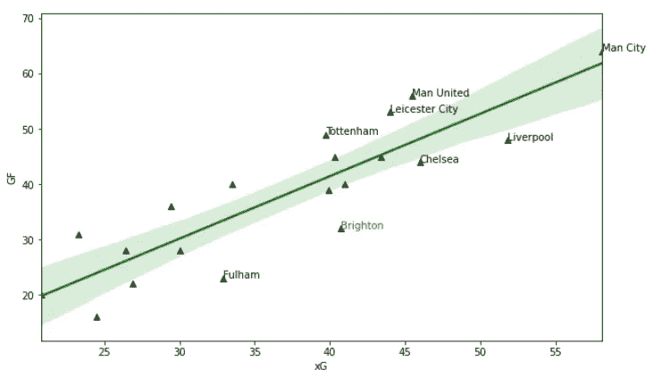
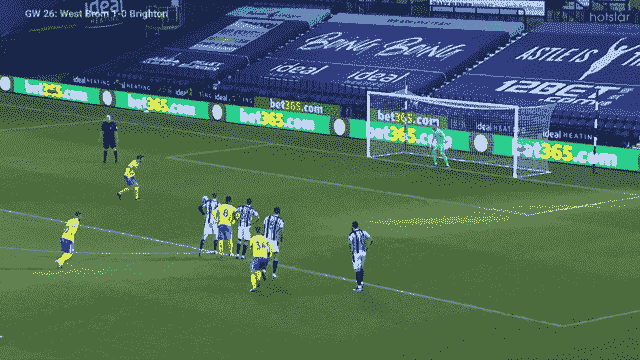
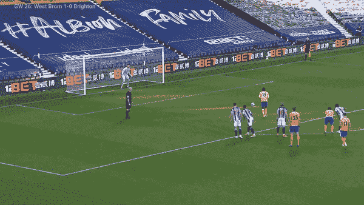
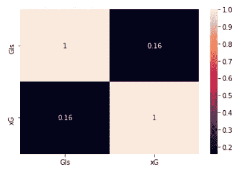
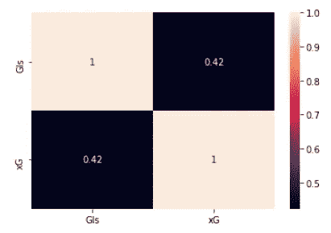
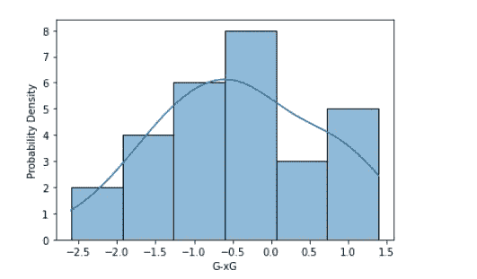
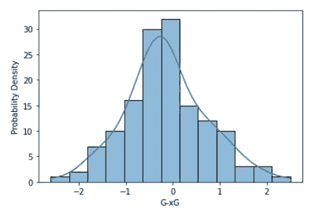

# 为布莱顿降级？

> 原文：<https://medium.com/mlearning-ai/relegation-for-brighton-3773b6ae07e?source=collection_archive---------3----------------------->

到目前为止，我们在英超联赛中踢了 29 场比赛，曼城以 71 分领先。尽管面临伤病危机，卫冕冠军利物浦队仍设法保住了前 10 名的位置。西汉姆，本赛季令人惊讶的排名第五，米克尔·阿尔特塔领导下的阿森纳排名第九。利兹联队(第 11 名)在过去几场比赛中似乎一直在丢分，在可能的 12 分中只得到 4 分。

在排行榜的末尾，谢菲尔德联队和西布朗正在努力追赶其他球队。第 18 名富勒姆，虽然比西布朗高出 8 分，但需要尽快改变命运，或者在短短一个赛季内重返冠军宝座。本帖主人公布莱顿 16，32 分，向上看。

布莱顿已经完成了 303 次进入禁区的传球，平均 9.34 次关键传球，直接导致每 90 分钟一次射门。他们完成了 81 次传入禁区的传球，是联盟最高的。他们的预期目标是 40.7，在排行榜的下半部分排名第二。他们仍然在联赛中排名第 16。然而，对于布莱顿来说，期望并没有变成现实。

Expected vs Actual goals in PL 2020–21 till Gameweek 29

所有线下的球队本赛季都一直表现不佳，布莱顿(红色)和富勒姆领先表现不佳的球队。布莱顿队在可能的 40 场比赛中打进了 31 球，丢了 36 球，而他们应该只丢了 28 球(xGA = 28.5)。然而富勒姆的情况并非如此，他们的 xGA 和 GA 相互匹配，清楚地显示了他们本赛季防守的弱点。

布莱顿在进球数表上的低计数可以清楚地用他们本赛季 28.3%的低命中率来解释。他们射了 364 次，只有 103 次击中目标。这是本赛季英超最差的得分率。此外，他们的投篮创造动作，被定义为两个直接导致投篮的进攻动作(传球、运球或制造犯规)，是一个非常令人印象深刻的动作，每 90 分中有 20.21 分。然而，在前面他们的进球创造低于标准杆 1.69/90。作为参考，莱斯特城 90 后 SCA 19.55，90 后 GCA 3.03。他们在创造机会，但没有完成。

游戏中 50%不可预测的一面对他们来说是沉重的。对西布朗的比赛中，他们的两个点球击中门柱，一个进球在最奇怪的情况下被判无效。那场比赛他们有 2.6 的巨大 xG，但一分未得。

如今，预期目标是决定团队绩效的最重要的指标。预期和实际之间的这种差异正常吗？是的，事实上，正是如此，正态分布。

我来介绍一下相关性的概念。两个度量之间的相关系数在-1 和 1 之间变化，是它们所共享的因素的相对权重的度量。例如，一个地方的每个家庭的用电量和该地方的事故数量之间的相关性很弱。然而，该地区的平均温度和每户的用电量可能有更强的相关性。

如果我们仔细看看本赛季的数据，布莱顿的 xG 和他们的目标有微弱的正相关。从赛季开始到现在，相关系数(r)在 0.16 左右。但这是否意味着 xG 对预测球队的进球数毫无帮助？看看这份报告，你会说 xG 不适合布莱顿，它会导致不合理的猜测，比如解雇格雷厄姆·波特。

(Left )— 2020–21\. (Right)- 2017-Present

然而，如果我们看看从 2017 年到当前赛季的跨赛季数据，相关性更高(0.42)。

我们希望一支球队能够准确或接近预期的进球数。所以这意味着，他们的目标减去预期目标或 G-xG 随着时间的推移应该在 0 左右。G-xG 为正值意味着团队得分高于预期，负值意味着团队表现不佳。换句话说，“G-xG”应该是正态或高斯分布。以下是布莱顿本季 G-xG 分布

KDE plot of Brighton’s G-xG this season

这清楚地表明分布不是正态的(不是钟形曲线)并且不以 0 为中心。相反，它集中在-1 到-0.5 左右，讲述了这个赛季布莱顿不适应的故事。然而，这为我们估计他们未来的游戏不会像过去那样糟糕铺平了道路。我怎么能这么说呢？看下图 2017-18 赛季至今的数据。

KDE plot of Brighton’s G-xG from 2017-present

这意味着，当我们从总体数据中抽取更大的样本时，G-xG 往往是一个正态分布的度量。这种趋势被称为均值回归，是一种统计趋势。正如丹尼尔·卡内曼所言，**“只要两个值之间的相关性不完美，就会回归到均值”**。

现在这并不意味着，布莱顿将赢得所有的比赛来平衡这种倾斜。我必须说，他们缺少最终产品，他们在中路的关键传球和防守都很好。Bissouma 吸引了欧洲精英的兴趣。很快就会有结果。回归平均值可能需要时间。然而，他们会尽可能多地进球，因为他们创造了机会，而这在之前并没有发生。维尔贝克对纽卡斯尔的“世界大战”可能只是一支球队本赛季保持领先的开始。

他们与曼彻斯特联队的比赛将是一场有趣的比赛，因为他们处于截然相反的两端。本赛季曼联队大大超过了他们的 xG 队。

布莱顿和霍夫艾比恩会熬夜。

数据学分-[https://fbref.com/en/](https://fbref.com/en/)